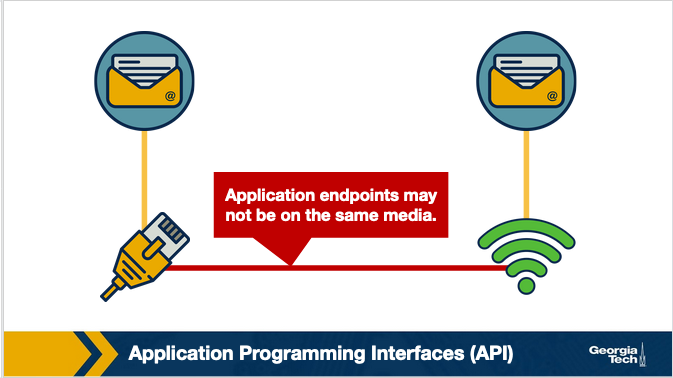
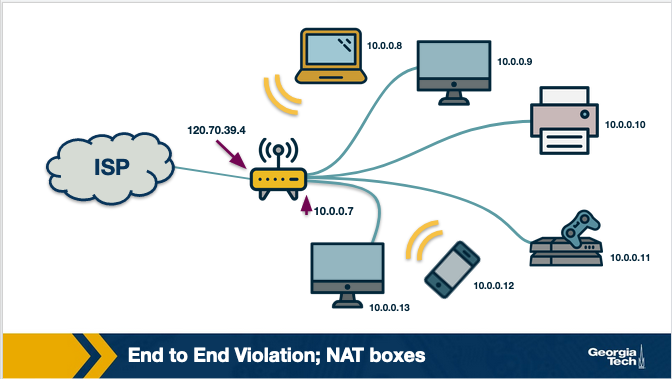
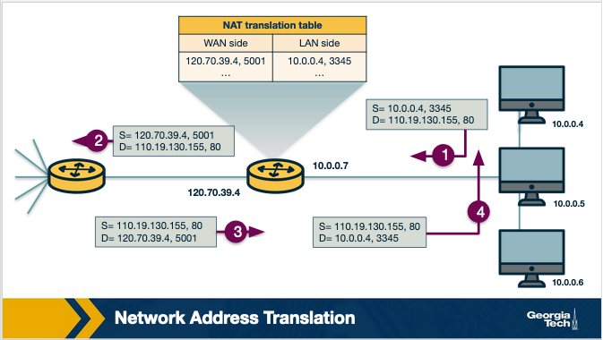
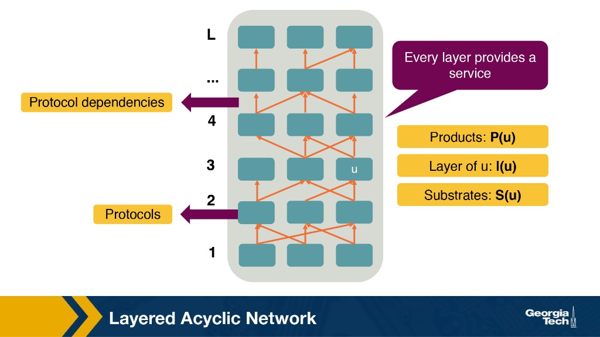
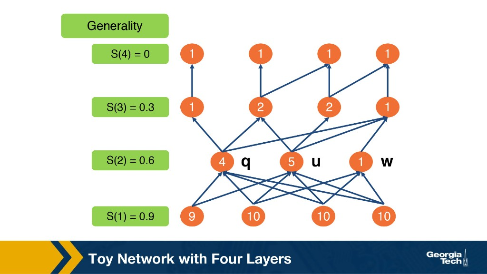
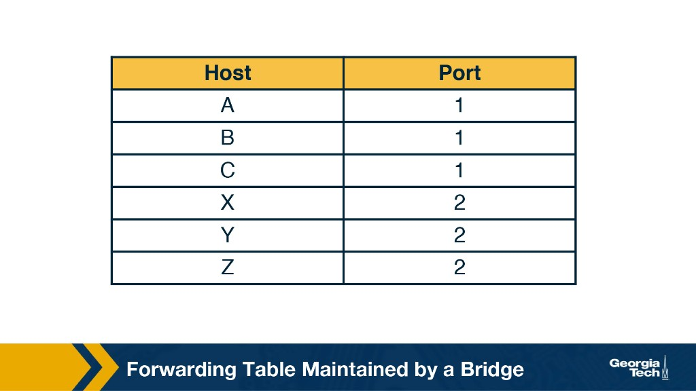

# Lesson 1: Introduction, History, and Internet Architecture

This section covers the fundamental design philosophies of modern networking.

!!! tip "Exam prep"
    Need a condensed review? See the **[Quick Study Guide](lesson-01-quick-study-guide.md)** — tables, memory aids, and high-yield questions with short answers. For interactive practice, try the **[Lesson 1 Quiz](lesson-01-quiz.md)**.

---

## A Brief History of the Internet

The Internet did not appear all at once. It grew through decades of research, experimentation, protocol design, and deployment. These milestones help explain how the Internet evolved from a small research network into today's global infrastructure. They also show why ideas such as packet switching, open architecture, internetworking, and scalable naming became so important.

### Early visions of networked computing

In 1962, J.C.R. Licklider described the idea of a "Galactic Network," a vision of globally interconnected computers that would allow people to access data and programs from many locations. This idea helped frame networking as more than a way to connect machines. It suggested a future where people could interact, collaborate, and share information through connected computing systems.

### Packet switching research

In the early 1960s, researchers developed the theory behind packet switching, a major shift from traditional circuit-switched communication. Packet switching allowed data to be broken into packets and sent efficiently across shared networks. This idea became a foundation for computer networking because it made communication more flexible and better suited for data traffic.

### The first wide-area computer network experiment

In 1965, Lawrence Roberts and Thomas Merrill connected a computer in Massachusetts to another computer in California using a low-speed dial-up telephone line. This experiment showed that time-shared computers could communicate over long distances. It also showed that the circuit-switched telephone system was not well suited for computer networking, which helped motivate packet-switched network design.

### ARPANET begins

In 1969, the first ARPANET node was installed at UCLA, followed by nodes at Stanford Research Institute, UC Santa Barbara, and the University of Utah. By the end of 1969, four host computers were connected. ARPANET was one of the first major steps toward the Internet because it demonstrated that packet-switched networks could support communication among geographically distributed computers.

### Network Control Protocol and early applications

In 1970, the Network Working Group completed the initial ARPANET host-to-host protocol, called Network Control Protocol (NCP). Once ARPANET sites implemented NCP, users could begin developing network applications. In 1972, email was introduced and quickly became one of the first major network applications. This showed that the value of the network came not only from connecting computers, but from enabling people-to-people communication.

### Open architecture networking and internetworking

A major design shift came with the idea of open architecture networking. Instead of requiring every network to use the same internal design, different networks could be built independently and then connected through a common internetworking architecture. This idea is central to why the Internet could grow across many technologies, including wired, wireless, satellite, and radio networks.

### TCP/IP and the modern Internet architecture

As networking expanded beyond ARPANET, researchers needed protocols that could connect multiple independent networks. This led to the development of TCP/IP, which became the foundation of the modern Internet. TCP/IP supported the idea that many different networks could interoperate through a shared protocol layer, helping create the Internet's "network of networks" architecture.

### DNS and the World Wide Web

As the Internet grew, it became difficult to maintain a single table of host names and addresses. The Domain Name System (DNS) introduced a scalable and distributed way to translate domain names into IP addresses.

Later, the World Wide Web made the Internet much easier to use for publishing, linking, and accessing information. The Web helped bring the Internet to a much broader public audience and became one of its most important applications.

### Why these milestones matter

These milestones show that the Internet grew from several connected ideas: packet switching, open architecture, end-to-end communication, scalable naming, and support for applications. The result is a system that can connect many different devices, networks, and technologies while still supporting a common communication model. This history also helps explain why the Internet protocol stack has been so successful, why it scales, and why some core protocols become difficult to replace over time.

!!! info "Reference"
    [A Brief History of the Internet](https://www.internetsociety.org/internet/history-internet/brief-history-internet/)

---

## Internet Architecture Introduction

The Internet architecture allows hosts in different types of networks to communicate with one another. For example, two email clients can exchange messages even if one host is connected through Wi-Fi and the other is connected through Ethernet. The underlying technologies may be different, but the applications can still communicate because the Internet architecture provides a common structure.

A computer network is a complex system. It includes many types of hosts, links, switches, routers, protocols, and applications. Without structure, it would be very difficult to design, update, or troubleshoot such a system. Network protocol designers manage this complexity by organizing protocols into **layers**.

### Layers, Services, and Functionality

A layered architecture divides network functionality into separate layers. Each layer has a specific responsibility. Each layer also provides a service to the layer above it and uses the service provided by the layer below it.

This idea is sometimes called the **service model** of a layer. The service model describes what a layer offers to the layer above. For example, one layer may provide local delivery across a single link, while another layer may provide end-to-end communication between applications.

A useful analogy is the airline system. To travel from one city to another, a passenger goes through a sequence of steps: buying a ticket, checking baggage, going through the gate, boarding the plane, flying, leaving the aircraft, and claiming baggage. Each step provides a service that supports the next step. The passenger does not need to know all the internal details of baggage routing, gate management, or air traffic control. The system is easier to understand because the tasks are separated into layers.

The same principle applies to Internet architecture. Each layer focuses on one part of communication. Lower layers handle physical transmission and local delivery. Higher layers support end-to-end communication and applications.


### Why Layering Helps

Layering gives the Internet several important benefits:

- **Scalability** — Each layer has a focused role, so the system can grow without requiring every component to understand every detail.
- **Modularity** — One layer can change its internal implementation as long as it continues to provide the same service to the layer above. For example, an application can continue to work even if the underlying access technology changes from Ethernet to Wi-Fi or 5G.
- **Interoperability** — Devices, networks, and applications built by different vendors can work together because they follow common protocol interfaces and standards.
- **Easier reasoning** — When something fails, engineers can ask which layer is responsible: Is this a physical connectivity problem? A local delivery problem? A routing problem? A transport problem? Or an application problem?

### Limitations of Layering

Layering is powerful, but it is not perfect. Sometimes one layer duplicates functionality that appears in another layer. For example, error recovery may appear in both lower layers and higher layers. Sometimes one layer may also need information that belongs to another layer, which can make strict separation difficult.

Even with these limitations, layering remains one of the main design ideas that makes the Internet manageable, scalable, and able to evolve over time.

!!! abstract "Takeaway"
    Layering helps the Internet scale by separating complex communication tasks into smaller, well-defined services.

---

## The OSI Model

The Internet architecture follows a layered model, where each layer provides a service to the layer above it and uses the service provided by the layer below it.

A well-known reference model is the **OSI model**, proposed by the International Organization for Standardization. The OSI model has seven layers:

1. Application
2. Presentation
3. Session
4. Transport
5. Network
6. Data Link
7. Physical

The traditional Internet protocol stack, however, is usually described with **five layers**:

1. Application
2. Transport
3. Network
4. Data Link
5. Physical

The main difference is that the Internet model combines the application, presentation, and session layers of the OSI model into one broader application layer. In practice, this means that many application-specific functions, such as data formatting, session management, and application logic, are handled by the application itself.

The interface between the application layer and the transport layer is the **socket interface**. Application developers use sockets to send and receive data over the network. It is then up to the application developer to decide what functionality the application needs and how the application should use the transport-layer services below it.



Layering gives the Internet important benefits, including scalability, modularity, and flexibility. It allows different technologies and protocols to evolve independently, as long as each layer continues to provide the expected service to the layer above it.


Layering also has some limitations:

- **Cross-layer dependencies** — Some layers may need information from other layers, which can make strict separation difficult.
- **Duplicated functionality** — Some functions may appear in more than one layer. For example, error recovery can happen at lower layers and also at higher layers.
- **Added overhead** — Each layer may add headers or processing steps, which can introduce additional overhead.

In the following sections, we will briefly review the main layers of the Internet protocol stack. For each layer, we will focus on four questions:

1. What service does the layer provide?
2. How is the layer accessed?
3. What are example protocols or technologies at that layer?
4. What do we call the packet of information handled at that layer?

!!! abstract "Takeaway"
    The OSI model gives us a complete reference model, while the five-layer Internet protocol stack reflects the architecture most commonly used to explain how the Internet works in practice.

---

## Application, Presentation, and Session Layers

In the OSI reference model, the top three layers are the application layer, presentation layer, and session layer. In the five-layer Internet protocol stack, these three layers are usually combined into one broader application layer.

### Application Layer

The application layer supports network applications and application-level protocols. This is the layer closest to the user-facing software, such as web browsers, email clients, file transfer tools, and domain-name lookup services.

Common application-layer protocols include:

- **HTTP** — Used for web communication.
- **SMTP** — Used for sending email.
- **FTP** — Used for transferring files between hosts.
- **DNS** — Used to translate domain names into IP addresses.

The services at this layer depend on the application. For example, a web browser and an email client use the network differently and rely on different application-layer protocols.

At the application layer, the packet of information is usually called a **message**.

### Presentation Layer

The presentation layer is responsible for how data is represented and formatted before it is delivered to the application. It can handle tasks such as data formatting, encoding, compression, and translation between data representations.

For example, the presentation layer may help format a video stream or translate data between different byte orders, such as big endian and little endian formats.

In the Internet protocol stack, these functions are usually handled inside the application or by application-level libraries.

### Session Layer

The session layer manages communication sessions between application processes. It helps organize related streams of communication that belong to the same interaction.

For example, in a teleconference application, the session layer concept helps explain how the system keeps related audio and video streams tied together as part of the same call.

In the Internet protocol stack, session management is usually handled by the application itself or by protocols and libraries used by the application.

!!! abstract "Takeaway"
    In the OSI model, application, presentation, and session are separate layers. In the Internet protocol stack, these functions are typically grouped into the application layer and handled by applications or application-level protocols.

---

## Transport and Network Layers

The transport layer and the network layer work together, but they solve different problems. The transport layer supports communication between applications running on end hosts. The network layer moves packets across the Internet from one host to another.

### Transport Layer

The transport layer is responsible for **end-to-end communication** between applications running on different hosts.

The two main transport-layer protocols are:

- **Transmission Control Protocol (TCP)** — Provides a connection-oriented service, meaning that the two endpoints establish a connection before exchanging data. TCP also provides reliable delivery, so lost data can be retransmitted. It supports flow control, which prevents the sender from overwhelming the receiver, and congestion control, which slows the sender when the network appears congested.

- **User Datagram Protocol (UDP)** — Provides a simpler service. It is connectionless and offers best-effort delivery. UDP does not provide built-in reliability, flow control, or congestion control. This makes UDP lightweight, but it also means that applications using UDP must handle any needed reliability or timing requirements themselves.

At the transport layer, the packet of information is called a **segment**.

### Network Layer

The network layer is responsible for moving packets from one host to another across the Internet. At this layer, the packet of information is called a **datagram**.

A source host passes a transport-layer segment, along with the destination address, down to the network layer. The network layer adds its own header and creates a datagram. It is then responsible for moving that datagram across routers and networks toward the destination host.

The most important protocol at this layer is the **Internet Protocol (IP)**. IP is often described as the glue that holds the Internet together because all Internet hosts and routers use IP to send and forward datagrams.

IP defines the structure of the datagram and the addressing information used by hosts and routers. However, IP by itself does not decide the full path in advance. **Routing protocols** help determine the routes that datagrams can take between sources and destinations.

!!! abstract "Takeaway"
    The transport layer provides end-to-end communication services to applications, while the network layer provides host-to-host packet delivery across the Internet.

---

## Data Link Layer and Physical Layer

The data link layer and the physical layer handle communication over individual links in the network. These layers move information from one directly connected node to the next.

### Data Link Layer

At the data link layer, the packet of information is called a **frame**.

The data link layer moves frames from one node to the next node. A node may be a host, router, or switch. For example, when a datagram travels from a sender to a receiver, it may pass through many routers. At each hop, the network layer passes the datagram down to the data link layer, and the data link layer delivers it across the next link.

Common data link layer technologies include:

- **Ethernet** — Wired LAN technology (think: office network cables).
- **Wi-Fi (802.11)** — Wireless LAN technology (think: laptop connecting to a router).
- **PPP (Point-to-Point Protocol)** — Used for direct links between two nodes (think: DSL modem to ISP).

!!! tip "Link-layer reliability vs. TCP reliability"
    Some link-layer protocols provide reliable delivery, but only across **one link** (node to next node). TCP provides reliability **end-to-end** (source host to destination host across many links). They operate at different scopes.

### Physical Layer

The physical layer transfers **raw bits** across the physical medium. It defines how bits are represented and transmitted.

Examples of physical media:

- **Twisted-pair copper wire** (Cat5/Cat6 cables) — cheap, common in LANs.
- **Fiber optics** — high bandwidth, long distances, used for backbone links.
- **Radio signals** — Wi-Fi, cellular, satellite.

The same data link protocol (e.g., Ethernet) can run over different physical media. The link layer stays the same; only the physical-layer details change.

!!! abstract "Takeaway"
    The data link layer moves frames across one link at a time, while the physical layer transmits the raw bits over the actual medium.

---

## Encapsulation and De-encapsulation

When data moves down the protocol stack at the sending host, each layer adds its own header. When data moves up at the receiving host, each layer removes the corresponding header. This reverse process is called **de-encapsulation**.

### At the Sending Host

Suppose an application creates a message **M** to send:

1. **Application layer** — Creates the original message M.
2. **Transport layer** — Adds header H~T~ → result is a **segment** [H~T~ | M].
3. **Network layer** — Adds header H~N~ → result is a **datagram** [H~N~ | H~T~ | M].
4. **Data link layer** — Adds header H~L~ → result is a **frame** [H~L~ | H~N~ | H~T~ | M].
5. **Physical layer** — Transmits the frame as raw bits over the medium.

At each layer, the packet has two parts: a **payload** (from the layer above) and a **header** (control information added by the current layer).

### At the Receiving Host

The process reverses: each layer strips its header and passes the payload up until the original application message is recovered.

### Intermediate Devices

The path between sender and receiver often includes switches and routers. These devices do **not** implement the full five-layer stack:

| Device | Layers Implemented | Forwarding Based On |
|--------|-------------------|---------------------|
| **Layer 2 switch** | Physical + Data Link | MAC addresses |
| **Router** | Physical + Data Link + Network | IP addresses |

A switch never looks at the IP header. A router never looks at the application data. Each device processes only the layers it needs.

### Design Choice: Intelligence at the Edges

End hosts implement all five layers because they create and consume application data. Intermediate devices implement fewer layers because their job is to forward traffic.

This keeps complexity at the **edges** of the network while keeping the core **simple and focused on forwarding** — a principle that connects directly to the end-to-end principle.


!!! abstract "Takeaway"
    Encapsulation explains how layered communication works in practice: each layer adds the information it needs, and each device processes only the layers required for its role.

---

## What are the advantages and disadvantages of a layered architecture?

**Advantages:**

- **Modularity** — Breaking complex networking tasks into discrete, manageable subsystems. Each layer has a well-defined interface and responsibility.
- **Independent evolution** — Layers can be updated or replaced without affecting other layers, as long as the interface contract is preserved.
- **Easier troubleshooting** — Problems can be isolated to a specific layer.
- **Interoperability** — Standards at each layer allow devices from different vendors to work together.
- **Scalability** — New technologies at the lower layers (e.g., 5G, fiber) can be introduced without rewriting applications.

**Disadvantages:**

- **Performance overhead** — Encapsulation/de-encapsulation at each layer adds processing cost and header bytes.
- **Redundancy** — Some functions are duplicated across layers (e.g., error checking at both the data link and transport layers).
- **Rigidity** — Strict layer boundaries can prevent cross-layer optimizations that could improve performance.
- **Information hiding** — Lower layers may hide information that higher layers could use to make better decisions.

---

## What are the differences and similarities between the OSI model and the five-layered Internet model?

| Feature | OSI Model | Internet (TCP/IP) Model |
|---------|-----------|------------------------|
| **Layers** | 7: Physical, Data Link, Network, Transport, Session, Presentation, Application | 5: Physical, Link, Network, Transport, Application |
| **Design Philosophy** | Prescriptive — the model was designed before the protocols | Descriptive — the model was built to describe already existing protocols |
| **Popular Protocols** | Often theoretical or legacy (e.g., X.25) | HTTP, TCP, UDP, IP, Ethernet, 802.11 |
| **Adoption** | Primarily a teaching/reference framework | The actual architecture of the Internet |

**Similarities:** Both use layering to manage complexity. Both have corresponding layers for physical transmission, data link framing, network routing, transport delivery, and application communication.

**Key difference:** The OSI model separates Session, Presentation, and Application into three distinct layers, while the Internet model combines all three into a single Application layer.

---

## Describe each layer of the OSI model

1. **Physical** — Transmits raw bits over a physical medium (copper, fiber, wireless).
2. **Data Link** — Provides node-to-node data transfer, framing, MAC addressing, and error detection.
3. **Network** — Handles logical addressing (IP) and routing of packets across networks.
4. **Transport** — Provides end-to-end communication between processes (TCP/UDP), including reliability and flow control.
5. **Session** — Manages sessions (dialogs) between applications, including establishment, maintenance, and teardown.
6. **Presentation** — Handles data translation, encryption, and compression between the application and network formats.
7. **Application** — Provides network services directly to end-user applications (HTTP, FTP, SMTP, DNS).

---

## Provide examples of popular protocols at each layer of the five-layered Internet model

| Layer | Protocols |
|-------|-----------|
| **Application** | HTTP, HTTPS, FTP, SMTP, DNS, SSH, DHCP, BGP |
| **Transport** | TCP, UDP |
| **Network** | IP (IPv4, IPv6), ICMP, ARP |
| **Link** | Ethernet (802.3), Wi-Fi (802.11), PPP |
| **Physical** | Copper (Cat5/6), Fiber optic, Radio (cellular, satellite) |

---

## What is encapsulation, and how is it used in a layered model?

Encapsulation is the process by which each layer adds its own header (and sometimes trailer) to the data received from the layer above before passing it down. De-encapsulation is the reverse at the receiver.

**Quick memory aid — the names shrink as you go up:**

| Layer | Adds Header | Result Called | Example Header Info |
|-------|-------------|--------------|---------------------|
| Application | — | **Message** | HTTP request data |
| Transport | H~T~ | **Segment** | Source/dest port, sequence number |
| Network | H~N~ | **Datagram** | Source/dest IP address |
| Data Link | H~L~ | **Frame** | Source/dest MAC address |
| Physical | — | **Bits** | Transmitted over the wire/air |

Intermediate devices only peel back the layers they need: a switch strips and re-adds the link header; a router strips link + network headers and re-adds them for the next hop. See the [Encapsulation and De-encapsulation](#encapsulation-and-de-encapsulation) section above for the full walkthrough.

---

## What are sockets?

A socket is the software interface between an application process and the transport layer. It acts as the API through which an application sends and receives messages to and from the network.

- A socket is identified by an IP address and a port number.
- It serves as the "door" between the application process and the transport-layer protocol (TCP or UDP).
- The application developer controls the application-layer side of the socket, while the OS controls the transport-layer side.

---

## What is the end-to-end (e2e) principle?

The end-to-end principle is one of the design ideas that shaped the Internet. It says that the **network core should stay simple and general**, while application-specific functions should be handled by the **end systems** (hosts).

### Core Idea

Some functions can only be implemented completely and correctly with help from the endpoints. Saltzer, Reed, and Clark state this in their classic paper *End-to-End Arguments in System Design*:

> "The function in question can completely and correctly be implemented only with the knowledge and help of the application standing at the endpoints of the communications system."

The network should avoid building too many application-specific features into the core. Instead, the core provides a simple, shared communication service ("best-effort" delivery), and applications implement the guarantees they need (reliability, ordering, security, etc.) at the edges.

### Why Keep the Core Simple?

Different applications need different behavior:

- **File transfer** cares about **correctness** — every byte must arrive, in order.
- **Video call** cares about **low delay** — it can tolerate some loss, but too much delay makes the call unusable.

If the network core tried to enforce one universal behavior for all applications, it would limit what applications could do. A simple core lets each application choose the trade-offs that fit its needs.

### Why This Helped the Internet Grow

The end-to-end principle pushed innovation to the network edge. Application developers could build new services without requiring changes inside the network core. Meanwhile, the lower layers could focus on shared functions like moving packets across links and networks.

This separation gave application designers flexibility while keeping the underlying infrastructure general — which is why the Internet could evolve from email and file transfer to the web, streaming, and real-time communication without redesigning routers.

!!! abstract "Takeaway"
    The end-to-end principle keeps the network core simple and places application-specific intelligence at the edges, making the Internet more flexible, scalable, and easier to evolve.

---

## Violations of the End-to-End Principle

In practice, real networks sometimes violate the end-to-end principle to solve practical problems. These violations are not always "bad" — they often address real constraints like security, policy enforcement, and IPv4 address scarcity.



### Firewalls

A firewall is an intermediate device that monitors traffic and can **allow or block** it based on security rules (e.g., dropping malicious-looking traffic).

**Why it violates e2e:** Instead of simply forwarding packets, the firewall makes decisions about whether traffic should be allowed — it sits between two communicating hosts and can interfere with their communication.

### Network Address Translation (NAT)

NAT was introduced as a practical response to the shortage of public IPv4 addresses. Instead of giving every device its own public IP, an ISP assigns **one public IP** to the home router. Devices inside use **private addresses** (e.g., `10.0.0.0/8` or `192.168.0.0/16`) that are not routed on the public Internet.

**How NAT works — example:**

1. Device `10.0.0.4` sends a packet with source port `3345` to a web server.
2. The NAT router rewrites the source to `120.70.39.4:5001` (its public IP + a new port).
3. The NAT stores the mapping: `120.70.39.4:5001` ↔ `10.0.0.4:3345`.
4. When the response arrives at `120.70.39.4:5001`, the NAT rewrites the destination back to `10.0.0.4:3345` and forwards it inside.



**Why NAT violates e2e:** In the original model, hosts are globally addressable and can communicate directly. With NAT, inside hosts are **not reachable** from the public Internet unless the NAT has a mapping. An outside host cannot initiate a connection to a device behind NAT. The NAT box becomes an active participant — rewriting addresses and ports — rather than a simple forwarder.

### NAT Workarounds

Because NAT makes direct communication difficult, workarounds exist:

- **STUN** (Session Traversal Utilities for NAT) — Helps a host discover the public IP and port the NAT assigned to its traffic.
- **UDP hole punching** — Establishes bidirectional UDP communication between hosts that are both behind NATs.

These techniques work around NAT but also show how NAT adds complexity to end-to-end communication.

### Other Violations

- **Proxies and Caches** — Intercept and respond to requests on behalf of the origin server, modifying the end-to-end communication path.
- **Deep Packet Inspection (DPI)** — Network middleboxes examine packet payloads, violating the principle that the core should only forward data.

!!! abstract "Takeaway"
    NAT and firewalls solve practical problems, but they place control and complexity inside the network rather than at the edges. The real Internet does not always follow the end-to-end principle perfectly.

---

## The Hourglass Shape of Internet Architecture

The Internet protocol stack is often described as having an **hourglass shape**:

- **Bottom (wide):** Many physical/link technologies — Ethernet, Wi-Fi, fiber, cellular, coaxial, satellite.
- **Middle (narrow waist):** A small set of core protocols — primarily **IPv4**, **TCP**, and **UDP**.
- **Top (wide):** Many applications — web, email, video streaming, real-time communication, cloud services.


### Was the Internet Always This Shape?

No. In the early 1990s, several network-layer protocols competed with IPv4 (e.g., Novell's IPX, X.25). Over time, IPv4 won out, creating the narrow waist. This gave the Internet powerful interoperability: many different networks could connect through one common protocol.

### Why Innovation Happens at the Edges

- **Lower layers** see frequent innovation: new access technologies (5G, Wi-Fi 6, fiber) appear regularly.
- **Upper layers** see frequent innovation: new apps and services appear constantly.
- **The waist** (IPv4, TCP, UDP) has been remarkably stable for decades.

This is because core protocols are **ossified** — once many systems depend on them, replacing them requires coordinating upgrades across a huge ecosystem (apps, OSes, routers, firewalls, ISPs).

!!! example "Why is IPv6 adoption so slow?"
    IPv6 is technically superior to IPv4, but replacing IPv4 requires every device, router, and application in the ecosystem to support the new protocol. This is ossification in action.

### Why Are Core Protocols Hard to Replace?

A protocol becomes hard to replace when many other protocols depend on it. A new protocol may be technically better, but it will struggle if applications, operating systems, routers, and network operators do not adopt it. **Adoption and dependency matter more than technical superiority.**

!!! abstract "Takeaway"
    The Internet's hourglass architecture allows innovation above and below a small set of core protocols, but that same narrow waist also makes the core difficult to change.

---

## The EvoArch Model

EvoArch (Evolutionary Architecture) is a model by Akhshabi and Dovrolis that explains **why** protocol stacks naturally evolve into an hourglass shape and why the waist becomes ossified.

### How It Models a Protocol Stack

EvoArch represents a protocol stack as a **layered directed acyclic graph**:

- **Nodes** = protocols
- **Edges** = dependencies between protocols
- **Substrates S(u)** = protocols below u that u depends on
- **Products P(u)** = protocols/applications above u that depend on u
- **Layer l(u)** = the layer where protocol u lives



### Layer Generality

Lower layers provide **more general** services (e.g., physical layer: move bits — almost anything can use this). Higher layers provide **more specific** services (e.g., a video streaming protocol). This means lower-layer protocols are more likely to be selected as substrates by many protocols above.

### Evolutionary Value

A protocol's value depends on the value of its products (the protocols/applications that depend on it).

- **TCP has high value** because many widely-used applications depend on it.
- **A new transport protocol** might be technically better but has low value if few apps use it.

This explains why better technology does not always win — **what matters is how many important things depend on you**.

### Competition

Two protocols at the same layer **compete** if they share enough of the same products. The lower-value competitor is more likely to die out.

### How a Simulation Round Works

EvoArch runs in discrete rounds:

1. **Birth** — New protocols are introduced at random layers.
2. **Dependency formation** — New protocols connect to substrates below (probability based on layer generality).
3. **Value recomputation** — Evolutionary values recalculated based on products.
4. **Competition** — Protocols at the same layer with overlapping products compete; lower-value ones may die.
5. **Cascading deaths** — If a protocol dies, dependents that relied only on it may also die.

After many rounds, the stack narrows toward a small waist and expands again — the hourglass emerges naturally.



### TCP/UDP as an Evolutionary Shield for IPv4

TCP and UDP help **protect IPv4** from replacement. Since most applications depend on TCP or UDP, new transport protocols struggle to gain adoption. If new transports don't survive, they can't support a new network-layer protocol either. The transport layer's stability reinforces the network layer's stability.

### Implications for Future Architectures

Even if engineers design a new architecture from scratch, it may still evolve toward an hourglass. One lesson: a **wider waist** (several general but non-overlapping protocols) may reduce competition among core protocols and make future evolution easier.

!!! abstract "Takeaway"
    EvoArch explains the hourglass naturally: protocols gain value when others depend on them, highly depended-on protocols outcompete alternatives, and the result is a narrow, ossified waist that is difficult to replace.

!!! info "Reference"
    [The Evolution of Layered Protocol Stacks Leads to an Hourglass-Shaped Architecture](https://dl.acm.org/doi/10.1145/2068816.2068834)

---

## Interconnecting Hosts and Networks

Different devices connect hosts and move traffic at different layers of the protocol stack.

| Device | Layer | Understands | What It Does |
|--------|-------|-------------|--------------|
| **Repeater** | Layer 1 (Physical) | Signals/bits only | Amplifies/regenerates signals to extend cable reach |
| **Hub** | Layer 1 (Physical) | Signals/bits only | Receives bits on one port, repeats to all other ports |
| **Bridge / Switch** | Layer 2 (Data Link) | MAC addresses | Inspects frame headers, forwards selectively |
| **Router** | Layer 3 (Network) | IP addresses | Moves packets between different networks |

### Repeaters and Hubs (Layer 1)

Hubs are simple and inexpensive — they just repeat bits. But all hosts connected through a hub share the same **collision domain** (they compete for the same medium). More hosts = more collisions = worse performance.

### Bridges and Switches (Layer 2)

Unlike hubs, switches use **MAC addresses** to forward frames only toward the correct destination. This makes local networks more efficient. However, output links have finite bandwidth — if frames arrive faster than an output link can send them, the switch buffers frames and may drop them if the buffer fills.

### Routers (Layer 3)

Routers use **IP addresses** to move packets between different networks. They interconnect separate networks — for example, moving a packet from your home network toward a web server across the Internet.

!!! abstract "Takeaway"
    Hubs repeat bits at Layer 1, switches forward frames using MAC addresses at Layer 2, and routers forward packets using IP addresses at Layer 3.

---

## Learning Bridges

A bridge has multiple ports. When it receives a frame, it must decide: which port should this frame go out on? A **learning bridge** figures this out automatically by observing traffic.

### The Forwarding Table

A learning bridge maintains a **forwarding table** that maps MAC addresses to ports:

| Host | Port |
|------|------|
| A | 1 |
| B | 1 |
| C | 1 |
| X | 2 |
| Y | 2 |
| Z | 2 |



### How the Bridge Learns

When a frame arrives, the bridge looks at two things:

1. **Source MAC address** in the frame
2. **Port** where the frame arrived

If a frame from Host A arrives on port 1, the bridge records: "A is reachable through port 1." Over time, the table fills in automatically.


### Known vs. Unknown Destinations

When a frame arrives, the bridge checks the **destination** MAC address:

- **In the table** → forward only to the corresponding port (efficient).
- **Not in the table** → **flood** the frame out all ports except the arrival port. When the destination replies, the bridge learns its port too.

!!! tip "Memory aid"
    Learning bridges learn from **sources** (incoming frames tell the bridge where hosts are) and forward to **destinations** (using the table or flooding if unknown).

!!! abstract "Takeaway"
    A learning bridge builds its forwarding table by watching source MAC addresses and incoming ports, allowing it to forward frames only where they need to go — no manual configuration required.

---

## The Looping Problem and the Spanning Tree Algorithm

### Why Loops Are Dangerous at Layer 2

Network designers add redundant links between switches for reliability. But redundancy creates **cycles**, and Layer-2 frames have **no hop limit** (unlike IP packets with TTL). If a loop exists:

- Frames circulate indefinitely
- Bridges keep forwarding the same traffic repeatedly
- The network becomes congested (**broadcast storm**)
- Forwarding tables become unstable (same source appears to move between ports)

**Goal:** Keep physical redundancy for reliability, but avoid forwarding loops.


### The Spanning Tree Idea

Represent the network as a graph (bridges = nodes, links = edges). Select a **subset of links** that keeps all bridges connected but removes cycles. This subset is a **spanning tree**.

The algorithm doesn't remove physical links — it decides which ports should be **active** for forwarding and which should be **blocked**.

### How It Works (Distributed)

The algorithm is **distributed** — no central controller. Bridges exchange messages with neighbors and gradually agree on a loop-free topology.

**Configuration messages** contain three fields:

```
<Sender ID, Root ID, Distance to Root>
```

Example: Bridge 3 initially sends `<3, 3, 0>` meaning "I'm bridge 3, I think the root is bridge 3, and I'm 0 hops away."

**Rules for comparing configurations** (in priority order):

1. Prefer the **smaller root ID**
2. If tied, prefer the **shorter distance** to root
3. If still tied, prefer the **smaller sender ID**

### Step-by-Step Process

1. **Start** — Every bridge assumes it is the root and advertises `<self, self, 0>`.
2. **Exchange** — Bridges send configuration messages to neighbors each round.
3. **Update** — When a bridge receives a better configuration (smaller root, shorter path), it updates its own belief and re-advertises.
4. **Port selection** — Each bridge keeps forwarding on ports that are part of the best path to root. It **blocks** ports where the neighbor has a better path (forwarding there would create a loop).
5. **Convergence** — The algorithm stops when no bridge receives a better configuration.

### Toy Example: B1 Through B7

In the topology with bridges B1–B7:

- **B1** has the smallest ID → becomes the **root bridge**
- All other bridges compute their shortest path to B1
- B3 may initially hear from B2 (who thinks B2 is root), but eventually learns B1 is the true root
- Ports that would create cycles are **blocked** (disabled for forwarding, but physically still connected)


### Convergence

The algorithm has converged when:

- All bridges agree on the same root
- Each bridge has selected its best path to the root
- Forwarding/blocked ports no longer change
- No bridge receives a better configuration message

If the topology later changes (link failure, bridge goes offline), bridges exchange new messages and **recompute** the tree.

### Final Properties

The resulting spanning tree guarantees:

1. **All bridges remain connected** (no isolation)
2. **No cycles** (no broadcast storms)

!!! tip "Memory aid"
    Spanning Tree = "keep redundancy physically, use only a tree logically." Smallest ID wins root. Shortest path wins port. Ties broken by sender ID.

!!! abstract "Takeaway"
    The Spanning Tree Algorithm prevents Layer-2 loops by selecting a loop-free subset of links. Bridges exchange configuration messages, agree on a root, and disable forwarding on ports that would create cycles.

---

## Optional: Clean-Slate Internet Architecture Redesign

The Internet's success comes from layering, packet switching, the end-to-end principle, and the hourglass shape. But these same choices make it hard to change. **Clean-slate design** asks: what if we redesigned the Internet from scratch around modern goals?

### Why Consider a Redesign?

The current architecture faces challenges it was never designed for:

| Challenge | Example |
|-----------|---------|
| **Security** | No built-in protection against spoofing or malicious routing |
| **Resilience** | Failures/attacks can affect large parts of the network |
| **Scalability** | Operating large networks is complex to coordinate |
| **Quality of service** | Different apps need different performance (low delay vs. high throughput) |
| **Economics** | Independent organizations have different business goals |

### Example: The 4D Architecture

The 4D approach separates network functionality into four planes:

1. **Data plane** — Forwards packets.
2. **Discovery plane** — Discovers network topology and state.
3. **Dissemination plane** — Distributes information and control instructions.
4. **Decision plane** — Computes decisions using a **network-wide view** and directly controls the data plane.

The key insight: give a central decision-maker a broad view of the network instead of relying on distributed protocols in every router. This line of thinking helped motivate **Software Defined Networking (SDN)**.

### Example: Accountable Internet Protocol (AIP)

AIP focuses on making the Internet more accountable — actions can be traced to the responsible entity.

**AIP addresses** use the form `AD:EID`:

- **AD** = network/administrative domain
- **EID** = end host (self-certifying, so spoofed sources can be detected)

AIP provides two types of accountability:

- **Source accountability** — Trace traffic back to the responsible host; detect and drop spoofed packets.
- **Control-plane accountability** — Verify that route advertisements are legitimate (origin authentication + path authentication).

### Why This Matters

Clean-slate designs help us understand the current Internet's limitations, even if they don't fully replace it. Key questions they explore:

- What if security and accountability were first-class goals?
- What if operators had a network-wide control view from the start?
- What if multiple architectures could coexist instead of one narrow waist?

!!! abstract "Takeaway"
    Clean-slate design asks what the network might look like if redesigned around modern goals (security, accountability, manageability, resilience). Even if these designs don't replace the Internet, they illuminate its limitations and inspire incremental improvements like SDN.
