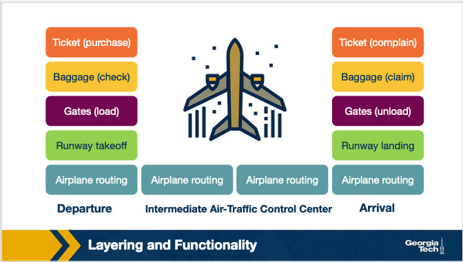
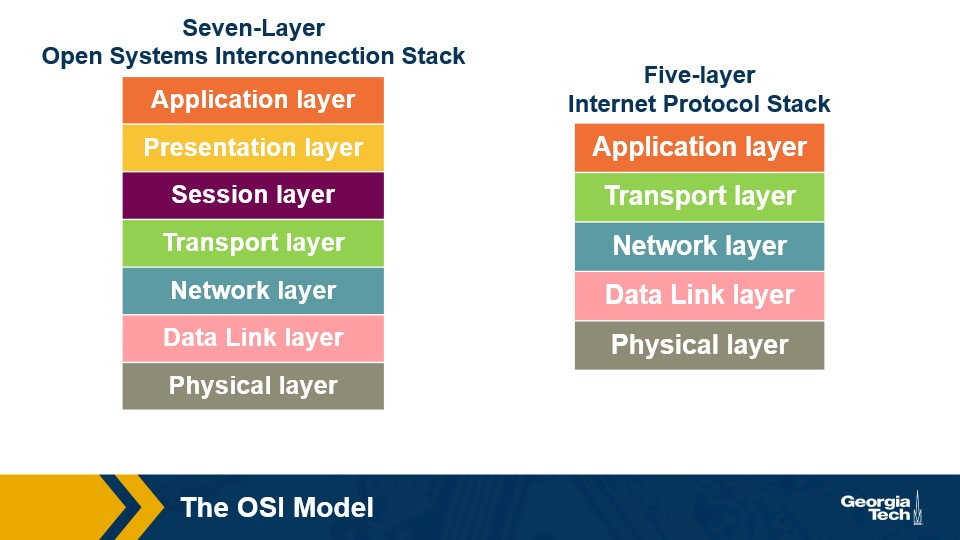
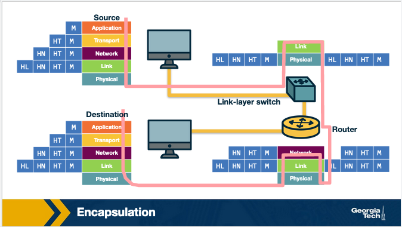
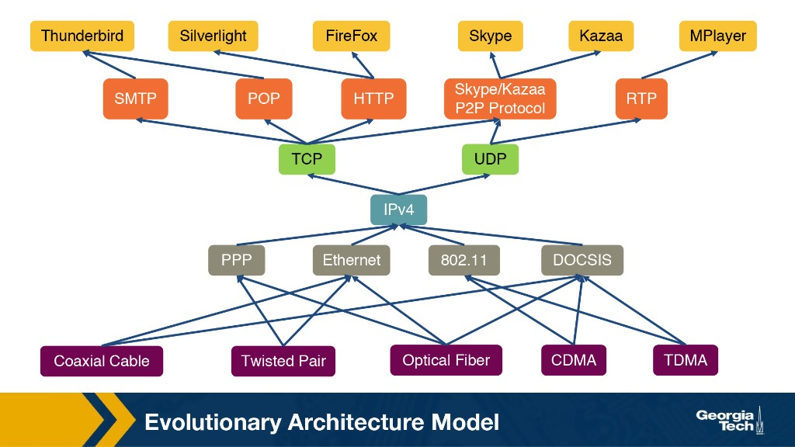
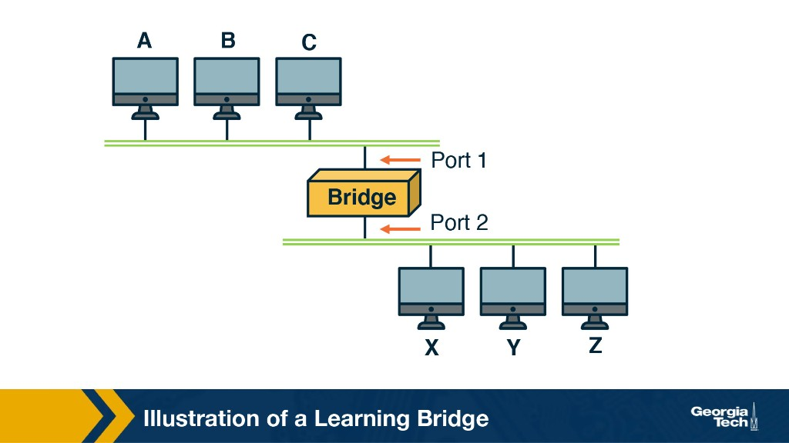
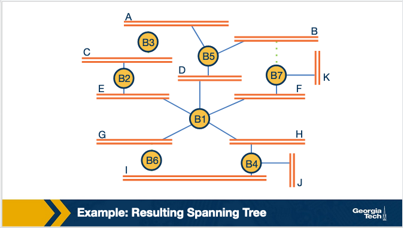

---
tags:
  - lesson-01
  - foundations
  - plain-language
search:
  boost: 2
---

# Lesson 1: Introduction & Internet Architecture — Plain-Language Guide

The simplest possible version of [Lesson 1](introduction.md). No jargon unless we explain it right away. When you want exam detail, use the **[Quick Study Guide](quick-study-guide.md)** or the **[Quiz](quiz.md)**. Next up: **[Lesson 2 — Transport Layer](../lesson-02/transport-application.md)** ([Plain-language guide](../lesson-02/plain-language.md)).

---

## Summary

The **Internet** connects many different networks so apps on your device can talk to apps anywhere in the world. It works by splitting data into small **packets**, organizing work into **layers**, and keeping the middle of the network simple while the smart work happens at the **edges** (your phone and the server).

---

## The one-sentence version

The Internet is many networks working together so your apps can reach other apps — by sending small packets, using layers, and putting the hard thinking at the ends, not in every router.

---

## How the Internet grew (story time)

The Internet grew slowly, like a city — not all at once.

| When | What happened | In plain words |
|------|---------------|----------------|
| 1960s | Packet switching | Split data into small pieces and share the line, like passing notes instead of renting the whole room. |
| 1969 | ARPANET | Four schools connected — the first small network. |
| 1970s | Email | People saw the goal: connect **people**, not just computers. |
| 1980s | TCP/IP | One shared language so different networks could talk. |
| 1980s–90s | DNS | A phone book for the Internet — type `google.com` instead of a number. |
| 1990s | World Wide Web | Pages, links, and browsers made the Internet easy for everyone. |

**Key takeaways:**

- **Packet switching** — break data into pieces and send them when there is room.
- **Open design** — Wi‑Fi, fiber, and cable can all work together if they follow the same top rules.
- **End-to-end** — your device and the server do the smart work; routers mostly just pass packets along.

---

## Why we use layers (the airline trip)

Sending data online is like flying from one city to another.

You do not load the plane, talk to air traffic control, or fuel the jet. You buy a ticket, check bags, go through security, board, fly, land, and pick up bags. Each step is a **layer**. You care about your trip. The airline handles the rest.

The Internet works the same way:

| Layer (top → bottom) | Job in plain words | Example |
|----------------------|--------------------|---------|
| **Application** | What you actually use | Browser, email, Zoom |
| **Transport** | Get data to the right app | **TCP** = make sure it arrives; **UDP** = send fast |
| **Network** | Get it to the right **computer** | IP addresses |
| **Data Link** | Get it to the **next** device on one hop | Wi‑Fi, Ethernet |
| **Physical** | Send the actual signals | Wires, fiber, radio |

**Key takeaways:**

- **Layers** split a big job into smaller steps.
- You can change one layer (like Wi‑Fi to 5G) without breaking your browser.
- Different companies can build different parts, and they still work together.
- The trade-off: extra wrapping adds a little delay, and some checks happen twice.



---

## OSI (7 layers) vs Internet (5 layers)

**OSI** is a textbook model with **7 layers**. The **Internet model** uses **5 layers** — what we actually build today.

The main difference: the Internet combines the top three OSI layers into one **Application** layer. Formatting data and keeping a session open? The app handles that.

```
OSI:        App | Pres | Sess | Trans | Net | Link | Phys   (7)
Internet:        App       | Trans | Net | Link | Phys   (5)
```



**Key takeaways:**

- **Socket** = the door between your app and the network. It uses an IP address plus a **port number**.
- **TCP** or **UDP** carries your message through that door.

---

## What each layer does

### Application — "What do you want to do?"

Web pages, email, and name lookup live here.

- **HTTP** — web pages
- **SMTP** — email
- **DNS** — turns names like `google.com` into numbers

**Data name:** **message**

### Transport — "Get it to the right app"

Your laptop runs many apps at once. **Port numbers** tell the computer which app gets each packet.

- **TCP** — like tracked mail: connect first, resend if lost, do not flood the receiver
- **UDP** — like a postcard: fast, no promises

**Data name:** **segment**

### Network — "Send it across the Internet"

Uses **IP addresses** (like street addresses for computers). **Routers** read them and pick the next hop.

**Data name:** **datagram**

### Data Link — "One hop at a time"

Moves data from this device to the **very next** one (laptop → router).

Uses **MAC addresses** (like a name tag on your network card).

**Data name:** **frame**

### Physical — "Send the signals"

Electricity, light in fiber, or radio waves. Just **bits** (0s and 1s).

**Data name:** **bits**

**Key takeaways:**

- Each layer has a clear job.
- Each layer uses a different name for its chunk of data.
- Memory trick going down: **M**essage → **S**egment → **D**atagram → **F**rame → **B**its

---

## Encapsulation — letters inside envelopes

When you send data, each layer wraps the layer above in a new envelope. That wrap is called a **header**.

```
You write:           M                          (message)
Transport adds:      [ envelope T | M ]         (segment)
Network adds:        [ envelope N | T | M ]    (datagram)
Link adds:           [ envelope L | N | T | M ] (frame)
Physical sends:      signals on the wire        (bits)
```

At the receiver, each layer opens its envelope and passes the inside up. That is **de-encapsulation**.

### Who reads what?

| Device | Layer | Looks at |
|--------|-------|----------|
| **Switch** | 2 | MAC address — "which port is this device on?" |
| **Router** | 3 | IP address — "which network is next?" |

**Key takeaways:**

- Switches and routers only read the **address on the outside**. They do not read your email or web page.
- **Smart edges, simple core** — phones and laptops are smart; middle routers stay simple and fast.



---

## End-to-end principle — keep the middle simple on purpose

**Rule:** If only the sender and receiver know what they need (speed? perfect delivery? encryption?), **do not build that into every router in the world**.

- File download? You need every byte in order → use **TCP** at the ends.
- Video call? You need low delay; one lost frame is OK → the app may use **UDP**.

The **core** tries its best to forward packets. Apps at the edges add the extra rules they need.

**Key takeaways:**

- This design helped the web, streaming, and video calls grow without rebuilding every router.
- Real life bends the rule sometimes:

| Middle box | What it does |
|------------|--------------|
| **Firewall** | Blocks bad traffic between you and the server |
| **NAT** | Lets many home devices share one public IP address |
| **Proxy / cache** | Answers for someone else instead of passing everything through |

**NAT in plain words:**

```
Your phone (10.0.0.4)  →  home router changes to public IP  →  website
Website replies        →  router remembers who asked         →  your phone
```

NAT helped when we ran out of old-style IP addresses. The downside: it is harder for outsiders to connect straight to your laptop (games and video calls need workarounds).

**Memory trick:** Wi‑Fi link-layer error correction is **not** an end-to-end violation — it fixes a noisy medium. **NAT**, **firewalls**, and **DPI** **are** violations because the middle changes or inspects traffic.

---

## Hourglass shape — skinny middle, wide top and bottom



```
     ╱╲   ← many apps (web, email, games, …)
    ╱  ╲
   │ IP │  ← narrow middle: IP, TCP, UDP
   │TCP │
   │UDP │
    ╲  ╱
     ╲╱   ← many link types (Wi‑Fi, fiber, 5G, …)
```

Almost everything uses **IP + TCP/UDP** in the middle. That is why so many devices work together.

**Key takeaways:**

- The middle is **narrow** — few core rules everyone shares.
- The top and bottom are **wide** — many apps and many types of wires.
- That middle is hard to change. **IPv6** is better in some ways, but switching billions of devices is slow. That stuck feeling is called **ossification**.

---

## EvoArch — why the hourglass happens

Researchers built a computer model called **EvoArch** to show how network rules evolve over time.

- Rules **below** you = things you depend on
- Rules **above** you = things that depend on you
- **Value** = how much important stuff needs you

**Key takeaways:**

- **TCP is valuable** because web, email, and many apps sit on top of it.
- A new rule can be better on paper but **fail** if nothing uses it.
- Rules at the same level **compete**. Losers fade away. Over time, you get an hourglass shape.
- **TCP and UDP protect IPv4** — new network rules struggle if apps will not switch.

---

## Network devices — from simple to smarter

| Device | Layer | In plain words |
|--------|-------|----------------|
| **Hub** | 1 | Megaphone — shouts to **everyone** |
| **Repeater** | 1 | Volume booster on a long cable |
| **Switch** | 2 | Smart mailroom — sends only to the right desk (MAC) |
| **Router** | 3 | Post office between neighborhoods — uses IP |

**Key takeaways:**

- **Hub vs switch:** a hub sends to everyone (noisy). A switch sends directly when it knows where you are.
- **Router vs switch:** a switch works inside one local network. A router connects different networks.

---

## Learning bridges — switches that teach themselves

A **learning bridge** (switch) builds a table: "Device A is on port 1. Device X is on port 2."

**How it learns:**

1. A frame arrives from Device A on port 1 → write down: **A → port 1**
2. A frame goes to Device X → look up X
   - **Known?** Send only to that port.
   - **Unknown?** **Flood** — send to all ports except where it came from. Someone will answer, and then we learn.

**Key takeaways:**

- Learn from the **source** (who sent it).
- Forward to the **destination** (who should get it).



---

## Spanning Tree — when backup cables cause loops

Extra cables between switches are good for backup. They are bad if they create a **loop**.

**Problem:** Ethernet frames do not expire (unlike IP, which has TTL). On a loop, the same frame spins forever → **broadcast storm** → network breaks.

**Fix:** Keep all cables plugged in, but **block** some ports in software so traffic follows a **tree** with no loops.


**How switches agree (no single boss):**

1. Everyone says "I think **I'm** the root!"
2. Smallest bridge ID wins → that is the **root**
3. Each switch picks the shortest path to the root
4. Block ports that would create a loop

**Key takeaways:**

- Keep backup cables **physically**, but use only a **tree** for forwarding.
- Pick the best update: smallest root ID → shortest distance → smallest sender ID.



---

## Layering — good and bad

**Good:**

- Easier to build and fix
- Change one layer without breaking others
- Gear from different companies works together

**Bad:**

- Extra headers add a little delay
- Some jobs get done twice
- Hard to make the whole stack faster at once

---

## Clean-slate redesign (optional)

"What if we built the Internet today from scratch?"

The old Internet focused on **moving packets**. Today we would also want built-in **security**, **accountability**, and easier control of big networks.

**Key takeaways:**

- **4D architecture** — split "forward packets fast" from "decide what the whole network should do." This idea helped inspire **SDN**.
- **AIP** — addresses that help trace who really sent a packet.
- We will not replace the Internet overnight. These ideas show where fixes like SDN came from.

---

## Where this leads

Lesson 1 explains **how the stack is organized**. **[Lesson 2](../lesson-02/transport-application.md)** goes deep on **TCP and UDP** — how apps get reliable or fast delivery on top of IP.

| Layer | Lesson 1 focus | Lesson 2 focus |
|-------|----------------|----------------|
| Application | HTTP, DNS, SMTP names | Multiplexing with **ports** |
| Transport | TCP vs UDP in one sentence | Reliability, flow control, congestion control |
| Network | IP addresses, routers | (IP stays best-effort below transport) |

---

## The whole lesson on one napkin

```
History:     packets + TCP/IP + DNS + Web = global Internet
Layers:      App → Transport → Network → Link → Physical
Names:       Message → Segment → Datagram → Frame → Bits
Devices:     Hub (simple) → Switch (MAC) → Router (IP)
Design:      Smart edges, simple core (end-to-end)
Shape:       Hourglass — many apps & links, few core rules
Reality:     NAT & firewalls bend the rules for good reasons
Switches:    Learn from source, forward to destination
Loops:       Spanning Tree blocks ports, keeps cables
```

---

## Where to go next

| You want… | Go here |
|-----------|---------|
| Full detail + diagrams | [Lesson 1 — full guide](introduction.md) |
| Exam tables & Q&A | [Quick Study Guide](quick-study-guide.md) |
| Practice | [Lesson 1 Quiz](quiz.md) |
| Next module | [Lesson 2 — Transport Layer](../lesson-02/transport-application.md) |

---

**Bottom line:** The Internet connects the world by sending small **packets** through **layers**, keeping the middle simple and letting apps at the edges decide what quality of delivery they need.
