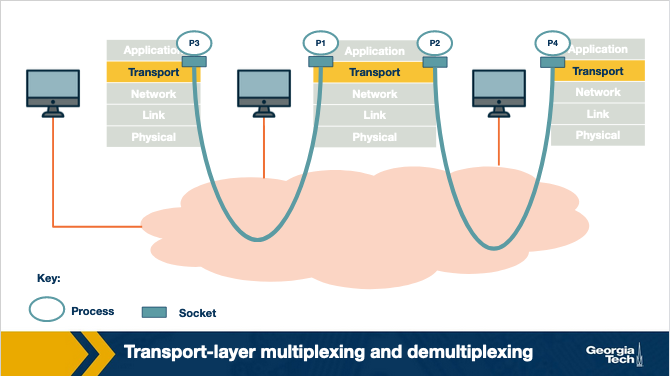
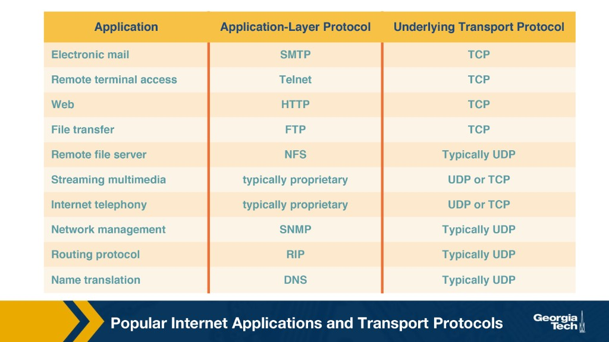
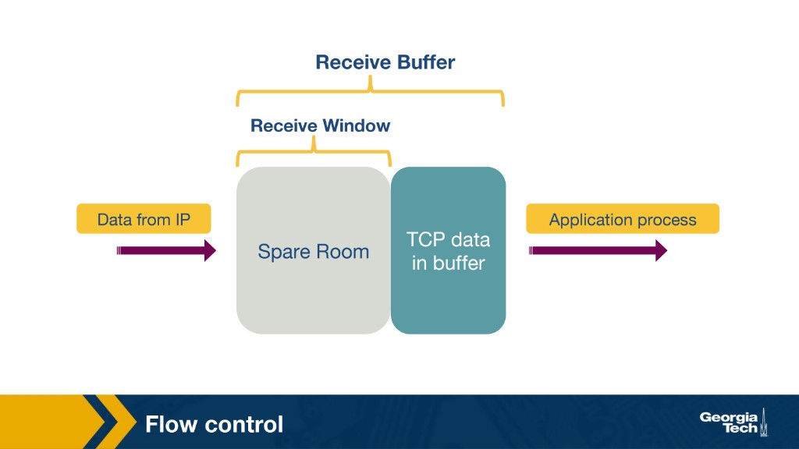
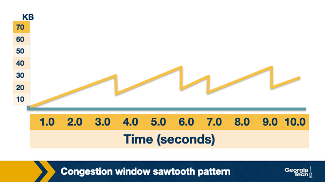

---
tags:
  - lesson-02
  - tcp
  - transport
  - plain-language
search:
  boost: 2
---

# Lesson 2: Transport Layer — Plain-Language Guide

The simplest version of [Lesson 2](transport-application.md). Layer basics from [Lesson 1](../lesson-01/plain-language.md) help here. For exam tables and formulas, use the **[Quick Study Guide](quick-study-guide.md)** or the **[Quiz](quiz.md)**.

---

## Summary

**IP** gets data to the right **computer** — but only with **best-effort** delivery (it tries, no promises). The **transport layer** gets data to the right **app** on that computer using **port numbers**. **TCP** adds reliability and speed control; **UDP** stays fast and simple.

---

## The one-sentence version

IP delivers to the house; transport delivers to the right room — and TCP can make sure nothing is lost, out of order, or sent too fast.

---

## A day on your laptop (the big picture)

You open your laptop. Within minutes you might:

| What you do | What the network needs | Protocol |
|-------------|------------------------|----------|
| Load a news site | Every byte, in order | **TCP** |
| Join a Zoom call | Low delay beats perfect audio | **UDP** (often) |
| Look up `netflix.com` | One quick question, one answer | **UDP** |
| Download a PDF | Nothing missing, no corruption | **TCP** |
| Play an online game | React in milliseconds | **UDP** |

All of this happens on **one computer** with **one IP address**. IP knows your laptop's address. It does **not** know whether a packet belongs to Chrome, Spotify, or Discord.

That's the transport layer's job: **app to app**, not just computer to computer.

**Memory trick:** **IP = house address. Transport = which room + how carefully to deliver.**

---

## Scenario 1: You open a website

You type `news.ycombinator.com` and hit Enter.

### Step 1 — Find the server (DNS, usually UDP)

Your browser asks: *"What IP address is news.ycombinator.com?"*

That is a tiny question with a tiny answer. **DNS** usually sends it over **UDP** — like shouting a question across a room. No long setup needed.

### Step 2 — Connect (TCP three-way handshake)

Loading the actual page needs every piece of HTML, in order. Your browser opens a **TCP connection** to the web server — like dialing a phone before you talk:

| Step | Who says what |
|------|---------------|
| 1 | Client → Server: **SYN** — "Can we talk?" |
| 2 | Server → Client: **SYN-ACK** — "Yes, I'm here too" |
| 3 | Client → Server: **ACK** — "Great, let's go" |

{ width="650" }

**Memory trick:** **SYN → SYN-ACK → ACK**

!!! warning "Exam gotcha"
    Step 3 has **SYN=0**, not 1. Some videos get this wrong.

### Step 3 — Fetch the page (HTTP on TCP)

Over that connection, your browser sends **HTTP GET**. The server sends back HTML. TCP makes sure:

- Lost pieces get **resent**
- Pieces arrive **in order**
- The sender does not **flood** your laptop's memory

When you leave the tab, TCP closes politely — **FIN → ACK → FIN → ACK** (four steps, not three).

**Key takeaways:**

- **Web pages → TCP** because missing a byte breaks the page.
- The handshake happens **before** application data (HTTP) flows.

---

## Scenario 2: You're on a video call

You're on a Zoom or FaceTime call. If one audio frame arrives 200 ms late, you do not want TCP to pause everything while it hunts for the perfect version of that frame.

| If TCP handled your call… | What you'd notice |
|---------------------------|-------------------|
| Retransmit lost frames | Stutter, then catch-up bursts |
| Wait for in-order delivery | Growing lag — "you're on mute" echoes |
| Slow down when the network looks busy | Voice cuts out during congestion |

**UDP** sends each audio chunk like a **postcard**: fast, no tracking, no guarantee. A tiny glitch beats a half-second freeze.

The app decides what to do about loss — maybe skip a frame, maybe interpolate.

**Key takeaways:**

- **Live video, gaming, VoIP → often UDP** when delay matters more than perfection.
- "Unreliable" does not mean broken — the **app** handles loss.

---

## Scenario 3: Many apps, one computer

Your laptop runs Chrome, Spotify, Slack, and a game — all at once. How does each packet find the right app?

| Term | Plain English |
|------|---------------|
| **Multiplexing** | Sender: gather data from many apps, label each piece, send down |
| **Demultiplexing** | Receiver: read the label, deliver to the correct app |
| **Socket** | An app's "door" on the network, tied to a **port number** |

{ width="700" }

### UDP: one door per port (2-tuple)

UDP only needs **(destination IP, destination port)** to know where a packet goes.

Two different people can send to your laptop's port 53 (DNS). Same door — UDP does not track separate conversations.

### TCP: one private line per conversation (4-tuple)

TCP needs all four:

**(source IP, source port, destination IP, destination port)**

A web server on port 80 might have **10,000 browsers** connected at once. It tells them apart with the full 4-tuple.

{ width="700" }

**How a web server works:**

1. **Welcoming socket** listens on port 80 — "anyone home?"
2. You connect; server creates a **connection socket** just for you
3. Your requests and responses flow on that private socket

**Memory trick:** **UDP = 2-tuple. TCP = 4-tuple.**

---

## UDP vs TCP — pick your delivery style

| | **UDP** | **TCP** |
|---|---------|---------|
| Setup | Just send | Handshake first |
| Reliability | Best effort | Resends, keeps order |
| Speed control | None | Yes |
| Feels like | Postcard | Registered mail with tracking |
| Good for | DNS, games, live streams | Web, email, file downloads |

{ width="700" }

---

## Scenario 4: When pieces go missing (TCP reliability)

You're downloading a 500 MB file. Somewhere on the Internet, segment **#847** vanishes.

**What TCP does:**

1. Receiver keeps saying "I still need byte 847" (**duplicate ACKs**)
2. Sender's timer expires → **retransmit**
3. Or: **3 duplicate ACKs** in a row → **fast retransmit** (don't wait for the timer)

{ width="650" }

| ARQ style | Plain English | Problem |
|-----------|---------------|---------|
| **Stop-and-wait** | Send one chunk, wait, send next | Wire sits idle — too slow |
| **Go-back-N** | Pipeline many chunks; throw away out-of-order ones | One loss wastes a lot of resending |
| **Selective repeat** | Buffer out-of-order pieces; resend only what's missing | What **TCP actually uses** |

**Memory trick:** **3 dup ACKs = "definitely lost, resend now." Timeout = "probably lost, resend slower."**

---

## Scenario 5: Don't flood the receiver (flow control)

Imagine pouring water into a bucket while someone drains it through a small hole (the app reading data). Pour faster than it drains → overflow.

| Idea | Plain English |
|------|---------------|
| **RcvBuffer** | Size of the bucket |
| **rwnd** (receive window) | "I have this much empty space left" |
| **Sender rule** | Don't send more un-ACKed data than **rwnd** |

{ width="600" }

If the bucket is full, receiver says **rwnd = 0**. Sender stops. When space opens up, sender sends tiny **probes** to ask "room yet?"

**Flow control protects the receiver** — not the network.

---

## Scenario 6: Don't clog the highway (congestion control)

Picture a freeway on-ramp. You and 50 other drivers merge at once. Everyone floors it → traffic jam → everyone slows down → some cars never make it (packets **dropped**).

TCP does not know the freeway's capacity ahead of time. It **probes**:

| Phase | What happens |
|-------|--------------|
| **Slow start** | Start with 1 segment; double roughly each round trip until things look good |
| **AIMD** | Grow slowly (+1 segment per RTT); on loss, **cut in half** |
| Result | A **sawtooth** graph — climb, hit congestion, drop, try again |

{ width="600" }

### Two different brakes

| | **Flow control** | **Congestion control** |
|---|------------------|------------------------|
| Protects | **Your laptop** (receiver buffer) | **The network** (shared links) |
| Knob | **rwnd** | **cwnd** (congestion window) |
| Question | "How much can *this computer* swallow?" | "How much can the *path* handle?" |

**Send limit = the smaller of rwnd and cwnd.**

**Memory trick:** **Flow = receiver bucket. Congestion = shared highway.**

### When loss happens — two severity levels

| Signal | TCP Reno's reaction |
|--------|---------------------|
| **3 duplicate ACKs** | Mild — halve cwnd, keep going |
| **Timeout** | Severe — drop to 1 segment, slow start again |

### Fairness — who gets how much road?

If **k** TCP connections share one link, each should get about **1/k** of the bandwidth — **if they use AIMD and the same RTT**.

| Situation | Fair? |
|-----------|-------|
| Same RTT + **AIMD** | Yes — converges toward equal share |
| **AIAD / MIMD / MIAD** instead of AIMD | No — none converge to equal share like AIMD |
| Shorter RTT wins | No — more ACKs per second → bigger window |
| Browser with 11 tabs vs app with 1 connection | No — fairness is **per connection**, not per app |

**Why only AIMD?** Additive increase helps the smaller flow catch up; multiplicative decrease (cut in half) clears congestion. **AIAD** keeps the same gap between flows forever. **MIMD** keeps the same **ratio** forever. **MIAD** makes the gap **worse** over time.

**Memory trick:** AIMD = **climb slow, fall fast proportionally** → fair sawtooth. MIMD = **scale together** → unfair ratio locked in.

### Modern twist: TCP CUBIC (brief)

On a **10 Gbps link across the ocean**, classic TCP grows too slowly — like adding one lane per hour on a 100-lane highway.

**TCP CUBIC** (Linux default) breaks Reno’s **RTT dependency**:

| | **Reno** | **CUBIC** |
|---|----------|-----------|
| What drives growth? | **ACKs** — ~+1 MSS per **RTT** | **Clock** — $W(t) = C(t-K)^3 + W_{\max}$ |
| Short vs long RTT | Short RTT wins (10× faster growth) | Same **target** $W(t)$ at time $t$ regardless of RTT |
| RTT’s role | Sets growth **rate** | Sets how **often** ACKs update toward target |

**Memory trick:** Reno grows with **ACKs per second**; CUBIC grows with **seconds on the wall clock** since last loss.

For exam formulas and CUBIC details → [full guide](transport-application.md) or [quick study guide](quick-study-guide.md).

---

## The whole lesson on one napkin

```
IP:           best effort, computer → computer
Transport:    app → app (ports)

UDP:          postcard, 2-tuple, fast (DNS, games, live video)
TCP:          tracked delivery, 4-tuple, handshake + teardown

Reliability:  ACKs + timeout; 3 dup ACKs = fast retransmit
Flow:         rwnd protects receiver bucket
Congestion:   cwnd protects shared network
Send limit:   min(rwnd, cwnd)

Slow start → AIMD sawtooth; timeout hits harder than dup ACKs
CUBIC:        faster on high-speed long-distance links (Linux default)
```

---

## Where to go next

| You want… | Go here |
|-----------|---------|
| Full detail + diagrams | [Lesson 2 — full guide](transport-application.md) |
| Exam tables & Q&A | [Quick Study Guide](quick-study-guide.md) |
| Practice | [Lesson 2 Quiz](quiz.md) |
| Internet architecture basics | [Lesson 1 plain-language guide](../lesson-01/plain-language.md) |

---

**Bottom line:** Transport turns IP's "deliver to the house" into "deliver to the right app" — and TCP adds the reliability and rate control that make the web work on a shared, unpredictable network.
