---
tags:
  - lesson-02
  - tcp
  - transport
---

# Lesson 2: Transport Layer

The transport layer sits above IP and provides **application-to-application** communication. Module 2 focuses on how TCP and UDP differ, how TCP achieves reliability and rate control, and how modern congestion control (including TCP CUBIC) works on high-speed networks.

!!! tip "Exam prep"
    New to the material? Start with the **[Plain-language guide](plain-language.md)** — plain-language explanations and analogies. Need a condensed review? See the **[Quick Study Guide](quick-study-guide.md)** — tables, memory aids, and high-yield questions with short answers. For interactive practice, try the **[Lesson 2 Quiz](quiz.md)**.

**Course references:** Module 2 Summary Video, Kurose & Ross Ch. 3 (Transport Layer), Ch. 2.1–2.2, 2.4 (Application — HTTP, DNS).

---

## Why do we need the transport layer?

IP moves **datagrams** between hosts using **best-effort** delivery. That means IP tries to deliver packets but does **not** guarantee:

- Delivery (packets can be lost)
- In-order delivery
- Bounded delay
- No duplication

The transport layer adds an **end-to-end service between applications**. At the sender, it takes an application message, adds a transport header, and forms a **segment**. IP then encapsulates that segment. At the receiver, the transport layer **demultiplexes** segments to the correct application process (using ports).

!!! tip "Memory aid"
    **IP = host-to-host, best effort. Transport = process-to-process, optional reliability and rate control.**

---

## Real-life scenarios (pick your transport)

| Scenario | What matters most | Typical choice | Why |
|----------|-------------------|----------------|-----|
| Loading a web page | Correct bytes, in order | **TCP** + HTTP | Missing HTML breaks the page |
| DNS lookup (`google.com` → IP) | One quick Q&A | **UDP** | Small request; speed beats setup overhead |
| Video call / gaming | Low delay | **UDP** (often) | Retransmitting old frames causes lag |
| Email / file download | Nothing lost | **TCP** | Corruption or gaps are unacceptable |
| Live sports stream | Smooth playback | **UDP** or **TCP** | App decides loss vs delay tradeoff |

These scenarios repeat throughout the lesson. When in doubt, ask: *Does this app need perfect delivery, or lowest delay?*

### Running example: loading a web page

When you type a URL in a browser:

1. **DNS (usually UDP):** Browser asks "what IP is this hostname?" — one small question, one small answer.
2. Traffic may leave your campus network, traverse ISPs, and reach a server (often at a **CDN** edge).
3. **TCP handshake:** Browser and server agree the connection exists before sending page data.
4. The browser sends an **HTTP GET**; the server replies with an **HTTP response** (HTML body).
5. TCP ensures bytes arrive **correctly** and **in order**; the browser renders the page.

**TCP** is the natural choice here. A real-time app (live video, VoIP, gaming) might prefer **UDP** when **lower delay** matters more than perfect reliability. See the **[Plain-language guide](plain-language.md)** for step-by-step scenario walkthroughs.

---

## UDP vs TCP at a glance

| | UDP | TCP |
|---|-----|-----|
| Connection | Connectionless | Connection-oriented (handshake first) |
| Reliability | Best effort; app handles loss if needed | Reliable, in-order byte stream |
| Flow control | None | Yes (receive window) |
| Congestion control | None | Yes (congestion window) |
| Overhead | Small header (8 bytes) | Larger header (20+ bytes) |
| Typical use | DNS, streaming, gaming, VoIP | Web, email, file transfer |

The Internet mainly offers these two transport choices. Pick based on what the application needs.

---

## Transport vs network layer (and where apps fit)

From [Lesson 1](../lesson-01/introduction.md), the stack is **Application → Transport → Network → Data Link → Physical**. This lesson focuses on **transport**; apps sit above it.

| Layer | Data unit | Scope | This lesson |
|-------|-----------|-------|-------------|
| **Application** | Message | What you use (HTTP, DNS, SMTP) | Mentioned in scenarios above |
| **Transport** | **Segment** | App to app (ports) | **TCP and UDP — main focus** |
| **Network (IP)** | **Datagram** | Computer to computer | Best effort; transport builds on top |

**TCP** — connection-oriented, reliable, flow control, congestion control.

**UDP** — connectionless, best effort, minimal overhead; the app handles timing and loss if needed.

!!! abstract "Takeaway"
    **Transport = process-to-process (ports). Network = host-to-host (IP).** Presentation and session (OSI layers 5–6) are folded into the Internet **application** layer — see [Lesson 1](../lesson-01/introduction.md) for the full stack comparison.

---

## What does the transport layer provide?

The transport layer provides **logical communication between application processes** on different hosts. It extends the network layer's host-to-host delivery to **process-to-process** delivery by using port numbers. Key services include:

- Multiplexing and demultiplexing
- (TCP) Reliable, in-order delivery
- (TCP) Flow control and congestion control
- (UDP) Lightweight, best-effort delivery

---

## What is a packet for the transport layer called?

A transport-layer packet is called a **segment**. Specifically:

- **TCP segment** — for TCP
- **UDP datagram** — for UDP (sometimes also called a segment)

---

## What are the two main protocols within the transport layer?

1. **TCP (Transmission Control Protocol)** — Connection-oriented, reliable, in-order delivery with flow and congestion control.
2. **UDP (User Datagram Protocol)** — Connectionless, unreliable, best-effort delivery with minimal overhead.

---

## Multiplexing and demultiplexing

### Why multiplexing?

A single host often runs **many applications at once** (browser, music streaming, email). The **network layer** delivers to a host using an **IP address** only — it does not identify which **process** should receive the packet.

The transport layer uses **ports** and **sockets**:

- Each application binds to a port by opening a **socket**.
- **Multiplexing** (sender): gather data from sockets → add transport header → pass segments down.
- **Demultiplexing** (receiver): read header fields → deliver to the correct socket.

| Term | Direction | Job |
|------|-----------|-----|
| **Multiplexing** | Sender | Sockets → segments → network layer |
| **Demultiplexing** | Receiver | Segment → correct socket |

{ width="700" }

The middle host runs **P1** and **P2** — transport must demultiplex inbound traffic and multiplex outbound traffic from both processes.

### Segment header: port fields

Key demultiplexing fields: **source port** and **destination port** (16 bits each):

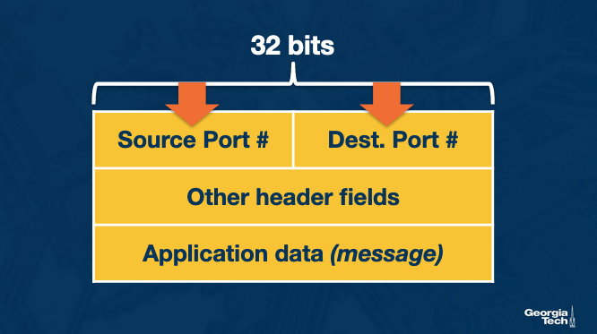{ width="500" }

### Connectionless (UDP) demultiplexing

UDP socket ID = **2-tuple: (destination IP, destination port)**

1. Sender builds segment with source/dest ports.
2. Network delivers datagram best-effort.
3. Receiver uses **destination port** (and dest IP) to pick the socket.

Same **dest IP + dest port** → same socket, even from different sources. Reply swaps ports.

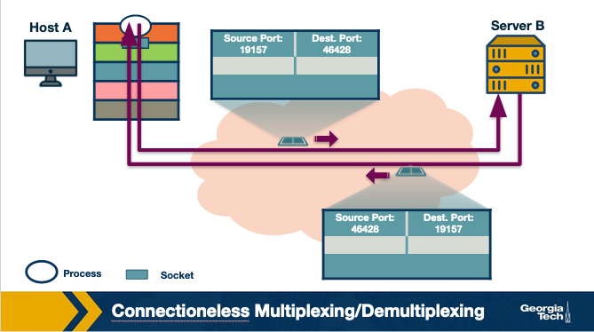{ width="650" }

### Connection-oriented (TCP) demultiplexing

TCP connection ID = **4-tuple: (source IP, source port, destination IP, destination port)**

1. Server **welcoming socket** listens (e.g., port 80).
2. Client SYN includes chosen source port + dest port 80.
3. Server creates **connection socket** for that 4-tuple.
4. Data flows between client socket and connection socket.

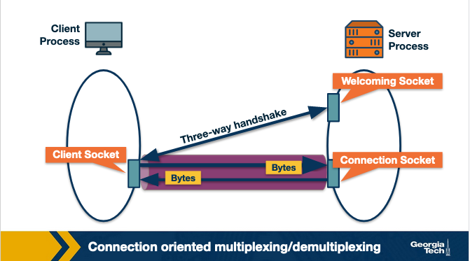{ width="650" }

### Example: three hosts, one web server

| Connection | Source IP | Source port | Dest IP | Dest port |
|------------|-----------|-------------|---------|-----------|
| A → B | A | 26145 | B | 80 |
| C → B (1) | C | 7532 | B | 80 |
| C → B (2) | C | 26145 | B | 80 |

A and C can both use source port **26145** — server B demultiplexes by full 4-tuple (C’s two sessions differ by source port).

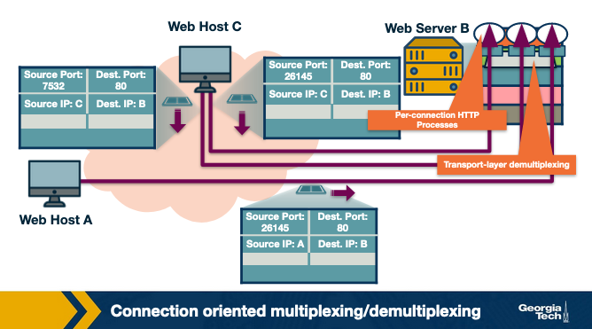{ width="700" }

!!! note "Persistent vs non-persistent HTTP"
    **Persistent:** many HTTP messages on one TCP connection/socket. **Non-persistent:** new connection per request — costly for busy servers.

!!! tip "Memory aid"
    **UDP = 2-tuple. TCP = 4-tuple. Welcoming socket listens; connection socket serves one client.**

---

## What is multiplexing, and why is it necessary?

IP only addresses **hosts**; ports address **processes**. Multiplexing gathers socket data at the sender; demultiplexing delivers to the correct socket at the receiver (see section above).

---

## Describe the two types of multiplexing/demultiplexing

- **UDP (connectionless):** 2-tuple **(dest IP, dest port)** — same dest port → same socket regardless of source.
- **TCP (connection-oriented):** 4-tuple **(src IP, src port, dest IP, dest port)** — each connection gets its own socket; server uses welcoming + connection sockets.

---

## What are the differences between UDP and TCP?

| Feature | UDP | TCP |
|---------|-----|-----|
| **Connection** | Connectionless | Connection-oriented (3-way handshake) |
| **Reliability** | No guarantees | Reliable, in-order delivery |
| **Flow Control** | None | Yes (receiver window) |
| **Congestion Control** | None | Yes (AIMD, slow start) |
| **Header Size** | 8 bytes | 20+ bytes |
| **Ordering** | No guarantee | Guaranteed in-order |
| **Speed** | Lower latency | Higher latency due to overhead |

---

## UDP: why it exists and how it works

UDP is **unreliable** and **connectionless** — no three-way handshake, no built-in retransmission, flow control, or congestion control. That sounds weak, but it is exactly why UDP is preferred for some apps.

### Why choose UDP over TCP?

| UDP advantage | Effect |
|---------------|--------|
| **No congestion control** | App data is encapsulated and sent immediately — TCP may delay sends for cwnd/rwnd and retransmits |
| **No connection setup** | No handshake delay before first byte |
| **Smaller header** | 8 bytes vs TCP's 20+ bytes |

Real-time apps (VoIP, live streaming, gaming) often prefer **lower delay** over perfect delivery. **DNS** typically uses UDP for simple request/response.

{ width="700" }

| Application | App protocol | Transport |
|-------------|--------------|-----------|
| Email | SMTP | TCP |
| Web | HTTP | TCP |
| File transfer | FTP | TCP |
| Streaming / Internet telephony | proprietary | UDP or TCP |
| Network management | SNMP | Usually UDP |
| Name translation | DNS | Usually UDP |

### UDP segment structure (64-bit header)

| Field | Size | Purpose |
|-------|------|---------|
| Source port | 16 bits | Sending process |
| Destination port | 16 bits | Receiving process |
| Length | 16 bits | Header + data (bytes) |
| Checksum | 16 bits | Error detection |
| Application data | variable | Payload (message) |

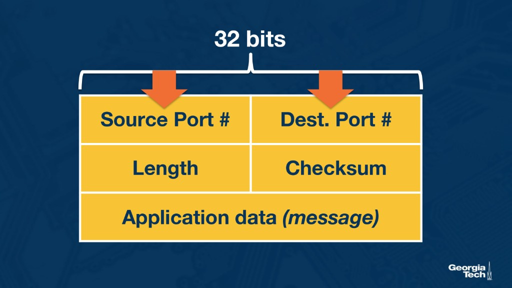{ width="500" }

### UDP checksum (basic idea)

The checksum helps detect errors even though the network is not end-to-end reliable:

1. Sender treats header fields + **application data** as 16-bit words (see RFC 768).
2. Sum the words, take **1's complement** → checksum field.
3. Receiver adds all 16-bit words including checksum; result should be **all 1s** if no error.

---

## When would an application layer protocol choose UDP over TCP?

Choose UDP when **latency and sender control** matter more than guaranteed delivery. See the [UDP section](#udp-why-it-exists-and-how-it-works) and application table above.

---

## TCP connection establishment (three-way handshake)

Before data transfer, TCP exchanges three control segments (often with **no application data**):

| Step | Name | Key fields |
|------|------|------------|
| 1 | **SYN** (client → server) | `SYN=1`, `seq=client_isn` |
| 2 | **SYN-ACK** (server → client) | `SYN=1`, `seq=server_isn`, `ack=client_isn+1` |
| 3 | **ACK** (client → server) | `SYN=0`, `seq=client_isn+1`, `ack=server_isn+1` |

The server allocates resources on SYN; the client allocates on SYN-ACK and confirms with ACK.

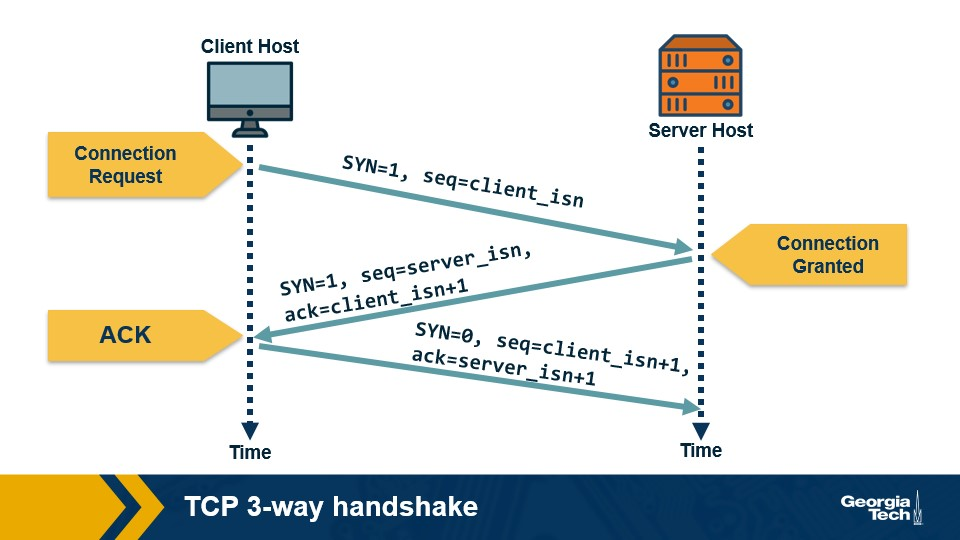{ width="650" }

!!! warning "Exam / video errata"
    Step 3 ACK has **SYN=0** (not 1). Some videos misstate this; the course text is correct.

!!! tip "Memory aid"
    **SYN → SYN-ACK → ACK** — synchronize sequence numbers and agree the connection exists.

## Explain the TCP Three-way Handshake

1. **SYN** — Client sends `SYN=1` and `client_isn`.
2. **SYN-ACK** — Server sends `SYN=1`, `server_isn`, `ack=client_isn+1`.
3. **ACK** — Client sends `SYN=0`, `ack=server_isn+1` (may carry data).

---

## TCP connection teardown

Closing is also controlled so one side does not think the connection is still open:

| Step | Direction | Segment |
|------|-----------|---------|
| 1 | Client → server | **FIN** (client wants to close) |
| 2 | Server → client | **ACK** (got your FIN) |
| 3 | Server → client | **FIN** (server done sending) |
| 4 | Client → server | **ACK** (confirm); client enters **TIME_WAIT** |

TIME_WAIT lets the client retransmit the final ACK if lost and absorbs delayed segments before fully closing.

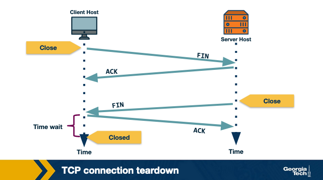{ width="650" }

## Explain the TCP connection tear down

Same four steps as above. After the final ACK, **TIME_WAIT** (often ~2× MSL) prevents ambiguous close states.

---

## Reliable transmission

The network layer is **unreliable** — packets can be **lost**, **duplicated**, or arrive **out of order**. That breaks apps like file download unless something fixes it.

- **UDP:** leaves reliability to the application.
- **TCP:** guarantees **in-order, loss-free, uncorrupted** delivery of the byte stream to the application.

### How TCP knows what was received

The receiver sends **acknowledgments (ACKs)** for data it got. If the sender gets no ACK within a **timeout**, it assumes loss and **retransmits**. This family of techniques is **Automatic Repeat Request (ARQ)**.

Timeout is usually based on estimated **RTT**:

- Too **short** → unnecessary retransmissions
- Too **long** → slow recovery after real loss

### ARQ variants

| Method | Idea | Tradeoff |
|--------|------|----------|
| **Stop-and-wait** | Send one segment → wait for ACK → send next | Simple; channel idle during RTT — very low utilization |
| **Go-back-N** | Pipeline up to **N** unacked segments; cumulative ACKs | Better throughput; one loss can waste many retransmissions |
| **Selective repeat / SACK** | ACK individual segments; buffer out-of-order at receiver | Retransmit only what was lost; more complex |

Pipelining requires:

- **Sequence numbers** on each segment (byte offsets in TCP)
- **Sender buffer** for sent-but-unacked data
- **Receiver buffer** if the app reads slower than data arrives

### Go-back-N

Receiver ACKs the **last in-order** segment only. Out-of-order arrivals are **discarded**.

If segment **7** is lost but 8–10 arrive, the receiver drops 8–10 and keeps ACKing 6 (or the byte before 7). The sender eventually retransmits **7 and everything after it**.

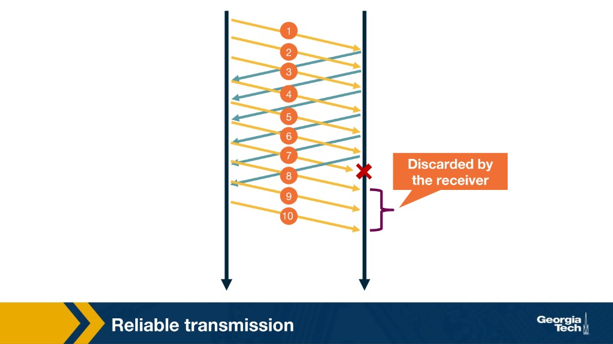{ width="650" }

### Selective ACKing (what TCP uses)

TCP retransmits only segments believed lost. The receiver **ACKs correctly received out-of-order segments** and **buffers** them until the gap fills, then delivers in order to the app.

ACKs can still be lost → TCP still needs **timeouts**.

### Fast retransmit (duplicate ACKs)

A **duplicate ACK** acknowledges again a byte the sender already knows was ACKed. They mean: “I got something new, but I’m still missing an earlier segment.”

When the sender sees **3 duplicate ACKs**, it treats the missing segment as lost and **retransmits immediately** (fast retransmit) instead of waiting for timeout.

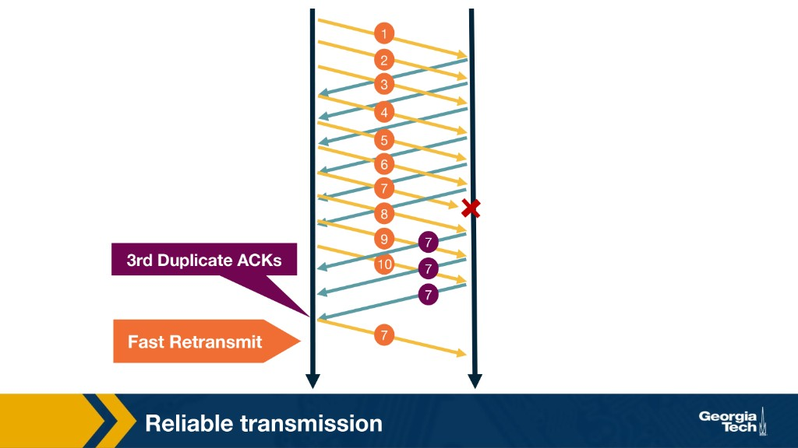{ width="650" }

**Example:** Segments 1–6 OK; **7 lost**; 8–10 arrive → receiver sends dup ACK **7** three times → sender fast-retransmits **7**.

!!! tip "Memory aid"
    **Timeout = loss (slow). 3 dup ACKs = likely loss (fast retransmit). SACK = don’t re-send what already arrived.**

---

## What is Automatic Repeat Request (ARQ)?

ARQ uses **ACKs + timeouts** (and sometimes dup ACKs) so the sender knows what to retransmit. Variants: Stop-and-wait, Go-back-N, selective repeat/SACK — see [Reliable transmission](#reliable-transmission) above.

---

## What is Stop and Wait ARQ?

Send **one** segment, wait for ACK, then send the next. Simple but idle during each RTT — poor utilization on high-latency links.

---

## What is Go-Back-N?

Pipeline **N** unacked segments; **cumulative ACKs**; receiver **discards** out-of-order data; sender retransmits from first loss onward. See diagram above.

---

## What is Selective ACKing?

Receiver buffers out-of-order segments and signals what it has; sender retransmits **only** missing segments (TCP SACK). More efficient than go-back-N.

---

## What is fast retransmit?

On **3 duplicate ACKs**, retransmit the missing segment immediately without waiting for timeout. See [fast retransmit diagram](#reliable-transmission) above.

---

## Transmission control: why and where

**Transmission control** regulates how fast a sender puts data on the network.

### Scenario: downloading a 1 GB file on a "100 Mbps" link

You start a big download. Your Wi‑Fi says 100 Mbps — so you expect ~80 seconds. Reality is messier:

- You do not know the true path capacity (many hops, shared links).
- **Other users** share the same bottleneck — your rate affects everyone.
- Your laptop may receive from **multiple senders** at once.
- Your disk or browser may read **slower** than data arrives.

Blasting at full speed can **overflow the receiver** or **clog routers** for everyone. **Rate must be discovered and adapted.**

### Why the transport layer (TCP)?

| Approach | Issue |
|----------|--------|
| **UDP / app does it** | Every app reimplements rate control; easy to get wrong |
| **TCP in transport** | One place for reliability + **flow control** + **congestion control** + **fairness** among flows |

Transmission control is a core primitive for most apps — TCP implements it in the transport layer.

---

## Flow control (protect the receiver)

**Flow control** matches the **sender’s rate** to the **receiver’s ability to absorb data**.

**Scenario:** You download a movie while your laptop is also backing up photos to the cloud. Movie bytes arrive faster than the video app can decode and write to disk. Without flow control, the receive buffer **overflows** and data is lost — ironically, on a *reliable* protocol.

TCP buffers arriving segments at the receiver until the application reads them. If the app is slow (disk I/O, other processes), data piles up and can **overflow RcvBuffer**.

### Receiver variables

| Variable | Meaning |
|----------|---------|
| **RcvBuffer** | Total receive buffer size for this connection |
| **LastByteRead** | Last byte the application has read from the buffer |
| **LastByteRcvd** | Last byte received from the network and placed in the buffer |

**No overflow rule:**

$$\text{LastByteRcvd} - \text{LastByteRead} \leq \text{RcvBuffer}$$

**Receive window (rwnd)** — spare room left in the buffer:

$$\text{rwnd} = \text{RcvBuffer} - (\text{LastByteRcvd} - \text{LastByteRead})$$

The receiver **advertises rwnd** in every segment/ACK to the sender.

{ width="600" }

- **Data from IP** fills the buffer (teal).
- **Application process** drains it from the other side.
- **Spare room** = rwnd = how much more the sender may send without overflowing.

### Sender variables

| Variable | Meaning |
|----------|---------|
| **LastByteSent** | Last byte sent (not necessarily ACKed) |
| **LastByteAcked** | Last byte ACKed by receiver |

**UnACKed data sent:**

$$\text{LastByteSent} - \text{LastByteAcked}$$

**Sender rule:**

$$\text{LastByteSent} - \text{LastByteAcked} \leq \text{rwnd}$$

The sender must not have more unacknowledged bytes in flight than the receiver’s advertised window.

### Zero-window deadlock and fix

**Problem:** Receiver advertises **rwnd = 0** → sender stops. Receiver’s app drains the buffer, but if B has **nothing to send** to A, B may never send a segment — A never learns space opened up.

**TCP fix:** Sender sends **1-byte probe segments** after rwnd = 0. Receiver ACKs with updated **rwnd** → sender resumes when buffer has room.

---

## Flow control vs congestion control

| Mechanism | Protects | Knob | Question answered |
|-----------|----------|------|-------------------|
| **Flow control** | **Receiver** buffer | **rwnd** | “How much can *this host* accept right now?” |
| **Congestion control** | **Network** | **cwnd** | “How much can the *path* handle without congestion?” |

Effective send limit:

$$\text{LastByteSent} - \text{LastByteAcked} \leq \min(\text{rwnd}, \text{cwnd})$$

!!! warning "Exam point"
    **Flow control = receiver. Congestion control = network.** Both limit rate; different reasons.

---

## What is transmission control, and why do we need to control it?

Regulate send rate for receiver overflow and network congestion. Implemented in **TCP** (not UDP). See sections above.

---

## What is flow control, and why do we need it?

Protect **RcvBuffer** using advertised **rwnd**; sender limits unACKed bytes. See [Flow control](#flow-control-protect-the-receiver) for formulas and zero-window probes.

---

## Congestion control (protect the network)

The second major reason for transmission control: avoid **overloading shared links**.

### Scenario: everyone streams at once

It's 8 p.m. in your apartment building. Twenty neighbors start Netflix at the same time. The link to your ISP has fixed capacity **R**. If combined traffic exceeds **R**:

- Router queues grow
- **Delay** increases
- **Packets drop** → retransmits → more congestion

Senders cannot know **R** in advance, and the network is **dynamic** (flows start/stop). Congestion control must **probe and adapt**.

### Goals of a good algorithm

| Goal | Meaning |
|------|---------|
| **Efficiency** | High throughput — use available bandwidth |
| **Fairness** | Flows sharing a bottleneck get roughly **equal share** (policy-dependent) |
| **Low delay** | Avoid filling buffers forever — hurts VoIP/video |
| **Fast convergence** | Reach fair share quickly — many flows are **short** |

### Network-assisted vs end-to-end

| Approach | Idea | Examples |
|----------|------|----------|
| **Network-assisted** | Routers tell senders about congestion | ICMP source quench (weak — can be dropped), **ECN**, QCN |
| **End-to-end** | Hosts **infer** congestion from behavior | Classic **TCP** |

TCP historically uses **end-to-end** inference (aligns with end-to-end principle). Modern networks may also use **ECN** marks before drops.

### How hosts infer congestion

| Signal | Observation | Caveat |
|--------|-------------|--------|
| **Increased delay / RTT** | Queues building in routers | Delay is noisy — harder to use alone |
| **Packet loss** | Buffers overflow; also rare non-congestion losses | TCP already detects loss for reliability — natural signal |

Early TCP used **loss** as the primary congestion signal.

### Congestion window (cwnd) and probe-and-adapt

TCP limits **unacknowledged data in flight** with **cwnd** (like **rwnd** for the receiver):

$$\text{LastByteSent} - \text{LastByteAcked} \leq \min(\text{cwnd}, \text{rwnd})$$

- **ACKs** act as probes — successful ACKs suggest capacity for more data
- **Increase cwnd** when path looks good
- **Decrease cwnd** on congestion signals

The sender cannot send faster than the **slowest** of network (cwnd) or receiver (rwnd).

---

## AIMD: additive increase, multiplicative decrease

TCP’s core congestion-avoidance pattern: **increase linearly**, **decrease multiplicatively** → **sawtooth** cwnd over time.

### Additive increase

- Start with a small **initial cwnd** (often a few segments).
- Target: grow by **~1 MSS per RTT** while no loss.
- In practice, increment **per ACK** (not wait for full RTT):

$$\text{Increment} = \text{MSS} \times \frac{\text{MSS}}{\text{cwnd}}$$

$$\text{cwnd} \mathrel{+}= \text{Increment}$$

Each ACK bumps cwnd slightly so that over one RTT the window grows by about one packet.

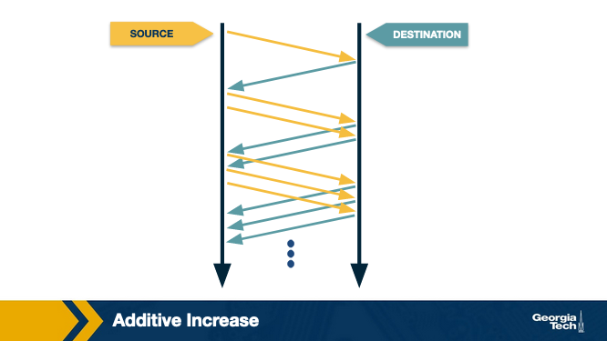{ width="550" }

### Multiplicative decrease

On a **loss event**, cut **cwnd in half** (for timeout-style AIMD decrease in congestion avoidance). Example: 16 → 8 → 4 → 2 → 1 (minimum 1 segment).

Repeated increase + decrease → **sawtooth**:

{ width="600" }

### TCP Reno: two loss severities

| Event | Severity | Typical cwnd reaction |
|-------|----------|------------------------|
| **3 duplicate ACKs** | Mild congestion | **Halve** cwnd, continue probing |
| **Timeout** | Severe congestion | Reset toward **initial window** / slow start |

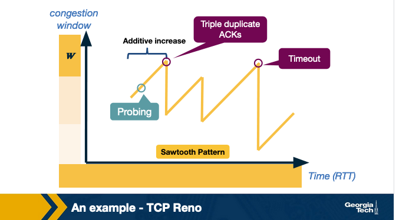{ width="650" }

**Probing:** TCP ramps up until congestion, backs off, then probes again — tests whether more bandwidth is available.

!!! tip "Memory aid"
    **AIMD = climb slowly (+1 MSS/RTT), fall fast (×½ on dup ACK; harder drop on timeout). Sawtooth = probe the path.**

---

## What is congestion control?

Protect shared network from overload using **cwnd** and dynamic adaptation. See [Congestion control](#congestion-control-protect-the-network) above.

---

## What are the goals of congestion control?

Efficiency, fairness, low delay, fast convergence — see goals table above.

---

## What is network-assisted congestion control?

Routers explicitly signal congestion (ECN, QCN, etc.) instead of only drops.

---

## What is end-to-end congestion control?

Senders infer congestion from loss and delay; classic TCP approach.

---

## How does a host infer congestion?

Primarily **loss** (dup ACK, timeout); optionally **RTT increase**.

---

## How does a TCP sender limit the sending rate?

UnACKed bytes $\leq \min(\text{cwnd}, \text{rwnd})$; rate $\approx \text{cwnd} / \text{RTT}$.

---

## Explain Additive Increase/Multiplicative Decrease (AIMD) in the context of TCP

Linear increase per RTT, multiplicative decrease on loss; see [AIMD section](#aimd-additive-increase-multiplicative-decrease) and diagrams.

---

## Slow start in TCP

**AIMD** (linear increase) is good when you are already **near** network capacity — decrease fast, increase slowly (too big a window is worse than too small).

A **new connection** starts from a **cold start** with cwnd = 1. Pure AIMD would take a long time to ramp up. **Slow start** uses **exponential** growth to probe capacity quickly, then switches to AIMD.

### How slow start works (TCP Reno)

1. Set **cwnd = 1** packet.
2. Send 1 packet; on ACK, **cwnd += 1** → send **2** packets.
3. On each ACK in that RTT, **cwnd += 1** per ACK → after one RTT, cwnd roughly **doubles** (1 → 2 → 4 → 8 …).
4. When $\text{cwnd} \geq \text{ssthresh}$, switch to **congestion avoidance (AIMD)** — linear +1 MSS per RTT.

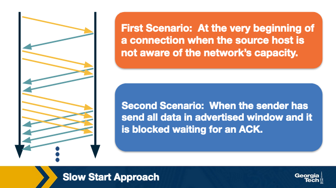{ width="550" }

### When slow start runs

| Scenario | Why |
|----------|-----|
| **New connection** | Sender does not know path capacity yet |
| **After timeout** while blocked on flow control | Connection was idle waiting for ACK; do not blast full window at once — restart slow start |

### Full cwnd timeline (slow start + AIMD + loss)

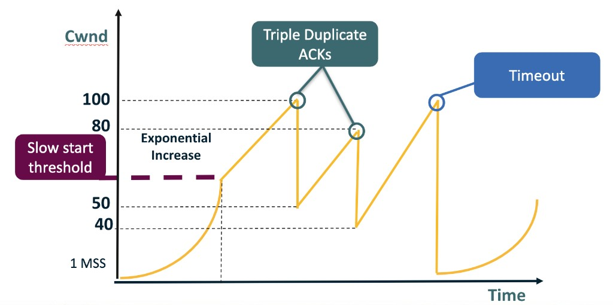{ width="650" }

- **Exponential increase** until **ssthresh** (slow start).
- **Linear increase** (AIMD probing) above threshold.
- **Triple duplicate ACKs** → halve cwnd (e.g., 100 → 50), resume AIMD.
- **Timeout** → drop to **1 MSS**, restart slow start.

### Why “slow” start?

Name is historical: you begin with **one** packet and double each RTT — “slow” compared to dumping a large window immediately, even though growth is **exponential**.

### CongestionThreshold after timeout (knee / cliff)

When a connection **times out** after sending up to the flow-control limit:

- Host eventually gets a cumulative ACK and can send again.
- Instead of sending the full allowed window at once, it uses **slow start** again.
- It remembers a **target** from the last loss → stored as **CongestionThreshold** (same role as **ssthresh**).
- **Knee:** slow start (double per RTT) until cwnd reaches threshold.
- **Cliff:** AIMD (+1 per RTT) until loss → multiplicative decrease.

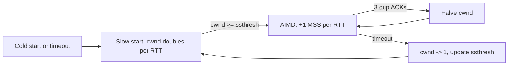

!!! tip "Memory aid"
    **Slow start = exponential to ssthresh. AIMD = linear probe. Dup ACK = halve. Timeout = back to 1 MSS + slow start.**

---

## What is slow start in TCP?

Exponential cwnd growth (≈ double per RTT) until **ssthresh**, then AIMD. Used at connection start and after severe timeout. See [Slow start in TCP](#slow-start-in-tcp) above.

---

## TCP fairness

**Fairness** (for congestion control): if **k** TCP connections share one bottleneck of rate **R**, each should get average throughput about **R/k**.

### When TCP is fair: same RTT, AIMD

Consider **two** TCP connections on one link of capacity **R**, same RTT, only TCP traffic. Plot throughput of connection 1 vs connection 2:

- **Full bandwidth line** — $Throughput_1 + Throughput_2 = R$
- **Equal share line** — $Throughput_1 = Throughput_2$ (fair goal: **R/2** each)

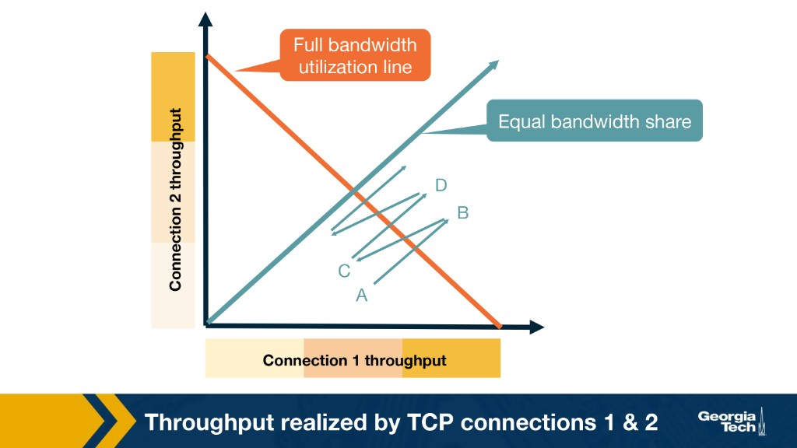{ width="600" }

**AIMD sawtooth in throughput space:**

| Point | What happens |
|-------|----------------|
| **A** | Total rate &lt; R → no loss → both **additively increase** → move toward B |
| **B** | Total rate &gt; R → loss → both **halve** window → move toward C |
| **C** | Under R again → increase → toward D |
| **D** | Loss again → repeat |

Equal additive increase and proportional multiplicative decrease push the operating point toward the **intersection** of full-utilization and equal-share lines → **AIMD tends toward fairness** when RTTs match.

### Alternative policies: AIAD, MIAD, MIMD

TCP uses **AIMD** because it is the only common increase/decrease pairing that **converges to both efficiency and fairness**. Other pairings were studied (Chiu & Jain); they may utilize the link but **do not** reach equal share the way AIMD does.

Plot two competing flows as $(x_1, x_2)$ in throughput space:

- **Efficiency line** — $x_1 + x_2 = C$ (full link capacity $C$)
- **Fairness line** — $x_1 = x_2$ (equal share $C/2$ each)

**Convergence** means the operating point moves toward the **intersection** of those two lines over many increase/decrease cycles.

| Policy | On increase | On decrease | Converges to fair $C/k$? | Behavior vs AIMD |
|--------|-------------|-------------|--------------------------|------------------|
| **AIMD** | $+a$ (additive) | $\times \beta$ (multiplicative) | **Yes** (same RTT) | Sawtooth around fair, efficient point |
| **AIAD** | $+a$ | $-b$ (additive) | **No** | Zig-zags on efficiency line; **gap preserved** |
| **MIMD** | $\times c$ | $\times d$ | **No** | Fills pipe but **locks initial ratio** |
| **MIAD** | $\times c$ | $-b$ | **No** — **diverges** | Large flow **starves** small flow over cycles |

#### AIAD — Additive Increase, Additive Decrease

Both flows gain $+a$ per RTT and lose $-b$ on loss. Adding or subtracting the **same constant** preserves the absolute gap $|x_1 - x_2|$. Flows can oscillate across the **efficiency** line, but any initial unfairness **never closes**. The decrease is also **less aggressive** than AIMD’s proportional cut — congestion is cleared more slowly.

#### MIMD — Multiplicative Increase, Multiplicative Decrease

Both flows scale by the same factors on increase ($\times c$) and decrease ($\times d$). The **ratio** $x_1 / x_2$ is **unchanged** by every step — whoever started ahead stays ahead in proportion. May reach high utilization, but **never corrects** an initial imbalance. Increase is **more aggressive** than AIMD’s linear probe → more overshoot and loss.

#### MIAD — Multiplicative Increase, Additive Decrease

The **worst** pairing for fairness: multiplicative increase widens the absolute gap (the larger flow gains faster), while additive decrease subtracts the **same** amount from both (does not restore balance). Over cycles the bigger flow **consumes more capacity** and can **starve** the smaller one. **Does not converge** to fairness — trajectories **diverge** from the equal-share line.

#### Why AIMD works

AIMD combines the right geometry over **repeated cycles**:

- **Additive increase** — same $+a$ to both flows reduces the **relative** gap, pulling trajectories toward the **fairness** line.
- **Multiplicative decrease** — same fraction (e.g. $\times 1/2$) on loss backs both flows off the congestion cliff; one MD step alone preserves ratio, but **AI + MD together** systematically correct imbalance while probing capacity.

!!! warning "Exam point"
    **Only AIMD** converges to **efficiency + fairness** among these four. **AIAD** preserves $|x_1 - x_2|$; **MIMD** preserves $x_1/x_2$; **MIAD diverges**. None of the alternatives are as **stable** as AIMD’s sawtooth.

!!! info "Reference"
    Chiu & Jain, *Analysis of the Increase and Decrease Algorithms for Congestion Avoidance in Computer Networks*; Kurose & Ross, Ch. 3.

---

## Caution: when TCP is not fair

### Different RTTs

TCP Reno adapts cwnd **per ACK**. Shorter **RTT** → more ACKs per second → faster window growth → **more bandwidth**.

Throughput bias (approximate): $\text{throughput} \propto 1/(\text{RTT} \cdot \sqrt{p})$ — lower RTT wins.

### Many parallel connections per app

Fairness is often defined **per TCP connection**, not per application.

| Setup | Share of R |
|-------|------------|
| 9 apps × 1 connection each + 1 new app × 1 connection | Each ≈ **R/10** |
| 9 apps × 1 connection + 1 new app × **11** connections | New app alone can get **&gt; R/2** |

Browsers opening many parallel HTTP connections can obtain **unfair** aggregate bandwidth vs a single-connection app.

---

## Is TCP fair in the case where connections have the same RTT?

**Yes** — AIMD converges toward **R/k** each. See [TCP fairness](#tcp-fairness) diagram.

---

## Is TCP fair in the case where two connections have different RTTs?

**No** — shorter RTT flows grow cwnd faster (ACK-clocked). See [Caution](#caution-when-tcp-is-not-fair).

---

## Would AIAD, MIAD, or MIMD converge to fairness like AIMD?

**No** — none of the three alternatives converge to **equal fair share** the way **AIMD** does.

| Policy | Convergence to $x_1 = x_2 = C/2$? | Key reason |
|--------|-------------------------------------|------------|
| **AIMD** | **Yes** (same RTT) | AI shrinks relative gap; MD backs off congestion; cycles pull toward fair + efficient point |
| **AIAD** | **No** | Additive ± same constant → $|x_1 - x_2|$ unchanged; may hit efficiency line but not fairness |
| **MIMD** | **No** | Same multiply factor → ratio $x_1/x_2$ locked; efficient but permanently unfair if unequal start |
| **MIAD** | **No** — **diverges** | MI widens gap; AD does not rebalance → larger flow dominates |

**Stability:** AIAD/MIAD use **less aggressive** decreases than AIMD (additive cut vs halving) — poor congestion response. MIAD/MIMD use **more aggressive** increases (multiplicative vs +1 MSS/RTT) — more overshoot and loss. See [Alternative policies](#alternative-policies-aiad-miad-mimd).

---

## TCP CUBIC (modern high-speed TCP)

**TCP CUBIC** is the default TCP congestion control algorithm in Linux (since kernel 2.6.18). It targets **high bandwidth–delay product (BDP)** paths where classic TCP-Reno/NewReno grows too slowly.

### Why standard TCP struggles on “long fat” paths

**BDP** $\approx \text{bandwidth} \times \text{RTT}$ = how many packets must be in flight to fill the pipe.

Standard TCP (Reno family) increases cwnd by about **1 MSS per RTT** in congestion avoidance. Example from the CUBIC paper:

- 10 Gbps link, 100 ms RTT, 1250-byte packets → BDP ≈ **100,000 packets**
- Growing from 50,000 packets to full BDP at 1 MSS/RTT takes ~50,000 RTTs ≈ **1.4 hours**
- Short flows never reach full utilization

High-speed variants (HSTCP, BIC-TCP, CUBIC, etc.) were developed to ramp up faster on such paths.

### BIC-TCP (predecessor)

**BIC-TCP** (Binary Increase Congestion Control) was Linux’s default before CUBIC. After loss it remembers:

- $W_{\max}$ — window just before reduction
- $W_{\min}$ — window just after reduction

It **binary-searches** between them (concave/logarithmic growth near the old saturation point) so the window stays near $W_{\max}$ longer → **stable**, less overshoot at loss. If the window passes $W_{\max}$ without loss, it **max-probes** with exponential growth to find a new maximum.

**Tradeoff:** very stable, but can be **slow to react** when available bandwidth jumps far above the old $W_{\max}$.

### CUBIC’s core idea (course summary)

On **high bandwidth–delay product (BDP)** networks, Reno’s low utilization motivated faster, stable growth. **TCP CUBIC** (Linux default) uses a **cubic polynomial** for cwnd vs **time since last loss** (not per-ACK like Reno).

After **triple duplicate ACK** at window $W_{\max}$:

1. **Multiplicative decrease** → $W_{\min}$ (often ≈ half for TCP-friendliness)
2. Optimal window is between $W_{\min}$ and $W_{\max}$, near $W_{\max}$
3. Grow **aggressively** when far below $W_{\max}$
4. Grow **slowly** as $W$ approaches $W_{\max}$ (last loss point)
5. If no loss past $W_{\max}$, probe **higher** — prior loss may have been transient

$$W(t) = C(t - K)^3 + W_{\max}$$

- $W_{\max}$ — cwnd when loss was detected
- $C$ — scaling constant (Linux **C = 0.4**)
- $K$ — time for the cubic curve to reach $W_{\max}$ with no further loss
- $t$ — **elapsed time since last loss** (congestion epoch), not RTT

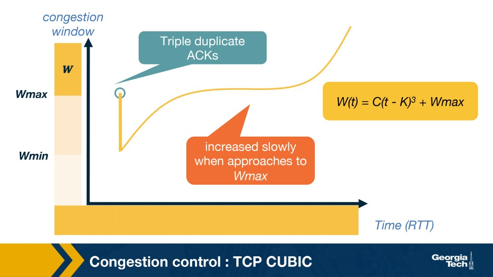{ width="600" }

CUBIC **replaces BIC’s piecewise phases** with this single cubic function. After loss, $\beta = 0.2$ in Linux (vs Reno’s 0.5).

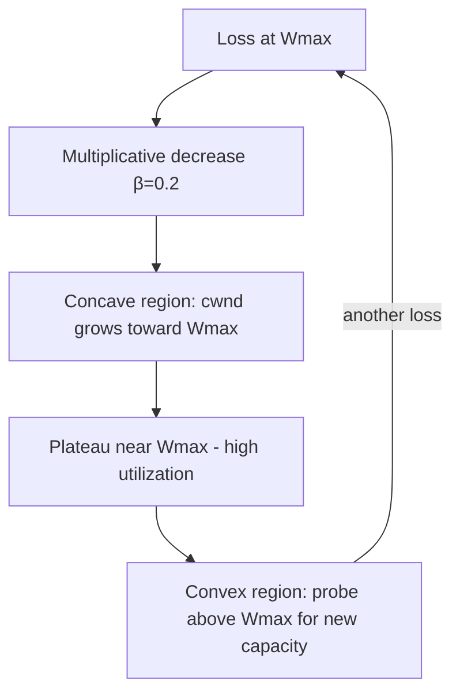

### Three operating regions

On each ACK in congestion avoidance, CUBIC compares current **cwnd** to the cubic target and to a **TCP-friendly** reference window $W_{tcp}(t)$:

| Region | Condition | Behavior |
|--------|-----------|----------|
| **TCP-friendly** | cwnd < $W_{tcp}(t)$ | Grow like standard TCP (AIMD-style) — important on **short RTT / small BDP** links |
| **Concave** | cwnd < $W_{\max}$ | Cubic curve rises toward last loss point — **aggressive** when far below saturation |
| **Convex** | cwnd > $W_{\max}$ | Cubic curve probes **above** old $W_{\max}$ (“max probing”) — bandwidth may have increased |

**Plateau near $W_{\max}$:** most window samples stay close to the last loss point → high link utilization with **small oscillations** (unlike convex-only schemes that spike growth right at saturation and cause big loss bursts).

### RTT-fairness: how CUBIC decouples growth from RTT

#### Traditional TCP (Reno/NewReno): ACK-clocked, RTT-dependent

In congestion avoidance, Reno increases **cwnd** by about **1 MSS per RTT**. Each ACK bumps cwnd slightly so that over one full window of ACKs (one RTT), the window grows by one segment.

Growth rate with respect to **real time** is roughly:

$$\text{Growth rate} \approx \frac{1}{RTT}$$

A flow with **RTT = 20 ms** completes ~50 growth rounds per second; a flow with **RTT = 200 ms** completes ~5. The short-RTT flow grows its window **10× faster** and can **unfairly dominate** bandwidth at the same bottleneck — even when both flows use AIMD.

#### CUBIC: real-time clocking, RTT-independent target

CUBIC does **not** tie target window size to ACK arrival rate. Instead, the **target** congestion window is a function of **wall-clock time** $t$ since the last **congestion event** (typically fast recovery after loss):

$$W(t) = C(t - K)^3 + W_{\max}$$

| Symbol | Meaning |
|--------|---------|
| $W(t)$ | Target cwnd at elapsed time $t$ |
| $t$ | **Real time** (seconds) since last congestion event — **not** RTT |
| $W_{\max}$ | Window just before the last loss |
| $C$ | Scaling constant (Linux **C = 0.4**) |
| $K$ | Time for the cubic curve to grow back to $W_{\max}$ |

On each ACK, CUBIC reads the clock, computes $W(t)$, and adjusts **cwnd** toward that target — it does **not** blindly add a fixed fraction of MSS per ACK the way Reno does.

#### Why this achieves RTT independence

At **$t = 2$ seconds** since the last congestion event, the formula yields the **same target** $W(t)$ whether RTT is 20 ms or 200 ms. RTT only affects **how often** the sender recalculates (ACKs arrive more frequently on short-RTT paths):

- **Short RTT** — many ACKs per second → many **small** adjustments toward $W(t)$
- **Long RTT** — fewer ACKs → fewer, **larger** jumps toward the same $W(t)$

At any given timestamp $t$, competing CUBIC flows at the same bottleneck tend toward **approximately the same window size** → **RTT-fairness**. The key feature is that growth depends on **time between consecutive congestion events**, not on RTT.

On short RTT / small BDP paths, the **TCP-friendly region** keeps CUBIC from outrunning standard TCP where Reno already works well.

!!! abstract "Practice Quiz 2–4 answer"
    CUBIC’s window growth depends only on **time between consecutive congestion events** (e.g. fast recovery after loss), not on RTT. Competing CUBIC flows at the same bottleneck reach **approximately the same cwnd** regardless of RTT → **good RTT-fairness**.

### Fast convergence

When a **new flow** joins, existing flows should release bandwidth. **Fast convergence:** if the new $W_{\max}$ after a loss is **less than** the previous epoch’s $W_{\max}$, the path’s capacity likely shrank — CUBIC lowers $W_{\max}$ further so the flow plateaus sooner and gives room to new flows.

### CUBIC vs Reno (exam summary)

| | TCP Reno / NewReno | TCP CUBIC |
|---|-------------------|-----------|
| Growth in avoidance | ~+1 MSS per **RTT** | Cubic function of **time since loss** |
| Decrease on loss | Often $\beta = 0.5$ (halve) | $\beta = 0.2$ |
| Best on | Moderate BDP, short RTT | **High BDP**, long RTT / high speed |
| RTT fairness | Biased toward short RTT | More **RTT-fair** at same bottleneck |
| Linux default | Optional / legacy | **Default** since 2.6.18 |

!!! tip "Memory aid"
    **CUBIC = Cubic curve in time, plateau at Wmax, TCP-friendly when Reno is fine, RTT-fair on fat pipes.**

!!! note "Further reading"
    [CUBIC: A New TCP-Friendly High-Speed TCP Variant (Ha, Rhee, Xu)](https://www.cs.princeton.edu/courses/archive/fall16/cos561/papers/Cubic08.pdf) — course reading; Kurose & Ross Ch. 3 for textbook context.

## Explain how TCP CUBIC works

TCP CUBIC is a congestion control algorithm designed to be **more efficient on high-bandwidth, high-latency networks** than standard AIMD:

1. After a loss event, CUBIC records the window size at which loss occurred ($W_{\max}$) and reduces cwnd ($\beta = 0.2$ in Linux).
2. The window growth follows $W(t) = C(t-K)^3 + W_{\max}$ — **concave** below $W_{\max}$, **convex** above it.
3. **Far from $W_{\max}$**: aggressive growth (concave).
4. **Near $W_{\max}$**: plateau — stable, high utilization.
5. **Above $W_{\max}$**: convex max-probing for new capacity.

CUBIC’s growth depends on **elapsed time** since the last congestion event, not RTT, improving **RTT-fairness** while mimicking Reno in the **TCP-friendly region** on short/low-BDP paths.

---

## Explain how in TCP CUBIC the congestion window growth becomes independent of RTTs

**Reno (RTT-dependent):** cwnd grows ~**1 MSS per RTT** because increase is **ACK-clocked** — one full window of ACKs takes one RTT. Short-RTT flows complete more growth rounds per second ($\propto 1/RTT$) and grab more bandwidth.

**CUBIC (RTT-independent target):** the **target** window is $W(t) = C(t-K)^3 + W_{\max}$, where $t$ is **real elapsed time** since the last **congestion event** (loss / fast recovery). The same $W(t)$ applies at $t$ seconds regardless of RTT.

RTT only sets **how often** ACKs trigger an update toward that target — not the target itself. Flows competing at the same bottleneck therefore reach **approximately the same cwnd** independent of RTT → **RTT-fairness**.

**Course one-liner:** Growth depends only on **time between consecutive congestion events**, not RTT.

---

## TCP throughput model (sawtooth)

In congestion avoidance, **cwnd** increases by about **1 MSS per RTT** until it reaches a maximum **W**, then a loss cuts cwnd in half — producing a **sawtooth**.

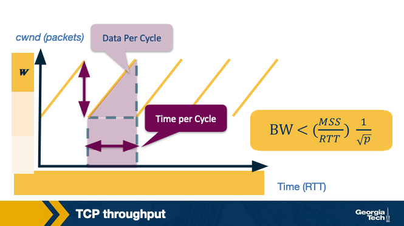{ width="600" }

### Simplified model assumptions

- **p** = packet loss probability
- The network delivers about **1/p** consecutive packets, then one loss (one sawtooth cycle per loss event)
- Each AIMD cycle: linear increase from **W/2** to **W**, then multiplicative decrease to **W/2**

### Packets per cycle (area under sawtooth)

One sawtooth has:

- **Height** ≈ W/2 (peak minus valley)
- **Width** ≈ W/2 RTTs (time to climb linearly)

Area (packets sent per cycle) ≈ average window × duration ≈ $\frac{W/2 + W}{2} \cdot \frac{W}{2} = \frac{3W^2}{8}$

With **1/p** packets per cycle before loss:

$$\frac{3W^2}{8} \approx \frac{1}{p} \quad \Rightarrow \quad W \approx \sqrt{\frac{8}{3p}} = \sqrt{\frac{2}{3p}} \cdot 2$$

(Course slides often write the peak window as $W \approx \sqrt{2/(3p)}$ with slightly different constant folding.)

### Throughput formula (Mathis)

$$\text{Bandwidth} = \frac{\text{data per cycle}}{\text{time per cycle}} \approx \frac{MSS \cdot (3W^2/8)}{(W/2) \cdot RTT} \propto \frac{MSS}{RTT \cdot \sqrt{p}}$$

With all constants folded in (see [Mathis et al.](https://ee.lbl.gov/papers/congavoid.pdf)):

$$\boxed{\text{Throughput} \lesssim \frac{1.22 \cdot MSS}{RTT \cdot \sqrt{p}}}$$

| Factor | Effect |
|--------|--------|
| Larger **MSS** | Higher throughput |
| Larger **RTT** | Lower throughput |
| Larger **p** (more loss) | Lower throughput ($\propto 1/\sqrt{p}$) |

In practice, **C < 1.22** because of small receive windows, timeouts, and other effects — this is an **upper bound**, not a guarantee.

!!! tip "Memory aid"
    **More loss or longer RTT → lower throughput. Sawtooth area + 1/p losses → the famous 1/√p law.**

---

## Explain TCP throughput calculation

$$\text{Throughput} \lesssim \frac{C \cdot MSS}{RTT \cdot \sqrt{p}}$$

where $C \approx 1.22$ in the standard model. See [TCP throughput model](#tcp-throughput-model-sawtooth) above.

---

## Optional reading: datacenter congestion control

These are **not required** for exams but connect Module 2 to modern deployments.

### Data Center TCP (DCTCP)

[DCTCP](https://people.csail.mit.edu/alizadeh/papers/dctcp-sigcomm10.pdf) targets **datacenter** networks (low latency + high throughput on shallow-buffer switches).

| Problem with TCP in DCs | DCTCP approach |
|-------------------------|----------------|
| Long flows fill switch buffers → high latency for short RPCs | Keep queues **persistently small** using **ECN** |
| **Incast** (many-to-one) → timeouts | React to **fraction of ECN-marked** packets, not just on/off |
| **Buffer pressure** on shared-memory switches | Gentle rate cut: $cwnd \leftarrow cwnd \times (1 - \alpha/2)$ where **α** = marking fraction |

**Key ideas:**

- Switches mark packets when queue > threshold **K** (ECN **CE** bit)
- Receiver echoes marks; sender estimates **α** = fraction marked per window
- **Low α** → small window reduction; **high α** → halve-like reduction
- Same throughput as TCP on long flows with **~90% less buffer** in experiments

**Workload context:** partition/aggregate apps (web search, ads) need **low tail latency** on short messages and **high utilization** on long update flows.

### TIMELY (RTT-based, optional)

[TIMELY](https://conferences.sigcomm.org/sigcomm/2015/pdf/papers/p537.pdf) uses **RTT gradients** (not ECN) for congestion control in datacenters, enabled by accurate **NIC hardware timestamps**. Complements DCTCP-style research on delay-sensitive DC transports.

### CUBIC (already covered above)

Default TCP on Linux for **high BDP** paths — see [TCP CUBIC](#tcp-cubic-modern-high-speed-tcp).

---

## Classic background: Jacobson congestion avoidance (1988)

Van Jacobson's *Congestion Avoidance and Control* paper explains why naive TCP behavior caused **congestion collapse** on the 1986 Internet (throughput could drop by orders of magnitude). Key ideas still used today:

### Packet conservation

At equilibrium, a connection should obey **packet conservation**: a new packet enters the network only after an old packet leaves. ACKs act as a **clock** to pace sending. Problems occur when:

1. The connection never reaches equilibrium (startup/restart)
2. The sender injects packets too fast (violates conservation)
3. Resource limits on the path prevent equilibrium

**Slow-start** gradually increases data in flight so ACKs can clock out packets without flooding router queues.

### AIMD from Jacobson

- On congestion signal (loss): **multiplicative decrease** (cut window, often by half)
- When no congestion: **additive increase** (grow window slowly, ~1 segment per RTT)

This probe-and-adapt policy is the foundation of TCP congestion avoidance.

!!! note "Optional readings"
    - [Congestion Avoidance and Control (Jacobson, 1988)](https://ee.lbl.gov/papers/congavoid.pdf)
    - Kurose & Ross: Ch. 3 (Transport), Ch. 2.1–2.2, 2.4 (Application — HTTP, DNS)

---

## Module 2 study questions (detailed answers)

The sections below answer the official study prompts in detail.
