---
tags:
  - lesson-03
  - routing
  - ospf
  - igp
---

# Lesson 3: Intradomain Routing

How routers move traffic **within** a single organization or administrative domain: forwarding vs routing, link-state vs distance-vector, and practical issues (count-to-infinity, poison reverse, hot potato).

!!! tip "Exam prep"
    New to the material? Start with the **[Plain-language guide](plain-language.md)** — plain-language explanations and analogies. Condensed review: **[Quick Study Guide](quick-study-guide.md)**. Interactive practice: **[Lesson 3 Quiz](quiz.md)**. Interdomain routing (BGP) is **[Lesson 4](../lesson-04/interdomain-routing.md)** ([Plain-language guide](../lesson-04/plain-language.md), [quick guide](../lesson-04/quick-study-guide.md), [quiz](../lesson-04/quiz.md)).

**Course references:** Module 3 Summary Video, Routing Algorithms / Link-State pages (Canvas), Kurose & Ross Ch. 5.2–5.3.

**Optional readings:** [Black-box OSPF Measurements (Shaikh & Greenberg)](https://conferences.sigcomm.org/imc/2001/imw2001-papers/82.pdf), [Hot Potatoes Heat Up BGP Routing](https://www.cs.princeton.edu/~jrex/papers/hotpotato.pdf), [Traffic Engineering with Traditional IP Routing (Fortz et al.)](https://www.cs.princeton.edu/~jrex/teaching/spring2005/reading/fortz02.pdf).

---

## Where routing fits in the stack

Transport (TCP/UDP) provides **end-to-end** communication between application processes. It does **not** decide which routers and links each packet uses.

After DNS resolves a hostname to an IP address, the **network layer (IP)** carries packets **hop by hop** through routers until they reach the destination host.

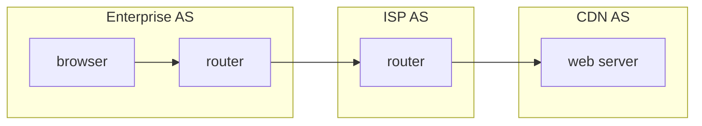

Packets cross **multiple administrative domains** (enterprise, ISP, CDN). Each domain runs its own routing policies.

---

## Administrative domains and ASes

An **administrative domain** (or **Autonomous System, AS**) is a network operated by one organization under a **unified routing policy**.

| Scope | Protocol family | Job |
|-------|-----------------|-----|
| **Intradomain** (within one AS) | **IGP** — Internal Gateway Protocol | Best path **inside** the AS (to any internal prefix or to a **border router**) |
| **Interdomain** (between ASes) | **BGP** | Which **neighboring AS** to use next |

**Example path:** Browser in enterprise → IGP finds path to **egress border router** → BGP picks next AS → repeat until CDN AS → IGP to server.

A **path** is the sequence of routers and links a packet follows **within** a domain. If the destination is outside the domain, the IGP computes the path to the **border router**; BGP handles the rest ([Lesson 4](../lesson-04/interdomain-routing.md)).

---

## Forwarding vs routing

Every router has two jobs at **different timescales**:

| | **Forwarding** | **Routing** |
|---|----------------|-------------|
| **Plane** | Data plane | Control plane |
| **What** | Per-packet: lookup dest IP → next hop / output port | Network-wide: learn topology, compute paths, **build/update forwarding table** |
| **Speed** | Nanoseconds–microseconds (per packet) | Seconds–minutes (on change) |
| **Scope** | Local table lookup | Exchange info with other routers |

**Forwarding** moves the packet from input port to output port using the **forwarding table** (FIB).

**Routing** runs **routing protocols** (OSPF, RIP, etc.) so that when links fail or costs change, tables **converge** to new best paths.

!!! tip "Memory aid"
    **Routing** computes the map; **forwarding** drives the car using the map.

---

## Two intradomain approaches

Both IGP families compute **least-cost routes** but differ in **information exchanged**:

| | **Link-state (LS)** | **Distance-vector (DV)** |
|---|---------------------|---------------------------|
| **View** | **Global** topology (same map at every router) | Only neighbors’ distance vectors |
| **Also called** | **Global routing algorithm** | **Decentralized** routing algorithm |
| **Algorithm** | Dijkstra (locally, per router) | Bellman-Ford (distributed) |
| **Messages** | Flood **LSAs** to all (in area) | Exchange vectors with **neighbors only** |
| **Examples** | **OSPF**, IS-IS | **RIP** |
| **Convergence** | Generally fast after flood + Dijkstra | Can be slow; **count-to-infinity** on bad news |

### What can edge weights represent?

In intradomain routing graphs, each link has a **cost** $c(u,v)$. The operator chooses the metric so Dijkstra (or Bellman-Ford) finds a **least-cost path** — “shortest” means **minimum total weight**, not necessarily fewest hops.

| Valid IGP link metric | Example use |
|----------------------|-------------|
| **Length of the cable** | Prefer shorter physical paths |
| **Time delay** to traverse the link | Minimize latency |
| **Monetary cost** | Prefer cheaper links |
| **Link capacity** | Prefer higher-bandwidth links (often inverse weight) |
| **Current load** on the link | Traffic-aware routing (dynamic weight) |

**Not an IGP edge weight:** **Business relationships** (customer, peer, provider) — those drive **interdomain** **BGP** policy ([Lesson 4](../lesson-04/interdomain-routing.md)), not least-cost paths inside one AS.

!!! warning "Exam point"
    **Intradomain** = technical/performance metrics on links. **Interdomain** = policy and money between organizations.

!!! note "Dynamic load weights"
    Using **current load** as the metric means weights are **not static** — they change as traffic shifts. That is a **non-trivial** problem: link-state algorithms can show **pathological behavior** when costs oscillate rapidly (routes flap as load changes).

---

## Link-state routing

### Idea

1. Each router discovers **local links** and **costs** (delay, bandwidth, admin weight).
2. Routers **flood link-state advertisements (LSAs)** so everyone builds the same **link-state database (LSDB)**.
3. Each router represents the network as a **graph** (nodes = routers, edges = links with cost).
4. Each router runs **Dijkstra’s algorithm** from **itself** as source to every destination.
5. From the shortest-path tree, install **next-hop** entries in the forwarding table (first hop on best path).

**Best path** = path with **minimum total link cost** under the chosen metric.

### Problem statement (per router)

Pick source router **u**. For every other node **v**, find:

- Minimum cost **D(v)** from u to v
- **Predecessor p(v)** to reconstruct the path

The **next hop** to v is the first node on the shortest path from u to v.

### Dijkstra’s algorithm

**Classification (exam):** Dijkstra is the SPF step in a **link-state** (also **global routing**) algorithm — each router runs it locally on a **complete** topology learned from LSA flooding. It is **not** a distance-vector algorithm.

**Notation (Kurose / course):**

| Symbol | Meaning |
|--------|---------|
| **u** | Source router |
| **v** | Any other node in the network |
| **c(u,v)** | Cost of the direct link u–v (if it exists) |
| **D(v)** | Current best-known least cost from u to v |
| **p(v)** | **Predecessor** on that best-known path (for route reconstruction) |
| **N′** | Subset of nodes whose shortest paths from u are **confirmed** |

In link-state routing, **topology and link costs are known to all routers** (via LSA flooding) **before** each router runs Dijkstra **locally** with itself as **u**.

!!! warning "Exam point"
    **False:** “All nodes learn the full topology only **after** Dijkstra terminates.” Link-state **broadcast/flood** distributes LSAs first; **then** every router independently runs SPF (Dijkstra) on the complete map.

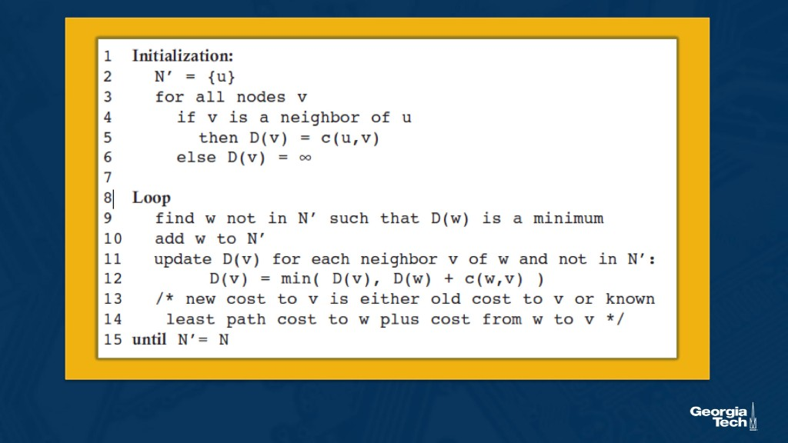{ width="520" }

**Initialization:**

1. N′ = {u}
2. For each node v: if v is a neighbor of u, D(v) = c(u,v) and p(v) = u; else D(v) = ∞

**Loop** (until N′ = N):

1. Find **w ∉ N′** with minimum D(w); add **w** to N′
2. For each neighbor **v** of w with v ∉ N′:  
   **D(v) = min( D(v), D(w) + c(w,v) )**  
   If D(v) improved, set **p(v) = w**

**Result:** shortest-path tree rooted at u → forwarding table = **first hop** on path to each destination (follow p(·) chain).

### Worked example: link-state rerouting (source u)

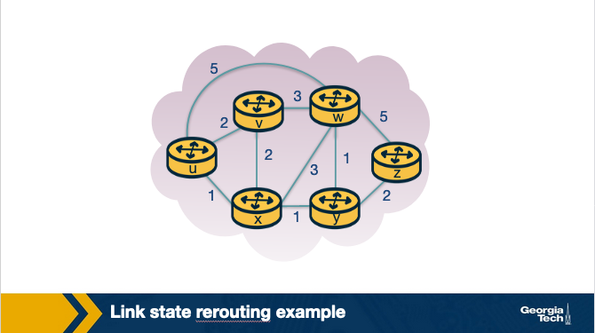{ width="560" }

**Link costs:** u–v=2, u–x=1, u–w=5, v–x=2, v–w=3, x–w=3, x–y=1, w–y=1, w–z=5, y–z=2.

**Initialization (step 0):** N′ = {u}. Direct neighbors: D(v)=2, D(x)=1, D(w)=5; all others ∞; p(neighbors)=u.

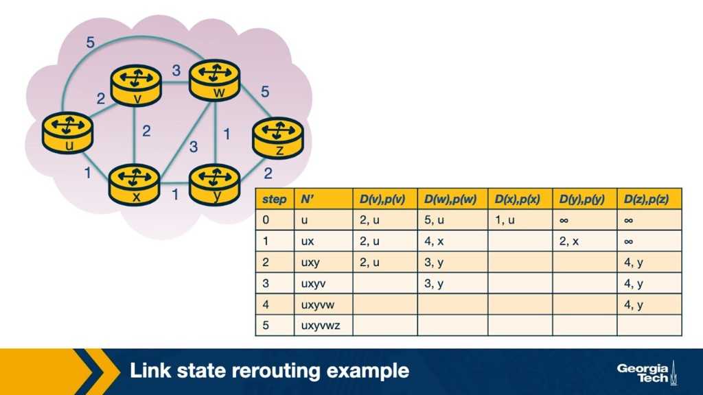{ width="700" }

| Step | N′ | D(v),p(v) | D(w),p(w) | D(x),p(x) | D(y),p(y) | D(z),p(z) |
|------|-----|-----------|-----------|-----------|-----------|-----------|
| 0 | u | 2,u | 5,u | 1,u | ∞ | ∞ |
| 1 | ux | 2,u | 4,x | — | 2,x | ∞ |
| 2 | uxy | 2,u | 3,y | — | — | 4,y |
| 3 | uxyv | — | 3,y | — | — | 4,y |
| 4 | uxyvw | — | — | — | — | 4,y |
| 5 | uxyvwz | — | — | — | — | — |

**How to read iterations:**

1. **Step 1:** Add **x** (min cost 1). Relax via x: D(w)=min(5,1+3)=**4,x**; D(y)=min(∞,1+1)=**2,x**.
2. **Step 2:** Add **y** (cost 2). Relax: D(w)=min(4,2+1)=**3,y**; D(z)=min(∞,2+2)=**4,y**.
3. **Step 3:** Add **v** (cost 2). No shorter paths through v.
4. **Step 4:** Add **w** (cost 3). Via w to z would be 3+5=8 > 4 — no update.
5. **Step 5:** Add **z** (cost 4). Done.

**Forwarding table at u (next hops):**

| Destination | D(·) | Path (via p) | Next hop from u |
|-------------|------|--------------|-----------------|
| v | 2 | u→v | **v** |
| x | 1 | u→x | **x** |
| w | 3 | u→x→y→w | **x** |
| y | 2 | u→x→y | **x** |
| z | 4 | u→x→y→z | **x** |

Algorithm **exits after step 5** when all nodes are in N′.

!!! warning "Exam point (Practice Quiz 3-2)"
    Dijkstra runs **N − 1 iterations** after initialization (one node added to **N′** per iteration) until **N′ = N**. For **6 nodes**, that is always **5 iterations** — **regardless of source** (u or x) or how many **immediate neighbors** the source has. More neighbors after init does **not** mean more iterations.

### Worked example: Dijkstra from source b (nodes a–f) {#worked-example-source-b}

**Link costs:** a–b=3, a–c=1, a–d=5, b–c=5, c–d=2, c–e=4, d–f=5, e–f=1.

**Initialization:** N′ = {b}. D(a)=3, D(c)=5; D(d), D(e), D(f)=∞.

| Step | Add to N′ | Key updates |
|------|-----------|-------------|
| 1 | **a** (cost 3) | D(c)=min(5, 3+1)=**4**; D(d)=3+5=**8** |
| 2 | **c** (cost 4) | D(d)=min(8, 4+2)=**6**; D(e)=4+4=**8** |
| 3 | **d** (cost 6) | D(f)=6+5=11 |
| 4 | **e** (cost 8) | D(f)=min(11, 8+1)=**9** |
| 5 | **f** (cost 9) | Done — N′ = N |

**Final least costs from b:**

| Node | D(·) |
|------|------|
| a | **3** |
| c | **4** |
| d | **6** |
| e | **8** |
| f | **9** |

### Complexity (link-state / Dijkstra) {#complexity}

**Exam question:** In the worst case, how many comparisons are needed to find least-cost paths from the source to all destinations?

Each iteration:

1. Search all nodes **not yet in N′** to find the one with minimum **D(·)**
2. Add that node to N′ and relax its neighbors

The number of nodes to scan **decreases** each iteration:

| Iteration | Nodes scanned (worst case) |
|-----------|----------------------------|
| 1st | n − 1 |
| 2nd | n − 2 |
| … | … |
| Last | 1 |

**Total comparisons** (worst case):

$$(n-1) + (n-2) + \cdots + 1 = \frac{n(n-1)}{2}$$

So Dijkstra’s complexity is **O(n²)** in the number of nodes **n**.

!!! note "Course wording"
    Some slides write the sum as **n(n+1)/2**; that counts slightly differently but is still **Θ(n²)**. What matters for exams: **quadratic in n**, because each of ~n iterations may scan O(n) nodes.

**Improvements:**

- **Min-heap (priority queue):** **O(n log n)** per SPF run
- **LSA flooding** (control-plane overhead): **O(n · e)** messages in worst case (e = links)

Each router runs Dijkstra **independently** after receiving LSAs, so SPF CPU cost scales with **area size**.

---

## OSPF (Open Shortest Path First)

**OSPF** is a **link-state** IGP: flood topology, run **Dijkstra**, install next hops. It improves on RIP with **authentication**, **multiple equal-cost paths (ECMP)**, and **hierarchical areas**.

| Feature | Detail |
|---------|--------|
| **Algorithm** | Link-state + Dijkstra least-cost paths |
| **Hierarchy** | AS split into **areas**; exactly one **backbone (area 0)** |
| **ABRs** | **Area Border Routers** connect areas via backbone |
| **Inter-area traffic** | Must go **ABR → backbone → ABR** (destination area) |
| **LSAs** | Describe local links; flooded to build **link-state database (LSDB)** |
| **Refresh** | LSAs re-flooded periodically (default **30 min**); link-up triggers immediate flood |
| **Duplicates** | First copy = new; later copies = duplicate (still acked) |
| **Metrics** | Admin-configured (e.g., inversely proportional to capacity, or all 1) |
| **Layer** | IP protocol **89** |

### Hierarchy (areas + backbone)

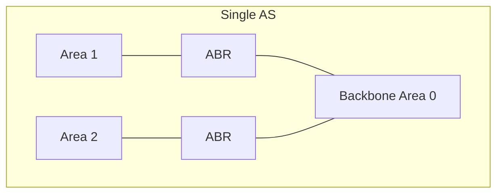

Each area runs its **own** OSPF instance and LSDB. **Backbone** contains all ABRs and routes traffic **between areas**.

### Processing OSPF messages in the router

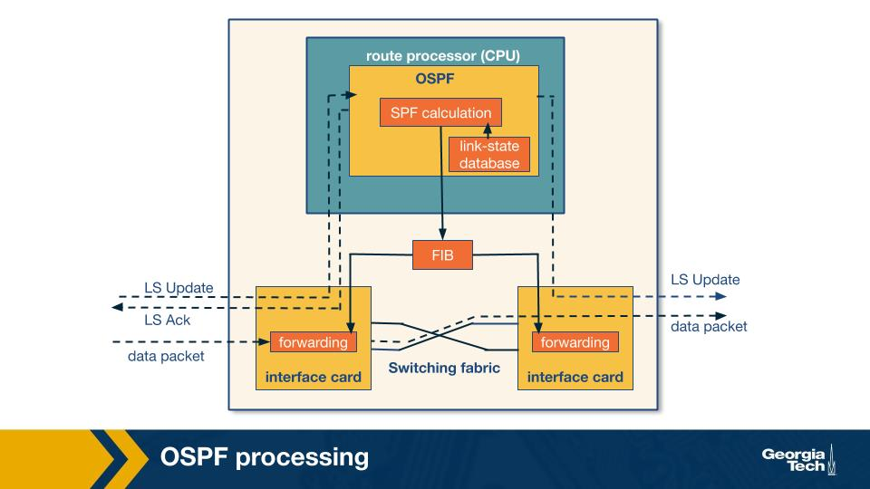{ width="620" }

| Component | Role |
|-----------|------|
| **Route processor (CPU)** | Runs OSPF; maintains **LSDB**; runs **SPF** |
| **FIB** | Forwarding table used by interface cards |
| **Interface cards** | Lookup FIB per packet; forward via **switching fabric** |
| **Data packets** | Do **not** use the CPU — only control messages do |

**Steps (high level):**

1. **LS Update** arrives → LSAs update **link-state database** (topology visible to this router)
2. **SPF** (Dijkstra) computes shortest-path tree → results written to **FIB**
3. **Data packet** arrives on interface → **forwarding** engine uses FIB → outgoing port

### OSPF processing timeline (T1–T7)

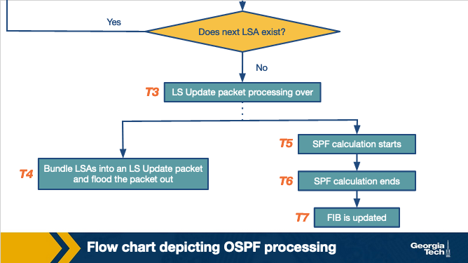{ width="520" }

| Time | Event |
|------|--------|
| **T1** | LS Update received; unpack LSAs |
| **T2** | Per LSA: new vs duplicate; update LSDB; **schedule SPF**; decide flood interfaces |
| **T3** | All LSAs in packet processed |
| **T4** | Bundle LSAs → flood LS Update to neighbors (may be **timer-paced**) |
| **T5–T6** | **SPF calculation** runs (CPU-intensive; often scheduled/batched) |
| **T7** | **FIB updated** with new next hops |

**New LSA:** higher sequence number than LSDB entry → topology change.

**Duplicate LSA:** same sequence → **acknowledge immediately** (no SPF needed for that LSA).

Modern routers may **delay SPF** (`spf-delay`, `spf-holdtime`) to batch multiple LSAs before one Dijkstra run.

### OSPF processing delays (optional reading)

The [Shaikh & Greenberg OSPF measurement paper](https://conferences.sigcomm.org/imc/2001/imw2001-papers/82.pdf) uses **black-box** techniques (external observations only) to estimate internal delays on production routers:

| Task | Typical scale (Cisco study) | Scales with |
|------|----------------------------|-------------|
| **LSA processing** | ~100–800 µs | LS Update **packet size** (copy dominates) |
| **LSA flooding** | ~30–40 ms | **Pacing timer** (~33 ms on Cisco) |
| **SPF calculation** | ~1–40 ms | **O(N²)** in number of nodes |
| **FIB update** | ~100–300 ms | Router **architecture** (not network size) |

**Why this matters for the course:**

- Topology changes trigger **intra-domain** reconvergence, then often **BGP** updates (BGP tie-breaks use IGP cost to NEXT_HOP — [hot potato](#hot-potato-routing)).
- **FIB update** can take **longer than SPF** — forwarding may lag behind the computed routes.
- ISPs rarely see vendor internals; measurement papers explain **real convergence time**.

---

## Distance-vector routing

Distance-vector (DV) routing is the second major IGP family. Unlike link-state, **no router has a full map** of the network.

### Properties

| Property | Meaning |
|----------|---------|
| **Distributed** | Each node knows only **direct links** and **neighbor distance vectors** — no central controller or global map |
| **Iterative** | Repeats until neighbors have **no new updates** to send |
| **Asynchronous** | Nodes need not be synchronized; updates arrive at different times |
| **Terminating** | Stops sending when no entry changes → network **converged** (until the next topology event) |

!!! warning "Exam point (Practice Quiz 3-3)"
    Distance-vector is **distributed**, **iterative**, and **asynchronous** — **not** centralized (that is link-state’s flood-then-SPF model with a full map at each router), **not** synchronous, and **not** non-terminating. **Count-to-infinity** is caused by **routing loops** with stale vectors after **bad news** — **not** by poison reverse (a fix), hot potato (BGP egress), or dropped packets (a symptom).

Each node **x** maintains a **distance vector** $D_x$ — its current best cost to **every** destination **y**. Periodically (or on change), nodes **send** $D_x$ to **neighbors**, who use it to update their own vectors.

### Bellman-Ford equation

The **Bellman-Ford equation** is the core update rule of **distance-vector** routing — **not** link-state / Dijkstra.

For each destination **y**, node **x** updates:

$$D_x(y) = \min_{v} \big\{ c(x,v) + D_v(y) \big\}$$

where **v** ranges over **neighbors** of x, **c(x,v)** is the direct link cost, and **$D_v(y)$** is what neighbor v advertises as its cost to y.

**Interpretation:** “Go to neighbor v first, then follow v’s best path to y” — take the **minimum** over all neighbors v.

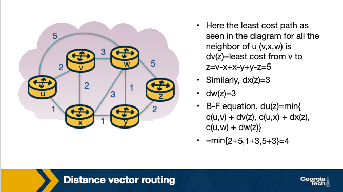{ width="640" }

**Example (same 6-node graph as link-state):** At **u**, to reach **z**:

- Via v: $c(u,v) + D_v(z) = 2 + 5 = 7$
- Via x: $c(u,x) + D_x(z) = 1 + 3 = 4$
- Via w: $c(u,w) + D_w(z) = 5 + 3 = 8$

$$D_u(z) = \min\{7,\, 4,\, 8\} = 4$$

(Neighbor costs $D_v(z)$, $D_x(z)$, $D_w(z)$ come from vectors learned after prior exchanges.)

### Distance-vector algorithm (pseudocode)

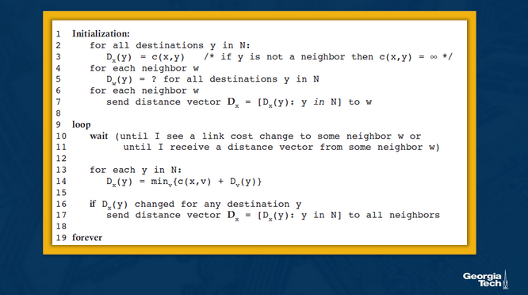{ width="520" }

**Initialization:**

- $D_x(y) \leftarrow c(x,y)$ for all destinations y (or ∞ if not a direct neighbor)
- Send distance vector $D_x$ to each neighbor

**Loop forever** — wait until:

- link cost to some neighbor changes, **or**
- a distance vector arrives from a neighbor

Then for each destination y:

- $D_x(y) \leftarrow \min_v \{ c(x,v) + D_v(y) \}$
- If any $D_x(y)$ changed, **send** $D_x$ to all neighbors

**Stop sending** when no entry changes → network **converged** (nodes wait until the next topology event).

### Worked example: three-node network (x, y, z)

**Link costs:** c(x,y)=2, c(y,z)=1, c(x,z)=7.

#### First iteration

Each node knows only **direct** links. Rows labeled “From” store each node’s distance vector; ∞ means “not received yet.”

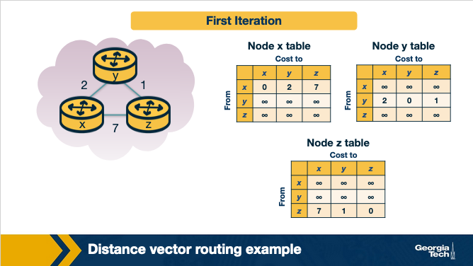{ width="700" }

| Node | Own vector $D_x(\cdot)$ |
|------|-------------------------|
| x | [0, 2, 7] to (x,y,z) |
| y | [2, 0, 1] |
| z | [7, 1, 0] |

Neighbors’ rows are all **∞** — no exchange yet.

#### Second iteration

Nodes **exchange** vectors and apply Bellman-Ford.

**At x:**

$$D_x(y) = \min\{ c(x,y)+D_y(y),\; c(x,z)+D_z(y) \} = \min\{2+0,\; 7+1\} = 2$$

$$D_x(z) = \min\{ c(x,y)+D_y(z),\; c(x,z)+D_z(z) \} = \min\{2+1,\; 7+0\} = 3$$

x’s table now includes y’s and z’s vectors from iteration 1. **Key:** path to z via y (2+1=**3**) beats direct link (7).

{ width="700" }

Nodes y and z perform the same updates in parallel.

#### Third iteration

Nodes process any **changed** vectors from iteration 2. In this topology, **all three tables match** — no further improvements.

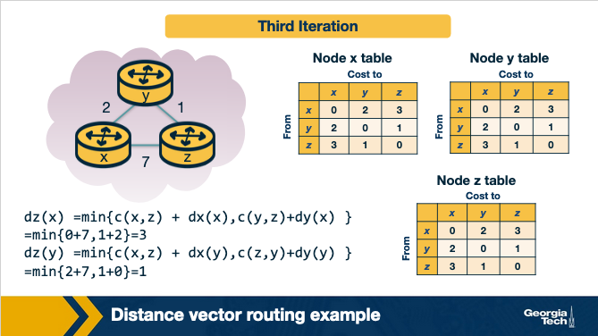{ width="700" }

**Converged distance matrix** (each row = costs from that source):

| From \ To | x | y | z |
|-----------|---|---|---|
| x | 0 | 2 | **3** |
| y | 2 | 0 | 1 |
| z | 3 | 1 | 0 |

**Forwarding at x:** to reach z, cost 3 via **y** (next hop **y**), not the direct x–z link (cost 7).

**At z** (iteration 3 check):

$$D_z(x) = \min\{ c(x,z)+D_x(x),\; c(y,z)+D_y(x) \} = \min\{7+0,\; 1+2\} = 3$$

No more updates are sent → nodes **wait** until a link cost changes.

### Convergence

**Good news** (lower costs) propagates quickly (often one round per hop).

**Bad news** (link **failure** or **large cost increase**) travels slowly → **[count-to-infinity](#link-cost-changes-and-failures-in-dv)**.

---

## Link cost changes and failures in DV

Topology: nodes **x**, **y**, **z** with c(x,y)=4, c(y,z)=1, c(x,z)=50 (before changes).

### Good news: cost decrease (x–y: 4 → 1)

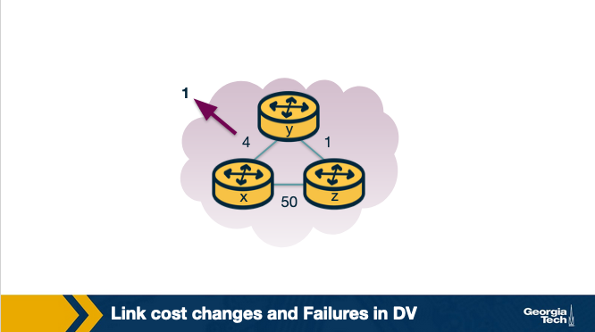{ width="400" }

| Time | What happens |
|------|----------------|
| **t0** | **y** detects c(y,x) dropped to **1**; updates $D_y(x)$; sends vector to neighbors |
| **t1** | **z** receives update; $D_z(x) = c(z,y) + D_y(x) = 1 + 1 = 2$; sends to neighbors |
| **t2** | **y** receives z’s update; **no change** → **no reply** |

**Good news propagates in a few iterations.**

### Bad news: count-to-infinity (y–x: 4 → 60)

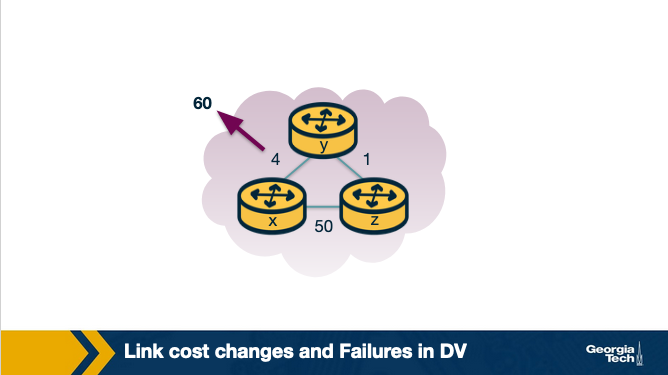{ width="400" }

| Time | What happens |
|------|----------------|
| **t0** | **y** sees link cost **60** to x. **Z has not updated yet** — z still advertises $D_z(x)=5$ (stale: path via y). **y** computes: $D_y(x) = c(y,z) + D_z(x) = 1 + 5 = 6$ |
| **t1** | **Routing loop:** y thinks x via z; z thinks x via y → packets bounce |
| **t1+** | Costs creep up: y→6, z→7, y→8, … **one per exchange** |

**Why “5” at t0?** y reads **z’s old distance vector** ($D_z(x)=5$). Equivalently:

$$D_y(x) = \underbrace{c(y,z)}_{1} + \underbrace{D_z(x)}_{5} = 6$$

y does **not** yet know the direct link is 60.

**Resolution:** After **~44 iterations**, z’s cost exceeds **50** → z switches to **direct** link c(z,x)=50; loop breaks.

| | Good news (cost ↓) | Bad news (cost ↑) |
|---|-------------------|-------------------|
| Speed | Few iterations | Many iterations (“count to infinity”) |
| Cause | Fresh lower costs spread fast | Stale vectors + mutual dependence |

---

## Poison reverse

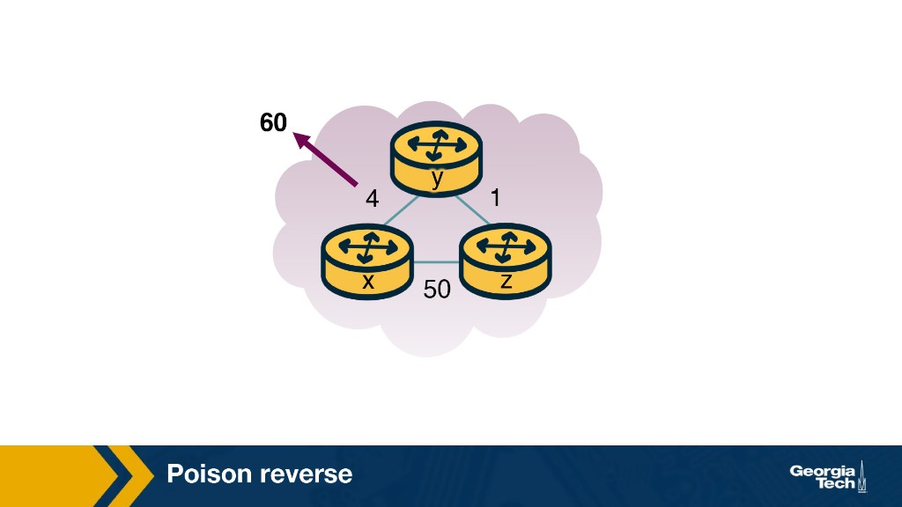{ width="400" }

**Idea:** If **z** reaches **x** through **y**, then **z advertises $D_z(x) = \infty$ to y** (a deliberate lie). y then never sends x-traffic via z while z’s path depends on y.

**Before failure:** z’s true $D_z(x)=5$ but tells y “∞ to x” → **poisons** the reverse path.

**After y–x cost → 60:**

1. **y** updates; uses **direct** link $D_y(x)=60$; informs **z**
2. **z** switches to direct c(z,x)=**50**; advertises $D_z(x)=50$ to y
3. **y** updates: $D_y(x) = c(y,z)+D_z(x) = 1+50 = 51$ via z — worse than direct 60, so y keeps direct
4. **y** now poisons reverse to z: tells z $D_y(x)=\infty$ (since path would go through z)

| | |
|---|---|
| **Fixes** | **Two-node** count-to-infinity loops |
| **Fails** | General loops with **3+ nodes** not in a simple pair |

Used with **split horizon** in RIP.

---

## RIP (Routing Information Protocol)

**RIP** = **distance-vector** **intradomain** (IGP) protocol using **hop count** (link cost = 1). Advertisements are **RIP response messages** (not raw DV tuples), sent **periodically** to neighbors.

!!! warning "Exam point (Practice Quiz 3-4)"
    **RIP is:** a **distance-vector** algorithm and an **intradomain** (IGP) protocol. **RIP is not:** link-state, interdomain (BGP), or **poison reverse** — poison reverse is a **loop-mitigation technique** RIP may use, not a protocol category.

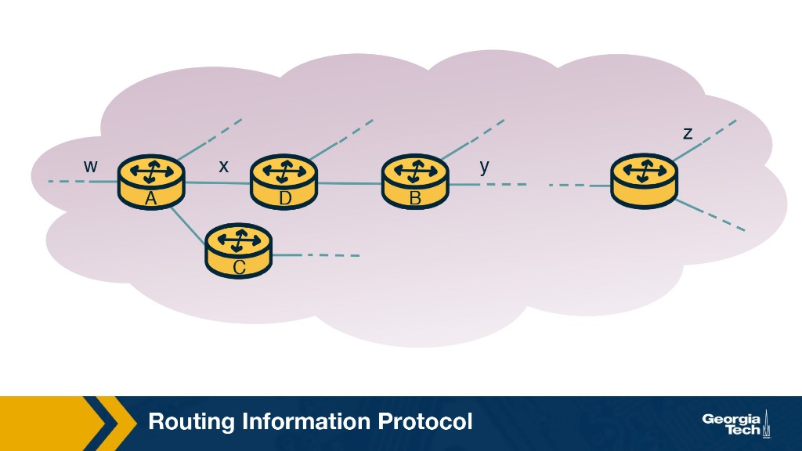{ width="560" }

| Property | Value |
|----------|--------|
| Metric | **Hops** (max **15**; **16 = ∞**) |
| Updates | Periodic + triggered on change |
| Transport | **UDP port 520** (application-level on IP) |
| Timeout | No hello for **180 s** → neighbor dead; propagate withdraw |
| v2 | Route aggregation for subnets |

### Router D’s table (example)

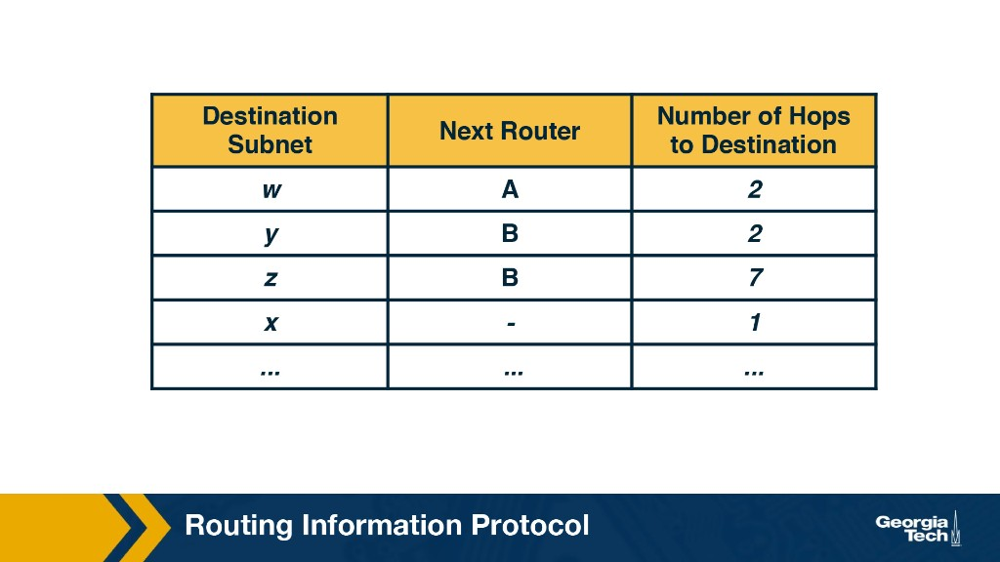{ width="480" }

Example: to reach subnet **w**, next router **A**, **2 hops**. Subnet **x** is **1 hop** (likely direct; next router “–”).

### Merging an advertisement from A

When **D** receives **A**’s RIP advertisement:

{ width="480" }

D learns a path to **z** through **A** that may be **shorter** than the old path via **B**.

### Updated table at D

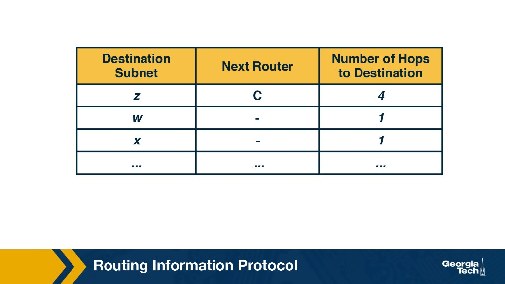{ width="480" }

**Merge rule:** For each subnet in the advertisement, if $1 + \text{hops from A} < \text{current hops}$, update next router and hop count.

**Challenges:** convergence time, loops / count-to-infinity (mitigated by poison reverse + split horizon).

---

## Hot potato routing {#hot-potato-routing}

Large networks use **IGP** inside and **BGP** at borders. When the destination is **outside** the AS, traffic must leave via an **egress** router. An AS may have **multiple egress points** to the same external destination — common for redundancy and traffic engineering. Often **multiple egresses** look equally good to **BGP** (same AS_PATH quality).

**Hot potato:** pick the egress with **lowest IGP cost** from the current router — “get the packet out of my AS ASAP.”

!!! warning "Exam point (Practice Quiz 3-5)"
    **Multiple egresses** to one external destination: **True** — normal at AS borders. Hot potato uses **lowest IGP cost** to the egress (BGP decision step 6), **not** geographic closeness to the ingress. Operators set IGP weights for capacity, delay, or TE — physical distance is **not** guaranteed to match lowest cost.

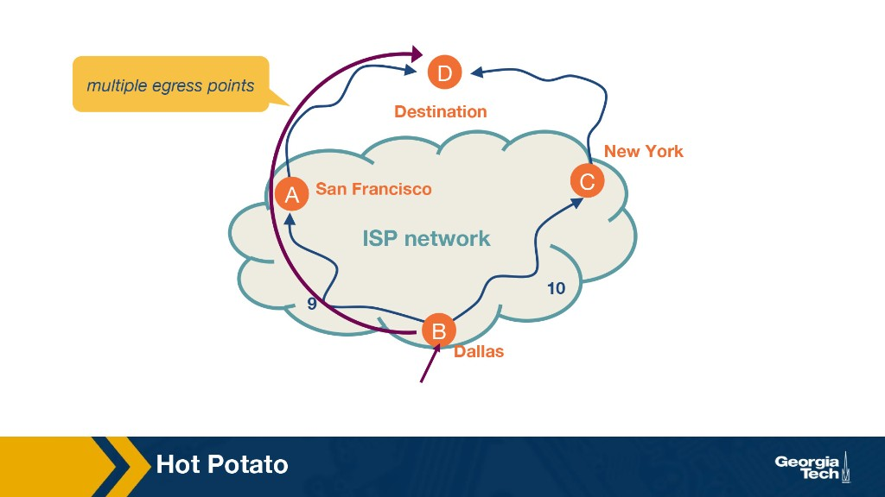{ width="560" }

**Example:** Router in **Dallas** (B) can send toward destination **D** via **San Francisco** (A, IGP cost **9**) or **New York** (C, IGP cost **10**). Both egresses have equally good BGP paths → choose **SF** (lower IGP cost).

| Benefit | Risk |
|---------|------|
| Simple; uses existing IGP metrics | End-to-end path may be suboptimal beyond egress |
| Reduces internal bandwidth use | IGP cost change → **different egress** → BGP/traffic shifts |
| Consistent choice at each hop | Couples intra- and inter-domain routing |

BGP decision step 6: **lowest IGP cost to NEXT_HOP** — see [Lesson 4](../lesson-04/interdomain-routing.md).

**Optional:** [Dynamics of Hot-Potato Routing](https://www.cs.princeton.edu/~jrex/papers/sigmetrics04.pdf)

---

## Optional reading: traffic engineering framework

Operators often tune **OSPF/IS-IS link weights** to steer traffic — not just accept default shortest paths. A classic framework has three phases: **measure → model → control**.

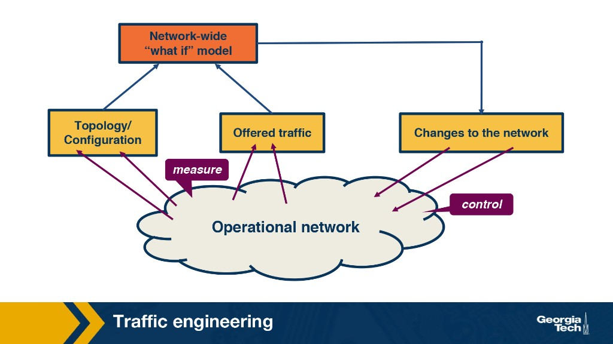{ width="560" }

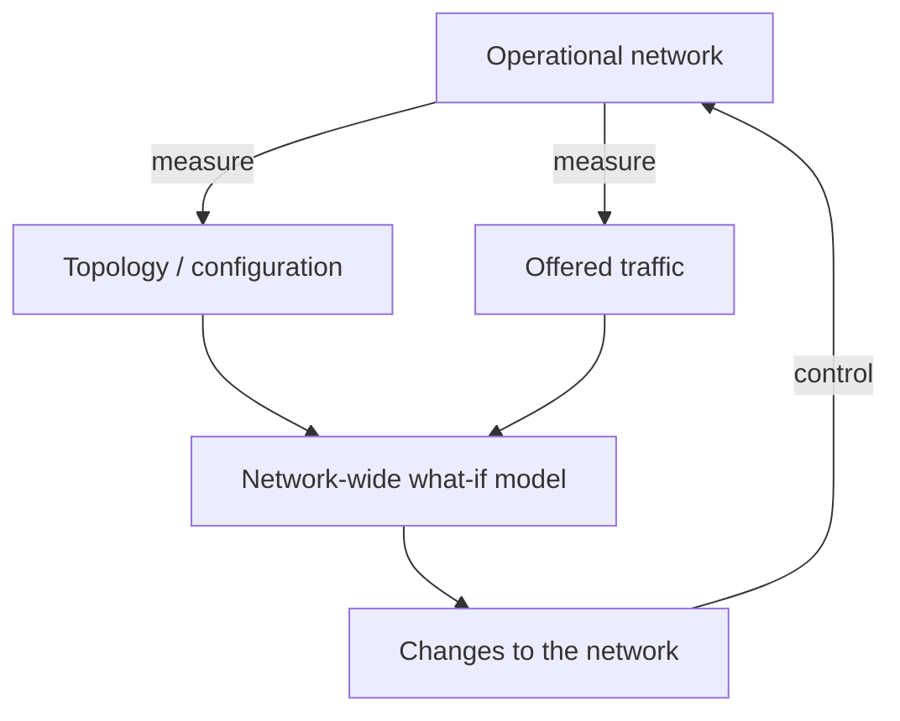

### 1. Measure

Build a real-time view of network state:

| Input | How it is obtained |
|-------|-------------------|
| **Routers and links** | SNMP polling / traps |
| **Link capacity & IGP params** | Router config or provisioning databases |
| **Live topology** | Software router participating in OSPF/IS-IS as route monitor |

**Traffic demand** estimates may come from:

- SNMP MIB counters
- Edge measurements + routing tables
- **Network tomography** (link loads + routing data)
- Packet sampling (e.g., flow export)

### 2. Model

Predict how traffic **would** flow given an IGP configuration:

- Within one OSPF/IS-IS **area**, paths follow **shortest paths** on link weights
- **Multi-area:** inter-area paths depend on **summary routes** at ABRs
- **Equal-cost multipath (ECMP):** split traffic across tied shortest paths
- Combine predicted paths with demand → estimate **load per link**

This is a **“what-if”** model: try candidate weight sets before deploying them.

### 3. Control

Apply chosen **link weights** to routers (telnet/SSH or automation). Each change triggers:

1. Update **LSDB** and **flood** new LSA
2. All routers **recompute SPF** and update **FIB**
3. Short **transient** inconsistency (like a small topology change)

Weight changes converge **faster than failures** (no failure-detection delay) but still cause a brief transition — so operators change weights **infrequently** (new hardware, failures, sustained demand shifts).

!!! tip "Connection to Lesson 3"
    Traffic engineering reuses everything you learned about **link-state routing**: weights define the graph; **Dijkstra** picks paths; **LSA flood + SPF + FIB update** applies changes network-wide.

**Reference:** [Traffic Engineering With Traditional IP Routing Protocols (Fortz et al.)](https://www.cs.princeton.edu/~jrex/teaching/spring2005/reading/fortz02.pdf)

---

## Link-state vs distance-vector (summary)

| Question | Link-state | Distance-vector |
|----------|------------|-----------------|
| Topology known? | Yes (per area) | No (local view only) |
| Computation | Dijkstra at each router | Bellman-Ford distributed |
| Messages | LSAs flooded | Vectors to neighbors |
| Failure of bad news | Usually fast | Count-to-infinity |
| Typical protocol | OSPF | RIP |

---

## Module 3 study questions (official prompts)

### What is the difference between forwarding and routing?

See [Forwarding vs routing](#forwarding-vs-routing) above.

### What could edge weights represent in intradomain routing?

When seeking a **least-cost path**, link weights in the graph can represent any **technical or economic metric** the operator configures:

- **Length of the cable**
- **Time delay** to traverse the link
- **Monetary cost**
- **Link capacity**
- **Current load** on the link (dynamic — can cause pathological behavior in link-state routing when weights change rapidly)

**Business relationships** are **not** IGP weights — they belong to **BGP** interdomain policy. See [What can edge weights represent?](#what-can-edge-weights-represent).

### Does intradomain routing involve multiple administrative domains?

**No.** **Intradomain** routing (IGP) operates **within** a **single** administrative domain / **Autonomous System**. **Interdomain** routing (**BGP**) connects **multiple** independently managed domains.

### When does each router know the full network topology (link-state)?

**Before** Dijkstra runs — after **LSA flooding** builds a consistent **link-state database (LSDB)** in each router. Dijkstra (SPF) then computes paths **locally** from that map; topology is **not** discovered by Dijkstra itself.

### How many Dijkstra iterations for N nodes?

**N − 1** iterations after initialization (add one node to **N′** per iteration until **N′ = N**). Independent of which node is the **source** or how many neighbors it has. Example: **6 nodes → 5 iterations** whether source is **u** or **x**.

### What is the main idea behind link-state routing?

Every router obtains a **consistent topology** (via LSAs), runs **Dijkstra** from itself, and installs **next-hop** forwarding entries for least-cost paths.

### Example link-state algorithm?

**Dijkstra’s algorithm** — a **global routing** / **link-state** SPF step. Protocols: **OSPF**, IS-IS.

### Which algorithm uses Bellman-Ford?

**Distance-vector** routing (e.g., **RIP**). Link-state uses **Dijkstra** on a flooded topology map.

### What is RIP an example of?

A **distance-vector** **intradomain** (IGP) protocol — **not** link-state, interdomain, or poison reverse (that is a technique, not a protocol type).

### Walk through link-state / complexity?

See [Dijkstra’s algorithm](#dijkstras-algorithm) and [Complexity](#complexity).

### Main idea behind distance-vector?

Neighbors exchange **cost-to-destination** vectors; update with **Bellman-Ford**; no global map.

### What words describe the distance-vector algorithm?

**Distributed**, **iterative**, **asynchronous** — and it **terminates** when vectors stabilize. **Not** centralized, synchronous, or non-terminating.

### What causes count-to-infinity?

**Routing loops** with **stale** distance vectors after link **failure** or cost **increase** — not poison reverse (a fix), hot potato (BGP), or dropped packets (symptom).

### Walk through distance-vector example?

See [Worked example: three-node network](#worked-example-three-node-network-x-y-z).

### What is the computational complexity of link-state routing?

**O(n²)** for naive Dijkstra: total node scans $\approx (n-1)+(n-2)+\cdots+1 = \frac{n(n-1)}{2}$. See [Complexity](#complexity).

### When does count-to-infinity occur?

Link **failure** or cost **increase** in DV — **routing loops** with mutual stale routes cause costs to increment slowly.

### How does poison reverse help?

Advertise **∞** to the neighbor you use for that destination — breaks 2-node loops.

### What is RIP? OSPF?

See [RIP](#rip-routing-information-protocol) and [OSPF](#ospf-open-shortest-path-first).

### What is hot potato routing?

Pick **closest egress** by **lowest IGP cost** from the current router when BGP paths tie — **not** necessarily geographic distance. Multiple egresses to one external destination are common.

### Multiple egresses to one external destination?

**Yes** — ASes often connect via several border routers; BGP may offer multiple valid exits.

### How does a router process advertisements?

- **LS (OSPF):** New LSA → update LSDB → flood → rerun Dijkstra → update FIB.
- **DV (RIP):** If neighbor advertises better cost, update vector → re-advertise to neighbors.

---

## Key takeaways

1. **IGP** routes inside an AS; **BGP** routes between ASes.
2. **Forwarding** = fast data plane; **routing** = control plane that fills the table.
3. **Link-state:** global map + Dijkstra (**OSPF**).
4. **Distance-vector:** neighbor vectors + Bellman-Ford (**RIP**); watch **count-to-infinity**.
5. **Poison reverse** mitigates simple DV loops; **hot potato** minimizes internal transit at egress.

**Next:** [Lesson 4 — Interdomain Routing (BGP)](../lesson-04/interdomain-routing.md)
