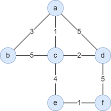

---
quiz:
  auto_number: True
  shuffle_answers: True
  disable_after_submit: False
tags:
  - lesson-03
  - routing
  - ospf
  - igp
  - quiz
search:
  boost: 1.5
---

# Lesson 3: Interactive Quiz

Intradomain routing, link-state, distance-vector, and convergence issues. New to the material? Start with the [Plain-language guide](plain-language.md). For written review, see the [Quick Study Guide](quick-study-guide.md) or [full Lesson 3 guide](intradomain-routing.md).

!!! info "Before you begin"
    <!-- mkdocs-quiz intro -->

---

## Practice Quiz 3-1 (intradomain foundations)

Canvas practice quiz — forwarding vs routing, IGP scope, and link metrics.

<quiz>
In **intradomain** routing, when seeking a **least-cost path**, what could the **weights on graph edges** represent? Select **all** that apply.
- [x] Length of the cable
- [x] Time delay to traverse the link
- [x] Monetary cost
- [ ] Business relationships
- [x] Link capacity
- [x] Current load on the link

**Business relationships** drive **BGP** (interdomain) policy — not IGP link metrics inside one AS. **Current load** weights are **dynamic** and can cause pathological behavior in link-state routing.
</quiz>

<quiz>
A packet is __________ when it is moved from a router's input link to the appropriate **output** link.
- [ ] Routed
- [x] Forwarded
- [ ] Dropped
- [ ] Acknowledged

**Forwarding** is the **data-plane** action on a single router. **Routing** is the **control-plane** process that builds the forwarding table.
</quiz>

<quiz>
Which action is **network-wide** (involves multiple routers)?
- [x] Routing
- [ ] Forwarding

**Routing** protocols exchange information and compute paths across the network. **Forwarding** is a local table lookup per packet.
</quiz>

<quiz>
**Intradomain** routing must involve **multiple** administrative domains.
- [ ] True
- [x] False

**Intradomain** (IGP) routing is **within one** administrative domain / AS. **Interdomain** (BGP) connects **multiple** domains.
</quiz>

---

## Practice Quiz 3-2 (link-state / Dijkstra)

Canvas practice quiz — iteration count, LSA vs Dijkstra, and a worked Dijkstra example.

<quiz>
In the **u–v–w–x–y–z** topology (6 nodes), **u** was the source in the course example. If **x** is the source instead (x has **more** direct neighbors than u), how many Dijkstra iterations run **after initialization**?
- [ ] Fewer than when u was source (fewer ∞ nodes after init)
- [x] The **same** number — **5** iterations (N − 1 = 6 − 1)
- [ ] More than when u was source (more neighbors to consider)

Each iteration adds **exactly one** node to **N′** until **N′ = N**. Neighbor count at the source does **not** change the iteration count.
</quiz>

<quiz>
In Dijkstra's algorithm, all nodes in a network are aware of the entire network topology only **after** the algorithm's termination.
- [ ] True
- [x] False

**Link-state flooding** distributes LSAs **before** SPF. Every router has the full map in its **LSDB**, **then** runs Dijkstra independently.
</quiz>

<quiz>
Source **b** in the a–f topology below. Least cost from **b** to **a** is [[3]].
---
Direct link b–a cost 3; confirmed in iteration 1 when a is added to N′.
</quiz>

<quiz>
Source **b** — least cost from **b** to **c** is [[4]].
---
After adding a: D(c)=min(5, 3+1)=4 via a–c.
</quiz>

<quiz>
Source **b** — least cost from **b** to **d** is [[6]].
---
Via a then c: 3+1+2=6 beats direct-via-a path 3+5=8.
</quiz>

<quiz>
Source **b** — least cost from **b** to **e** is [[8]].
---
Via c: 4+4=8 after c is added to N′.
</quiz>

<quiz>
Source **b** — least cost from **b** to **f** is [[9]].
---
Via e: 8+1=9 beats via d: 6+5=11.
</quiz>

See the [worked example from source b](../intradomain-routing.md#worked-example-source-b) in the full guide.

---

## Practice Quiz 3-3 (distance-vector)

Canvas practice quiz — DV algorithm properties and count-to-infinity.

<quiz>
Select the words that can describe the **distance-vector** algorithm. Select **all** that apply.
- [x] Distributed
- [ ] Centralized
- [x] Iterative
- [x] Asynchronous
- [ ] Synchronous
- [ ] Non-terminating

Each router knows only **direct links** and **neighbor vectors** — no central map (**not centralized**). Updates repeat in rounds (**iterative**) whenever a neighbor advertises or a local link changes (**asynchronous** — no global clock). The algorithm **terminates** when no vector changes.
</quiz>

<quiz>
Which of the following can **cause** the count-to-infinity problem?
- [ ] Poison reverse
- [x] Routing loops
- [ ] Hot potato routing
- [ ] Dropped packets

**Routing loops** let stale vectors bounce (A→B→A…) so costs creep up until **∞**. **Poison reverse** is a **mitigation**, not a cause. **Hot potato** is BGP egress choice. **Dropped packets** may follow from loops but are not the algorithmic root cause.
</quiz>

---

## Practice Quiz 3-4 (algorithm classification)

Canvas practice quiz — Dijkstra vs Bellman-Ford, global vs link-state, and what RIP is.

<quiz>
Dijkstra's algorithm is a [[global]] routing algorithm, which is also referred to as a [[link-state]] algorithm.
---
Each router has the **full topology** (via LSA flood) before running SPF — a **global** view. **Link-state** is the IGP family name (OSPF, IS-IS). **Not** distance-vector.
</quiz>

<quiz>
The **Bellman-Ford equation** is used by the ______________ algorithm.
- [ ] Link-state
- [x] Distance vector

$D_x(y) = \min_v \{ c(x,v) + D_v(y) \}$ updates each router from **neighbor advertisements** only. **Dijkstra** is the link-state SPF step.
</quiz>

<quiz>
The **Routing Information Protocol (RIP)** is an example of ______________. Select **all** that apply.
- [ ] A link-state algorithm
- [x] A distance vector algorithm
- [ ] Poison reverse
- [ ] An interdomain routing algorithm
- [x] An intradomain routing algorithm

**RIP** is an **IGP** (inside one AS) that exchanges **distance vectors** (hop count). **Poison reverse** is a **technique** RIP may use — not what RIP *is*. **BGP** is interdomain.
</quiz>

---

## Practice Quiz 3-5 (hot potato routing)

Canvas practice quiz — multiple egress points and how hot potato chooses among them.

<quiz>
There may be **multiple egress points** from an administrative domain to an external destination.
- [x] True
- [ ] False

Large ASes often peer via **several border routers** (redundancy, capacity). BGP may advertise equally good paths through **multiple exits** to the same external prefix.
</quiz>

<quiz>
**Hot potato routing** always selects the egress point that is **geographically closest** to the ingress point.
- [ ] True
- [x] False

Hot potato picks the egress with **lowest IGP cost** from the **current** router (BGP step 6). IGP weights reflect operator policy (capacity, delay, TE) — **not** strict geographic distance.
</quiz>

---

## Forwarding & routing

<quiz>
**Forwarding** is best described as:
- [x] Data-plane: per-packet lookup and send on an output port
- [ ] Control-plane: computing shortest paths network-wide
- [ ] DNS resolution of hostnames
- [ ] TCP congestion control

Routing builds the table; forwarding uses it on every packet.
</quiz>

<quiz>
Which protocol family typically routes packets **inside** a single autonomous system?
- [x] IGP (e.g., OSPF, RIP)
- [ ] BGP only
- [ ] DNS
- [ ] HTTP

**BGP** is mainly **interdomain** (between ASes).
</quiz>

---

## Link-state & Dijkstra

<quiz>
In link-state routing, each router:
- [x] Floods link information and runs Dijkstra locally
- [ ] Only talks to immediate neighbors with hop counts
- [ ] Never knows link costs
- [ ] Uses BGP to pick internal paths

All routers in an area build the same topology database (LSDB).
</quiz>

<quiz>
Dijkstra’s algorithm maintains N′ as the set of nodes whose shortest paths from the source are [[confirmed]].
---
Each iteration adds the tentative node with minimum D(v) to N′ and relaxes its neighbors.
</quiz>

<quiz>
In the course link-state example with source **u**, the least cost from u to **x** is [[1]] (direct link).
---
u–x has cost 1; x is added to N′ in the first iteration.
</quiz>

<quiz>
In Dijkstra notation, **p(v)** stores the [[predecessor]] node on the current best path from the source to v.
---
Tracing predecessors from v back to u gives the full path; the first hop is the forwarding-table entry.
</quiz>

<quiz>
When OSPF receives a [[duplicate]] LSA (same sequence number as in the LSDB), it must acknowledge it immediately.
---
This behavior is useful for black-box measurement of processing delays (Shaikh & Greenberg paper).
</quiz>

<quiz>
**OSPF** uses hierarchical [[areas]] connected by a backbone and area border routers to limit LSA flooding scope.
---
Backbone is typically **area 0**; ABRs connect areas to the backbone.
</quiz>

---

## Link-state complexity

<quiz>
Naive Dijkstra (link-state SPF) has worst-case time complexity:
- [x] O(n²) in the number of nodes n
- [ ] O(n) 
- [ ] O(log n)
- [ ] O(1)

Each of ~n iterations may scan O(n) nodes: (n−1)+…+1 = n(n−1)/2 comparisons.
</quiz>

---

## Distance-vector

<quiz>
Distance-vector routing is described as iterative, asynchronous, and [[distributed]] — each node updates from neighbor vectors without a central map.
---
Unlike link-state flooding, DV nodes only know their neighbors' advertised costs.
</quiz>

<quiz>
The Bellman-Ford update at node x for destination y is:
- [x] $D_x(y) = \min_v \{ c(x,v) + D_v(y) \}$
- [ ] $D_x(y) = \max_v \{ c(x,v) + D_v(y) \}$
- [ ] $D_x(y) = c(x,y)$ only
- [ ] $D_x(y) = D_y(x)$ always

Try each neighbor as first hop; pick minimum total cost.
</quiz>

<quiz>
**RIP** uses which metric?
- [x] Hop count (max 15, 16 = infinity)
- [ ] Bandwidth only
- [ ] AS_PATH length
- [ ] No metric

RIP is a classic **distance-vector** IGP for smaller networks.
</quiz>

<quiz>
In the course 3-node DV example (x–y=2, y–z=1, x–z=7), after convergence $D_x(z)$ is:
- [x] 3 (via y)
- [ ] 7 (direct)
- [ ] 1
- [ ] 0

$D_x(z) = \min\{c(x,y)+D_y(z),\, c(x,z)+D_z(z)\} = \min\{2+1,\, 7+0\} = 3$.
</quiz>

---

## Count-to-infinity & poison reverse

<quiz>
Count-to-infinity most often occurs when:
- [x] A link fails or its cost increases significantly (bad news in DV)
- [ ] A new link is added with cost zero
- [ ] OSPF floods a new LSA
- [ ] DNS TTL expires

Routers may loop through each other with **stale** distance vectors.
</quiz>

<quiz>
In the course x–y–z example, when c(y,x) jumps to 60, at t0 router y may compute $D_y(x) = c(y,z) + D_z(x) = 1 + [[5]] = 6$ using z's **stale** advertisement.
---
Z had not heard about the failure yet; y incorrectly thinks it can reach x cheaply via z.
</quiz>

<quiz>
**Poison reverse** means: if your best route to X goes through neighbor Y, you advertise distance [[infinity]] to X when speaking to Y.
---
This blocks Y from thinking it can reach X through you when your path depends on Y.
</quiz>

---

## RIP & OSPF

<quiz>
**RIP** advertisements are sent over:
- [x] UDP port 520
- [ ] TCP port 179
- [ ] IP protocol 89
- [ ] ICMP only

RIP is an application-level process; **OSPF** uses IP proto 89; **BGP** uses TCP 179.
</quiz>

<quiz>
In OSPF, traffic between two non-backbone areas must pass through the [[backbone]] area (area 0).
---
ABRs connect each area to the backbone; inter-area routing is ABR → backbone → ABR.
</quiz>

---

## Hot potato & comparison

<quiz>
**Hot potato routing** selects an egress point by:
- [x] Lowest IGP cost to that egress (closest exit by **IGP metric**)
- [ ] Longest AS_PATH
- [ ] Highest BGP LOCAL_PREF from a peer
- [ ] Random choice among exits

Goal: hand traffic to another AS quickly and save internal resources. **Not** necessarily the geographically nearest border — IGP weights are configurable.
</quiz>

<quiz>
Which pairing is correct?
- [x] OSPF → link-state; RIP → distance-vector
- [ ] OSPF → distance-vector; RIP → link-state
- [ ] Both are path-vector like BGP
- [ ] Both use only hop count with no topology

OSPF runs Dijkstra; RIP exchanges distance vectors.
</quiz>

---

<!-- mkdocs-quiz results -->

---

!!! tip "Keep studying"
    - [Plain-language guide](plain-language.md)
    - [Full Lesson 3 guide](intradomain-routing.md)
    - [Lesson 4 — Interdomain / BGP](../lesson-04/interdomain-routing.md)
    - [Lesson 4 plain-language guide](../lesson-04/plain-language.md)
    - [Lesson 4 Quick Study Guide](../lesson-04/quick-study-guide.md)
    - [Lesson 4 Quiz](../lesson-04/quiz.md)
