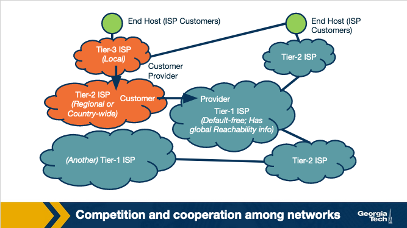
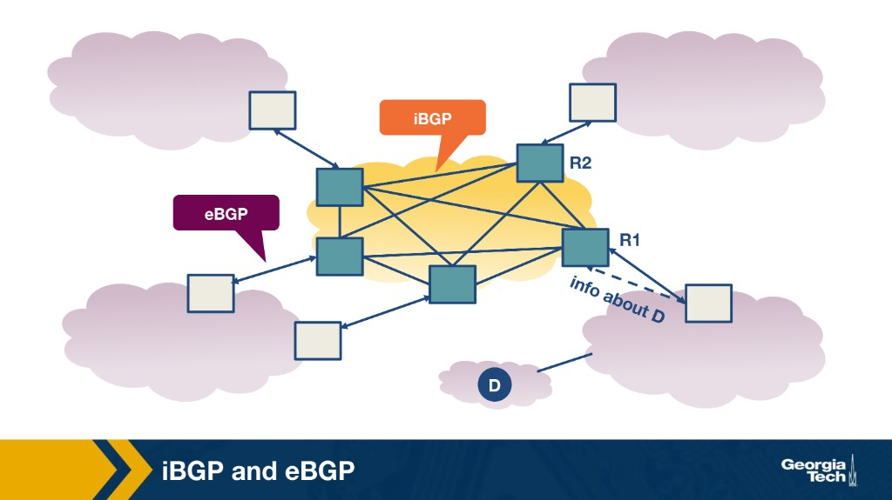
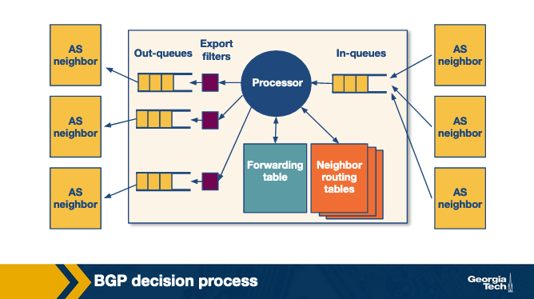
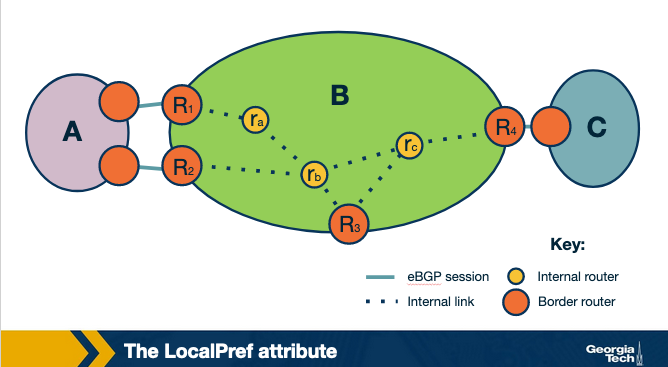
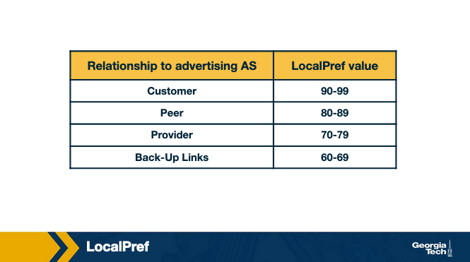
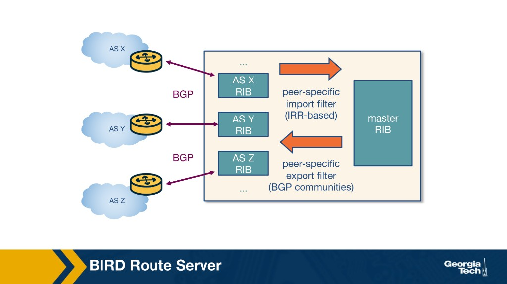
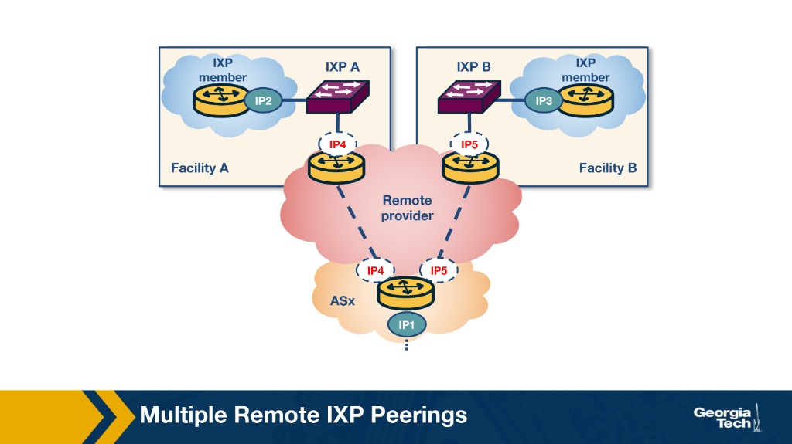

---
tags:
  - lesson-04
  - routing
  - bgp
---

# Lesson 4: Interdomain Routing (BGP)

How autonomous systems exchange reachability and apply **policy** at Internet scale. Intradomain (IGP) material is in **[Lesson 3](../lesson-03/intradomain-routing.md)**.

!!! tip "Exam prep"
    New to the material? Start with the **[Plain-language guide](plain-language.md)** — plain-language explanations and analogies. Need a condensed review? See the **[Quick Study Guide](quick-study-guide.md)** — tables, memory aids, and high-yield questions with short answers. For interactive practice, try the **[Lesson 4 Quiz](quiz.md)**. Intradomain routing (IGP) is **[Lesson 3](../lesson-03/intradomain-routing.md)**.

---

## Learning Objectives

1. **Define AS**, intra vs inter routing (IGP vs BGP).
2. **Explain AS business relationships** — transit vs peering and the incentives behind them.
3. **Apply import/export policy** and route filters (customer / peer / provider).
4. **Describe BGP sessions, updates, and path selection** — LocalPref, MED.
5. **Explain why IXPs matter** and how route servers scale peering.
6. **Identify operational risks** — misconfigurations, churn, scalability pressure.

### Roadmap

The Internet ecosystem → AS relationships → policies → BGP → IXPs/route servers → failures

---

## Lesson 4 Overview

Welcome to Module 4: **AS Relationships and Interdomain Routing**.

In this module, we study how traffic moves between independently operated networks across the global Internet. Inside one network, routing is mostly about finding good paths. Across networks, routing also involves **policy, business relationships, and incentives**. We use **BGP** as the main example of how networks exchange reachability information and decide which routes to accept, prefer, and advertise.

For example, when a browser in an enterprise network reaches a web server hosted in a CDN, the traffic may cross multiple ISPs, ASes, and exchange points before it reaches the destination. We also study how **IXPs** and **route servers** make peering easier to scale, and why **BGP misconfiguration** can create instability beyond one network.

### Key Concepts

- Autonomous Systems and interdomain routing
- Intradomain routing versus interdomain routing
- BGP as the "glue" of the Internet
- Prefix reachability and border routers
- Customer-provider and peering relationships
- Import and export routing policies
- LocalPref, MED, and BGP path selection
- eBGP and iBGP
- BGP updates, withdrawals, and instability
- Internet Exchange Points and route servers
- Route filtering, misconfiguration, and operational risks

### How to Navigate This Module

1. Start with the **Module 4 Summary Video** to get the main ideas and takeaways.
2. Work through this lesson's pages in order — they expand on the summary video and provide the main course content.
3. Use the transcript and slides as study references when reviewing.

---

## Autonomous Systems and Internet Interconnection

Today's Internet is a complex **ecosystem** built of a network of networks. The basis includes **Internet Service Providers (ISPs)**, **Internet Exchange Points (IXPs)**, and **Content Delivery Networks (CDNs)**.


### Network Types

**ISPs** are categorized into three tiers:

| Tier | Name | Role | Examples |
|------|------|------|----------|
| **Tier-1** | Global backbone | Default-free; peers with all other Tier-1s; ~dozen worldwide | AT&T, NTT, Level-3, Sprint |
| **Tier-2** | Regional ISP | Connect to Tier-1; serve regional/country-wide areas | Regional providers |
| **Tier-3** | Access ISP | Connect to Tier-2; serve end users locally | Local access providers |

**IXPs** are interconnection infrastructures providing physical facilities where multiple networks interconnect and exchange traffic locally. As of 2019, there are approximately **500 IXPs** worldwide.

**CDNs** are networks content providers create to control delivery and reduce connectivity costs. Examples: Google, Netflix. Multiple data centers with hundreds of servers distributed globally.

### Competition and Cooperation Among Networks

The ecosystem forms a **hierarchical structure**: smaller networks (access ISPs) connect to larger ones (regional → Tier-1) as **customers** of their **providers**.



- ISPs **compete** at every level (Tier-1 vs Tier-1, regional vs regional).
- Competing ISPs must also **cooperate** to provide global connectivity to their customers.
- ISPs deploy multiple interconnection strategies based on customer count and geography.

**Additional interconnection options:**

- **Points of Presence (PoPs)** — one or more routers in a provider's network where customers connect.
- **Multi-homing** — an ISP connects to one or more provider networks for redundancy.
- **Peering** — settlement-free agreement where neither network pays the other for direct traffic exchange.

### Hierarchical vs Flat Topology

The ecosystem was **hierarchical** in the Internet's early days. As IXPs and CDNs have grown, the structure is **morphing from hierarchical to flat** — access ISPs may connect directly to Tier-1 ISPs, content providers, or IXPs, bypassing regional tiers.

### Autonomous Systems

Each network (ISP, CDN, enterprise) may operate as an **Autonomous System (AS)**:

- A group of routers (and links) under the **same administrative authority**.
- An ISP may operate as a single AS or through **multiple ASes**.
- Each AS implements its own policies, traffic engineering, interconnection strategies, and controls how traffic enters/exits.

### Routing Protocols: IGP vs BGP

| Scope | Protocol | Focus |
|-------|----------|-------|
| **Between ASes** | **BGP** (Border Gateway Protocol) | Border routers exchange reachability; policy-driven |
| **Within an AS** | **IGP** (Interior Gateway Protocol) | Optimize path metric internally |

Example IGPs: OSPF, IS-IS, RIP, E-IGRP.

!!! info "Reference"
    Kurose & Ross, 6th Edition, Section 1.3.3; [MIT AS-BGP Notes](https://web.mit.edu/6.829/www/currentsemester/papers/AS-bgp-notes.pdf)

---

## AS Business Relationships

The prevalent forms of business relationships between ASes are **provider-customer (transit)** and **peering**.


### Provider-Customer (Transit)

A **financial settlement** determines how much the customer pays the provider. The provider forwards the customer's traffic to destinations in the provider's routing table — **in both directions** (inbound and outbound).

- **Customer** buys reachability; pays the provider.
- **Provider** carries traffic between the customer and the rest of the Internet.

### Peering

In a peering relationship, two ASes share access to a **subset** of each other's routing tables. Routes shared between peers are often restricted to each AS's **own customers**.

- Agreement holds as long as traffic exchanged is **not highly asymmetric**.
- **Tier-1 peering** — peers must be of similar size and handle proportional traffic; a larger ISP lacks incentive to peer with a much smaller one.
- **Smaller ISP peering** — both save money they would pay providers by forwarding traffic directly when significant volume is destined for each other (or each other's customers).

### How Providers Charge Customers

While peering forwards traffic at no cost, provider ASes have a financial incentive to carry as much customer traffic as possible. A major revenue factor is the **data rate** of an interconnection. Providers typically charge in one of two ways:

1. **Fixed price** — flat fee while bandwidth stays within a predefined range.
2. **Usage-based (95th percentile)** — measure bandwidth at periodic intervals (e.g., every five minutes); charge based on the **95th percentile** of the measurement distribution.

!!! note "Policy Incentive"
    Complex routing policies sometimes exist to **increase traffic from a customer to its provider**, boosting provider revenue.

!!! info "Reference"
    Kurose & Ross, 6th Edition, Section 1.3.3; [MIT AS-BGP Notes](https://web.mit.edu/6.829/www/currentsemester/papers/AS-bgp-notes.pdf)

---

## BGP Routing Policies: Importing and Exporting Routes

AS business relationships drive an AS's **routing policies** and determine which routes to **import** or **export**. Advertising a route to a neighbor means that neighbor may select it — and traffic may flow through your network. Import/export decisions are therefore **policy decisions**, implemented via **route filters** (rules controlling which routes a router advertises to neighboring ASes).


### Exporting Routes

Consider AS **X** deciding what to advertise:

| Routes learned from | Export to | Rationale |
|---------------------|-----------|-----------|
| **Customers** | Everyone (customers, peers, providers) | X is paid to provide reachability — more advertisements → more traffic through X → more revenue |
| **Providers** | Customers only | No incentive to carry traffic for provider routes; withheld from peers and other providers |
| **Peers** | Customers only | Don't advertise peer routes to providers (or other peers) — otherwise A and B would use X as free transit without paying |

**Key principle:** An AS only wants to carry transit traffic if it gets paid for it.

```
Routes learned from:          Export to:
  Customer  ──────────────→  Everyone (customers, peers, providers)
  Peer      ──────────────→  Customers only
  Provider  ──────────────→  Customers only
```

### Importing Routes

ASes are also selective about which routes to **import**. Decisions depend on **which neighbor** advertises the route and the **business relationship** type.

When multiple neighbors advertise routes to the same destination, the AS **ranks** them before selecting one:

| Rank | Source | Reasoning |
|------|--------|-----------|
| 1 | **Customer** | Keep customer traffic local — avoid unnecessary transit costs through other ASes |
| 2 | **Peer** | Usually "free" under the peering agreement |
| 3 | **Provider** | Costly transit — use only when needed for connectivity |

```
Import preference:
  Customer routes  >  Peer routes  >  Provider routes
```

Interdomain routing is rarely about the shortest path — the selected path reflects **financial and traffic engineering goals**.

---

## BGP and Design Goals

After import/export policy, we turn to **BGP (Border Gateway Protocol)** — the default interdomain routing protocol used to implement those policies.

### Original Design Goals

**1. Scalability**

As the Internet grows, so do the number of ASes, prefixes in routing tables, network churn, and BGP traffic between routers. BGP must manage this growth while achieving **convergence in reasonable timescales** and providing **loop-free paths**.

**2. Express routing policies**

BGP defines **route attributes** that let ASes implement policies (which routes to import/export) through **route filtering** and **route ranking**. Each AS's routing decisions can remain **confidential**, and each AS implements them **independently**.

**3. Allow cooperation among ASes**

Each AS makes **local decisions** (which routes to import/export) while keeping those decisions **confidential** from other ASes — enabling cooperation between independently operated networks with competing interests.

### Security (Added Later)

Security was **not** an original BGP design goal. As the Internet grew, protection and early detection became necessary for:

- Malicious attacks
- Misconfiguration
- Faults

These vulnerabilities still cause routing disruptions and connectivity issues for hosts, networks, and even entire countries.

**Security efforts** (limited deployment):

| Approach | Examples |
|----------|----------|
| Protocol enhancements | S-BGP |
| Infrastructure | Prefix registries (which AS owns which prefixes), public keys for ASes |
| Research | Machine learning-based detection systems |
| Modern deployments | RPKI, BGPsec (gradual adoption) |

Wide deployment has been slow due to **protocol transition difficulty** and **lack of incentives**.

!!! info "Reference"
    Kurose & Ross, 6th Edition, Section 1.3.3; [MIT AS-BGP Notes](https://web.mit.edu/6.829/www/currentsemester/papers/AS-bgp-notes.pdf)

---

## BGP Protocol Basics

A pair of routers (**BGP peers**) exchange routing information over a semi-permanent **TCP** connection called a **BGP session**. To start a session, a router sends an **OPEN** message. Peers then exchange announcements from their routing tables — route exchange can take **seconds to minutes**, depending on table size.

### eBGP vs iBGP

| Session | Between | Example |
|---------|---------|---------|
| **eBGP** (external) | Routers in **different** ASes | 3a ↔ 1c |
| **iBGP** (internal) | Routers in the **same** AS | 3c ↔ 3a |


### BGP Messages

After session establishment, peers exchange:

| Message | Purpose |
|---------|---------|
| **UPDATE** | Routes that changed since the previous update |
| **KEEPALIVE** | Maintain the current session |

**UPDATE** messages have two forms:

- **Announcements** — advertise new routes or update existing ones (include standardized attributes).
- **Withdrawals** — inform peer that a previously announced route is no longer available (failure or policy change).

### BGP Prefix Reachability

Destinations are **IP prefixes** (subnets or collections of subnets an AS can reach).

1. **Border routers** running eBGP advertise reachable prefixes to neighboring ASes per the **export policy**.
2. Via **iBGP**, gateway routers disseminate external routes to internal routers per the **import policy**.
3. Internal routers run iBGP to propagate external routes to other iBGP-speaking routers.

### Path Attributes and BGP Routes

Advertised routes include a reachable prefix plus **BGP attributes**. Two notable attributes:

**AS-PATH**

- Each AS is identified by its **ASN**.
- As an announcement traverses ASes, each prepends its ASN to AS-PATH.
- Prevents loops; used in path selection — prefer **shortest AS-PATH** among candidates.

**NEXT-HOP**

- IP address of the next-hop router (interface) toward the destination.
- Internal routers store the **border router's** IP as next-hop for external destinations.
- Traffic to external destinations is forwarded through the border router.
- When multiple border routers advertise paths to the same destination, NEXT-HOP lets internal routers install the best path per AS routing policy.

!!! info "Reference"
    Kurose & Ross, 6th Edition, Section 4.6.3; [MIT AS-BGP Notes](https://web.mit.edu/6.829/www/currentsemester/papers/AS-bgp-notes.pdf)

---

## BGP: eBGP and iBGP

BGP has two flavors, both used to disseminate routes for **external destinations**:

| Flavor | Sessions between | Role |
|--------|------------------|------|
| **eBGP** | Border routers of **neighboring ASes** | Learn routes to external prefixes |
| **iBGP** | Internal routers within the **same AS** | Disseminate eBGP-learned routes inside the AS |

**eBGP-speaking routers** learn external routes and pass them to all routers in the AS via **iBGP**. Border routers of AS1, AS2, and AS3 establish eBGP sessions to learn external routes; inside AS2, those routes are disseminated over iBGP.


### iBGP Full Mesh

Route dissemination within an AS uses a **full mesh** of iBGP sessions — each eBGP-speaking router maintains an iBGP session with **every other BGP router** in the AS to send updates about routes learned over eBGP.



### iBGP Is Not an IGP

**iBGP is not** an IGP-like protocol (RIP, OSPF):

| | **IGP** (RIP, OSPF) | **iBGP** |
|---|---------------------|----------|
| **Purpose** | Establish paths between internal routers based on **costs within the AS** | **Disseminate external routes** learned via eBGP |
| **Scope** | Intradomain path computation | Interdomain reachability distribution |

IGP and iBGP are complementary: IGP finds paths to border routers; iBGP distributes which external prefixes are reachable and through which exit.

---

## BGP Decision Process: Selecting Routes at a Router

ASes operate under different administrative authorities with different business goals and traffic volumes — yet all routers follow the **same decision process** to select routes.

### Router Model



Conceptually ([Dovrolis et al.](https://www.cc.gatech.edu/home/dovrolis/Papers/bgp-scale-conext08.pdf)):

1. **Receive** incoming BGP messages (in-queues).
2. **Import** — apply import policies; exclude routes from consideration.
3. **Decide** — run the decision process; select best routes reflecting policy.
4. **Install** — write selected routes to the **forwarding table**.
5. **Export** — apply export policy; advertise to selected neighbors (out-queues).

### Comparing Routes

When multiple advertisements exist for the same destination, the router **compares routes attribute-by-attribute**. For each attribute, it picks the value that best applies policy. If tied, it moves to the next attribute.

With **no policy**, the router would simply pick the shortest path (fewest hops) — this rarely happens in practice.


| Step | Attribute | Controlled by |
|------|-----------|---------------|
| 1 | **Highest LocalPref** | Local AS |
| 2 | **Shortest AS-PATH** | Neighbor AS |
| 3 | **Lowest origin type** | Protocol |
| 4 | **Lowest MED** | Neighbor AS |
| 5 | **eBGP over iBGP** | Protocol |
| 6 | **Lowest IGP cost to border router** | Local AS |
| 7 | **Lowest router ID** (tiebreak) | Protocol |

### LocalPref — Outbound Exit Selection

**LocalPref** prefers routes learned through a specific neighbor AS over others — controlling **where traffic exits** the AS (outbound).



Example: AS B learns destination **x** via AS A and AS C. If B prefers routing through A (peering/business), it assigns a **higher LocalPref** to routes from A. Internal routers then select A as the exit point.

An operator can assign **non-overlapping LocalPref ranges** by business relationship:



| Relationship | LocalPref range |
|--------------|-----------------|
| Customer | 90–99 |
| Peer | 80–89 |
| Provider | 70–79 |
| Back-up links | 60–69 |

Higher LocalPref = preferred. This implements customer > peer > provider import ranking.

### MED — Inbound Entry Selection

**MED (Multi-Exit Discriminator)** designates which links are preferred for **inbound** traffic when two ASes connect via multiple links.

Example: AS B advertises routes to AS A through border routers R1 and R2 with **different MED values**. If R1 has lower MED (and other attributes tie), AS A prefers R1 to forward traffic into AS B.

- An AS can **tag routes with MED** to reflect business relationship type.
- An AS can **filter routes** with specific MED values before exporting.
- Influencing route exports affects **entry points** for inbound traffic.

MED is a **suggestion** — the receiving AS may honor or ignore it.

### Who Controls Attributes?

| Control | Examples |
|---------|----------|
| **Local AS** | LocalPref; IGP cost to border router |
| **Neighbor AS** | MED; AS-PATH length |
| **Protocol** | Origin type; eBGP vs iBGP preference; router ID tiebreak |

!!! info "Reference"
    [BGP Routing Policies in ISP Networks](https://www.cs.princeton.edu/~jrex/papers/policies.pdf) — especially Sections 2, 3, 4

---

## Challenges with BGP: Scalability and Misconfigurations

In practice, BGP suffers from two significant limitations: **misconfigurations** and **faults**.

A misconfiguration or error can trigger an excessively large number of UPDATE messages, causing:

- **Route instability**
- Router **processor and memory overload**
- **Outages** and router failures

ASes reduce this risk by **limiting routing table size** and **limiting the number of route changes**.

### Limiting Routing Table Size

| Technique | How it helps |
|-----------|--------------|
| **Filtering** | Filter long, specific prefixes to encourage **route aggregation** |
| **Per-session prefix limits** | Cap prefixes advertised from a single source on each BGP session |
| **Default routes** | Small ASes may install default routes instead of full tables |
| **Aggregation on export** | Export **less-specific prefixes** where possible to protect other ASes |

### Limiting Route Changes (Flap Damping)

**Flap damping** explicitly limits propagation of **unstable routes**:

1. Track UPDATE count for a specific prefix over a time window.
2. If count exceeds a **configurable threshold**, **suppress** the route until a later time.
3. Apply **strategically** — damping affects reachability:
   - **More specific prefixes** — more aggressive suppression (lower thresholds).
   - **High-availability destinations** — higher thresholds (less aggressive).

!!! info "Reference"
    [BGP Routing Policies in ISP Networks](https://www.cs.princeton.edu/~jrex/papers/policies.pdf)

!!! note "Optional"
    [On the Scalability of BGP](https://www.cc.gatech.edu/home/dovrolis/Papers/bgp-scale-conext08.pdf) — topology growth and update rate-limiting

---

## Peering at IXPs

ASes can peer **directly** or at **Internet Exchange Points (IXPs)** — infrastructures that facilitate peering and offer additional services.

### What Are IXPs?

IXPs are **physical infrastructures** enabling ASes to interconnect and directly exchange traffic. ASes at an IXP are **participant ASes**.

- Infrastructure: network of switches (single site, regional, or global).
- **Fully redundant switching fabric** for fault tolerance.
- Equipment in data centers (reliability, power, physical security).


Example: **DE-CIX** in Frankfurt — core sites (3, 6) plus additional sites (1–4, 7) at different colocation facilities.

### Why IXPs Matter

| Reason | Detail |
|--------|--------|
| **Traffic hubs** | 2012 study: large European IXP had 50,000+ active peering links; daily volume comparable to Tier-1 ISPs |
| **DDoS mitigation** | Observe traffic to/from many participants; act as "shield" (e.g., March 2013 Spamhaus/Stophaus/Cloudflare attack). See Lesson 9 for BGP blackholing |
| **Research playground** | Study peering ecosystem, traffic flows, Internet landscape changes; SDN and security applications |
| **Innovation hubs** | Active marketplaces (NA/Europe); services beyond interconnection (DDoS mitigation, SDN) |

### Steps to Peer at an IXP

1. **Public ASN** required.
2. Bring a **BGP-capable router** to the IXP (or a distributed location).
3. Connect a port to the **IXP switch**.
4. Agree to the IXP's **General Terms and Conditions (GTC)**.

**Costs:**

- One-time circuit from premises to IXP.
- Monthly **port fee** (higher speeds cost more).
- Possible **annual membership** fee.
- Public peering traffic is **settlement-free** — IXPs typically don't charge by volume.
- IXPs don't interfere with bilateral relationships unless GTC is violated.
- Paid peering or transit across the fabric may still occur between participants.
- Public peering setup: **days to weeks**.

### Why Networks Peer at IXPs

- **Keep local traffic local** — avoid unnecessary transit through third parties.
- **Lower costs** — cheaper than volume-based third-party transit.
- **Better performance** — reduced delay.
- **Incentives** — major content providers (e.g., Google) may require presence at specific IXPs to peer.

### IXP Services

| Service | Description |
|---------|-------------|
| **Public peering** | Shared IXP fabric; settlement-free traffic exchange; bilateral BGP per business relationship |
| **Private peering (PI)** | Dedicated cross-connect; high-volume, stable, bidirectional traffic; bypasses public fabric |
| **Route servers + SLAs** | Free route servers; instant multilateral peering via one BGP session; SLAs for participants |
| **Remote peering (resellers)** | Third parties resell IXP ports; enables distant networks and low-traffic participants |
| **Mobile peering** | Scalable GPRS/3G mobile network interconnection |
| **DDoS blackholing** | Customer-triggered blackholing to mitigate attacks |
| **Value-added (free)** | IRR, speed tests, DNS root/ccTLD servers, NTP (e.g., Netnod) |

### How Route Servers Work

Two ASes typically exchange traffic over the IXP switching fabric using a **bilateral BGP session**. With many participants, bilateral sessions don't scale — **O(n²)** sessions vs **O(n)** with a route server.

A **Route Server (RS)**:

1. **Collects** routing information from IXP participants connected to it.
2. Runs its own **BGP decision process** and **re-advertises** results (e.g., best route selection) to all RS peer routers.


| Mode | BGP sessions | Scalability |
|------|--------------|-------------|
| **Bilateral** | Full mesh between all AS pairs | Poor — grows as N(N−1)/2 |
| **Multilateral (RS)** | Each AS → one session to route server | Good — O(n) sessions |

#### Route Server Architecture

A routing daemon maintains:

- **Master RIB** — all BGP paths received from peers.
- **AS-specific RIBs** — per-participant session state.



**Two filter types:**

| Filter | Purpose |
|--------|---------|
| **Import** | Ensure each member only advertises routes it should (prevents route leaks; often IRR-based) |
| **Export** | Members restrict which other IXP ASes receive their routes (often via BGP communities) |

**Example: AS X and AS Z exchange routes via RS**

1. AS X advertises prefix **p1** → added to AS X-specific RIB.
2. RS applies **peer-specific import filter** — if p1 allowed → add to **Master RIB**.
3. RS applies **peer-specific export filter** — if AS X allows AS Z to receive p1 → add to **AS Z-specific RIB**.
4. RS advertises **p1** to AS Z with **AS X as next-hop**.

!!! note "Control vs Data Plane"
    Route server handles **control plane only** (BGP). **Data traffic** flows directly between participants on the IXP fabric — not through the RS.

!!! info "Reference"
    [Peering at Peerings: On the Role of IXP Route Servers](https://people.csail.mit.edu/richterp/imc238-richterA.pdf)

---

## Module 4 Summary

!!! tip "Diagrams"
    This summary mirrors the video transcript. Course diagrams from each topic above are embedded here for quick review — scroll the dedicated sections above for full narrative detail.

The main question: **how does traffic reliably move between independently run networks across the global Internet?**

Inside a single network, routing is mostly a **technical problem** — optimizing paths within one administrative domain. Between networks, routing is a mix of **technology and policy**, because different organizations have different goals, constraints, and business relationships. **BGP** is the glue of the Internet: it connects networks and lets them express routing decisions that reflect real-world incentives — which routes to accept and which to share with neighbors.

### Where Routing Lives

Consider a browser in an **enterprise network** sending HTTP over TCP/IP to a web server in a **CDN**:

```
Browser (enterprise) → enterprise routers → ISP network → CDN (web server)
```

Traffic crosses multiple independently run networks. **Routing sits at the IP layer** — hop-by-hop packet forwarding, independent of the application above.

| Scope | Protocol | Purpose |
|-------|----------|---------|
| **Inside one AS** | Intradomain (OSPF, RIP) | Optimize internal paths |
| **Between ASes** | Interdomain (BGP) | Exchange reachability with policy; scale across thousands of networks |

### Autonomous Systems

An **Autonomous System (AS)** is a network owned and operated by a **single organization** (ISP, university, enterprise) under one administrative authority. It controls its own infrastructure, IP address space, and routing decisions.

- **Inside the AS:** routers use an IGP (OSPF, RIP) to select internal paths.
- **At the edges:** the AS makes interdomain choices — which neighbors to connect to, which routes to announce/accept, which exits to prefer.

!!! note
    One organization doesn't always mean one AS. A large ISP may run multiple ASes for business separation or traffic engineering.

### What Networks Exchange

At Internet scale, destinations are **prefixes** (address blocks like `a.b.c.0/24`), not individual hosts. Networks exchange **reachability** to those prefixes at **border routers**:

1. Border routers learn external reachability from neighbors.
2. That information is shared internally (via iBGP) so all routers know which exit to use.
3. Packets are forwarded hop-by-hop toward the chosen exit.

### The Internet as an Ecosystem

The Internet is a **network of networks** — not one operator, but thousands of independent ASes cooperating and competing:


| Network Type | Role |
|--------------|------|
| **Tier 1 ISPs** | Global backbone; settlement-free peering with all other Tier-1s |
| **Regional / Tier 2 ISPs** | Regional connectivity; buy transit from Tier-1 |
| **Access / Tier 3 ISPs** | Connect end users and enterprises |
| **Enterprise networks** | Organizations with their own AS (e.g., `a.b.c.0/24`) |
| **CDNs / Content providers** | Distributed infrastructure (e.g., `c.d.f.0/20`) closer to users |
| **IXPs** | Physical switching fabrics where ASes meet to exchange traffic locally |

Historically the Internet was hierarchical (traffic up/down through large transit providers). It has been **flattening** — more networks peer directly at IXPs.

Networks **compete** (customers, performance, market share) and **cooperate** (no single network provides global connectivity). Economic incentives (cost, revenue, performance) shape which paths are acceptable — the **AS is the core policy boundary** where those choices are enforced.

### Import/Export Policy at a Glance


```
Routes learned from:          Export to:
  Customer  ──────────────→  Everyone (customers, peers, providers)
  Peer      ──────────────→  Customers only
  Provider  ──────────────→  Customers only

Import preference (ranking):
  Customer routes  >  Peer routes  >  Provider routes
```

### AS Business Relationships


**Customer–Provider (Transit)**

- **Customer** buys Internet reachability; pays the provider regardless of traffic direction (inbound or outbound).
- **Provider** sells reachability; carries traffic between customer and the rest of the Internet.
- Customer advertises its prefixes → provider advertises them outward.
- Provider advertises its full routing table back to the customer.

**Peering**

- Two networks typically **don't pay** each other — exchange benefits both sides.
- More **limited** than transit: each peer advertises routes for itself and its own customers only.
- A peer does **not** advertise routes learned from other peers or providers (that would be free transit).
- Valid while traffic is **not highly asymmetric**; Tier-1 peers need similar size; smaller ISPs peer to avoid provider transit costs.

**Provider charging** — fixed fee within a bandwidth cap, or **95th-percentile** usage billing (e.g., 5-minute samples).

### BGP Import and Export Policies

From an AS's perspective: **what routes do I advertise?** and **which received routes do I prefer?**

**Export (advertising to neighbors):**

| Learned from | Export to |
|--------------|-----------|
| **Customer** | Everyone (customers, peers, providers) — carrying customer traffic = revenue |
| **Peer or Provider** | Customers only — not free transit for non-paying networks |

**Import (selecting routes):**

For the same destination, a router may learn multiple routes. It ranks them by **cost**:

1. Routes from **customers** (preferred)
2. Routes from **peers**
3. Routes from **providers** (least preferred)

Interdomain routing is rarely about the shortest path — the selected path reflects **financial and traffic engineering goals**.

### BGP Path Selection Process

Each border router runs a control-plane pipeline:


```
Receive BGP messages → Import Policies → Decision Making → Install in FIB → Send BGP messages (export)
```


1. **Import** — apply import policies: reject routes, tag them, assign preference attributes (e.g., LocalPref).
2. **Decision** — compare candidate routes attribute-by-attribute in fixed order until one path is selected.
3. **Install** — selected path becomes the forwarding route; combine BGP next-hop with IGP path to border router.
4. **Export** — decide what to advertise to neighbors (constrained by business relationships).

### Key BGP Attributes


**LocalPref** — set **inside your AS**. Controls which exit to use for **outbound** traffic. Higher values = preferred during path selection. Typical assignment:

- Customer routes → highest LocalPref
- Peer routes → medium
- Provider routes → lowest

**MED (Multi-Exit Discriminator)** — set by a **neighbor** to suggest where they prefer traffic to **enter** their network (when multiple interconnection points exist). It's a **suggestion**, not enforceable — the receiving network can honor or ignore it.

### BGP Mechanics


- Neighbors establish a session over **TCP** (port 179) via **OPEN** messages.
- **UPDATE** messages announce new routes or withdraw old ones (incremental operation).
- **KEEPALIVE** messages maintain the session.

| Flavor | Scope | Role |
|--------|-------|------|
| **eBGP** | Between routers in **different** ASes | Border routers learn routes from neighbors and advertise outward (constrained by import/export policies) |
| **iBGP** | Within the **same** AS | Disseminate what border routers learned via eBGP to all internal routers (typically full mesh) |

iBGP does **not** compute internal paths — that's still the IGP's job (OSPF, RIP).

### How BGP and IGP Work Together (FIB)

The **Forwarding Information Base (FIB)** is the router's lookup table. Four steps to build an entry:

1. **Select best path** — compare BGP routes via the decision process.
2. **Identify egress point** — best path determines which border router exits the AS.
3. **Install forwarding entry** — prefix → send toward chosen exit.
4. **Reach the exit** — use **intradomain routing** (IGP) to forward across the AS to the border router, then to the next network.

### BGP Challenges: Scalability and Misconfigurations

| Challenge | Description |
|-----------|-------------|
| **Misconfigs and faults** | Wrong, excessive, or unstable route announcements/withdrawals in the control plane |
| **Update storms / churn** | Rapid waves of UPDATE/withdraw messages propagating across peers |
| **Routing table growth** | Too many prefixes or overly specific prefixes increase state and complexity |
| **Operational scalability** | Stability depends on filters, prefix limits, aggregation, and churn controls (with tradeoffs) |

BGP errors **don't stay local** — they spread across neighbors, causing slow convergence, instability, or outages.

**Guardrails:** flap damping, update thresholds, route filters, prefix limits — temporarily suppress flapping routes and prevent route leaks.

### Internet Exchange Points (IXPs)

IXPs provide **interconnection infrastructure** — a physical switching fabric where **participant ASes** (ISPs, CDNs, enterprises, cloud providers) exchange traffic locally.


To peer at an IXP, a network needs:

1. Physical connection to the exchange fabric (e.g., port on IXP switch)
2. Routable interconnection setup (border router, ASN, prefixes to advertise)
3. IXP membership and onboarding (fees, VLAN setup, technical requirements)

**Peering options:**

| Mode | Description |
|------|-------------|
| **Public peering** | Shared IXP fabric; settlement-free |
| **Private peering** | Direct interconnect between two ASes at the IXP |
| **Bilateral** | Separate BGP sessions with specific peers |
| **Multilateral** | Peer via the IXP's **route server** (one session, many peers) |
| **Remote peering** | Access via transport partners without local facility presence |

### How Route Servers Work


1. Route server maintains one **master table**.
2. When member X announces prefix P1 → **import filters** check if X is allowed to advertise P1 (prevents route leaks).
3. If accepted → added to master table.
4. **Export filters** per receiving member decide whether member Z should see P1.
5. Result: each member gets its own **per-member routing view**.

Route servers scale peering: collect routes, distribute broadly, preserve each participant's policies.

### IXP Benefits and Services

- **Lower transit costs**, lower latency, higher bandwidth
- **Low-friction peering** — route servers as a free service; peer with many networks without bilateral negotiations
- **Resilience** — route server as fallback if bilateral session fails
- **Remote peering** — participate without local presence
- **Security services** — customer-triggered blackholing for DDoS mitigation
- **Neutral marketplace** — public peering is settlement-free (not priced per volume)

!!! abstract "Takeaway"
    Interdomain routing is a **network of networks** where economic incentives shape acceptable paths. Import/export policies translate business relationships (customer > peer > provider) into routing behavior. BGP scales this via TCP sessions, incremental UPDATE/withdraw messages, and attribute-based path selection (LocalPref for outbound exit, MED for inbound entry hints). IXPs and route servers enable peering at scale without hundreds of bilateral sessions. Stability requires filters, prefix limits, aggregation, and damping — misconfigs propagate globally.

---

## What is the difference between forwarding and routing?

See [Lesson 3 — Forwarding vs routing](../lesson-03/intradomain-routing.md#forwarding-vs-routing).

---

## Describe the relationships between ISPs, IXPs, and CDNs

- **ISPs** — Tier-1 (global backbone, ~dozen, default-free), Tier-2 (regional, buy transit from Tier-1), Tier-3/access (connect end users). Hierarchical customer-provider relationships, but flattening due to IXPs/CDNs.
- **IXPs** — Physical interconnection infrastructure (~500 worldwide) where ISPs, CDNs, and enterprises exchange traffic locally. Enable peering without transit costs.
- **CDNs** — Content provider networks (Google, Netflix) with distributed data centers for controlled, cost-efficient delivery. Connect via ISPs and IXPs.

Also: **PoPs** (customer connection points), **multi-homing** (multiple providers), **settlement-free peering** (direct exchange). Topology evolving from hierarchical to flat.

---

## What is an AS?

An **Autonomous System (AS)** is a group of routers (and links) operating under the **same administrative authority**, presenting a unified routing policy. Identified by a unique **ASN**.

- An ISP may operate as one AS or **multiple ASes** (business separation, traffic engineering).
- Each AS sets its own policies, interconnection strategies, and controls traffic ingress/egress.
- **BGP** at borders; **IGP** (OSPF, IS-IS, RIP) within.

Examples: ISPs, CDNs, universities, enterprises.

---

## What kind of relationship does an AS have with other parties?

1. **Provider-Customer (Transit)** — Customer **buys** Internet reachability and pays the provider regardless of traffic direction (inbound or outbound). Provider sells reachability and carries traffic between customer and the rest of the Internet. Customer advertises its prefixes; provider advertises them outward and shares its routing table back.

2. **Peer-to-Peer** — Settlement-free exchange; neither pays the other. Each peer shares a **subset** of routes (typically own customers only) — not routes learned from other peers or providers (free transit). Holds while traffic is **not highly asymmetric**. Tier-1 peers need similar size; smaller ISPs peer to save provider transit costs when traffic between them is significant.

**Provider charging:** fixed price within a bandwidth range, or **95th-percentile** billing from periodic (e.g., 5-minute) usage samples. Providers may shape policies to increase customer→provider traffic (revenue).

3. **Sibling** — Two ASes owned by the same organization that freely exchange all traffic.

**Export rules based on relationships:**

- Routes learned from **customers** → advertise to everyone (carrying customer traffic = revenue).
- Routes learned from **peers/providers** → advertise only to customers (avoid free transit for non-paying networks).

---

## What is BGP?

**BGP (Border Gateway Protocol)** is the de facto **interdomain routing protocol** of the Internet. It enables ASes to exchange reachability information and apply routing policies.

- BGP is a **path-vector protocol** — routes include the full AS path, which helps detect and prevent loops.
- BGP uses **TCP** (port 179) for reliable message exchange between peers.
- BGP supports **policy-based routing** — ASes can filter and prioritize routes based on business relationships.

---

## How does an AS determine what rules to import/export?

Policies are driven by **business relationships** and implemented via **route filters**.

**Export (route advertisement):**

- **Customer routes** → advertise to **everyone** — more traffic through the AS = more revenue.
- **Provider routes** → **customers only** — no incentive to carry provider traffic for peers/other providers.
- **Peer routes** → **customers only** — avoid becoming free transit between providers/peers.

**Import (route selection)** — when multiple routes exist for one destination:

1. **Customer routes** — keep customer traffic from traversing other ASes (avoid costs).
2. **Peer routes** — free under peering agreement.
3. **Provider routes** — costly transit; use only when necessary.

**Principle:** An AS only carries transit traffic if it gets paid for it.

---

## What were the original design goals of BGP? What was considered later?

**Original goals:**

1. **Scalability** — Manage growth in ASes, prefixes, churn, and BGP traffic; converge in reasonable time; provide loop-free paths.
2. **Express routing policies** — Route attributes enable filtering and ranking; each AS decides independently and confidentially.
3. **Allow cooperation among ASes** — Local import/export decisions while cooperating across competing, independent networks.

**Added later — Security:**

- Not in original design; needed for attacks, misconfiguration, and faults (can disrupt hosts, networks, countries).
- Efforts: S-BGP, prefix registries, AS public keys, ML-based detection, RPKI/BGPsec.
- Slow adoption: hard protocol transitions, lack of incentives.

---

## What are the basics of BGP?

- **BGP peers** exchange routes over a semi-permanent **TCP** session (OPEN to start; KEEPALIVE to maintain).
- **Route exchange** takes seconds to minutes depending on table size.
- **eBGP** — between routers in different ASes; **iBGP** — within the same AS (full mesh typical).
- **UPDATE messages** — **announcements** (new/changed routes with attributes) or **withdrawals** (route no longer available).
- **Prefixes** — destinations are IP prefixes; border routers advertise via eBGP, disseminate internally via iBGP.
- **Key attributes:** AS-PATH (loop prevention, shortest-path tiebreak), NEXT-HOP (border router for external traffic), plus LOCAL_PREF, MED.
- **Decision process** — sequential tiebreaking to select best route from multiple candidates.

---

## What is the difference between iBGP and eBGP?

Both disseminate routes for **external destinations**.

| Feature | eBGP | iBGP |
|---------|------|------|
| **Between** | Border routers in **different** ASes | Routers in the **same** AS |
| **Purpose** | Learn routes to external prefixes from neighbors | Disseminate eBGP-learned routes to all internal BGP routers |
| **Topology** | One session per neighbor AS | **Full mesh** — each eBGP router iBGP-peers with every other BGP router in the AS |
| **AS_PATH** | Prepends the AS number | Does not modify AS_PATH |
| **Next-hop** | Typically changes | Typically preserved (border router IP for external destinations) |

---

## What is the difference between iBGP and IGP-like protocols (RIP or OSPF)?

**iBGP is not an IGP.** IGPs establish paths between internal routers based on **costs within the AS**. iBGP only **disseminates external routes** learned via eBGP.

| Feature | iBGP | IGP (RIP/OSPF) |
|---------|------|-----------------|
| **Purpose** | Distribute externally learned BGP routes within the AS | Compute intradomain shortest paths |
| **Scope** | External reachability + exit selection | Internal path computation |
| **Metrics** | Policy-based (LOCAL_PREF, AS_PATH, etc.) | Cost/hop-based metrics |
| **Convergence** | Slower (relies on IGP for reachability to NEXT_HOP) | Faster |

Complementary: IGP routes packets to border routers; iBGP tells internal routers which external prefixes exist and which exit to use.

---

## How does a router use the BGP decision process to choose which routes to import?

Pipeline: **import policies** → **decision process** → **forwarding table** → **export policies**.

Compare routes **attribute-by-attribute** until one wins:

| Step | Attribute | Control |
|------|-----------|---------|
| 1 | Highest **LocalPref** | Local AS — outbound exit preference |
| 2 | Shortest **AS-PATH** | Neighbor |
| 3 | Lowest **origin type** | Protocol (IGP < EGP < Incomplete) |
| 4 | Lowest **MED** | Neighbor — inbound entry hint (same neighbor only) |
| 5 | **eBGP** over iBGP | Protocol |
| 6 | Lowest **IGP cost** to border router | Local AS — hot potato ([Lesson 3](../lesson-03/intradomain-routing.md#hot-potato-routing)) |
| 7 | Lowest **router ID** | Protocol tiebreak |

**LocalPref ranges** (example): customer 90–99, peer 80–89, provider 70–79, backup 60–69.

---

## What are the 2 main challenges with BGP? Why?

1. **Misconfigurations and faults / scalability pressure** — Errors trigger excessive UPDATEs → route instability, router CPU/memory overload, outages. BGP errors **don't stay local** — they propagate globally. Mitigations:
   - **Limit table size** — filtering, aggregation, per-session prefix limits, default routes (small ASes), export less-specific prefixes.
   - **Limit churn** — **flap damping** (suppress flapping prefixes; strategic thresholds for specific vs high-availability routes).

2. **Security / Lack of authentication** — BGP was designed without strong security. Any AS can announce any prefix, leading to **prefix hijacking**. Solutions like RPKI are being deployed but adoption is gradual.

---

## What is an IXP?

An **Internet Exchange Point (IXP)** is physical infrastructure (switches in data centers, often redundant/distributed) where **participant ASes** interconnect and exchange traffic directly via **BGP**, rather than through transit providers.

Requirements: public ASN, BGP router, port on IXP switch, GTC agreement. Costs: circuit setup, monthly port fee, possible membership — but traffic exchange is typically **settlement-free** (not volume-priced).

---

## What are four reasons for IXPs' increased popularity?

1. **Traffic hubs** — Handle massive peering link counts and volumes (comparable to Tier-1 ISPs for large European IXPs).
2. **DDoS mitigation** — Shield participants by observing/stopping attack traffic (BGP blackholing).
3. **Research & ecosystem insight** — Study Internet traffic flows and peering landscape.
4. **Innovation hubs** — Beyond interconnection: route servers, SDN services, marketplaces; content providers incentivize IXP presence for peering.

Also: lower cost, better performance, keep local traffic local.

---

## Which services do IXPs provide?

- **Public peering** — Shared fabric; settlement-free; bilateral BGP.
- **Private peering (PI)** — Dedicated high-capacity link between two participants.
- **Route servers + SLAs** — One session to peer with many networks.
- **Remote peering** — Reseller/partner programs for distant or low-traffic networks.
- **Mobile peering** — GPRS/3G interconnection.
- **DDoS blackholing** — Customer-triggered attack mitigation.
- **Value-added** — IRR, DNS root/ccTLD, NTP, speed tests (some IXPs offer free).

---

## How does a route server work?

**Problem:** Bilateral BGP at IXPs requires O(n²) sessions — doesn't scale.

**Solution:** Route server (RS) collects routes from participants, runs BGP decision process, re-advertises to all RS peers — **O(n)** sessions (multilateral peering).

**Architecture:** **Master RIB** + **AS-specific RIBs** per participant.

**Example (AS X → AS Z via RS):**

1. AS X advertises **p1** → AS X-specific RIB.
2. **Import filter** (IRR-based) — if allowed → Master RIB.
3. **Export filter** (BGP communities) — if AS X allows AS Z → AS Z-specific RIB.
4. RS advertises p1 to AS Z with **AS X as next-hop**.

RS = **control plane only**; data flows directly on IXP fabric. Can serve as fallback if bilateral sessions fail.

---

## What is hot potato routing?

See [Lesson 3 — Hot potato routing](../lesson-03/intradomain-routing.md#hot-potato-routing). At the BGP level, step 6 of the decision process uses **lowest IGP cost to NEXT_HOP**.

---

## How does a router process advertisements?

- **Link-state (OSPF):** The router checks if the LSA is new. If so, it updates its link-state database, re-floods the LSA to neighbors, and reruns Dijkstra's algorithm to recompute the forwarding table.
- **Distance vector (RIP):** The router compares the advertised costs with its current table. If a better path is found (lower cost via the advertising neighbor), it updates its table and propagates the change to its own neighbors.

---

## What is the Routing Information Protocol (RIP)?

See [Lesson 3 — RIP](../lesson-03/intradomain-routing.md#rip-routing-information-protocol).

---

## What is the Open Shortest Path First (OSPF) protocol?

See [Lesson 3 — OSPF](../lesson-03/intradomain-routing.md#ospf-open-shortest-path-first).

---

## Optional Reading: Remote Peering

### What Is Remote Peering?

**Remote peering (RP)** is peering at an IXP **without physical presence** at the peering point. A **remote peering provider** sells access to IXPs through its own infrastructure.

RP lowers barriers to connecting to IXPs worldwide — often more **cost-effective** for localized or regional network operators.



### How to Detect Remote Peering

Researchers have developed methods to detect whether an AS is **directly colocated** at an IXP or connected via **remote peering**.

**RTT-only approach (limited):** Measure round-trip time between a vantage point inside the IXP and the member's peering interface. This fails on modern IXPs — can misclassify remote members as local and vice versa.

**Combined methods (more accurate):**

| Method | Idea |
|--------|------|
| **Port capacity** | IXP ports are typically 1–100 Gbit/s (PeeringDB/IXP websites). Resellers offer smaller virtual ports at lower prices — signals reseller customers |
| **Colocation info** | AS must deploy equipment in a facility where the IXP has switches; cross-reference AS and IXP colocation (imperfect in practice) |
| **Multi-IXP router inference** | One router connected to multiple IXPs — if local/remote status known for one IXP, extend to others based on shared colocation |
| **Private connectivity** | If AS has private peers on the same router as its IXP connection, and those peers are colocated at the IXP facility → AS is likely local |

!!! info "Reference"
    [O Peer, Where Art Thou? Uncovering Remote Peering Interconnections at IXPs](https://www.inspire.edu.gr/wp-content/pdfs/uncovering_remote_peering_interconnections_v1.pdf)

---

## Optional Reading: BGP Configuration Verification

BGP configuration is complex and easily misconfigured — at **eBGP** borders and within an AS at **iBGP** (full mesh or route reflectors). Vendor configuration languages vary and may be poorly designed, compounded by BGP's **distributed** implementation.

### BGP Correctness: Two Dimensions

| Dimension | Meaning |
|-----------|---------|
| **Path visibility** | Route destinations are correctly propagated through available links |
| **Route validity** | Traffic for a destination actually reaches it |

### rcc (Router Configuration Checker)

**rcc** is a research tool that detects BGP configuration faults using **static analysis** — checking correctness **before** deploying configuration on a live network.

1. **Factor** configuration into a normalized model focused on route **dissemination**, **filtering**, and **ranking**.
2. Analyze single-router or network-wide BGP settings.
3. Output a list of configuration faults.

Can also analyze live systems to detect active faults.

### Common Faults Found in Practice

**Path visibility faults:**

- iBGP **full mesh** or **route reflector** misconfigurations → signaling partitions
- Route reflector **cluster** problems
- **Incomplete iBGP sessions** — active on one router but not the other

**Route validity faults:**

- **Filtering** — legacy policies not fully removed, inconsistent export/import, undefined policy references, missing/inadequate filters
- **Dissemination** — unorthodox AS prepending, iBGP sessions with **next-hop self**

These suggest iBGP protocol improvements could reduce faults during updates and scaling.

### Limitations

rcc is pre-deployment static analysis — **not complete or sound**:

- May produce **false positives**
- May **miss** some faults

Still useful for catching issues before they cause live outages that often go undetected initially.

!!! info "Reference"
    [Detecting BGP Configuration Faults with Static Analysis](https://www.usenix.org/legacy/events/nsdi05/tech/feamster/feamster.pdf) (Feamster et al., NSDI 2005)

---

## Readings and Additional Resources

### Important Readings

**Interdomain routing and BGP policy:**

- [Interdomain Internet Routing](https://web.mit.edu/6.829/www/currentsemester/papers/AS-bgp-notes.pdf) — AS structure, BGP, routing policy
- [BGP Routing Policies in ISP Networks](https://www.cs.princeton.edu/~jrex/papers/policies.pdf) — how ISPs implement BGP policy

**Internet Exchange Points and route servers:**

- [On the Importance of Internet eXchange Points](https://cryptome.wikileaks.org/2013/07/ixp-importance.pdf) — role of IXPs in today's ecosystem
- [Peering at Peerings: On the Role of IXP Route Servers](https://people.csail.mit.edu/richterp/imc238-richterA.pdf) — how route servers scale peering

### Book References

*Purchasing not required.* For textbook explanations:

**Kurose & Ross, 7th/8th edition** — Chapter 5: The Network Layer: Control Plane

- 5.4 — Routing Among the ISPs: BGP
- 5.4.1 — The Role of BGP
- 5.4.2 — Advertising BGP Route Information
- 5.4.3 — Determining the Best Routes
- 5.4.4 — IP-Anycast
- 5.4.5 — Routing Policy

### Optional Readings

| Topic | Paper |
|-------|-------|
| BGP policy inference | [Investigating Interdomain Routing Policies in the Wild](https://people.cs.umass.edu/~phillipa/papers/AnwarIMC15.pdf) |
| BGP communities | [BGP Communities: Even More Worms in the Routing Can](https://people.mpi-inf.mpg.de/~fstreibelt/preprint/communities-imc2018.pdf) |
| BGP config faults | [Detecting BGP Configuration Faults with Static Analysis](https://www.usenix.org/legacy/events/nsdi05/tech/feamster/feamster.pdf) — see [Optional Reading: BGP Configuration Verification](#optional-reading-bgp-configuration-verification) |
| BGP scalability | [On the Scalability of BGP](https://www.cc.gatech.edu/home/dovrolis/Papers/bgp-scale-conext08.pdf) |
| Remote peering | [O Peer, Where Art Thou?](https://www.inspire.edu.gr/wp-content/pdfs/uncovering_remote_peering_interconnections_v1.pdf) — see [Optional Reading: Remote Peering](#optional-reading-remote-peering) |

!!! tip "Study Strategy"
    Start with Kurose-Ross §5.4 for a textbook BGP overview. Then read the BGP policy and IXP papers for business relationships and route servers. Use optional readings only for deeper exploration.

---

**Previous:** [Lesson 3 — Intradomain Routing](../lesson-03/intradomain-routing.md)
