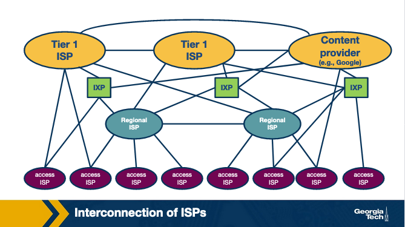
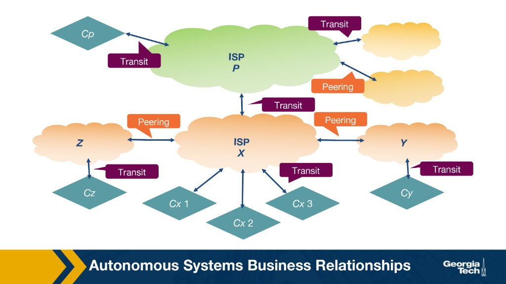
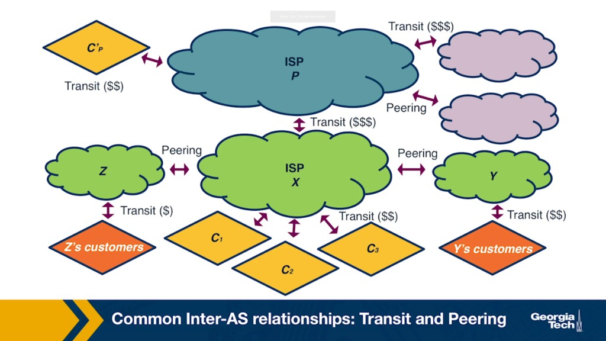
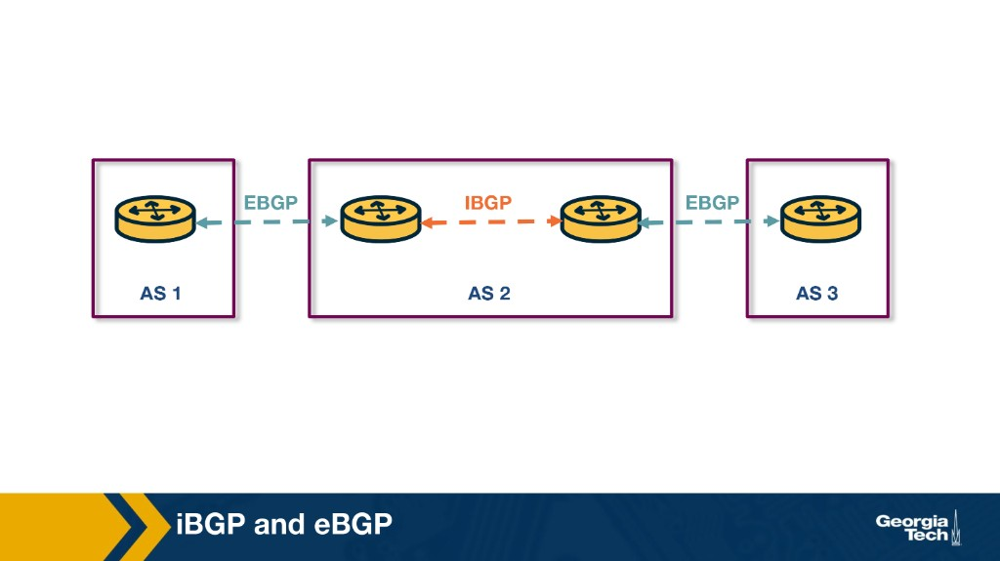
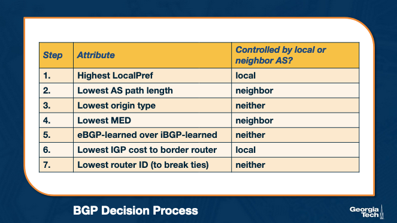
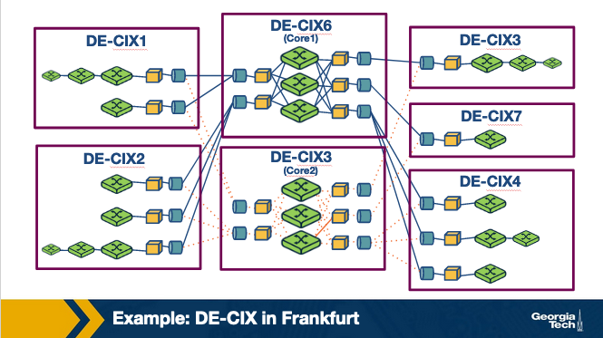
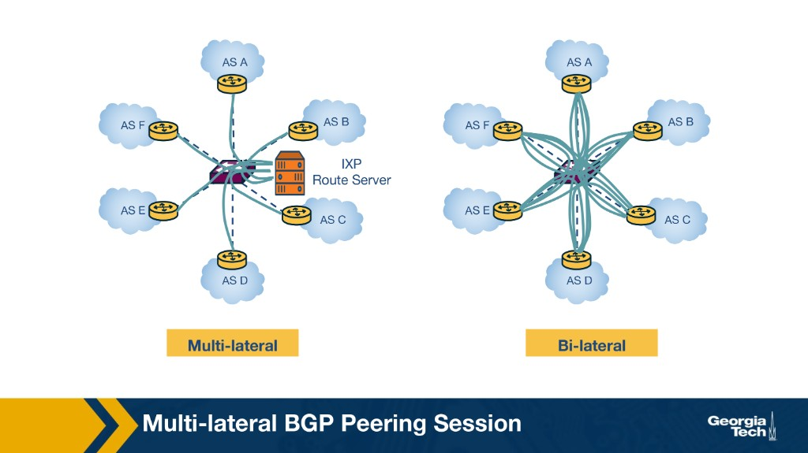

---
tags:
  - lesson-04
  - routing
  - bgp
  - plain-language
search:
  boost: 2
---

# Lesson 4: Interdomain Routing (BGP) — Plain-Language Guide

The simplest version of [Lesson 4](interdomain-routing.md). We explain ideas through **real trips on the Internet** — loading a show, paying your ISP, two companies swapping traffic for free. Inside-one-network routing is in [Lesson 3](../lesson-03/intradomain-routing.md). When you want exam tables and short answers, use the **[Quick Study Guide](quick-study-guide.md)** or the **[Quiz](quiz.md)**.

---

## Summary

The **Internet** is thousands of **separate networks** — Comcast, Google, your university, Netflix — each run by a different organization. **Inside** your network, routing finds a good path ([Lesson 3](../lesson-03/intradomain-routing.md)). **Between** networks, routing also follows **money and deals**. **BGP** (Border Gateway Protocol) is how networks tell neighbors *"I can reach these address blocks"* and pick which neighbor's path to use.

---

## The one-sentence version

BGP is how separate networks on the Internet tell each other what they can reach — and choose paths based on **who pays whom**, not just the shortest road.

---

## Scenario: you press play on Netflix

Your laptop does not "call Netflix" on one wire. Your request hops through several **organizations**:

```
Your laptop
  → home Wi‑Fi router
  → your ISP (e.g. Comcast)
  → maybe a regional ISP
  → maybe an Internet Exchange Point (IXP)
  → Netflix's network (CDN servers near you)
  → the show starts
```

Each hop might be a **different company**. Inside each company, routers use an **IGP** (like OSPF) — **hallways inside the building**. At the **edges**, **eBGP** picks **which neighbor's door** to use. **iBGP** spreads that external reachability **inside** the company like an **intercom**.

| Scope | Protocol | Plain English |
|-------|----------|---------------|
| **Inside one network** | **IGP** | Best path **inside our building** (hallways) |
| **Between networks** | **eBGP** | Which **neighbor's door** do we use to leave? |
| **Inside one network** | **iBGP** | Tell everyone **which exit** to use for outside destinations |

**Memory trick:** **IGP = hallways. eBGP = exit doors. iBGP = intercom.**



---

## Scenario: your monthly Internet bill

Your home ISP (Tier-3 **access** provider) does not own cables to every website on Earth. It **pays** a bigger **regional** or **global** provider to carry traffic to the rest of the Internet. That deal is **customer–provider transit**:

- **You pay** your ISP.
- **Your ISP pays** its upstream provider.
- The provider agrees to carry traffic **both ways** — your requests out, replies back in.

Like hiring a delivery company that can reach every address in the world, not just your block.

| Who | Role | Real example |
|-----|------|--------------|
| **Tier-1 ISP** | Global backbone; peers with other Tier-1s | AT&T, NTT — the "highways" |
| **Tier-2 ISP** | Regional; buys from Tier-1 | Country-wide provider |
| **Tier-3 / access** | Sells to homes and small businesses | Your cable or fiber company |
| **CDN** | Content company runs its **own** network | Netflix, Google — servers close to you |

**Peering** is different: two networks agree to swap traffic **without paying each other** — but only for routes they're allowed to share (usually their own customers and themselves, not everything they learned from others). Works when traffic is roughly balanced.

There **is** a BGP **handshake** at the border (**eBGP** session), but peering does **not** require the two sides to align **internal** policies. Each **Autonomous System** is **autonomous** — a black box to its peer.

| What peers negotiate (external) | What stays private (internal) |
|--------------------------------|------------------------------|
| Where to connect (IXP, cross-connect) | Which **IGP** (OSPF vs IS-IS) each uses |
| Link capacity (e.g. 100 Gbps) | How each routes traffic inside its own network |
| Which **prefixes** each may send | Switch vendors, congestion policies, TE inside the AS |
| Settlement-free terms (usually) | Anything behind the **exit door** |

**Postal analogy:** USPS and Canada Post agree to swap mail bags at a border dock at 5 PM — label format, bag size, schedule. USPS does **not** dictate which highways Canada Post uses inside Canada, or how Toronto sorts mail.

**Memory trick:** Peering negotiates the **exit doors**; whatever happens **inside the building** is private.

### Why the Internet is "flattening"

In the **old hierarchical** model, two neighboring local ISPs might send traffic **up** to a global Tier-1 backbone, pay a **transit** fee, and ride back **down** — even when the destination was next door.

**Direct peering** fixes that: two independent networks connect and exchange traffic **directly**, usually **settlement-free** (neither pays the other). **Private bridge** analogy — Town A and Town B swap mail over their own bridge instead of routing everything through a national sorting facility three states away.

**IXPs** scale peering: instead of hundreds of private cables, each network runs **one** high-capacity link into a local exchange and peers with anyone else plugged into the same fabric. When you stream Netflix, your ISP often reaches Netflix **at a nearby IXP** — not across the country through a backbone.

Result: faster paths, lower **latency**, lower **transit** bills — and a topology that is **less hierarchical** than it used to be.



---

## Scenario: Georgia Tech's network

An **Autonomous System (AS)** is one organization's network under **one set of rules** — one admin, one routing policy. It is **not** a single server, and **not** just an ID number.

| | **Server node** | **Autonomous System (AS)** |
|---|-----------------|---------------------------|
| **What** | One computer (or VM) running an app | Routers, switches, cables, data centers — an entire network |
| **Job** | Host a website, run a database | Route traffic inside the org and hand off to other networks at borders |
| **ID** | IP address (e.g. `8.8.8.8`) | **ASN** — Autonomous System Number (e.g. Google AS15169) |

**Memory trick:** If a server is one **desk**, an AS is the whole **corporate campus** — buildings, roads, and security gates.

- **Inside** campus: routers use an **IGP** to find paths between buildings ([Lesson 3](../lesson-03/intradomain-routing.md)).
- **At the border**: **border routers** talk **BGP** to Comcast, research networks, or peers.

One big company might run **several ASes** (different divisions, different policies). You get an **ASN** when your network is large enough to participate in global **BGP** — you apply through a regional registry (e.g. ARIN in North America). The ASN is the **business license**; the AS is the **actual network**.

### AS vs IXP — "who" vs "where"

| | **AS** | **IXP** |
|---|--------|---------|
| **What** | An independent **network** (the organization) | A **physical facility** where networks meet |
| **Analogy** | A corporation with its own campus | A **convention center** where corporations rent booths |
| **Exists without the other?** | Yes — Comcast is an AS whether or not it connects at an IXP today | Yes — an empty building does not create networks |

You do **not** get an AS because you rent space at an IXP. Order of operations: build a network → receive an **ASN** → optionally connect at an **IXP** to peer and save transit costs.

---

## Scenario: the rules of who tells whom

When a network learns a route, two questions matter for **money**:

1. **Export** — "Do I tell my neighbors about this route?"
2. **Import** — "If two neighbors both offer a path, which do I **prefer**?"

Think of it like a hotel concierge who only recommends certain exits:

| Route learned from | Tell who? | Why |
|--------------------|-----------|-----|
| **Customer** (pays you) | **Everyone** | You get paid to carry their traffic |
| **Peer** (free swap) | **Customers only** | Don't give free rides to other peers |
| **Provider** (you pay them) | **Customers only** | Same — no free transit for non-payers |

When picking between paths to the same destination, **prefer**:

```
Customer routes  >  Peer routes  >  Provider routes
```

**Key takeaway:** BGP paths are rarely the mathematically shortest. They follow **business rules**.



---

## Scenario: two routers on a long phone call

**BGP** is the default language at network borders. Two border routers open a **BGP session** — a long-lived **TCP** connection, like a phone line that stays open.

- They exchange **UPDATE** messages: "I can reach this block of addresses" or **withdraw** a route when it goes away.
- **KEEPALIVE** messages say "I'm still here."
- Destinations are **prefixes** (blocks of IP addresses), not single laptops.

Important attributes on each route:

| Attribute | Plain English |
|-----------|---------------|
| **AS-PATH** | List of AS numbers the route passed through — stops loops; shorter often wins |
| **NEXT-HOP** | IP of the next router toward the destination — usually a **border router** |

**Security came later.** BGP was built for **scale and policy**, not to stop lies. A mistaken or malicious announcement can redirect traffic worldwide. (Real example: misconfigured routes have briefly sent huge chunks of traffic to the wrong place.)

---

## Scenario: hallways, exit doors, and the intercom

These three are easy to mix up — they sound similar and must work together. Think of an **Autonomous System (AS)** as one **office building** owned by one company.

| Protocol | Where | Job | Analogy |
|----------|-------|-----|---------|
| **IGP** (OSPF, RIP, IS-IS) | **Inside** one AS | Find the best physical path between **internal** routers | **Hallways** — how to walk room to room inside the building |
| **eBGP** | **Between** different ASes | Border routers exchange reachability with neighbors; apply **business policy** | **Exit doors** — which neighbor's door do we use to leave? |
| **iBGP** | **Inside** one AS | Spread **externally learned** routes to all internal BGP routers | **Intercom** — *"To reach Google, use Exit Door A"* |

!!! warning "Exam point"
    **iBGP is NOT an IGP.** iBGP does **not** compute hop-by-hop paths through your network — it only **disseminates** which external prefixes exist and which **border router** (exit) to use.

### How they team up

When you send a packet to a destination **outside** your AS:

1. **iBGP** tells the router **which border router** (exit) to use for that prefix.
2. **IGP** finds the physical path **across the AS** to reach that border router.
3. **eBGP** at the border hands the packet off to the **neighboring AS**.

For destinations **inside** your AS, only the **IGP** is involved — no BGP needed for internal reachability.



**Memory trick:** **IGP = hallways. eBGP = exit doors. iBGP = intercom** (which exit for which outside destination).

---

## Scenario: picking which exit door

When several BGP routes reach the same prefix, routers compare them step by step (exam detail in the [full guide](interdomain-routing.md) and [quick study](quick-study-guide.md)). Two knobs you hear about constantly:

### LocalPref — you control **outbound** traffic

Set **inside your network**. **Higher number = more preferred exit.**

Example: Your company connects to both **Provider A** (cheap) and **Provider B** (backup). You set a **higher LocalPref** on A's routes → all internal routers send traffic out through A unless A is down.

Typical pattern: customer routes beat peer routes beat provider routes — encoded as higher LocalPref numbers.

### MED — neighbor hints about **inbound** traffic

**MED** (Multi-Exit Discriminator) is your **neighbor** saying: "Please send traffic **into** my network through **this** link." You may honor it or ignore it. Only compare MED from the **same** neighbor.

**Memory trick:** **LocalPref = your choice of exit. MED = their suggestion for entry.**



---

## Scenario: the network swap meet (IXP)

An **IXP** (Internet Exchange Point) is almost always a **massive, highly secure data center** — sometimes a campus of a few interconnected facilities in a major city. Inside, many networks plug in and exchange traffic **locally** — Paris-to-Paris traffic should not fly to Virginia and back.

### The IXP does not "route" traffic

This is a common mix-up. The organization that runs the IXP is **not** a giant middleman that receives Netflix's traffic, looks up the destination, and forwards it to Comcast.

Instead, the IXP provides a neutral **switching fabric** — essentially a huge, very high-speed Ethernet switch. **Routing decisions** are made by each participant's own **routers**; the IXP only provides the physical bridge.

| Who | What they do |
|-----|----------------|
| **IXP operator** | Building, power, security, shared **switch fabric**, port fees |
| **Participant AS** | Brings **routers**, runs **BGP**, decides who to peer with and which routes to accept |

What actually happens inside the building:

1. **Rent space** — ISPs, CDNs, and cloud providers rent racks in the IXP facility.
2. **Bring hardware** — each company installs its own enterprise **routers** in those racks.
3. **Plug in** — a fiber cable runs from each router to the IXP's central shared switch.
4. **Talk directly** — engineers configure their routers to exchange traffic **peer to peer** over that fabric.

**Memory trick:** The IXP is the **room and the tables**; the participants bring the **routers** that do the thinking.

### The convention center analogy

Think of an IXP like a huge convention center hosting a business networking event:

- The **convention center (IXP)** provides the building, security, air conditioning, and tables.
- The **businesses (ISPs, CDNs, cloud providers)** rent a booth and send representatives (**routers**).
- Staff do **not** negotiate deals or carry messages. Representatives talk **directly** across the tables to exchange goods (**data**).

So it **is** a central data center — but it works as a **neutral meeting ground**, not as one entity that manages Internet traffic.

Why networks join:

- **Cheaper** — peering often beats buying transit for heavy traffic between locals.
- **Faster** — shorter paths, lower delay.
- **Keep local traffic local.**

To join: get an **ASN**, bring a **BGP-capable router**, plug into the IXP switch, sign their agreement. You pay for the **port**; swapping traffic is usually settlement-free.



---

## Who shows up at the swap meet?

**CDNs** are one of the biggest reasons direct peering exploded. Peering is about **saving money** and cutting **lag** — so the companies that use it most move the most data.

| Who | Examples | Why they're there |
|-----|----------|-------------------|
| **CDNs** | Cloudflare, Akamai, Fastly | Store copies of sites and media **near users**. If your ISP peers with a CDN at an IXP, millions of websites load fast without crossing the global backbone. |
| **Streaming** | Netflix, YouTube, Twitch | Video eats more bandwidth than anything else. Netflix even ships **Open Connect** boxes into ISP data centers (or peers at IXPs) so your movie may travel only a few miles. |
| **Cloud giants** | AWS, Azure, Google Cloud, Meta, Apple | Apps, feeds, and sync traffic need low delay. Peering with mobile and home ISPs keeps heavy traffic off crowded transit paths. |
| **ISPs** | Comcast, AT&T, regional providers | It takes two to peer! If customers live on Netflix and YouTube, the ISP saves **transit fees** by connecting directly instead of paying a middleman. |

**Memory trick:** **Big data + lots of users → direct peering.** Content/cloud on one side; **ISPs** on the other.

---

## Scenario: one mailing list instead of 100 phone calls

At a big IXP, if every network set up BGP with every other network, connections grow explosively (100 networks → thousands of sessions).

A **route server** fixes that:

- Each member connects **once** to the route server.
- The server collects routes, applies **filters**, and gives each member a tailored view.
- **Data packets** still flow **directly** between members on the switch — the route server only handles **control** (BGP messages), not your Netflix stream.



---

## Scenario: when someone announces the wrong roads

BGP is powerful but fragile:

| Problem | What happens in real life |
|---------|---------------------------|
| **Misconfiguration** | One wrong UPDATE can spread globally; traffic takes a weird detour or black hole |
| **Route hijacking** | Someone claims to own an address block they don't — traffic can be steered to them |
| **Huge route tables** | Routers need more memory; decisions slow down |
| **Flapping routes** | A link up/down/up floods UPDATE messages |

Networks defend with **route filters**, **prefix limits**, **aggregation**, and **flap damping**. Fixes like **RPKI** help verify who really owns a prefix — adoption is slow.

**Key takeaway:** A BGP mistake in **one** network can affect **everyone**.

---

## The whole lesson on one napkin

```
You stream Netflix:  laptop → ISP → maybe IXP → CDN  (many organizations)

IGP = hallways | eBGP = exit doors | iBGP = intercom (NOT an IGP)

Inside one org:      IGP = internal paths only
Between orgs:        eBGP = learn/share routes at borders
Inside org (again):  iBGP = spread external routes — NOT a replacement for IGP

Deals:               Customer pays provider (transit) | Peering = limited free swap
Flattening:          Direct peering + IXPs bypass "up to Tier-1 and back down"
Money rules:         Export customers to all; peers/providers to customers only
                     Import: customer > peer > provider

BGP session:         Long TCP call; UPDATE + WITHDRAW; prefixes not single hosts
                     AS-PATH (loop check) | NEXT-HOP (border router)

Pick route:          LocalPref (your exit) → AS-PATH → … → IGP cost ("hot potato")
MED:                 Neighbor's hint for entry — optional

IXP:                 Switch fabric + colo — does NOT route for you
Who peers:           CDNs, streaming, cloud ↔ ISPs (save $, cut latency)
Route server:        One BGP session to many peers; data still goes direct
Risks:               Misconfig / hijack spreads fast; filters and RPKI help
```

---

## Where to go next

| You want… | Go here |
|-----------|---------|
| Full detail + all study questions | [Lesson 4 — full guide](interdomain-routing.md) |
| Exam tables & short answers | [Quick Study Guide](quick-study-guide.md) |
| Practice | [Lesson 4 Quiz](quiz.md) |
| Routing inside one network | [Lesson 3 — Intradomain Routing](../lesson-03/intradomain-routing.md) |
| Plain-language Lesson 3 | [Lesson 3 plain-language](../lesson-03/plain-language.md) |

---

**Bottom line:** BGP lets thousands of separate networks share reachability and pick paths based on **business deals and policy**, not just the shortest road — and IXPs plus route servers make that cooperation possible at global scale.
