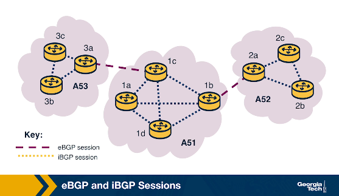

---
quiz:
  auto_number: True
  shuffle_answers: True
  disable_after_submit: False
tags:
  - lesson-04
  - routing
  - bgp
  - quiz
search:
  boost: 1.5
---

# Lesson 4: Interactive Quiz

Interdomain routing, BGP policy, business relationships, and IXPs. New to the material? Start with the [Plain-language guide](plain-language.md). See the [Quick Study Guide](quick-study-guide.md).

!!! info "Before you begin"
    <!-- mkdocs-quiz intro -->

---

## Module 4 exam questions

Official Module 4 quiz topics: Internet topology, AS relationships, BGP sessions, path selection, and IXPs. See the [Full guide](interdomain-routing.md) for narrative detail.

### Internet topology & autonomous systems

<quiz>
The Internet topology has been evolving to an increasingly prominent **hierarchical** structure.
- [ ] True
- [x] False

Historically the Internet was **hierarchical**, but IXPs and CDNs are pushing it toward a **flatter** topology — more networks peer directly instead of always riding up through large transit providers.
</quiz>

<quiz>
An **Autonomous System** operates across multiple administrative domains.
- [ ] True
- [x] False

An **AS** is routers and links under **one** administrative authority with one routing policy. One organization may run **multiple** ASes, but one AS does not span multiple admin domains.
</quiz>

<quiz>
For two ASes to form a **peering agreement**, they need to find common ground regarding the **internal policies and traffic engineering** approaches that each AS implements.
- [ ] True
- [x] False

Peering sets **border-level** BGP rules — where to connect, link capacity, which **prefixes** to exchange, usually settlement-free terms. Each AS remains **autonomous**: internal **IGP**, topology, and traffic engineering stay **private**. Peers treat each other as **black boxes** — the eBGP handshake negotiates **exit doors**, not hallways inside the building.
</quiz>

<quiz>
A **Content Distribution Network (CDN)** or an **ISP** can operate over multiple Autonomous Systems.
- [x] True
- [ ] False

One organization does not always mean one AS. A large ISP or CDN may run **multiple ASes** for business separation or traffic engineering.
</quiz>

### Import & export policy

*C1, C2, C3 are customers of ISP-X. ISP-P is a provider of ISP-X.*

<quiz>
**ISP-X** has the incentive to advertise routes for **C3** to **Y**.
- [x] True
- [ ] False

Routes learned from a **customer** (C3) are exported to **everyone** — customers, peers, and providers — because carrying that traffic generates **revenue**.
</quiz>

<quiz>
**ISP-X** has the incentive to advertise the routes for **P's customers** to **Y** and **Z**.
- [ ] True
- [x] False

Routes learned from a **provider** (P) are exported to **customers only**. Advertising provider routes to **peers** (Y, Z) would offer **free transit** between non-paying networks.
</quiz>

<quiz>
**AS-X** learns multiple routes for the same external destination **W** — from **C3** (customer), **Y** (peer), and **P** (provider). How does AS-X **rank** these routes before deciding which to import?
- [x] 1) route from C3, 2) route from Y, 3) route from P
- [ ] 1) route from Y, 2) route from C3, 3) route from P
- [ ] 1) route from P, 2) route from Y, 3) route from C3

Import preference reflects business relationships: **customer > peer > provider**. Keep customer traffic local; peers are settlement-free; provider transit is costly.
</quiz>

### eBGP vs iBGP sessions

*Course topology uses AS-A through AS-D with routers R-A1, R-B1, R-D2, etc. Same rules: **iBGP** within an AS, **eBGP** between ASes.*

<quiz>
Consider the topology and the types of BGP sessions the routers form. Select the **true** statements.
- [x] R-A1 ↔ R-A3 : iBGP
- [x] R-B1 ↔ R-A3 : eBGP
- [ ] R-B3 ↔ R-D2 : iBGP
- [ ] R-D3 ↔ R-D2 : eBGP

**iBGP** runs between routers in the **same AS** (R-A1 and R-A3). **eBGP** runs between border routers in **different ASes** (R-B1 in AS-B and R-A3 in AS-A). R-B3↔R-D2 crosses AS boundaries (eBGP, not iBGP); R-D3↔R-D2 is internal (iBGP, not eBGP).
</quiz>

<quiz>
Router **R-D2** learns about a route to a destination in **AS-A**. How does R-D2 disseminate this route to **R-D3** and **R-D1**?
- [x] Using iBGP
- [ ] Using eBGP
- [ ] Using IGP

External routes learned at a border router (via **eBGP**) are shared **inside** the AS via **iBGP** so all internal routers know which exit to use.
</quiz>

<quiz>
Router **R-D2** learns about a route to an **internal** destination in **AS-D**. How does R-D2 disseminate this route to **R-D3** and **R-D1**?
- [ ] Using iBGP
- [ ] Using eBGP
- [x] Using IGP

Paths between routers **within** one AS are computed by an **IGP** (OSPF, RIP, etc.). **iBGP** disseminates externally learned routes; it does not replace the IGP for internal destinations.
</quiz>

<quiz>
Router **R-B1** learns about a route to **AS-C**. How does R-B1 disseminate this route to **R-A3**?
- [ ] Using iBGP
- [x] Using eBGP
- [ ] Using IGP

R-B1 (AS-B) and R-A3 (AS-A) are in **different ASes**. Border routers exchange routes across AS boundaries via **eBGP**.
</quiz>

### BGP path selection

<quiz>
Since the BGP path selection process is **fixed**, an AS has **no control** over which routes are selected.
- [ ] True
- [x] False

The **comparison order** is fixed, but each AS controls the **attributes** the process evaluates — **LocalPref**, **MED**, import/export filters — to match financial and traffic-engineering goals.
</quiz>

<quiz>
**AS-B** learns about an external destination from both **AS-C** and **AS-A**. AS-B can prefer the route from AS-C by assigning a **higher LocalPref** to that route.
- [x] True
- [ ] False

**LocalPref** is set **inside your AS**. Higher values win step 1 of the decision process, controlling which **exit** is preferred for outbound traffic.
</quiz>

<quiz>
**AS-B** advertises routes to its internal destination to **AS-A** through **R-B1** and **R-B4**. AS-B can signal that it prefers **R-B1** as the entry point by assigning **lower MED** values to those routes.
- [x] True
- [ ] False

**MED** is a neighbor's hint for **inbound** entry. **Lower MED** is preferred (when other attributes tie). AS-B tags routes via R-B1 with lower MED so AS-A sends traffic in through R-B1.
</quiz>

<quiz>
An AS can use **LocalPref** to control **exit points** (outgoing traffic) and **MED** to control **entry points** (incoming traffic).
- [x] True
- [ ] False

**LocalPref** = your choice of outbound exit (higher wins). **MED** = neighbor's suggestion for where traffic should enter their network (lower wins if honored).
</quiz>

### IXPs & route servers

<quiz>
One service provided by **IXPs** is additional security protections such as mitigation of **DDoS** attacks.
- [x] True
- [ ] False

Many IXPs offer security services — notably **customer-triggered DDoS blackholing** — because they observe traffic to and from many participants.
</quiz>

<quiz>
There are **no costs** involved for an AS to participate at an **IXP**.
- [ ] True
- [x] False

Public peering traffic is typically **settlement-free** (not volume-priced), but participation still requires **port fees**, possible **membership** fees, and circuit costs to reach the exchange.
</quiz>

<quiz>
Since local traffic stays local at IXPs, IXP infrastructures deal with **limited** volumes of traffic.
- [ ] True
- [x] False

Large IXPs are major **traffic hubs** — daily volumes can be **comparable to Tier-1 ISPs**, with tens of thousands of active peering links.
</quiz>

<quiz>
When a large **provider** or **CDN** joins an IXP, this can act as an **incentive** for other networks to join as well.
- [x] True
- [ ] False

Major content providers at an IXP let others **peer directly** with high-traffic destinations, reducing **transit costs** and improving performance — a strong draw for new members.
</quiz>

<quiz>
At an IXP, members have the choice to peer **privately** or **publicly**.
- [x] True
- [ ] False

IXPs support **public peering** (shared fabric) and **private peering** (dedicated cross-connect between two participants).
</quiz>

<quiz>
IXPs' leading incentive to establish **route servers** was to **charge** participants for using them.
- [ ] True
- [x] False

Route servers are typically a **free** service that enables **low-friction multilateral peering** — one BGP session to reach many peers instead of a full bilateral mesh.
</quiz>

<quiz>
An IXP **route server** does **not** need to run the **BGP protocol** to facilitate multilateral peering sessions.
- [ ] True
- [x] False

A route server **collects BGP routes**, maintains RIBs, applies **import/export filters**, and **re-advertises** selected routes — all of which require running **BGP** on the control plane.
</quiz>

<quiz>
For **multilateral** BGP peering at an IXP, participants can advertise routes either **directly to other participants** or to the **route server**.
- [x] True
- [ ] False

Participants can use **bilateral** sessions with chosen partners **and** a **multilateral** session to the route server at the same time — data still flows directly on the IXP fabric.
</quiz>

---

## IGP vs BGP & autonomous systems

<quiz>
Which protocol family is primarily used for routing **between** autonomous systems on the Internet?
- [ ] OSPF
- [ ] RIP
- [x] BGP
- [ ] ARP

**IGP** protocols (OSPF, RIP) route **inside** one AS; **BGP** is the default **interdomain** protocol.
</quiz>

<quiz>
An **Autonomous System (AS)** is best defined as:
- [x] Routers and links under a single administrative authority with one routing policy
- [ ] Any home Wi-Fi network without an ASN
- [ ] Only Tier-1 ISP backbones
- [ ] A DNS zone file

Each AS has a unique **ASN** and runs **IGP** internally, **BGP** at borders.
</quiz>

<quiz>
At Internet scale, BGP exchanges reachability for [[prefixes]] (blocks of IP addresses), not individual hosts.
---
Destinations are advertised as CIDR prefixes (e.g., `203.0.113.0/24`).
</quiz>

---

## Business relationships

<quiz>
In a **customer–provider (transit)** relationship:
- [x] The customer pays the provider to reach the rest of the Internet in both directions
- [ ] Neither party pays; both share full routing tables freely
- [ ] Only outbound traffic is carried by the provider
- [ ] The provider learns routes only from peers, not customers

Transit is a **paid** relationship; the provider advertises reachability **both ways**.
</quiz>

<quiz>
In a typical **peering** agreement between two ASes:
- [x] Neither usually pays the other; routes shared are limited (often own customers only)
- [ ] The smaller AS always pays the larger AS per gigabyte
- [ ] Each peer must advertise routes learned from its providers to the other peer
- [ ] Peering always replaces the need for any transit provider

Advertising provider/peer routes to a peer would make you **free transit** — not allowed.
</quiz>

<quiz>
A common provider billing method that ignores the top 5% of bandwidth samples is the [[95th]] percentile model.
---
Providers sample utilization periodically; charge based on the 95th highest reading to ignore brief spikes.
</quiz>

---

## Import & export policy

<quiz>
An AS learns a route from a **customer**. Per standard export policy, it should advertise that route to:
- [x] Customers, peers, and providers (everyone)
- [ ] Customers only
- [ ] No one — customer routes stay private
- [ ] Peers only

Carrying customer traffic generates **revenue** — advertise widely.
</quiz>

<quiz>
An AS learns a route from a **peer** or **provider**. It should typically export that route to:
- [ ] Everyone including other peers and providers
- [x] Its own customers only
- [ ] No one
- [ ] Tier-1 ISPs only

Exporting peer/provider routes upward would provide **free transit** for non-paying networks.
</quiz>

<quiz>
When multiple neighbors advertise a route to the same destination, import preference is:
- [x] Customer routes > peer routes > provider routes
- [ ] Provider routes > peer routes > customer routes
- [ ] Shortest AS-PATH only — business relationships do not matter
- [ ] Random among equal-length paths

Interdomain routing reflects **policy and economics**, not just shortest path.
</quiz>

---

## BGP protocol basics

<quiz>
BGP sessions between peers run over:
- [x] TCP (reliable, semi-permanent connection)
- [ ] UDP only
- [ ] ICMP echo requests
- [ ] Raw Ethernet frames with no transport layer

BGP uses **TCP port 179** for session establishment and message exchange.
</quiz>

<quiz>
Which BGP message type informs a peer that a previously announced route is no longer available?
- [ ] OPEN
- [ ] KEEPALIVE
- [x] UPDATE (withdrawal)
- [ ] ACK

**UPDATE** messages can **announce** new/changed routes or **withdraw** unavailable ones.
</quiz>

<quiz>
The BGP attribute that lists AS numbers traversed and helps prevent routing loops is [[AS-PATH]] (or AS_PATH).
---
Each AS prepends its ASN as a route is exported; loops are detected if your own ASN appears in the path.
</quiz>

<quiz>
For external destinations, the BGP [[NEXT-HOP]] attribute typically identifies the border router interface toward the destination.
---
Internal routers forward to the border router; **IGP** finds the path across the AS to that next-hop.
</quiz>

---

## eBGP vs iBGP

<quiz>
**eBGP** sessions are established between:
- [x] Border routers in different autonomous systems
- [ ] All routers inside one AS only
- [ ] DNS servers and web caches
- [ ] End hosts and their default gateway

**eBGP** learns routes from **outside** neighbors.
</quiz>

<quiz>
**iBGP** inside an AS is primarily used to:
- [x] Disseminate externally learned routes to all internal BGP-speaking routers
- [ ] Replace OSPF for computing shortest internal paths
- [ ] Assign IP addresses to end hosts
- [ ] Encrypt packets at the network layer

**iBGP** distributes reachability; **IGP** still computes internal paths to the BGP next-hop.
</quiz>

<quiz>
A common iBGP scaling pattern within a large AS is a [[full mesh]] of sessions among BGP routers.
---
Each eBGP-speaking router typically maintains iBGP with every other BGP router in the AS (unless route reflectors are used — beyond core course scope).
</quiz>

---

## BGP path selection

<quiz>
In the BGP decision process, the **first** attribute compared (highest wins) is:
- [x] LOCAL_PREF (Local Preference)
- [ ] MED
- [ ] Router ID
- [ ] TCP port number

**LocalPref** is set by the **local AS** and controls **outbound** exit preference.
</quiz>

<quiz>
**LOCAL_PREF** is controlled by the [[local]] AS and influences which exit point is preferred for outbound traffic.
---
Higher LocalPref = more preferred. Typical ranges encode customer > peer > provider.
</quiz>

<quiz>
**MED (Multi-Exit Discriminator)** is primarily used to:
- [x] Suggest which interconnection point a neighbor prefers for inbound traffic into its AS
- [ ] Encrypt BGP sessions
- [ ] Replace AS-PATH for loop detection
- [ ] Set TCP window size on BGP peers

MED is a **suggestion** from the **neighbor** — the receiving AS may honor or ignore it.
</quiz>

<quiz>
When comparing MED values, they are only meaningful among routes from the [[same]] neighboring AS.
---
MED is not compared across different neighbors — only among multiple paths from one peer.
</quiz>

<quiz>
Step 6 of the BGP decision process (lowest IGP cost to NEXT-HOP) implements:
- [x] Hot potato routing — pick the closest egress border router
- [ ] Longest AS-PATH selection
- [ ] DNS load balancing
- [ ] TCP slow start

See [Lesson 3 hot potato](../lesson-03/intradomain-routing.md#hot-potato-routing) for the intradomain side.
</quiz>

<quiz>
In the standard BGP decision order, which comes **before** lowest MED?
- [x] Shortest AS-PATH
- [ ] Lowest router ID
- [ ] Lowest IGP cost to border
- [ ] eBGP over iBGP

Order: LocalPref → AS-PATH → origin type → MED → eBGP>iBGP → IGP cost → router ID.
</quiz>

---

## BGP challenges

<quiz>
A major operational risk with BGP misconfiguration is that:
- [x] Errors can propagate globally and cause instability far beyond one AS
- [ ] Only the misconfigured router is affected; neighbors ignore bad routes automatically
- [ ] BGP always authenticates every prefix announcement cryptographically by default
- [ ] Misconfigs are limited to the data plane and never affect routing tables

BGP was **not** designed with strong security; bad announcements can spread widely.
</quiz>

<quiz>
**Flap damping** is used to:
- [x] Suppress routes that change frequently (announce/withdraw churn)
- [ ] Increase BGP table size for redundancy
- [ ] Replace iBGP with OSPF
- [ ] Encrypt UPDATE messages

Damping trades **reachability** for **stability** when prefixes flap excessively.
</quiz>

---

## IXPs & route servers

<quiz>
An **Internet Exchange Point (IXP)** is:
- [x] Physical switching infrastructure where multiple ASes interconnect and exchange traffic locally
- [ ] A cloud CDN caching service only
- [ ] The BGP protocol itself
- [ ] A government agency that assigns IP addresses

~500 IXPs worldwide; participants peer via shared or private interconnects.
</quiz>

<quiz>
Without a route server, bilateral peering among N IXP participants requires how many BGP sessions in the worst case?
- [x] O(n²) — on the order of N(N−1)/2 pairwise sessions
- [ ] O(1) — one session total
- [ ] O(log n) — tree-shaped peering
- [ ] O(n) — one session per participant only

Full mesh bilateral peering does **not** scale — route servers reduce this to **O(n)** sessions.
</quiz>

<quiz>
A route server at an IXP handles:
- [x] Control plane (BGP route collection and redistribution with filters)
- [ ] All data-plane traffic between every participant (traffic must flow through the RS)
- [ ] DNS resolution for participant domains
- [ ] TCP congestion control for peering links

**Data traffic** flows **directly** between participants on the IXP fabric, not through the RS.
</quiz>

<quiz>
Which filter type on a route server checks whether member X is allowed to advertise prefix P?
- [x] Import filter
- [ ] Export filter only
- [ ] TCP checksum filter
- [ ] Spanning tree filter

**Import** filters validate what enters the master RIB; **export** filters control what each member receives.
</quiz>

---

<!-- mkdocs-quiz results -->

---

!!! tip "Keep studying"
    - [Plain-language guide](plain-language.md)
    - [Full Lesson 4 guide](interdomain-routing.md)
    - [Quick Study Guide](quick-study-guide.md)
    - [Lesson 3 — Intradomain routing](../lesson-03/intradomain-routing.md)
