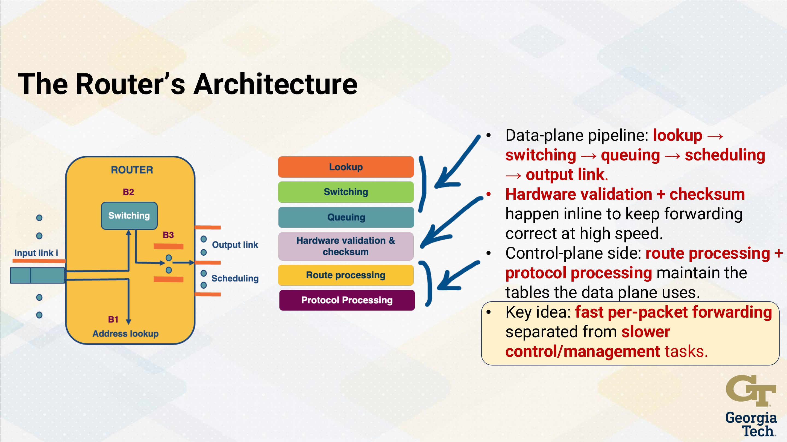
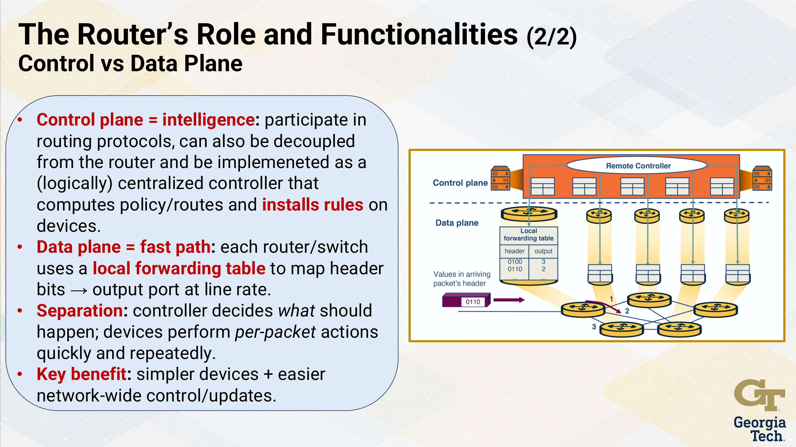
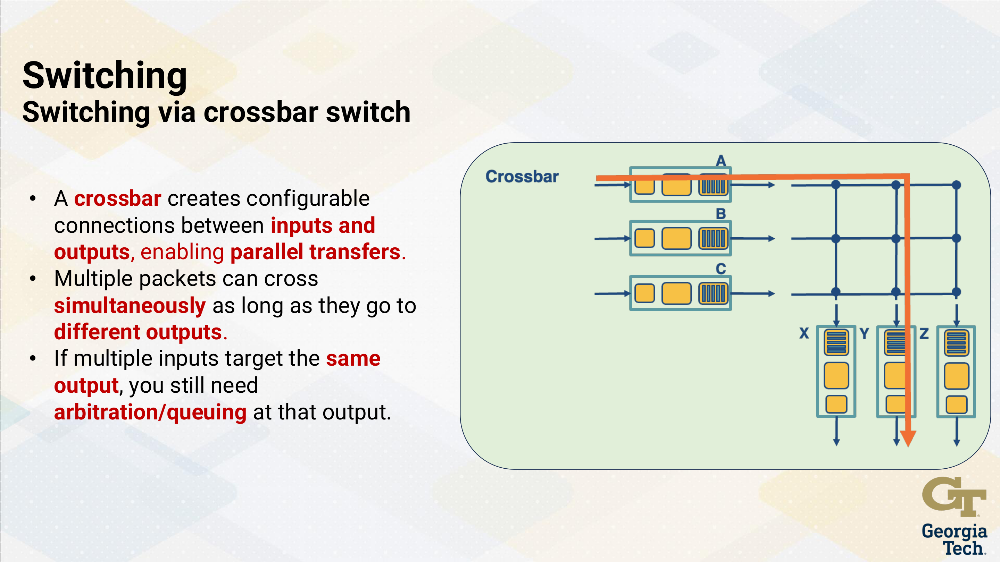
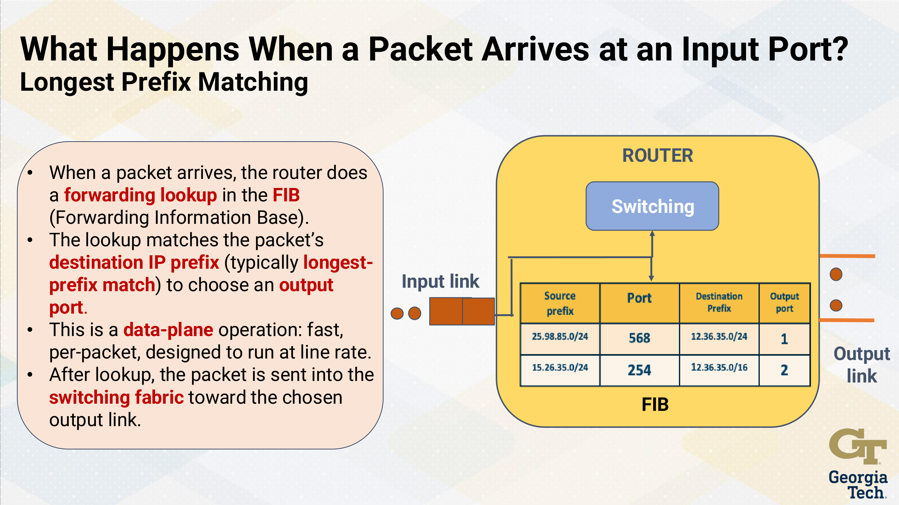
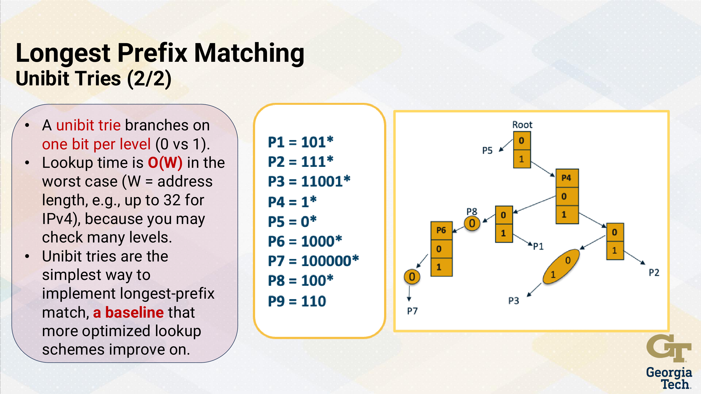
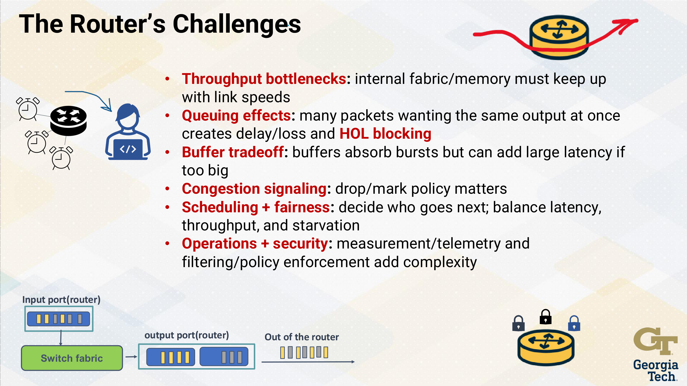

---
tags:
  - lesson-05
  - router-design
  - plain-language
search:
  boost: 2
---

# Lesson 5: Router Design (Part 1) — Plain-Language Guide

The simplest possible version of [Lesson 5](router-design-1.md). We explain ideas through **everyday situations** — sending a message, sorting mail, rush-hour traffic. Scheduling, QoS, and token buckets are in [Lesson 6](../lesson-06/router-design-2.md). When you want exam detail, use the **[Quick Study Guide](quick-study-guide.md)** or the **[Quiz](quiz.md)**.

---

## Summary

A **router** is the box that connects networks and forwards **packets** hop by hop. Every packet goes through a fast pipeline: **look up where it goes → move it inside the box → wait in line if needed → send it out the right port**.

Routers split work into two jobs. The **control plane** is the slow brain that builds the map (routing protocols, table updates). The **data plane** is the fast muscle that reads the map on every packet. Finding the right route uses **longest prefix match** — and **tries** are tree structures that make that search fast enough for wire speed.

---

## The one-sentence version

A router's data plane looks up each packet's destination, switches it across an internal fabric, queues it if the link is busy, and sends it out — while the control plane slowly builds the lookup table that tells it how.

---

## Scenario: you send a photo to a friend

Your phone uploads a photo. The packet leaves your Wi‑Fi, hits your home router, then your ISP's router, then more routers on the way to your friend.

**At each router, the same five steps happen:**

```
Packet arrives
    → Lookup: "Which port leads toward this destination?"
    → Switch: move it across the router's internal highway
    → Queue: wait if the outgoing link is busy
    → Schedule: pick which waiting packet goes next
    → Output: transmit on the wire
```

You never see any of this. It happens in **nanoseconds** per packet.

**Memory trick:** **Lookup → Switch → Queue → Schedule → Out.**



---

## Scenario: airport flight plan vs boarding gate

Think of a busy airport.

| | **Control plane** | **Data plane** |
|---|-------------------|----------------|
| **Who** | Airline ops center | Gate agents at each terminal |
| **Speed** | Slow — updates routes over minutes or hours | Fast — scan every boarding pass instantly |
| **Job** | Decide which flights exist and where they go | Move each passenger to the right gate |
| **In a router** | Runs OSPF/BGP, builds the forwarding table | Looks up destination → forwards the packet |

The ops center decides **what the map should say**. Gate agents **use** the map on every passenger without re-planning the whole airline.

**Key takeaways:**

- **Routing** = control plane (build the map). Same idea as [Lesson 3](../lesson-03/intradomain-routing.md).
- **Forwarding** = data plane (read the map per packet).
- In **SDN** (later lessons), the "ops center" can live on a separate controller — same split, more centralized.



---

## Scenario: what's inside the box?

When a packet hits a router, four parts do the work:

| Part | Everyday analogy | What it actually does |
|------|------------------|----------------------|
| **Input port** | Receiving dock | Gets bits off the wire; looks up destination in the **FIB** (Forwarding Information Base) |
| **Switching fabric** | Warehouse conveyor belt | Moves the packet from input to the right output |
| **Output port** | Loading dock | Buffers packets; sends them on the outgoing link |
| **Routing processor** | Back-office planner | Control plane — runs protocols, updates tables |

```
Packet in → [Input: lookup] → [Fabric] → [Output: queue + send] → next hop
                  ↑
           table built by control plane (OSPF, BGP, etc.)
```

---

## Scenario: rush hour inside the router

Imagine packets as cars trying to cross an intersection inside the router. Three designs for that intersection:

| Design | Real-life feel | Can multiple packets move at once? |
|--------|----------------|-------------------------------------|
| **Memory** | One-lane bridge — cars take turns copying through a shared lot | **No** — one at a time |
| **Bus** | Single shared road everyone drives on | **No** — bus is shared |
| **Crossbar** | Many lanes with a traffic light matrix | **Yes** — if they want different exits |

**Why it matters:** If the inside of the router is slower than the line speed, packets pile up → delay and drops. Only **crossbar** can move **multiple packets at once** (as long as they don't fight for the same output).



---

## Scenario: sorting mail by zip code

Routers don't store every IP address. They store **prefixes** — blocks like `192.168.1.0/24` (think "everything starting with these bits").

When a packet arrives, the router finds the **most specific matching prefix**. That's **longest prefix match (LPM)** — longest match wins.

**Real example:**

Your router's table says:

| Prefix | Means | Send out |
|--------|-------|----------|
| `10.0.0.0/8` | All addresses starting with `10.` | Port 1 |
| `10.1.0.0/16` | All addresses starting with `10.1.` | Port 2 |

A packet to `10.1.2.3` matches **both** rules. The `/16` is more specific → **Port 2**.

**Postal analogy:** A letter to "90210-1234" matches both "902xx" and "90210-xxxxx." The longer, more specific zip wins.

**Why it's hard:** At 40 Gbps, the router might get only **1–2 memory lookups** per packet — not time to scan a whole phone book.



---

## Scenario: the phone tree at customer service

How do routers search millions of prefixes that fast? With a **trie** (say "try") — a tree where each branch is a bit of the address.

**Unibit trie — one question at a time:**

Like a phone tree: "Press 0 or 1. Press 0 or 1. Press 0 or 1…" — one bit per step, up to **32 steps** for IPv4. Along the way, remember the **last valid prefix** you passed. That's your longest match.

**Problem:** 32 steps is too many at wire speed.

**Multibit trie — ask several bits at once:**

"Press 00, 01, 10, or 11" — jump **several bits per level** (the **stride**). Fewer steps = faster. But each node is bigger (more empty slots) = more memory.

| Approach | Speed | Memory |
|----------|-------|--------|
| **Unibit** | Up to 32 memory trips | Lean |
| **Multibit** | Fewer trips | Fatter nodes |

**Prefix expansion — when a short rule doesn't fit the stride:**

Suppose the stride is 2 bits but you have a rule for `11*`. You stretch it into `1100*`, `1101*`, `1110*`, `1111*`. If an expanded copy **collides** with a more-specific real entry, **drop the expanded copy** — the specific rule wins.

**Memory trick:** Unibit = **one question at a time**. Multibit = **multiple-choice at each level**. Prefix expansion = **stretch short rules to fit the quiz format**.



---

## Scenario: why your company got a /22 instead of a whole Class B

Old **classful** addressing gave you Class A, B, or C — often way too much or too little. **CIDR** (Classless Inter-Domain Routing) fixed that.

| Old problem | CIDR fix |
|-------------|----------|
| Company needs 500 addresses, gets 65,000 (Class B) | Give them exactly `/22` (~1,000 addresses) |
| Every small network gets its own table entry | **Aggregation** — combine many small blocks into one bigger announcement |

**Slash notation cheat sheet:**

| Slash | Mask (example) | Plain English |
|-------|----------------|---------------|
| `/24` | `255.255.255.0` | First 24 bits = network |
| `/16` | `255.255.0.0` | First 16 bits = network |
| `/8` | `255.0.0.0` | First 8 bits = network |

`/n` = first **n** bits identify the network block.

---

## Scenario: why routers are so hard to build

Four everyday pressures that show up in real networks:

| Pressure | What you notice | Why engineers care |
|----------|-----------------|-------------------|
| **Lookup speed** | Everything feels fine until it doesn't | 900k+ prefixes, nanoseconds per packet |
| **Memory type** | — | DRAM too slow; SRAM fast but tiny; TCAM fast but power-hungry |
| **Fabric throughput** | Internal jam even when links look idle | Inside must keep up with **all ports combined** |
| **Hot destinations** | One viral video hammers the same path | A few prefixes carry most traffic → caching helps |

**Traffic facts that shape design:**

1. **Bursty** — Netflix at 8pm isn't the average; routers need buffers for spikes.
2. **Small packets** — a flood of tiny packets means lookups/sec matter as much as Gbps.
3. **Uneven prefix lengths** — rules range from `/8` to `/32`; algorithms must handle all of them.



---

## The whole lesson on one napkin

```
You send a photo → every router: Lookup → Switch → Queue → Schedule → Out

Control plane = slow brain (builds the map via OSPF, BGP)
Data plane = fast muscle (reads the map per packet)

Inside the box: input ports | fabric | output ports | routing processor

Rush hour inside: memory (1 lane) | bus (1 lane) | crossbar (many lanes)

Mail sorting = longest prefix match (/16 beats /8)

Phone tree = trie lookup; multibit = fewer questions per level
Prefix expansion = stretch short rules; drop collisions

CIDR = right-sized address blocks + aggregation
```

---

## Where to go next

| You want… | Go here |
|-----------|---------|
| Full detail + study Q&A | [Lesson 5 — full guide](router-design-1.md) |
| Exam tables & short answers | [Quick Study Guide](quick-study-guide.md) |
| Practice | [Lesson 5 Quiz](quiz.md) |
| Scheduling, HOL, token bucket | [Lesson 6 — Part 2](../lesson-06/router-design-2.md) |
| How tables get built | [Lesson 3 — routing](../lesson-03/intradomain-routing.md) |

---

**Bottom line:** Routers forward at wire speed using a fast data-plane pipeline and trie-based longest-prefix lookup, while the control plane slowly installs the rules that make each lookup correct.
