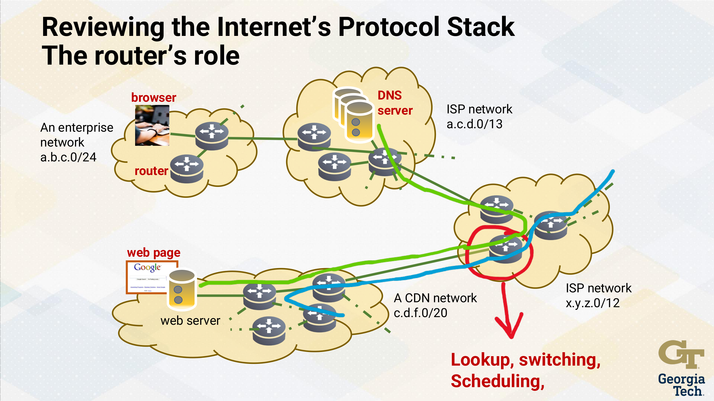
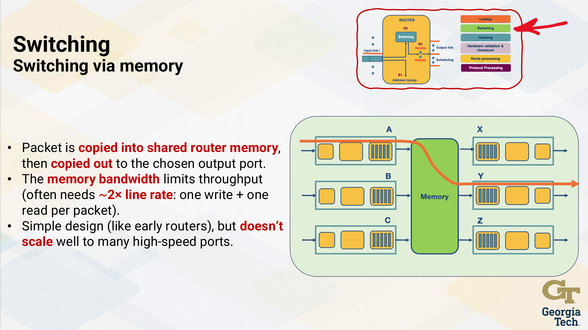
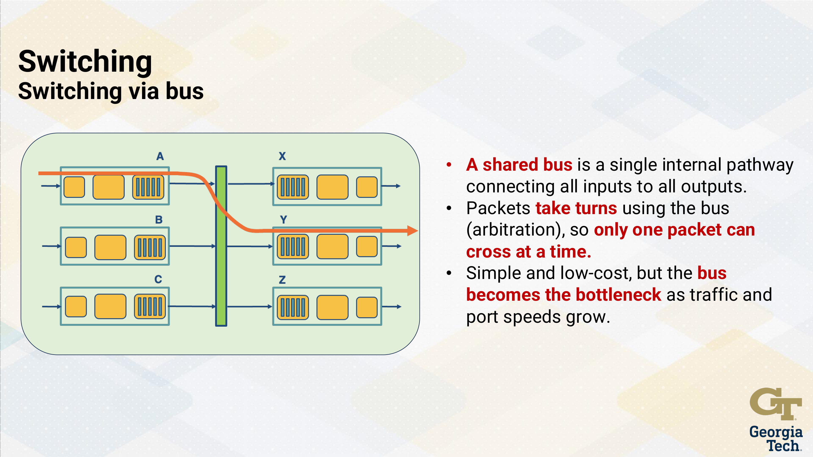
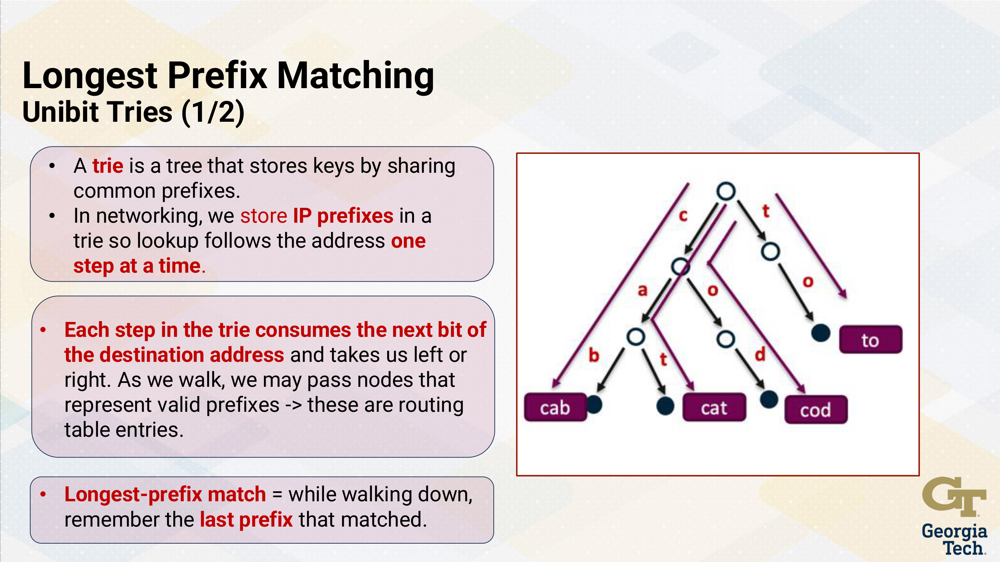
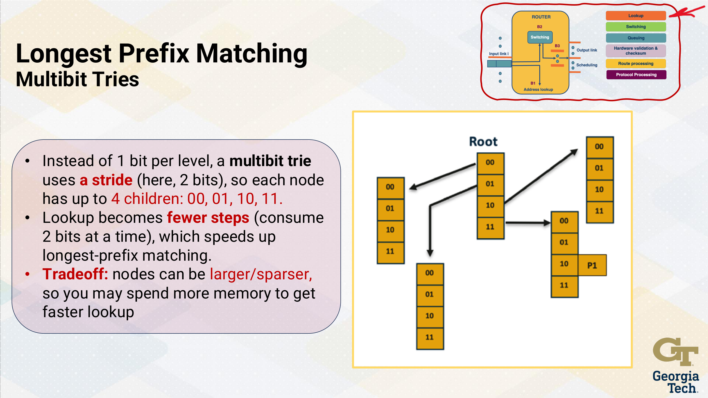
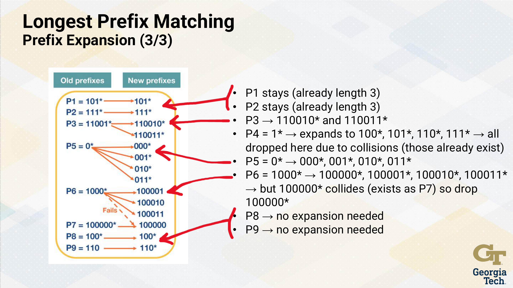

---
tags:
  - lesson-05
  - router-design
---

# Lesson 5: Router Design and Algorithms (Part 1)

Router architecture, control vs data plane, switching fabrics, and longest-prefix match (tries). Continues in **[Lesson 6](../lesson-06/router-design-2.md)** (packet classification, scheduling, rate control).

!!! tip "Exam prep"
    New to the material? Start with the **[Plain-language guide](plain-language.md)** — plain-language explanations and analogies. Need a condensed review? See the **[Quick Study Guide](quick-study-guide.md)** — tables, memory aids, and high-yield questions with short answers. For interactive practice, try the **[Lesson 5 Quiz](quiz.md)**.

---

## Learning Objectives

By the end of this module you should be able to:

1. **Explain what's inside a router** and how a packet moves through it — router components; control plane vs data plane; lookup → switching → queuing/scheduling → output.
2. **Compare how routers move packets internally** and why traffic jams happen — memory/bus/crossbar switching; contention/buffering; delay, loss, throughput limits.
3. **Explain how routers choose the "best match" route quickly** — longest-prefix matching; tries (unibit/multibit); prefix expansion; LPM efficiency.
4. **Explain how routers share link capacity fairly and smooth bursty traffic** — HOL blocking; VOQ + crossbar scheduling; policing vs shaping; token bucket/leaky bucket *(covered in [Lesson 6](../lesson-06/router-design-2.md))*.

### Roadmap

Router architecture → data vs control plane → lookup & LPM (tries) → switching fabrics (memory/bus/crossbar) → queuing, scheduling & HOL/VOQ → classification + QoS → traffic shaping/policing (token & leaky bucket)

---

## The Router's Role

Consider a browser in an enterprise network (`a.b.c.0/24`) requesting a web page from a CDN server (`c.d.f.0/20`). The request crosses an ISP network (`x.y.z.0/12`) through a **router** that performs:

- **Lookup** — match destination prefix in the FIB (Forwarding Information Base)
- **Switching** — move the packet across the internal fabric
- **Scheduling** — decide which packet goes next when outputs contend
- **Output** — transmit on the chosen link

The router sits at the **network layer** of the Internet protocol stack, connecting hosts across different networks.

{ width="700" }

---

## The Router's Challenges

| Challenge | Description |
|-----------|-------------|
| **Throughput bottlenecks** | Internal fabric/memory must keep up with link speeds |
| **Queuing effects** | Many packets wanting the same output creates delay/loss and HOL blocking |
| **Buffer tradeoff** | Buffers absorb bursts but add large latency if too big |
| **Congestion signaling** | Drop/mark policy matters for end-to-end behavior |
| **Scheduling + fairness** | Decide who goes next; balance latency, throughput, starvation |
| **Operations + security** | Measurement/telemetry and filtering/policy add complexity |

{ width="700" }

---

## Control Plane vs Data Plane

**Two planes:**

- **Control plane** = intelligence. Participates in routing protocols (OSPF, BGP). Can be decoupled from the router and implemented as a (logically) centralized controller (SDN) that computes policy/routes and installs rules on devices.
- **Data plane** = fast path. Each router uses a local **forwarding table** to map header bits → output port at **line rate**.

**Separation:** The controller decides what should happen; devices perform per-packet actions quickly and repeatedly. Key benefit: simpler devices + easier network-wide control/updates.

{ width="700" }

### Router Components

| Component | Role |
|-----------|------|
| **Input ports** | Terminate physical + link layer; perform FIB lookup to pick output port; control packets may go to routing processor |
| **Switching fabric** | Internal "network inside the router" — moves packets from inputs to outputs |
| **Output ports** | Buffer packets from fabric; transmit on outgoing link (link + physical functions) |
| **Routing processor** | Control plane — runs protocols, maintains tables, management |

---

## What Happens When a Packet Arrives?

The data-plane pipeline: **lookup → switching → queuing → scheduling → output**.

### 1. Lookup (Longest Prefix Match)

When a packet arrives, the router does a forwarding lookup in the **FIB**:

- Match the packet's destination IP prefix (typically **longest-prefix match**) to choose an output port.
- Data-plane operation: fast, per-packet, designed to run at line rate.
- Routers store **prefixes** (e.g., `/24`, `/16`), not individual IP addresses. If multiple prefixes match, choose the **most specific** (longest) match.

{ width="700" }

### 2. Switching

After lookup, the packet crosses the **switching fabric** — the router's internal backplane:

- If multiple inputs want the same output simultaneously → **arbitration** → packets may wait (internal contention).
- Goal: move packets fast enough that internal switching doesn't become the bottleneck.

### 3. Queuing

After switching, packets may wait in buffers because outputs transmit at a fixed rate:

- Queues form when arrival rate > service rate (even briefly during bursts).
- Queuing adds **delay**; if buffers fill → **loss** (drops).
- Routers keep **multiple queues per output** (by traffic class or flow), not just one FIFO — enables QoS and fairness.

### 4. Scheduling

A **scheduler** chooses the next packet across queues (priority, weighted, or fair scheduling), trading off latency, throughput, and starvation risk.

### Router Architecture Summary

{ width="700" }

Hardware validation and checksum happen inline. Control-plane side: route processing + protocol processing maintain the tables the data plane uses.

---

## Switching Fabrics

### Switching via Memory

Packet copied into shared router memory, then copied to the output port. Memory bandwidth limits throughput (~2× line rate needed: one write + one read per packet). Simple early design; doesn't scale to many high-speed ports. **One packet at a time.**

{ width="700" }

### Switching via Bus

Shared bus connects all inputs to outputs. Packets take turns (arbitration) — only **one packet crosses at a time**. Simple and low-cost; bus becomes bottleneck as port speeds grow.

{ width="700" }

### Switching via Crossbar

Configurable connections between inputs and outputs enable **parallel transfers**. Multiple packets cross simultaneously if they go to **different outputs**. If multiple inputs target the same output → arbitration/queuing at that output. **Can send multiple packets in parallel.**

{ width="700" }

---

## Longest Prefix Matching and Tries

### Unibit Tries

A **trie** stores keys by sharing common prefixes. For IP routing, lookup follows the address one bit at a time:

- Each step consumes the next bit → left (0) or right (1).
- While walking, remember the **last valid prefix** encountered (longest-prefix match).
- Worst case: **O(W)** steps where W = address width (32 for IPv4).

{ width="700" }

{ width="700" }

### Multibit Tries

Instead of 1 bit per level, use a **stride** (e.g., 2 bits) → each node has up to 4 children: `00`, `01`, `10`, `11`. Fewer steps = faster lookup. **Tradeoff:** nodes are larger/sparser → more memory.

{ width="700" }

### Prefix Expansion

With multibit tries, prefixes don't always align with the stride. **Prefix expansion** replaces shorter prefixes with equivalent longer ones:

- Example (stride = 2): `11*` → `1100*`, `1101*`, `1110*`, `1111*`
- **Benefit:** fast table indexing per stride
- **Cost:** more entries + more memory

**3-bit stride example** — expand every prefix to a length that's a multiple of 3. If an expanded prefix collides with an existing more-specific entry, **drop the expanded copy** (more-specific wins):

| Prefix | Original | After Expansion |
|--------|----------|-----------------|
| P1 | `111*` (len 3) | stays |
| P2 | `111*` (len 3) | stays |
| P3 | `11001*` (len 5) | `110010*`, `110011*` (len 6) |
| P4 | `1*` (len 1) | `100*`, `101*`, `110*`, `111*` → **all dropped** (collisions) |
| P5 | `0*` (len 1) | `000*`, `001*`, `010*`, `011*` |
| P6 | `1000*` (len 4) | `100000*`, `100001*`, `100010*`, `100011*` → `100000*` **dropped** (exists as P7) |
| P7 | `100000*` | no expansion needed |
| P8, P9 | — | no expansion needed |

{ width="700" }

---

## What are the basic components of a router?

A router consists of four main components:

1. **Input ports** — Perform physical-layer reception, data-link-layer processing, and forwarding table lookup to determine the output port.
2. **Switching fabric** — Connects input ports to output ports; transfers packets from input to output.
3. **Output ports** — Store packets received from the switching fabric and perform data-link-layer and physical-layer transmission.
4. **Routing processor (Control plane)** — Executes routing protocols, maintains routing tables, computes forwarding tables, and handles network management functions.

---

## Explain the forwarding (or switching) function of a router

The forwarding function transfers a packet from an input port to the appropriate output port. When a packet arrives at an input port:

1. The input port extracts the destination IP address from the packet header.
2. It performs a **longest prefix match** lookup in the forwarding table.
3. The lookup result identifies the output port.
4. The packet is sent through the **switching fabric** to that output port.

This is a **data plane** operation that must happen at line rate (nanoseconds per packet).

---

## What are the functionalities performed by the input and output ports?

**Input ports:**

- **Line termination** — Physical-layer bit reception.
- **Data link processing** — Frame decapsulation, error checking.
- **Lookup and forwarding** — Destination IP lookup in the forwarding table using longest prefix match.
- **Queuing** — If the switching fabric is slower than the aggregate input rate, packets queue at the input.

**Output ports:**

- **Queuing and buffer management** — Store packets waiting to be transmitted; apply scheduling and drop policies.
- **Data link processing** — Frame encapsulation for the outgoing link.
- **Line termination** — Physical-layer bit transmission.

---

## What is the purpose of the router's control plane?

The control plane is responsible for:

- **Running routing protocols** (OSPF, BGP) to exchange reachability information with other routers.
- **Computing forwarding tables** based on routing protocol information.
- **Network management** — Responding to SNMP queries, handling configuration commands.
- **Software-based processing** — Unlike the data plane (hardware-based, per-packet), the control plane operates at slower timescales.

---

## What tasks occur in a router?

1. **Lookup** — Determine the output port for each packet using longest prefix match.
2. **Switching** — Transfer packets from input to output ports via the switching fabric.
3. **Queuing** — Buffer packets at input and/or output ports when contention occurs.
4. **Header validation and checksum** — Verify IP header integrity; update TTL and recompute checksum.
5. **Route processing** — Run routing protocols, update routing/forwarding tables.
6. **Scheduling** — Decide which queued packet to transmit next.

---

## List and briefly describe each type of switching. Which, if any, can send multiple packets across the fabric in parallel?

1. **Switching via memory** — The oldest approach. Packets are copied to the routing processor's memory, looked up, then copied to the output port. Limited by memory bandwidth; only **one packet at a time**.

2. **Switching via bus** — Packets are transferred from input to output over a shared bus. The input port labels the packet with the output port; all ports see the packet, but only the labeled port accepts it. Limited by **bus bandwidth**; only **one packet at a time**.

3. **Switching via crossbar (interconnection network)** — A matrix of 2N buses connecting N inputs to N outputs. Multiple input-output pairs can transfer simultaneously as long as no two packets go to the same output. **Can send multiple packets in parallel.**

---

## What are two fundamental problems involving routers, and what causes these problems?

1. **Bandwidth and speed growing faster than processing capability** — As link speeds increase (100 Gbps+), routers must perform lookups and switching at increasingly high rates. The lookup problem arises because longest prefix match is more complex than simple exact match.

2. **Routing table size growth** — The Internet routing table contains 900,000+ prefixes and continues to grow. This makes lookup tables larger and lookups potentially slower, stressing memory and processing resources.

---

## What are the bottlenecks that routers face, and why do they occur?

1. **Lookup speed** — Longest prefix match requires searching through a large number of variable-length prefixes at line rate. Each packet must be looked up in nanoseconds.
2. **Memory access speed** — DRAM is too slow for line-rate lookups; SRAM is fast but expensive and limited in capacity. TCAM is fast but power-hungry.
3. **Switching fabric throughput** — If the fabric can't keep up with aggregate input rates, packets queue and may be dropped.
4. **Output port contention** — Multiple input ports may need to send to the same output port simultaneously, causing queuing and potential head-of-line blocking.

---

## Convert between different prefix notations (dot-decimal, slash, and masking)

**Example:** The prefix `192.168.1.0/24`

- **Slash notation (CIDR):** `192.168.1.0/24` — the `/24` means the first 24 bits are the network portion.
- **Dot-decimal with mask:** Address `192.168.1.0`, Mask `255.255.255.0`
- **Binary mask:** `11111111.11111111.11111111.00000000`

**Conversion rules:**

- `/n` means the first n bits are 1s in the mask.
- `/24` → mask = `255.255.255.0` (24 ones followed by 8 zeros).
- `/16` → mask = `255.255.0.0`.
- `/20` → mask = `255.255.240.0` (20 ones → first two octets all 1s, third octet = `11110000` = 240).

---

## What is CIDR, and why was it introduced?

**CIDR (Classless Inter-Domain Routing)** is an addressing scheme that replaces the old classful addressing (Class A/B/C) with **variable-length prefixes**.

**Why it was introduced:**

- **Address exhaustion** — Classful addressing wasted huge numbers of addresses (e.g., a Class B gave 65,536 addresses even if only 1,000 were needed).
- **Routing table explosion** — Without CIDR, the routing table would grow unmanageably large.
- **Route aggregation** — CIDR enables **supernetting** — combining multiple smaller prefixes into a single larger prefix, reducing routing table size.

With CIDR, prefixes can be any length (e.g., `/20`, `/22`), not just `/8`, `/16`, or `/24`.

---

## Name 4 takeaway observations around network traffic characteristics. Explain their consequences.

1. **Traffic is bursty** — Network traffic arrives in bursts rather than at a smooth rate. Routers need sufficient buffer space and must handle peak rates, not just averages.

2. **Most packets are small** — A large fraction of Internet packets are small (e.g., TCP ACKs at 40 bytes). This means lookup rate (packets/second) matters more than raw bandwidth for router design.

3. **The distribution of prefix lengths is non-uniform** — Most prefixes are /24, but there's a range from /8 to /32. Lookup algorithms must handle variable-length prefixes efficiently.

4. **A small number of prefixes carry most of the traffic** — Popular destinations (e.g., Google, Netflix) receive the majority of traffic. Caching frequently used forwarding entries can significantly improve performance.

---

## Why do we need multibit tries?

**Unibit tries** examine one bit of the prefix at a time, requiring up to 32 memory accesses for a single IPv4 lookup (one per bit). At line rate (e.g., 40 Gbps), a lookup must complete in ~10 ns, which may allow only 1-2 memory accesses.

**Multibit tries** examine multiple bits at each node, reducing the trie depth and the number of memory accesses required. For example, a stride of 4 bits reduces maximum depth from 32 to 8 levels.

---

## What is prefix expansion, and why is it needed?

Prefix expansion is the process of **expanding shorter prefixes to match the stride length** of a multibit trie. Since multibit tries examine a fixed number of bits at each level, all prefixes at a given level must have the same length.

**Example:** With a stride of 4 bits, a 2-bit prefix like `01*` must be expanded into all 4-bit prefixes that start with `01`: `0100`, `0101`, `0110`, `0111`. Each expanded prefix maps to the same next-hop as the original.

**Why needed:** Multibit tries require all prefixes at each level to have uniform length. Without expansion, shorter prefixes can't be stored at the correct trie level.

---

## Perform a prefix lookup given a list of pointers for unibit tries, fixed-length multibit tries, and variable-length multibit tries

**Unibit trie lookup:**

- Start at the root. Examine bits of the destination address one at a time.
- At each node, follow the left child (0) or right child (1) based on the current bit.
- Record the last prefix match encountered along the path.
- When a leaf is reached or no further match exists, return the last recorded match.

**Fixed-length multibit trie lookup:**

- Same principle but examine multiple bits (stride) at each level.
- At each node, use the next `s` bits of the address as an index into an array of $2^s$ children.
- Record prefix matches along the way; return the longest match.

**Variable-length multibit trie lookup:**

- Different levels may have different stride lengths, optimized to minimize memory or lookup time.
- At each node, the stride determines how many bits to examine.
- Lookup proceeds similarly, using the variable stride at each level.

---

## Perform a prefix expansion. How many prefix lengths do old prefixes have? What about new prefixes?

**Old prefixes** can have **any number of prefix lengths** (e.g., prefixes of length 1, 3, 5, 7, etc. — whatever the original routing table contains).

After expansion to match the trie stride, **new prefixes** have only as many distinct lengths as there are **levels in the trie**. For example, with a fixed stride of 8 bits on IPv4, there are only 4 possible prefix lengths: 8, 16, 24, 32.

**Expansion example (stride = 3):** See the [3-bit stride table](#prefix-expansion) above. Key rules:

- Append bits to reach the next multiple of the stride length.
- If an expanded prefix **collides** with an existing more-specific entry, **drop the expanded copy**.
- P4 (`1*`) expands to four prefixes but all collide with existing entries → all dropped.
- P6 expansion of `100000*` collides with P7 → dropped.

---

## What are the benefits of variable-stride versus fixed-stride multibit tries?

**Fixed-stride:**

- Simpler to implement — every level has the same stride.
- May waste memory on sparse levels (large arrays with many empty entries).

**Variable-stride:**

- **Memory optimization** — Smaller strides on sparse levels, larger strides on dense levels.
- **Fewer memory accesses** — Can use larger strides where the trie is dense, reducing depth.
- **Flexibility** — Different subtrees can have different strides tailored to the prefix distribution.
- Trade-off: More complex to implement and manage.
