---
tags:
  - lesson-05
  - router-design
---

# Lesson 5: Router Design and Algorithms (Part 1)

Router architecture, control vs data plane, switching fabrics, and longest-prefix match (tries). Continues in **[Lesson 6](../lesson-06/router-design-2.md)** (packet classification, scheduling, rate control).

!!! info "Reference"
    **Module 5&6 Part 1 Summary Video** (transcript + slides on Canvas). Textbook: Kurose & Ross **Ch. 4.2** (What's Inside a Router?), **4.3** (IPv4 addressing), **4.4** (SDN forwarding). Optional depth: Varghese *Network Algorithmics* Ch. 2.3, 4.6–4.9; IP address lookup survey (Canvas readings).

!!! tip "Exam prep"
    New to the material? Start with the **[Plain-language guide](plain-language.md)** — plain-language explanations and analogies. Need a condensed review? See the **[Quick Study Guide](quick-study-guide.md)** — tables, memory aids, and high-yield questions with short answers. For interactive practice, try the **[Lesson 5 Quiz](quiz.md)**.

---

## Learning Objectives

By the end of this module you should be able to:

1. **Explain what's inside a router** and how a packet moves through it — router components; control plane vs data plane; lookup → switching → queuing/scheduling → output.
2. **Compare how routers move packets internally** and why traffic jams happen — memory/bus/crossbar switching; contention/buffering; delay, loss, throughput limits.
3. **Explain how routers choose the "best match" route quickly** — longest-prefix matching; tries (unibit/multibit); prefix expansion; LPM efficiency.
4. **Explain how routers share link capacity fairly and smooth bursty traffic** — HOL blocking; VOQ + crossbar scheduling; policing vs shaping; token bucket/leaky bucket *(covered in [Lesson 6](../lesson-06/router-design-2.md))*.

### Roadmap

Router architecture → data vs control plane → lookup & LPM (tries) → switching fabrics (memory/bus/crossbar) → queuing, scheduling & HOL/VOQ → classification + QoS → traffic shaping/policing (token & leaky bucket)

---

## The Router's Role

Consider a browser in an enterprise network (`a.b.c.0/24`) requesting a web page from a CDN server (`c.d.f.0/20`). The request crosses an ISP network (`x.y.z.0/12`) through a **router** that performs:

- **Lookup** — match destination prefix in the FIB (Forwarding Information Base)
- **Switching** — move the packet across the internal fabric
- **Scheduling** — decide which packet goes next when outputs contend
- **Output** — transmit on the chosen link

The router sits at the **network layer** of the Internet protocol stack, connecting hosts across different networks.

{ width="700" }

---

## The Router's Challenges

Routers face scaling pressure from three directions:

1. **Bandwidth and Internet population scaling** — more devices, more traffic from new applications, and faster links (e.g., optical) that push higher volumes through each router.
2. **Services at high speeds** — QoS, attack/failure protection, measurement, and security must run at line rate, not just basic forwarding.

| Challenge | Description |
|-----------|-------------|
| **Throughput bottlenecks** | Internal fabric/memory must keep up with link speeds |
| **Queuing effects** | Many packets wanting the same output creates delay/loss and HOL blocking |
| **Buffer tradeoff** | Buffers absorb bursts but add large latency if too big |
| **Congestion signaling** | Drop/mark policy matters for end-to-end behavior |
| **Scheduling + fairness** | Decide who goes next; balance latency, throughput, starvation |
| **Operations + security** | Measurement/telemetry and filtering/policy add complexity |

{ width="700" }

### Four fundamental bottleneck categories

| Category | Problem | Why it hurts |
|----------|---------|--------------|
| **Longest prefix matching** | Destinations grouped into prefixes; LPM is harder than exact match | Table size + variable-length prefixes stress lookup speed |
| **Service differentiation** | QoS/security requires **packet classification** beyond destination | More complex per-packet decisions at line rate |
| **Switching limitations** | Crossbar adds parallelism but introduces **HOL blocking** and scheduling complexity | Internal interconnect becomes the bottleneck |
| **Service bottlenecks** | Performance guarantees, measurement, security at wire speed | Control/data plane overhead scales with link speed |

### Router bottlenecks — causes and sample solutions

| Bottleneck | Cause | Sample solution |
|------------|-------|-----------------|
| **Exact lookups** | Link speed scaling | Parallel hashing |
| **Prefix lookups** | Link speed scaling; prefix DB size scaling | Compressed multibit tries |
| **Packet classification** | Service differentiation; link speed/size scaling | Decision tree algorithms; hardware parallelism (CAMs) |
| **Switching** | Optical–electronic speed gap; HOL blocking | Crossbar switches; virtual output queues (VOQ) |
| **Fair queueing** | Service differentiation; link/memory scaling | WFQ; deficit round robin; DiffServ |
| **Internal bandwidth** | Scaling internal bus speeds | Reliable striping |
| **Measurement** | Link speed scaling | Juniper DCU |
| **Security** | Attack volume/intensity scaling | Traceback (Bloom filters); worm signature extraction |

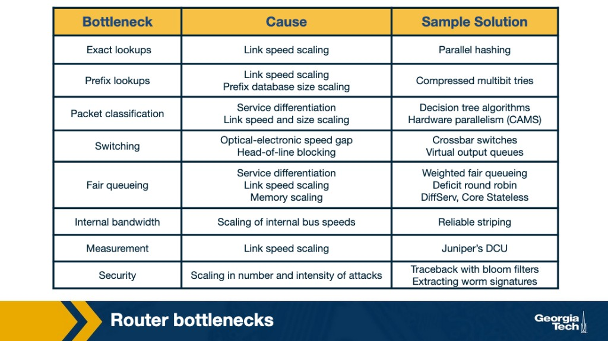{ width="700" }

!!! abstract "Takeaway"
    Bottlenecks span **lookup**, **classification**, **switching**, **queueing**, **measurement**, and **security** — each driven by link-speed scaling and growing table/state size. Part 1 focuses on prefix lookups and switching; Part 2 ([Lesson 6](../lesson-06/router-design-2.md)) covers classification, scheduling, and rate control.

---

## Control Plane vs Data Plane

A router's main job is to implement **forwarding** (data plane) and **routing/control** (control plane) functions.

**Two planes:**

- **Control plane** = intelligence. Participates in routing protocols (OSPF, BGP). Computes and maintains forwarding tables. Implemented in **software** on the **routing processor** (traditional routers). Can be decoupled and implemented as a (logically) centralized **remote controller** (SDN) that installs rules on devices.
- **Data plane** = fast path. Each router uses a local **forwarding table** to map header bits → output port at **line rate**. Implemented in **hardware** at input ports and the switching fabric.

**Separation:** The controller decides what should happen; devices perform per-packet actions quickly and repeatedly. Key benefit: simpler devices + easier network-wide control/updates.

!!! warning "Exam point"
    In a **traditional router**, data plane = **hardware**; control plane = **software**. The **data plane** operates on a **shorter timescale** (nanoseconds per packet) than the control plane (protocol timers, topology changes).

{ width="700" }

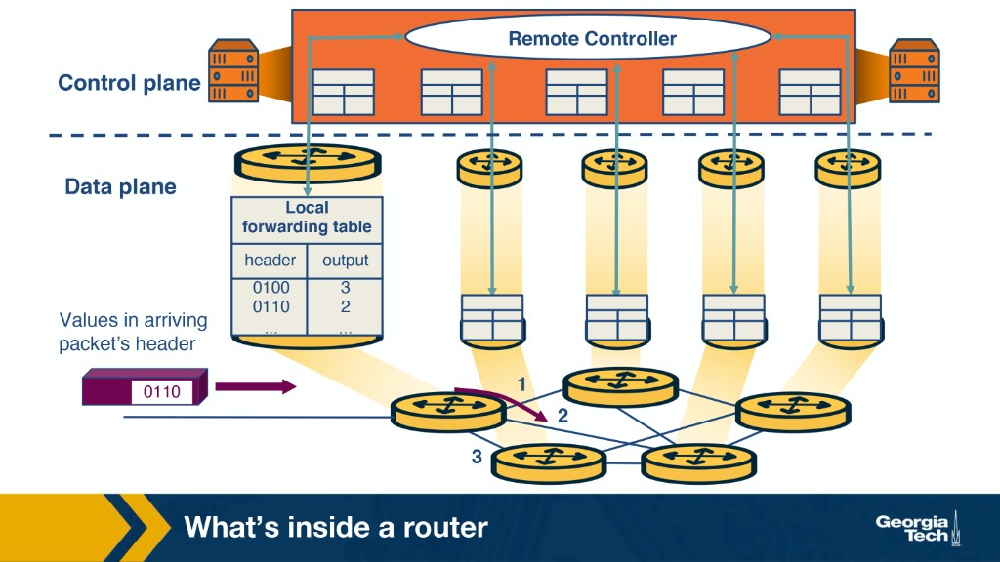{ width="700" }

### Router Components

| Component | Role |
|-----------|------|
| **Input ports** | Terminate physical + link layer; perform FIB lookup to pick output port; control packets may go to routing processor |
| **Switching fabric** | Internal "network inside the router" — moves packets from inputs to outputs |
| **Output ports** | Buffer packets from fabric; transmit on outgoing link (link + physical functions) |
| **Routing processor** | Control plane — runs protocols, maintains tables, management |

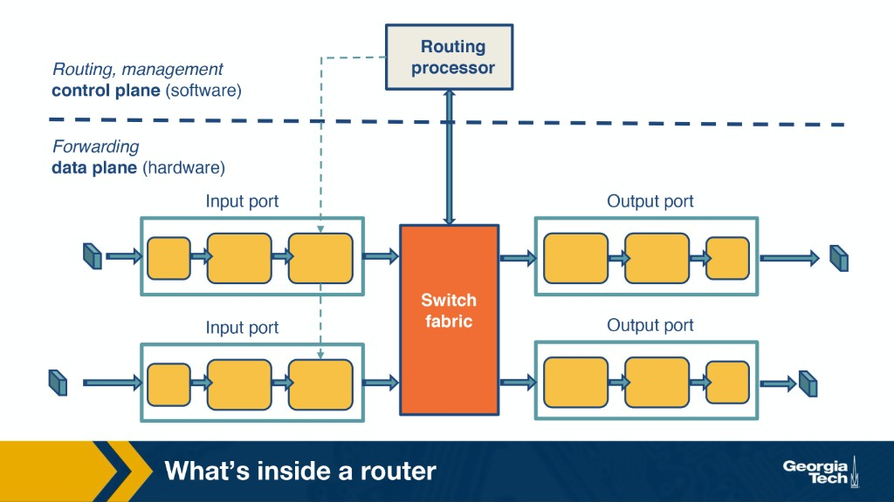{ width="700" }

### Input port pipeline

Left to right on an **input port**:

1. **Line termination** — physical-layer reception on the incoming link
2. **Data link processing** — frame decapsulation (protocol-specific)
3. **Lookup, forwarding, queuing** — consult the forwarding table (FIB) for longest-prefix match; queue if the switching fabric is busy

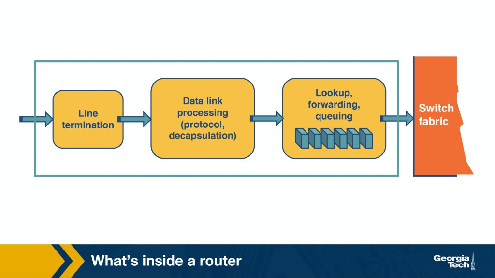{ width="700" }

### Output port pipeline

Left to right on an **output port**:

1. **Queuing (buffer management)** — hold packets waiting for the outgoing link
2. **Data link processing** — frame encapsulation for the outgoing link
3. **Line termination** — physical-layer transmission

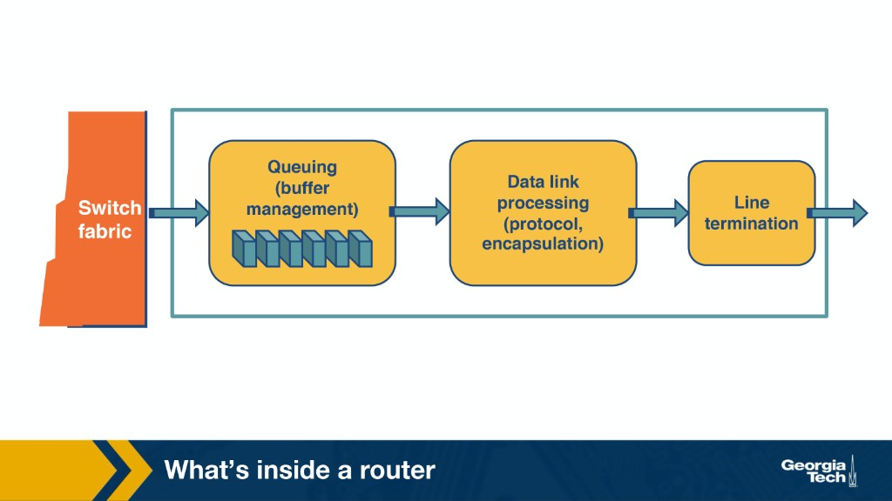{ width="700" }

### Time-sensitive vs control-plane tasks

The **Model of a Router** diagram classifies seven router functions by timescale:

| Function | Plane | Timescale |
|----------|-------|-----------|
| **Lookup** | Data | Per-packet (ns) |
| **Switching** | Data | Per-packet (ns) |
| **Queuing** | Data | Per-packet (ns) |
| **Hardware validation & checksum** | Data | Per-packet (inline) |
| **Route processing** | Control | Protocol timers |
| **Protocol processing** (SNMP, ICMP, TCP/UDP management) | Control | Slow |
| **Fragmentation, redirects, ARP** | Mixed / control-heavy | Slower than forwarding |

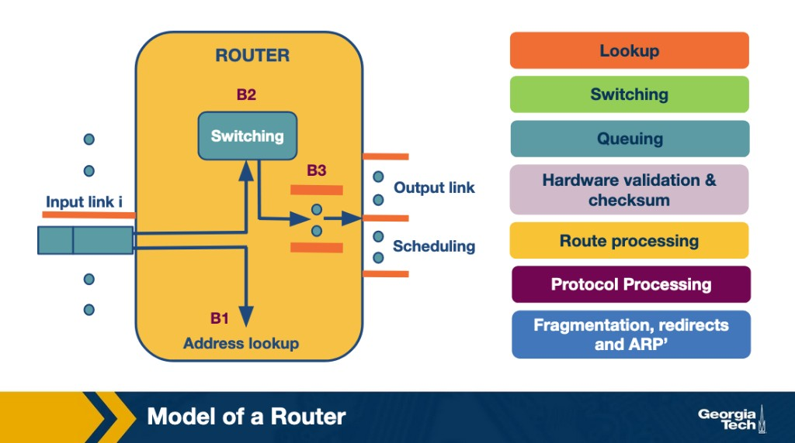{ width="700" }

!!! tip "Canvas practice quiz"
    Classify common operations: **computing paths via a protocol**, **running protocols to build a routing table**, **running Spanning Tree**, and **configuring a middlebox** → **control plane**. **Forwarding at Layer 3**, **switching across the fabric**, **decrementing TTL**, **recomputing checksum**, and **forwarding per installed middlebox rules** → **data plane**.

---

## What Happens When a Packet Arrives?

The data-plane pipeline: **lookup → switching → queuing → scheduling → output**.

### 1. Lookup (Longest Prefix Match)

When a packet arrives, the router does a forwarding lookup in the **FIB**:

- Match the packet's destination IP prefix (typically **longest-prefix match**) to choose an output port.
- Data-plane operation: fast, per-packet, designed to run at line rate.
- Routers store **prefixes** (e.g., `/24`, `/16`), not individual IP addresses. If multiple prefixes match, choose the **most specific** (longest) match.

{ width="700" }

### 2. Switching

After lookup, the packet crosses the **switching fabric** — the router's internal backplane:

- If multiple inputs want the same output simultaneously → **arbitration** → packets may wait (internal contention).
- Goal: move packets fast enough that internal switching doesn't become the bottleneck.

### 3. Queuing

After switching, packets may wait in buffers because outputs transmit at a fixed rate:

- Queues form when arrival rate > service rate (even briefly during bursts).
- Queuing adds **delay**; if buffers fill → **loss** (drops).
- Routers keep **multiple queues per output** (by traffic class or flow), not just one FIFO — enables QoS and fairness.

### 4. Scheduling

A **scheduler** chooses the next packet across queues (priority, weighted, or fair scheduling), trading off latency, throughput, and starvation risk.

### Router Architecture Summary

{ width="700" }

Hardware validation and checksum happen inline. Control-plane side: route processing + protocol processing maintain the tables the data plane uses.

---

## Switching Fabrics

### Switching via Memory

Packet copied into shared router memory, then copied to the output port. Memory bandwidth limits throughput (~2× line rate needed: one write + one read per packet). Simple early design; doesn't scale to many high-speed ports. **One packet at a time.**

{ width="700" }

### Switching via Bus

Shared bus connects all inputs to outputs. When an input port receives a packet, it attaches an **internal header** designating the output port and places the packet on the shared bus. **All output ports** see the packet, but only the designated port keeps it (internal header removed on accept). The routing processor does **not** intervene per packet (unlike memory switching). Only **one packet crosses at a time** — bus bandwidth caps router throughput.

{ width="700" }

### Switching via Crossbar (Interconnection Network)

A **crossbar** connects $N$ input ports to $N$ output ports using $2N$ buses (horizontal + vertical). **Crosspoints** at intersections are configured to connect a specific input to a specific output — e.g., input A → output Y closes the crosspoint where their buses meet. Configurable connections enable **parallel transfers**: A→Y and B→X can happen simultaneously. If multiple inputs target the **same output** → arbitration/queuing at that output. **Only crossbar can send multiple packets across the fabric in parallel.**

{ width="700" }

---

## Prefix-Match Lookups

**Prefix-match lookup** is the core forwarding operation: given a packet's destination IP, find the **longest matching prefix** in the FIB and return the output port. Routers cannot store every host address — they **group** destinations into **prefixes** for scalability. **CIDR** (1993) replaced classful fixed-length prefixes with **variable-length** prefixes, shrinking tables but introducing **longest-prefix match (LPM)**.

### Prefix notation

| Notation | Example | Meaning |
|----------|---------|---------|
| **Dot decimal + wildcard** | `132.234` → binary `1000010011101010*` | `*` = remaining bits don't matter |
| **Slash (CIDR)** | `132.238.0.0/16` | First **16** bits define the prefix |
| **Mask** | `123.234.0.0` + mask `255.255.0.0` | Mask `255.255.0.0` = first 16 bits matter (same as `/16`) |

### Why better lookup algorithms?

Every forwarded packet needs a lookup before switching. Design is constrained by three factors:

| Factor | Constraint |
|--------|------------|
| **Lookup speed** | Must run at **line rate**; cost dominated by **memory accesses** |
| **Memory** | Fast SRAM/TCAM vs slow/cheap DRAM — trade capacity for speed |
| **Update time** | Unstable BGP/multicast can force add/delete/replace in **milliseconds** |

### Traffic observations → design inferences

Measurement studies motivate prefix-lookup algorithm design:

| # | Observation | Inference |
|---|-------------|-----------|
| 1 | ~250,000 concurrent flows in backbone | **Caching works poorly** in backbone routers |
| 2 | ~50% of packets are TCP ACKs (~40 bytes) | **Wire-speed lookup** needed for small packets (packets/sec, not just Gbps) |
| 3 | Lookup dominated by memory accesses | Lookup speed ≈ **number of memory accesses** |
| 4 | Prefix lengths range /8–/32 | Naive schemes can require **~24 memory accesses** |
| 5 | ~150,000+ prefixes (growing toward 500k–1M) | Tables must scale without proportional slowdown |
| 6 | Unstable BGP, multicast | Updates must complete in **ms to seconds** |
| 7 | Higher line speeds need SRAM | **Minimize memory** — SRAM is fast but expensive/limited |
| 8 | IPv6 adoption delayed | **32-bit IPv4 lookups** remain critical for years |

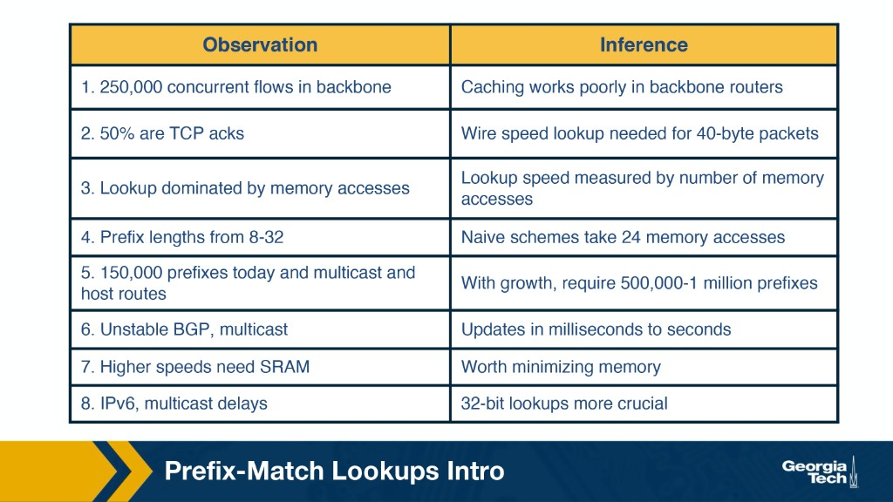{ width="700" }

!!! tip "Exam prep"
    Four **takeaway** observations from the module: (1) many concurrent flows → caching fails in backbones; (2) lookup speed is dominated by **memory access count**; (3) unstable routing → **fast table updates** matter; (4) **SRAM vs DRAM** memory tradeoff drives trie/TCAM design.

---

## Longest Prefix Matching and Tries

### Example prefix database (P1–P9)

The course uses this nine-prefix database throughout trie examples (same prefixes as **Practice Quiz 5-2**):

| Prefix | Pattern |
|--------|---------|
| **P1** | `101*` |
| **P2** | `111*` |
| **P3** | `11001*` |
| **P4** | `1*` |
| **P5** | `0*` |
| **P6** | `1000*` |
| **P7** | `100000*` |
| **P8** | `100*` |
| **P9** | `110` (compressed one-way branch — see below) |

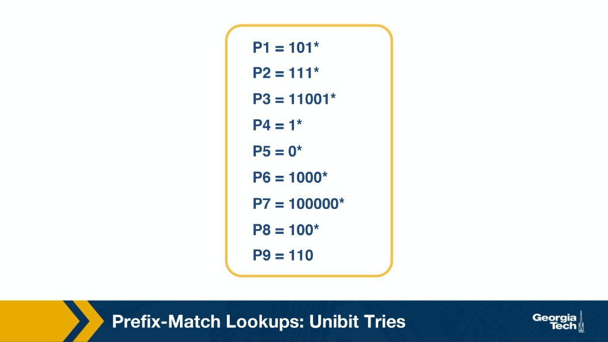{ width="500" }

### Unibit Tries

A **unibit trie** is the simplest prefix-lookup structure: each node has a **0-pointer** and a **1-pointer**. From the root, the 0-pointer leads to prefixes starting with `0`, the 1-pointer to prefixes starting with `1`. Each additional level allocates the next bit of the prefix.

**Constructing the trie:** Build subtrees by following shared prefix bits. Prefixes that are **substrings** of longer prefixes are stored **on the path** to the more specific entry — e.g., **P4** (`1*`) sits on the path toward **P2** (`111*`).

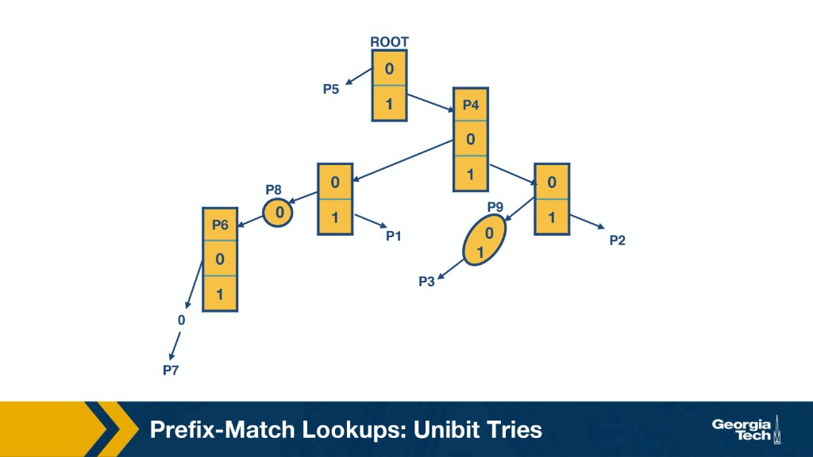{ width="700" }

**Tracing prefixes into the trie (insertion paths):**

| Prefix | Path from root (bit by bit) |
|--------|----------------------------|
| **P1** `101*` | 1 → 0 → 1 |
| **P7** `100000*` | 1 → 0 → 0 → 0 → 0 → 0 |
| **P3** `11001*` | 1 → 1 → 0 → (P9: `01`) |

**Longest-prefix match algorithm:**

1. Start at the **root** and trace the trie following the packet's destination address bits.
2. At each node, record any **valid prefix** stored along the path.
3. Continue until lookup **fails** (empty pointer or no matching child).
4. Return the **last valid prefix** recorded — that is the longest match.

**Example lookups** (same table as Practice Quiz 5-2):

| Destination starts with | Last prefix on path | Match |
|-------------------------|---------------------|-------|
| `111…` | P2 `111*` | **P2** |
| `101…` | P1 `101*` | **P1** |
| `11001…` | P3 `11001*` | **P3** (beats P4 `1*` on the shared `1…` path) |
| `10*` (2 bits only) | P4 `1*` | **P4** — not P8 or P1 (see below) |

- Worst case: **O(W)** steps where W = address width (32 for IPv4).
- Lookup speed ≈ **number of memory accesses** (one per trie level).

**Node shapes: squares vs compressed ovals**

In the course P1–P9 diagram, node shape tells you how lookup proceeds:

| Shape | Role | At lookup |
|-------|------|-----------|
| **Square** | Normal branching node | Has both a **0-pointer** and a **1-pointer** — read one bit and choose 0 or 1 |
| **Oval (P9)** | **Compressed one-way branch** | No real choice — you must match the whole compressed string (e.g. `01`) at once; mismatch → lookup fails |

**Why separate them visually?** Squares are branching decisions; ovals are forced multi-bit steps. Do not treat **P9** like a normal 0/1 node — you match its label in one step, not bit-by-bit.

**Why P3 compresses:** **P3** = `11001*`. After matching `110`, the only remaining bits are `0` then `1`, and **no other prefix** in the database shares that intermediate path. Without compression, the trie would waste two square nodes that each have only one pointer. Those **one-way branches** collapse into oval **P9** (label `01`) on the path to P3 — four empty pointers become zero.

**Where prefixes are stored**

A prefix is stored at the node where **its own bits end** — not at every node you pass through on the way there.

**Why `10*` returns P4, not P8 or P1:**

- **P8** = `100*` (3 bits) and **P1** = `101*` (3 bits) — you need a **third** bit to reach either.
- Lookup for `10*` (only 2 bits consumed):

```
root
 └─1─► square node   ← P4 stored here ("1*" matches — record it)
         └─0─► square node   ← NO prefix stored (path "10" only)
                               P8 lives at 100… (one level deeper)
                               P1 lives at 101… (one level deeper)
```

After 2 bits, the last prefix recorded is **P4** (`1*`). If the address were `100…`, you would trace one more `0` and record **P8**; if `101…`, record **P1**. But `10*` alone never gets that far.

!!! warning "Exam point"
    **`10*` → P4**, not P8 or P1. Shorter prefixes on the path win when lookup stops before a deeper stored prefix is reached.

### Practice: nodes a–h (Canvas quiz)

Blue nodes store prefixes; white nodes are internal (no stored prefix). **Return the last blue node reached** — the longest prefix matched so far.

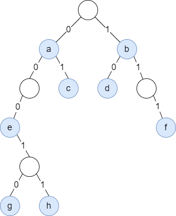{ width="600" }

| Stored prefix | Node | Lookup trace |
|---------------|------|--------------|
| `0*` | **a** | bit 0 → **a** |
| `1*` | **b** | bit 1 → **b** |
| `01*` | **c** | 0 → a, then 1 → **c** |
| `00*` | **a** | 0 → **a**, then 0 → white (no prefix); last match **a** (`0*`) |
| `0000*` | **e** | 0 → a, 0 → white, 0 → **e**, 0 → fail; last match **e** |
| `00011*` | **h** | 0 → a, 0 → white, 0 → e, 1 → white, 1 → **h** |

!!! warning "Exam point"
    When a lookup walks past a stored prefix into a **white** (non-storing) node and then fails, return the **last blue node** — not the white node. That is why `00*` returns **a**, not a node at path `00`.

!!! info "Reference"
    Varghese, *Network Algorithmics* §11.4; IP address lookup survey (Canvas readings).

{ width="700" }

{ width="700" }

### Multibit Tries

**Why multibit?** A unibit trie may need up to **32 memory accesses** for IPv4. At ~60 ns DRAM latency, worst case ≈ **1.92 μs** per lookup — too slow for high-speed links. A **multibit trie** checks **k bits per step** (the **stride**), giving each node up to **$2^k$** children and reducing trie depth.

| Type | Description |
|------|-------------|
| **Fixed-length stride** | Same stride **k** at every level |
| **Variable-length stride** | Different **k** per level — tune memory vs speed per subtree |

{ width="700" }

!!! info "Reference"
    Varghese, *Network Algorithmics* §11.5.

### Controlled prefix expansion

Multibit tries only index **k bits at a time**, so every stored prefix must have a length that is a **multiple of the stride**. **Controlled prefix expansion** lengthens shorter prefixes by appending all bit combinations needed to reach the next stride boundary.

- **Tradeoff:** more prefix entries, but **fewer distinct lengths** → faster indexing.
- **Collision:** if an expanded prefix matches an **existing** entry, **drop the expanded copy** (existing/more-specific wins).

**Example (stride = 2):** `101*` (length 3) is not a multiple of 2 at the leaf level — expand `11*` (len 2) style: `11*` → `1100*`, `1101*`, `1110*`, `1111*`.

**P1–P9 database, stride = 3** — original lengths {1, 3, 4, 5, 6} become only **{3, 6}**:

| Prefix | Original | After expansion (stride 3) |
|--------|----------|----------------------------|
| P1 | `101*` (len 3) | `101*` (unchanged) |
| P2 | `111*` (len 3) | `111*` (unchanged) |
| P3 | `11001*` (len 5) | `110010*`, `110011*` (len 6) |
| P4 | `1*` (len 1) | `100*`, `101*`, `110*`, `111*` → **all dropped** (collide with P1, P2, P8, …) |
| P5 | `0*` (len 1) | `000*`, `001*`, `010*`, `011*` |
| P6 | `1000*` (len 4) | `100000*`, `100001*`, `100010*`, `100011*` → `100000*` **dropped** (P7 exists) |
| P7 | `100000*` (len 6) | unchanged |
| P8 | `100*` (len 3) | `100*` (unchanged) |
| P9 | `110` (len 3) | `110*` (unchanged) |

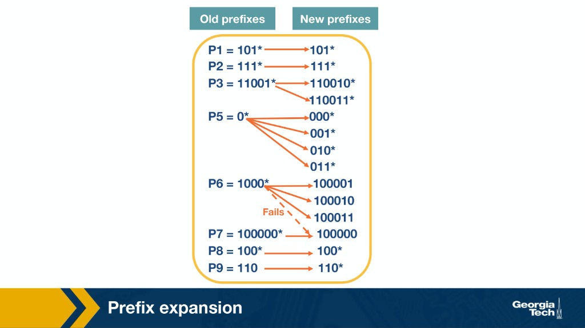{ width="700" }

### Practice: expansion quiz (stride 3)

**Database:**

| ID | Prefix |
|----|--------|
| P1 | `101*` |
| P2 | `0*` |
| P3 | `1*` |
| P4 | `10101*` |

| Prefix | Expansion (stride 3) | Result |
|--------|----------------------|--------|
| P1 `101*` | len 3 — no change | `101*` |
| P2 `0*` | len 1 → 3 | `000*`, `001*`, `010*`, `011*` |
| P3 `1*` | len 1 → 3 | `100*`, `101*`, `110*`, `111*` |
| P4 `10101*` | len 5 → 6 | `101010*`, `101011*` |

**P3 collision:** expanded `101*` **collides with P1** (`101*`) → **drop**. P3 keeps only **`100*`**, **`110*`**, **`111*`**.

!!! warning "Exam point"
    After expansion, map each surviving prefix back to its **original** ID. `101*` is owned by **P1**, not P3.

{ width="700" }

### Fixed-stride multibit trie (stride 3)

After expanding the P1–P9 database to stride 3, every node has **$2^3 = 8$** entries (`000`–`111`). Each entry holds:

- A **prefix value** (e.g., p5) — last matched prefix at this point
- An optional **pointer** to a child node

**Lookup rules:**

1. Index the next **3 bits** at each node.
2. When following a pointer, **remember** the last prefix value seen.
3. Stop on an **empty pointer**; return the last matched prefix.

| Lookup | Trace | Result |
|--------|-------|--------|
| `001…` | Root entry `001` — no pointer | **P5** |
| `100000…` | Root `100` → p8, pointer to right child → child `000` → **P7** | **P7** |

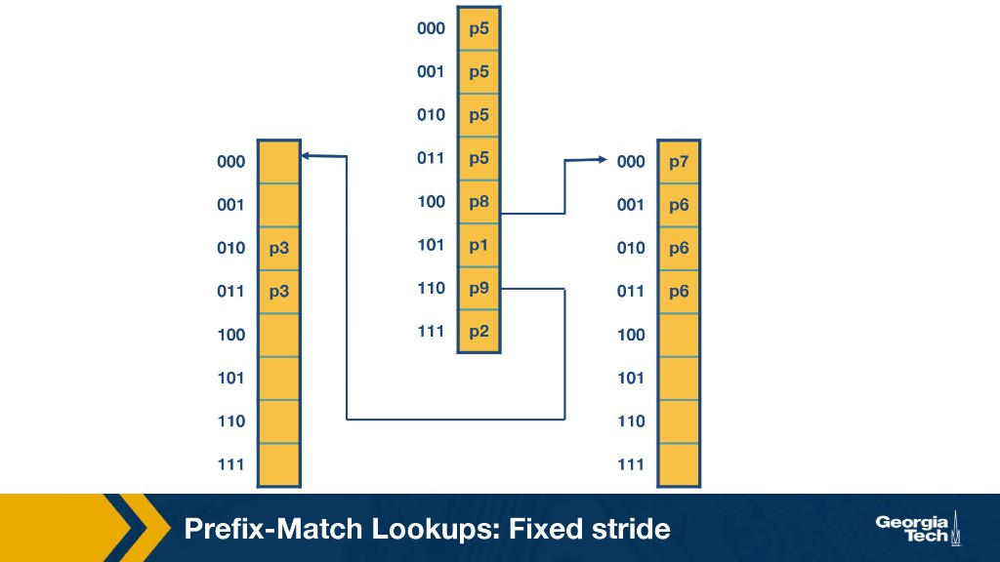{ width="700" }

### Variable-stride multibit trie

**Why variable stride?** A fixed stride of 3 forces the left subtree for **P3** (`11001*`) to use 8 entries even though only 2 bits remain after `110`. A **variable stride** encodes the stride in each pointer — e.g., the `110` entry uses a **2-bit** child node for P3 while `100` still uses **3 bits** for P7.

- Each node can examine a **different** number of bits.
- Goal: **fewer entries** and **fewer memory accesses** (optimal strides often chosen via **dynamic programming**).
- Root node typically stays fixed; child strides vary.

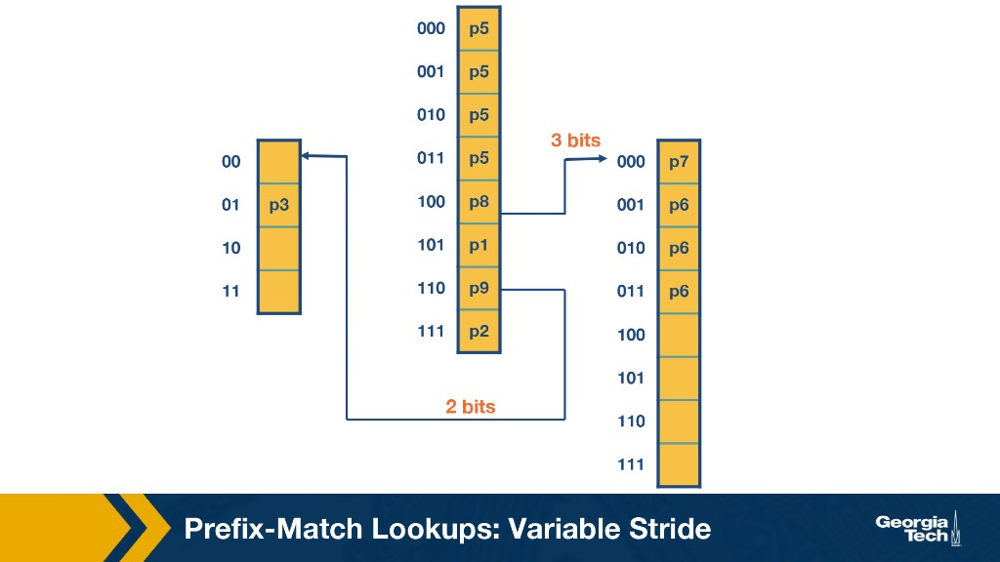{ width="700" }

### Practice: variable-stride trie (Quiz 5-5)

**Database:**

| ID | Prefix |
|----|--------|
| a | `0*` |
| b | `01000*` |
| c | `011*` |
| d | `1*` |
| e | `100*` |
| f | `1100*` |
| g | `1101*` |
| h | `1110*` |
| i | `1111*` |

**Trie structure:** n1 (stride 2) → children n2–n5; n3 branches to n6–n9; n4 to n10–n11; n5 to n12–n15; n6 to n16–n17.

**Canvas answers (Quiz 5-5):**

| Node | Label | Why |
|------|-------|-----|
| n1 | **none** | root |
| n2 | **a** | `00` branch — `0*` |
| n3 | **a** | `01` branch — `0*` (same short prefix on **both** 0-child subtrees) |
| n4 | **d** | `10` branch — `1*` |
| n5 | **d** | `11` branch — `1*` (same short prefix on **both** 1-child subtrees) |
| n6 | **none** | internal (`010…` toward b) |
| n7 | **none** | leaf `0101` — no stored prefix |
| n8 | **c** | `0110` — `011*` (third bit 1, entry `10` at n3) |
| n9 | **c** | `0111` — `011*` (third bit 1, entry `11` at n3) |
| n10 | **e** | `100*` |
| n11 | **none** | `101` — no stored prefix |
| n12 | **f** | `1100*` |
| n13 | **g** | `1101*` |
| n14 | **h** | `1110*` |
| n15 | **i** | `1111*` |
| n16 | **b** | `01000*` |
| n17 | **none** | `01001` — no stored prefix |

!!! tip "Memory aid"
    **Short prefixes appear at every child** that shares their fixed bits: `0*` → **n2 + n3**; `1*` → **n4 + n5**; `011*` → **n8 + n9** (both n3 entries where bit 3 = 1). Longer specific prefixes (b, e, f–i) appear at **one** terminal node each.

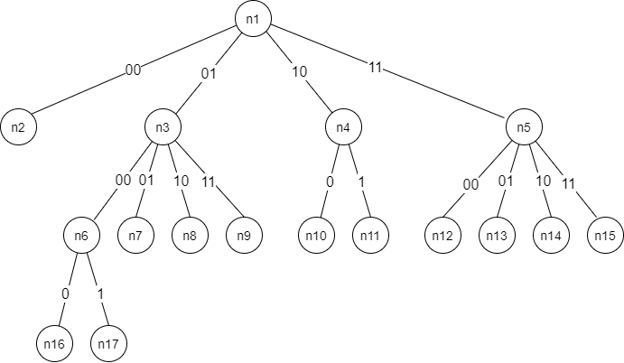{ width="600" }

!!! warning "Exam point"
    A **fixed-length** multibit trie (after expansion) supports only prefix lengths that are **multiples of the stride** — **not** an arbitrary number of lengths. A multibit trie requires **fewer** memory accesses than a unibit trie for the same database.

---

## What are the basic components of a router?

A router consists of four main components:

1. **Input ports** — Perform physical-layer reception, data-link-layer processing, and forwarding table lookup to determine the output port.
2. **Switching fabric** — Connects input ports to output ports; transfers packets from input to output.
3. **Output ports** — Store packets received from the switching fabric and perform data-link-layer and physical-layer transmission.
4. **Routing processor (Control plane)** — Executes routing protocols, maintains routing tables, computes forwarding tables, and handles network management functions.

---

## Explain the forwarding (or switching) function of a router

The forwarding function transfers a packet from an input port to the appropriate output port. When a packet arrives at an input port:

1. The input port extracts the destination IP address from the packet header.
2. It performs a **longest prefix match** lookup in the forwarding table.
3. The lookup result identifies the output port.
4. The packet is sent through the **switching fabric** to that output port.

This is a **data plane** operation that must happen at line rate (nanoseconds per packet).

---

## What are the functionalities performed by the input and output ports?

**Input ports:**

- **Line termination** — Physical-layer bit reception.
- **Data link processing** — Frame decapsulation, error checking.
- **Lookup and forwarding** — Destination IP lookup in the forwarding table using longest prefix match.
- **Queuing** — If the switching fabric is slower than the aggregate input rate, packets queue at the input.

**Output ports:**

- **Queuing and buffer management** — Store packets waiting to be transmitted; apply scheduling and drop policies.
- **Data link processing** — Frame encapsulation for the outgoing link.
- **Line termination** — Physical-layer bit transmission.

---

## What is the purpose of the router's control plane?

The control plane is responsible for:

- **Running routing protocols** (OSPF, BGP) to exchange reachability information with other routers.
- **Computing forwarding tables** based on routing protocol information.
- **Network management** — Responding to SNMP queries, handling configuration commands.
- **Software-based processing** — Unlike the data plane (hardware-based, per-packet), the control plane operates at slower timescales.

---

## What tasks occur in a router?

1. **Lookup** — Determine the output port for each packet using longest prefix match.
2. **Switching** — Transfer packets from input to output ports via the switching fabric.
3. **Queuing** — Buffer packets at input and/or output ports when contention occurs.
4. **Header validation and checksum** — Verify IP header integrity; update TTL and recompute checksum.
5. **Route processing** — Run routing protocols, update routing/forwarding tables.
6. **Scheduling** — Decide which queued packet to transmit next.

---

## List and briefly describe each type of switching. Which, if any, can send multiple packets across the fabric in parallel?

1. **Switching via memory** — The oldest approach. Packets are copied to the routing processor's memory, looked up, then copied to the output port. Limited by memory bandwidth; only **one packet at a time**.

2. **Switching via bus** — Packets are transferred from input to output over a shared bus. The input port labels the packet with the output port; all ports see the packet, but only the labeled port accepts it. Limited by **bus bandwidth**; only **one packet at a time**.

3. **Switching via crossbar (interconnection network)** — A matrix of 2N buses connecting N inputs to N outputs. Multiple input-output pairs can transfer simultaneously as long as no two packets go to the same output. **Can send multiple packets in parallel.**

---

## What are two fundamental problems involving routers, and what causes these problems?

1. **Bandwidth and Internet population scaling** — More devices, more traffic from new applications, and faster optical links push routers to process more packets per second. Longest-prefix match is harder than exact match, and link speeds outpace per-packet processing.
2. **Services at high speeds** — QoS, security, measurement, and failure protection must run at line rate alongside basic forwarding.

Secondary scaling pressure: the global routing table has grown to **900,000+** prefixes (course slide: 150k historically → 500k–1M projected), stressing lookup memory and update time.

---

## What are the bottlenecks that routers face, and why do they occur?

See the [bottlenecks table](#router-bottlenecks-causes-and-sample-solutions) above. Summary:

1. **Prefix lookups** — LPM at line rate with growing prefix tables; memory access count dominates lookup time.
2. **Packet classification** — Service differentiation requires matching on more than destination (source, port, etc.).
3. **Switching** — Optical–electronic speed gap; crossbar helps but HOL blocking remains.
4. **Fair queueing** — QoS scheduling at high speeds with limited memory.
5. **Measurement & security** — Counters, traceback, and filtering must scale with attack intensity and link speed.

---

## Convert between different prefix notations (dot-decimal, slash, and masking)

**Example:** The prefix `192.168.1.0/24`

- **Slash notation (CIDR):** `192.168.1.0/24` — the `/24` means the first 24 bits are the network portion.
- **Dot-decimal with mask:** Address `192.168.1.0`, Mask `255.255.255.0`
- **Dot-decimal + wildcard:** `192.168.1` in binary with `*` for remaining bits (e.g., `110000001010100000000001*` for the /24 network bits)
- **Binary mask:** `11111111.11111111.11111111.00000000`

**Canvas example:** `132.234` (16-bit prefix) → binary `1000010011101010*` (`132` = `10000100`, `234` = `11101010`). Equivalently: `132.234.0.0/16` with mask `255.255.0.0`.

**Conversion rules:**

- `/n` means the first n bits are 1s in the mask.
- `/24` → mask = `255.255.255.0` (24 ones followed by 8 zeros).
- `/16` → mask = `255.255.0.0`.
- `/20` → mask = `255.255.240.0` (20 ones → first two octets all 1s, third octet = `11110000` = 240).

---

## What is CIDR, and why was it introduced?

**CIDR (Classless Inter-Domain Routing)** is an addressing scheme that replaces the old classful addressing (Class A/B/C) with **variable-length prefixes**.

**Why it was introduced:**

- **Address exhaustion** — Classful addressing wasted huge numbers of addresses (e.g., a Class B gave 65,536 addresses even if only 1,000 were needed).
- **Routing table explosion** — Without CIDR, the routing table would grow unmanageably large.
- **Route aggregation** — CIDR enables **supernetting** — combining multiple smaller prefixes into a single larger prefix, reducing routing table size.

With CIDR, prefixes can be any length (e.g., `/20`, `/22`), not just `/8`, `/16`, or `/24`.

---

## Name 4 takeaway observations around network traffic characteristics. Explain their consequences.

1. **Many concurrent flows (~250,000 in backbone studies)** — Flow-level **caching** of forwarding entries works poorly in backbone routers; every packet still needs a full lookup path.
2. **Lookup speed dominated by memory accesses** — At line rate, a lookup may allow only **1–2 memory accesses**; algorithm design is measured in accesses per lookup, not CPU cycles alone.
3. **Unstable routing protocols (BGP, multicast)** — Prefix **add/delete/replace** must complete in milliseconds to seconds; slow updates stall forwarding or require complex incremental structures.
4. **Memory tradeoff (SRAM vs DRAM)** — Fast SRAM/TCAM enables wire-speed lookups but is expensive and limited; cheaper DRAM is too slow — drives **trie compression**, multibit strides, and TCAM use.

**Related observations:** ~50% of packets are small TCP ACKs (~40 bytes) → **packets/sec** matters as much as Gbps; prefix lengths span /8–/32 → naive LPM can need ~24 accesses; table growth toward 500k–1M prefixes stresses memory and update time.

---

## Why do we need multibit tries?

**Unibit tries** examine one bit of the prefix at a time, requiring up to 32 memory accesses for a single IPv4 lookup (one per bit). At line rate (e.g., 40 Gbps), a lookup must complete in ~10 ns, which may allow only 1-2 memory accesses.

**Multibit tries** examine multiple bits at each node, reducing the trie depth and the number of memory accesses required. For example, a stride of 4 bits reduces maximum depth from 32 to 8 levels.

---

## What is prefix expansion, and why is it needed?

Prefix expansion is the process of **expanding shorter prefixes to match the stride length** of a multibit trie. Since multibit tries examine a fixed number of bits at each level, all prefixes at a given level must have the same length.

**Example:** With a stride of 4 bits, a 2-bit prefix like `01*` must be expanded into all 4-bit prefixes that start with `01`: `0100`, `0101`, `0110`, `0111`. Each expanded prefix maps to the same next-hop as the original.

**Why needed:** Multibit tries require all prefixes at each level to have uniform length. Without expansion, shorter prefixes can't be stored at the correct trie level.

---

## Perform a prefix lookup given a list of pointers for unibit tries, fixed-length multibit tries, and variable-length multibit tries

**Unibit trie lookup (P1–P9 database):**

1. Start at root. Follow 0/1 pointers matching each destination bit.
2. Record every prefix label encountered on the path (e.g., P4 `1*` before reaching P2 `111*`).
3. Stop when a pointer is null or the path ends.
4. Return the **last recorded prefix** = longest match.

**Worked example:** Destination `11001001…`

- Bit 1 → follow 1-pointer (P4 `1*` recorded)
- Bit 2 → follow 1-pointer
- Bit 3 → follow 0-pointer
- Bits 4–5 → follow P9 compressed branch `01` → **P3** `11001*` (longest match)

**Fixed-length multibit trie lookup:**

- Same principle but examine multiple bits (stride) at each level.
- At each node, use the next `s` bits of the address as an index into an array of $2^s$ children.
- Record prefix matches along the way; return the longest match.

**Variable-length multibit trie lookup:**

- Different levels may have different stride lengths, optimized to minimize memory or lookup time.
- At each node, the stride determines how many bits to examine.
- Lookup proceeds similarly, using the variable stride at each level.

---

## Perform a prefix expansion. How many prefix lengths do old prefixes have? What about new prefixes?

**Old prefixes** can have **any number of prefix lengths** (e.g., prefixes of length 1, 3, 5, 7, etc. — whatever the original routing table contains).

After expansion to match the trie stride, **new prefixes** have only as many distinct lengths as there are **levels in the trie**. For example, with a fixed stride of 8 bits on IPv4, there are only 4 possible prefix lengths: 8, 16, 24, 32.

**Expansion example (stride = 3):** See the [3-bit stride table](#controlled-prefix-expansion) above. Key rules:

- Append bits to reach the next multiple of the stride length.
- If an expanded prefix **collides** with an existing more-specific entry, **drop the expanded copy**.
- P4 (`1*`) expands to four prefixes but all collide with existing entries → all dropped.
- P6 expansion of `100000*` collides with P7 → dropped.

---

## What are the benefits of variable-stride versus fixed-stride multibit tries?

**Fixed-stride:**

- Simpler to implement — every level has the same stride.
- May waste memory on sparse levels (large arrays with many empty entries).

**Variable-stride:**

- **Memory optimization** — Smaller strides on sparse levels, larger strides on dense levels.
- **Fewer memory accesses** — Can use larger strides where the trie is dense, reducing depth.
- **Flexibility** — Different subtrees can have different strides tailored to the prefix distribution.
- Trade-off: More complex to implement and manage.
