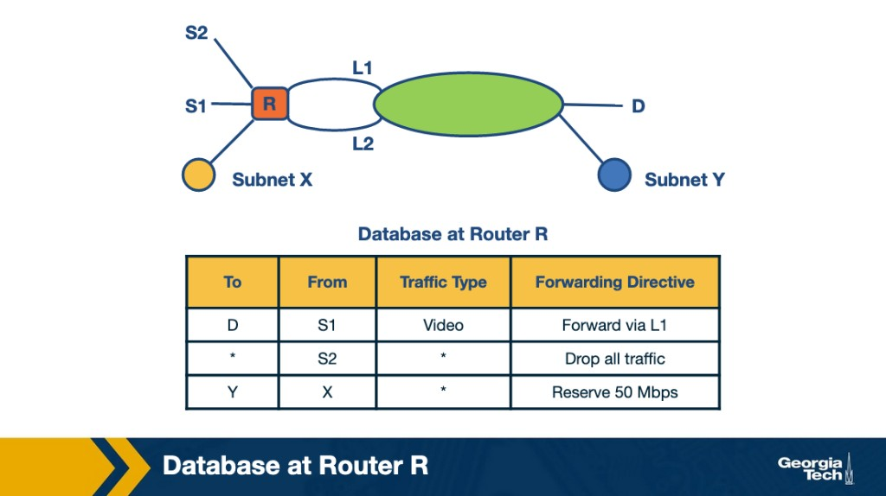
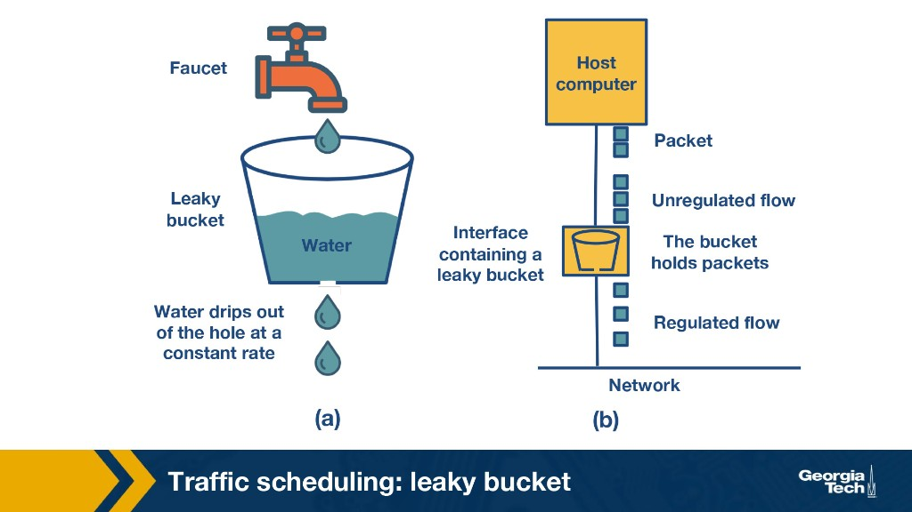

---
tags:
  - lesson-06
  - router-design
  - packet-classification
  - scheduling
  - qos
  - plain-language
search:
  boost: 2
---

# Lesson 6: Router Design (Part 2) — Plain-Language Guide

The simplest possible version of [Lesson 6](router-design-2.md). We explain ideas through **real situations** — a company firewall, a video call during a backup, a crowded switch. When you want exam detail, use the **[Quick Study Guide](quick-study-guide.md)** or the **[Quiz](quiz.md)**. Need Part 1 first? See [Lesson 5](../lesson-05/router-design-1.md).

---

## Summary

In [Lesson 5](../lesson-05/router-design-1.md), a router mostly asked: *"Where does this packet go?"* Part 2 adds three harder jobs: **classify** packets by more than destination, **schedule** who goes next when everyone is waiting, and **rate-limit** traffic so one user cannot hog the link.

---

## The one-sentence version

A modern router is like a busy airport security line: it checks more than your destination, decides who boards next so one slow gate does not block everyone, and enforces speed limits so no single flight dominates the runway.

---

## Scenario: Your company router has rules, not just a map

Lesson 5 forwarding is like a GPS: look up the destination, pick a road. Real routers also need a **rule book**.

Imagine router **R** connecting several sites. The lecture gives three rules:

| Rule | Plain English |
|------|---------------|
| Video from **S1** to **D** | Send it on the fast link **L1** |
| Anything from **S2** | **Drop it** (maybe S2 is a sketchy lab) |
| Traffic from **X** to **Y** | **Reserve 50 Mbps** for that path |



That is **packet classification** — matching on **source, destination, port, protocol**, not just "where is it going?"

**Why bother?**

| Real need | Everyday example |
|-----------|------------------|
| **Security** | Office firewall blocks traffic from a compromised subnet |
| **QoS** | Zoom calls get priority over a bulk file sync |
| **Traffic engineering** | Video traffic takes a dedicated, less-congested path |

**The hard part:** A big company might have **thousands** of rules. Checking every rule for every packet is too slow. Routers use clever search structures (tries with shortcuts) — the full guide covers set-pruning, backtracking, and grid-of-tries. For now, just remember the tradeoff:

| Approach | Plain English |
|----------|---------------|
| **Set-pruning** | Copy rules everywhere → **fast lookup, huge memory** |
| **Backtracking** | Store each rule once → **less memory, slower search** |
| **Grid of tries** | Precomputed shortcuts → **middle ground** |

**Memory trick:** **Fast and fat. Lean and slow. Grid in between.**

Edge networks sometimes avoid re-classifying every hop: **MPLS** and **DiffServ** mark packets once at the edge; middle routers just follow the label.

---

## Scenario: Three people, one door — head-of-line blocking

Inside a router, a **crossbar switch** connects many inputs to many outputs at once — like a grid of doors between hallways.

The lecture uses three inputs (**A**, **B**, **C**) and four outputs (**1–4**). All three want to reach output **1** first.

**Take-a-ticket** scheduling works like a deli counter:

1. Everyone takes a number for output 1.
2. **A** gets served first and connects.
3. **B** and **C** wait — even if they also have packets for outputs **2** or **3** that are sitting idle.


That wait is **head-of-line (HOL) blocking**: the packet at the **front** of the line blocks everything behind it, even when a different output is free.

**Fix:** Give each input a **separate mini-queue per output** — **virtual output queues (VOQs)**. Now a blocked packet for output 1 does not trap packets headed for output 3.

---

## Scenario: Everyone asks at once — parallel matching

With VOQs, inputs can request multiple outputs in the same round. **Parallel Iterative Matching (PIM)** runs three quick steps:

1. **Request** — each input asks every output it needs.
2. **Grant** — each output picks one requester (randomly if several asked).
3. **Accept** — each input picks one grant if it got several.

**Round 1:** A, B, and C all wanted output 1 — but output 1 only grants **B**. Meanwhile A gets output 2 and C gets output 4. **Three connections at once** instead of one-at-a-time tickets.


**Key takeaway:** VOQs + PIM = **no HOL blocking, crossbar stays busy.**

---

## Scenario: Backup night floods the router

Your router uses simple **FIFO** queues: first in, first out. When the buffer is full, new packets at the **tail** get **dropped** — **tail drop**.

Friday night, someone kicks off a huge backup. Bursts fill the buffer. Meanwhile your boss is on a **video call**. FIFO does not care — important and unimportant packets wait in the same line, and both can get dropped.

**Why go beyond FIFO?**

| Problem | What you feel |
|---------|---------------|
| Congestion | Everything slows when one flow hogs the buffer |
| No QoS | Voice/video stutters while bulk traffic wins |
| Unfair sharing | One download starves everyone else |

**Deficit Round Robin (DRR)** is a practical fix. Think of a **cafeteria line with credits**:

- Each flow gets a **quantum** (allowance) each round.
- Send packets until the allowance runs out; leftover credit **carries over**.
- Big packet that does not fit this round? Wait — credit accumulates for next time.


Fair enough for real hardware, cheap to run — unlike fancier schemes that track a finish time for every queue.

---

## Scenario: Speed limit on the on-ramp

Your ISP sells you "up to 100 Mbps" but does not want you blasting 100 Mbps **nonstop** while also sending huge bursts. Routers enforce **traffic profiles** two ways:

| | **Policing** | **Shaping** |
|---|-------------|-------------|
| **Excess traffic** | Drop or mark it | Buffer and send later |
| **Feels like** | Bouncer at the door | Waiting room before the door |
| **Output** | Spiky, clipped peaks | Smooth, steady stream |

### Token bucket — burst allowance

Imagine a **parking meter** that refills at rate **R**, holding at most **B** tokens.

- Tokens available? Packet goes through (maybe in a burst up to **B**).
- **Shaping:** no tokens → packet **waits** in a queue.
- **Policing:** no tokens → packet **dropped**.


**Exam point:** Token bucket allows **controlled bursts** (up to B) while averaging rate R.

### Leaky bucket — steady drip

A bucket with a **small hole** dripping at constant rate **r**. Water (packets) pours in; only the drip leaves. Overflow? Discarded or queued.



Output is **smooth and constant** — no bursting. Good when you want a steady stream, not occasional floods.


**Memory trick:** **Token = burst OK. Leaky = smooth only. Police = drop. Shape = delay.**

---

## The whole lesson on one napkin

```
Classify: more than destination — firewall, QoS, reserved paths
  Fast/fat (set-pruning) vs lean/slow (backtracking) vs grid shortcuts

HOL blocking: front packet blocks the whole FIFO line
  Fix: VOQs (queue per output) + PIM (request → grant → accept)

FIFO tail drop: simple, unfair under congestion
  DRR: each flow gets quantum + rolling credit

Token bucket: avg rate R, burst up to B
Leaky bucket: constant drip, no burst
Policing = drop/mark excess | Shaping = buffer/delay excess
```

---

## Where to go next

| You want... | Go here |
|-------------|---------|
| Full details, algorithms, and study questions | [Lesson 6 full guide](router-design-2.md) |
| Fast exam review | [Quick Study Guide](quick-study-guide.md) |
| Practice questions | [Lesson 6 Quiz](quiz.md) |
| Router architecture basics (Part 1) | [Lesson 5](../lesson-05/router-design-1.md) |
| SDN control/data-plane shift | [Lesson 7](../lesson-07/sdn-1.md) |
