---
tags:
  - lesson-06
  - router-design
---

# Lesson 6: Router Design and Algorithms (Part 2)

Continues **[Lesson 5](../lesson-05/router-design-1.md)** (router components, longest prefix match, tries, prefix expansion).

!!! tip "Exam prep"
    New to the material? Start with the **[Plain-language guide](plain-language.md)**. Need a condensed review? See the **[Quick Study Guide](quick-study-guide.md)**. For interactive practice, try the **[Lesson 6 Quiz](quiz.md)**. Need Part 1 first? See **[Lesson 5](../lesson-05/router-design-1.md)**.

---

## Learning Objectives (Part 2)

1. **Implement longest-prefix match efficiently** — unibit tries, multibit tries, prefix expansion and collision handling.
2. **Understand why scheduling matters** — FIFO limitations, QoS motivation, HOL blocking, virtual output queues.
3. **Schedule crossbar switches** — parallel iterative matching (request/grant/accept) and take-a-ticket arbitration.
4. **Classify packets beyond destination lookup** — set-pruning tries, backtracking, grid of tries (speed vs memory).
5. **Enforce traffic profiles** — policing vs shaping; token bucket vs leaky bucket.

---

## Module Summary (Part 2)

Routers split operations into a **fast data plane** (forwards at line rate) and a **slower control plane** (computes and installs forwarding state). Inside the data plane, forwarding is a pipeline: **lookup → switching → queuing → scheduling → output**. Contention in that pipeline creates delay and loss.

### Lookup and Classification

**Longest prefix matching** (covered in [Lesson 5](../lesson-05/router-design-1.md)) uses tries — unibit tries walk one bit at a time (up to 32 steps for IPv4); **multibit tries** use a stride to reduce memory accesses at the cost of wider, sparser nodes. **Prefix expansion** aligns shorter prefixes with the stride boundary, trading memory for speed.

**Packet classification** goes beyond destination lookup — routers match multiple header fields (source/destination IP, ports, TCP flags) to apply QoS, security, or traffic engineering policies. Three approaches:

| Approach | Memory | Lookup Speed |
|----------|--------|--------------|
| **Set-pruning tries** | High (rules duplicated per destination node) | Fast (one destination walk + one source walk) |
| **Backtracking** | Low (each rule stored once) | Slow (may revisit ancestor source tries) |
| **Grid of tries** | Moderate | Fast (switch pointers skip backtracking) |

### Scheduling and HOL Blocking

**FIFO with tail drop** is simple but treats all packets equally and can drop important traffic during bursts. **Head-of-line blocking** occurs when one FIFO queue per input blocks packets behind a congested head, even when other outputs are idle.

**Virtual output queues (VOQs)** — one queue per output at each input — eliminate HOL blocking. Schedulers then match inputs to outputs:

- **Parallel iterative matching** — Request → Grant → Accept (multiple packets cross in parallel).
- **Take-a-ticket** — iterative ticket grant rounds build up nonconflicting matches; routers use a small fixed number of rounds for hardware efficiency.

### Rate Control

After classification, routers enforce **traffic profiles** via:

- **Shaping** — buffer excess traffic, release later (smooth output, extra delay).
- **Policing** — drop or mark excess traffic (strict enforcement, packet loss).

**Token bucket** — tokens accumulate at rate R (burst limit B); shaping waits for tokens, policing drops. **Leaky bucket** — constant leak rate R produces steady output regardless of input burstiness.

!!! abstract "Takeaway"
    Fast lookup (tries), efficient classification (set-pruning / backtracking / grid of tries), HOL-free scheduling (VOQs + PIM/ticket), and rate control (token/leaky bucket) together enable modern routers to forward at line rate while enforcing policy.

---

## Why We Need Packet Classification?

As the Internet becomes increasingly complex, networks require **quality-of-service** and **security guarantees** for their traffic. Packet forwarding based on the longest prefix matching of destination IP addresses is insufficient. We need to handle packets based on multiple criteria such as TCP flags, source addresses, and so on. We refer to this finer packet handling as **packet classification**.

We have already seen variants of packet classification:

- **Firewalls** — Routers implement firewalls at the entry and exit points of the network to filter out unwanted traffic or enforce security policies.
- **Resource reservation protocols** — For example, DiffServ has been used to reserve bandwidth between a source and a destination.
- **Routing based on traffic type** — Routing based on the specific type of traffic helps avoid delays for time-sensitive applications.

The figure below shows an example topology where networks are connected through router **R**. Destinations are shown as S1, S2, X, Y, and D. L1 and L2 denote specific connection points for router R.

The table at router R shows example packet classification rules:

| To | From | Traffic Type | Forwarding Directive |
|----|------|--------------|----------------------|
| D | S1 | Video | Forward via L1 |
| * | S2 | * | Drop all traffic |
| Y | X | * | Reserve 50 Mbps |

- **Rule 1** routes video traffic from S1 to D via L1.
- **Rule 2** drops all traffic from S2 (e.g., if S2 were an experimental site).
- **Rule 3** reserves 50 Mbps of traffic from prefix X to prefix Y — an example of resource reservation.

!!! info "Reference"
    Varghese, *Network Algorithmics*, Section 12.1

---

## Packet Classification: Simple Solutions

Before looking into algorithmic solutions, consider the most straightforward approaches:

### Linear Search

Firewall implementations perform a **linear search** of the rules database and keep track of the best-match rule. This solution can be reasonable for a few rules, but the time to search through a large database that may have **thousands of rules** can be prohibitive.

### Caching

Another approach is to cache the results so that future searches run faster. This has two problems:

1. The cache-hit rate can be high (80–90%), but we still need to perform searches for cache misses.
2. Even with a 90% hit rate, a slow linear search performs poorly. For example, suppose a cache search costs **100 nsec** (one memory access) and a linear search of 10,000 rules costs **1,000,000 nsec = 1 msec** (one memory access per rule). Then the average search time with a 90% hit rate is still **0.1 msec**, which is rather slow.

### Passing Labels

**Multiprotocol Label Switching (MPLS)** and **DiffServ** use this technology. MPLS is useful for traffic engineering:

1. A label-switched path is set up between sites A and B.
2. Before traffic leaves site A, a router does packet classification and maps the web traffic into an MPLS header.
3. Intermediate routers between A and B apply the label without having to redo packet classification.

DiffServ follows a similar approach, applying packet classification at the edges to mark packets for special quality-of-service.

!!! info "Reference"
    Varghese, *Network Algorithmics*, Section 12.4

---

## Fast Searching Using Set-Pruning Tries

Assume we have a **two-dimensional rule** — classifying packets using both source and destination IP addresses. Consider the table below as our rule database:

| Rule | Destination | Source |
|------|-------------|--------|
| R₁ | 0* | 10* |
| R₂ | 0* | 01* |
| R₃ | 0* | 1* |
| R₄ | 00* | 1* |
| R₅ | 00* | 11* |
| R₆ | 10* | 1* |
| R₇ | * | 00* |

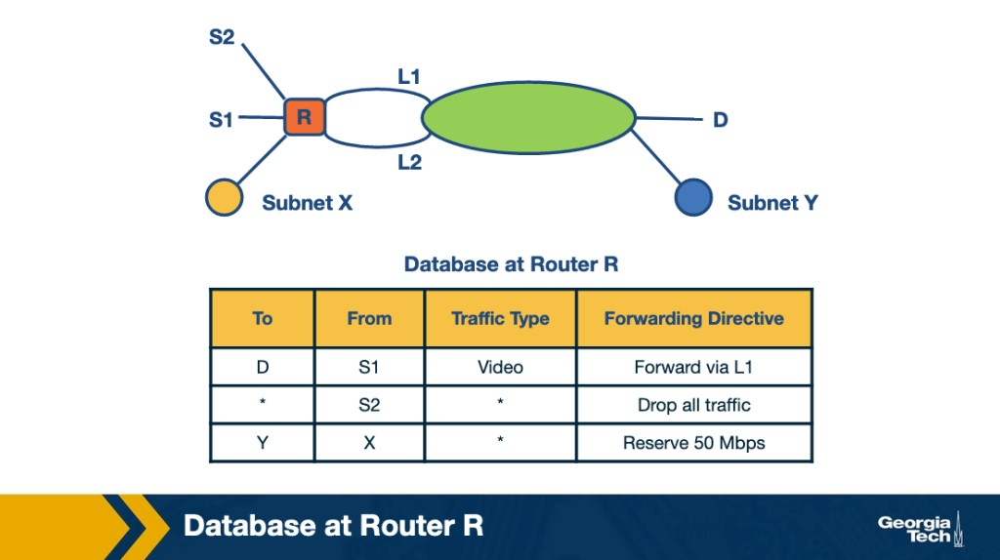{ width="700" }

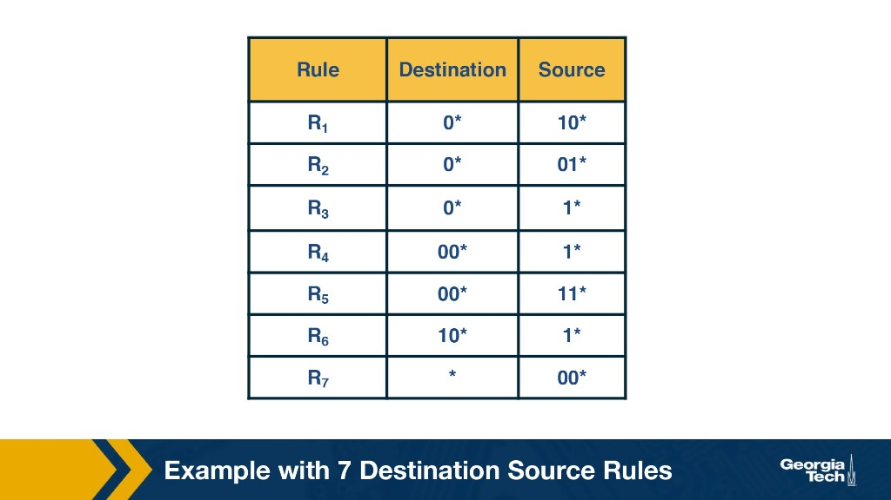{ width="600" }

The simplest approach is to build a **trie on the destination prefixes**, and then for every leaf node in the destination trie, "hang" **source tries**. By S₁ we denote the source prefix of rule R₁, S₂ of rule R₂, and so on. For every destination prefix D in the destination trie, we **prune** the set of rules to those compatible with D.

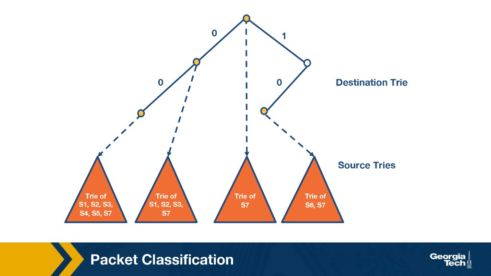

**Lookup procedure:**

1. Match the destination IP address in the packet against the destination trie.
2. Traverse the corresponding source trie to find the longest prefix match for the source IP.
3. Keep track of the **lowest-cost matching rule**.
4. Conclude with the least-cost rule.

**Challenge — which source prefixes to store?** Consider destination D = `00*`. Rules R₄ and R₅ have D as the destination prefix, so the source trie for D must include source prefixes `1*` and `11*`. But restricting to only those is **not sufficient** — the prefix `0*` also matches `00*`, and it appears in rules R₁, R₂, R₃, and R₇. We must include all corresponding source prefixes from ancestor destination prefixes as well.

**Main problem:** **Memory explosion.** A source prefix can occur in multiple destination tries, causing rules to be duplicated across many source tries.

!!! info "Reference"
    Varghese, *Network Algorithmics*, Section 12.5.1

---

## Reducing Memory Using Backtracking

The set-pruning approach has a **high cost in memory** to reduce lookup time. The opposite approach is to **pay in time to reduce memory**.

For a destination prefix D, the backtracking approach has each destination prefix D point to a source trie that stores only the rules whose destination field is **exactly D**. The search algorithm then performs a **backtracking search** on the source tries associated with all ancestors of D.

**Lookup procedure:**

1. Traverse the destination trie and find the longest destination prefix D matching the packet header.
2. Work back up the destination trie and search the source trie associated with every ancestor prefix of D that points to a nonempty source trie.

Since each rule is stored **exactly once**, memory requirements are lower than set-pruning tries. However, the lookup cost for backtracking is **worse**.

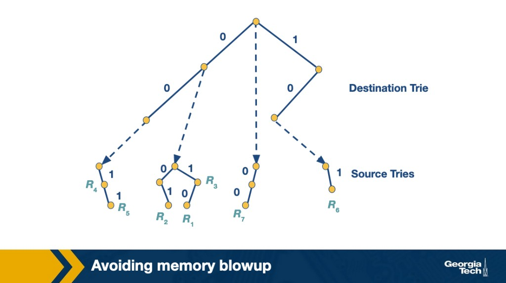

---

## Grid of Tries

We have seen two solutions for the two-dimensional problem:

| Approach | Memory | Lookup Time |
|----------|--------|-------------|
| **Set-pruning** | High — rules duplicated across destination tries | Fast |
| **Backtracking** | Low — each rule stored once | Slow — must revisit ancestor tries |

The **grid of tries** approach reduces wasted time in backtracking by using **precomputation**. When there is a failure point in a source trie, we precompute a **switch pointer**. Switch pointers take us directly to the next possible source trie containing a matching rule.

**Example:** Consider searching for a packet with destination address `001` and source address `001`.

1. Start with the destination trie, which gives D = `00` as the best match.
2. The search in the corresponding source trie **fails**.
3. Instead of backtracking, a switch pointer (labeled `0`) points to node **x**, where it fails again.
4. Follow another switch pointer to node **y**, where the algorithm terminates.

The precomputed switch pointers allow us to take **shortcuts** — we avoid backtracking to find an ancestor node and then traversing its source trie. We still proceed to match the source and keep track of our current best source match, but we **skip source tries with source fields shorter than our current source match**.

!!! abstract "Takeaway"
    Grid of tries = backtracking with precomputed shortcuts. Switch pointers are labeled by the bit value that caused the failure, and they jump directly to the next candidate source trie.

{ width="700" }

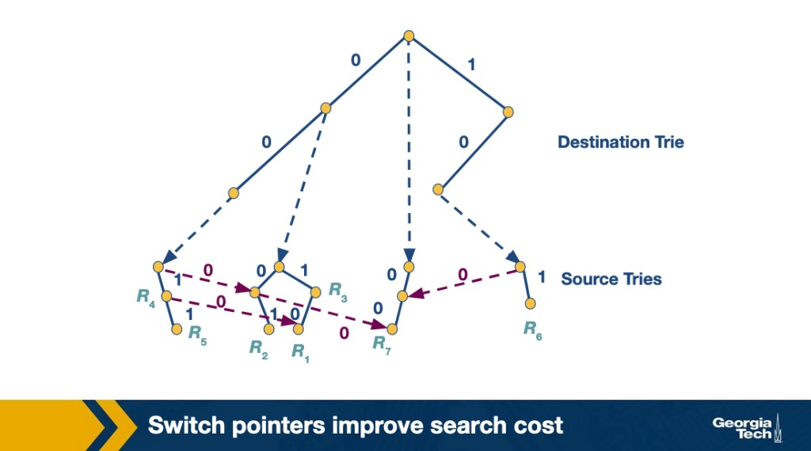{ width="700" }

!!! info "Reference"
    Varghese, *Network Algorithmics*, Section 12.5.3

---

## Scheduling and Head of Line Blocking

Consider an **N-by-N crossbar switch** with N input lines, N output lines, and N² crosspoints. Each crosspoint needs to be controlled (on/off). We must ensure each input link connects to at most one output link, while maximizing the number of input/output link pairs that communicate in parallel.

### Take-a-Ticket Algorithm

A simple scheduling algorithm is the **take-the-ticket algorithm**. Each output line maintains a distributed queue for all input lines that want to send packets to it. When an input line intends to send a packet to a specific output line, it **requests a ticket**, then waits for the ticket to be served. At that point, the input line connects to the output line, the crosspoint is turned on, and the packet is sent.

Consider three input lines (A, B, C) and four output lines (1, 2, 3, 4). Next to each input line is the queue of output lines it wants to connect with. For example, inputs A and B want to connect with output lines 1, 2, and 3.

**Round 1:** All three inputs request tickets for output link 1. Output link 1 grants three tickets (T1, T2, T3) and processes them in order. Input A's ticket is served first, so A connects to output link 1 and sends its packet. B and C wait.

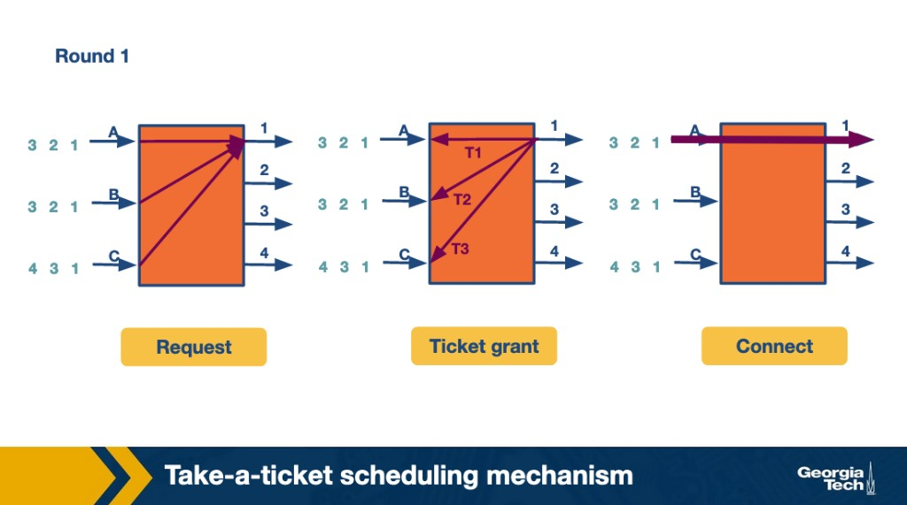

**Round 2:** A requests a ticket for output link 2. B uses its ticket T2 from round 1 to connect with output link 1.

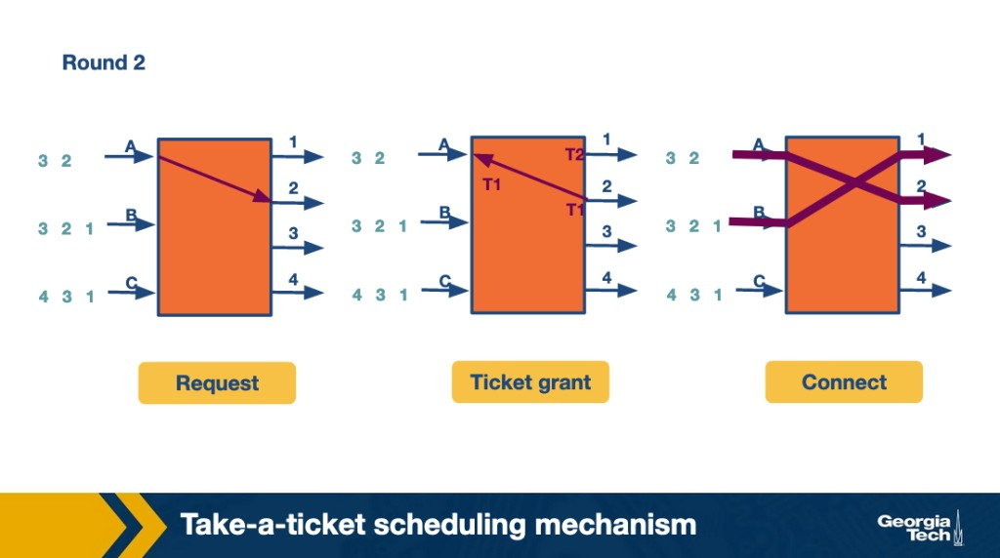

**Round 3:** A and B move forward to their next connections. C finally gets to request and connect with output link 1. All this time, C was blocked waiting for A and B.

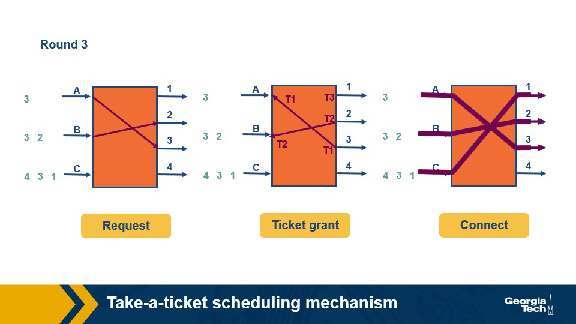

While A sends its packet in the first iteration, the **entire queue for B and C is waiting**. We refer to this problem as **head-of-line (HOL) blocking** — the entire queue is blocked by the progress of the head of the queue, even when packets behind the head are destined for idle output ports.

The timeline below shows the effect across all output links. Empty slots mean no packet was sent at that time — wasted capacity caused by HOL blocking:

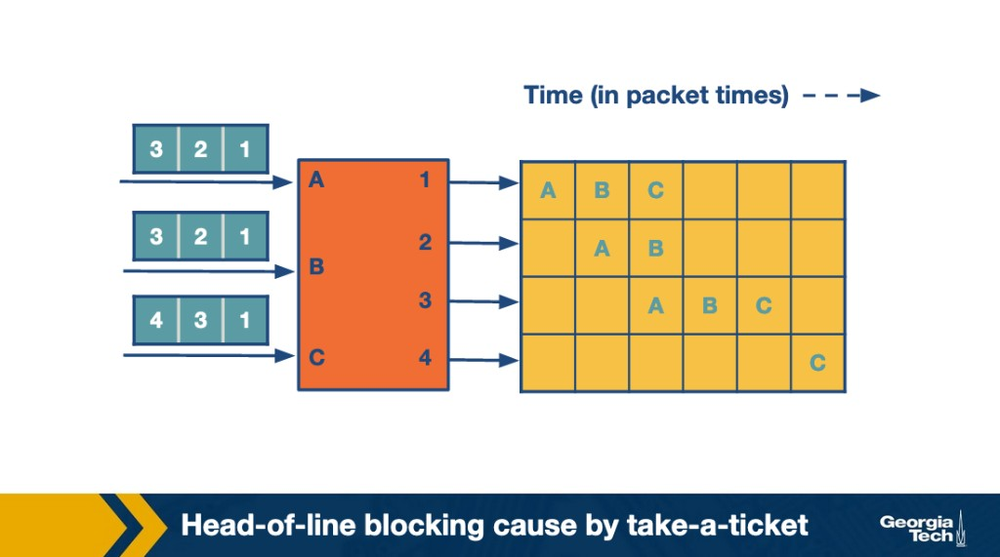{ width="700" }

---

## Avoiding Head of Line Blocking

### Output Queuing and the Knockout Scheme

Suppose we have an N-by-N crossbar switch. Can we send a packet to an output link **without queueing** at the input? If so, a packet at an output link can only block packets sent to the **same** output link. We could achieve this if the fabric runs **N times faster** than the input links.

A practical implementation is the **Knockout scheme**, which relies on breaking packets into fixed-size **cells**:

- In practice, the same output rarely receives N cells simultaneously; the expected number is **k** (k < N).
- The fabric can run **k times** as fast as an input link instead of N.
- When more than k cells contend for the same output, excess cells are **dropped** ("knocked out").

**Concentrator configurations:**

| Case | Description |
|------|-------------|
| k = 1, N = 2 | Randomly pick the winning output. The switching element is called a **concentrator**. |
| k = 1, N > 2 | One output chosen from N possibilities, using multiple 2-by-2 concentrators. |
| k and N arbitrary | Create **k knockout trees** to compute the first k winners. |

**Drawback:** Complex to implement.

### Parallel Iterative Matching (PIM)

The main idea: allow queueing at input lines, but in a way that **avoids HOL blocking**. Instead of a single queue per input, break it into **virtual output queues (VOQs)** — one virtual queue per output link. This lets the queue make progress even when the head packet is blocked.

The algorithm runs in **three phases** per round:

1. **Request** — All inputs send requests in parallel to every output they want to connect with.
2. **Grant** — Each output that received multiple requests picks one input **randomly**.
3. **Accept** — Inputs that received multiple grants randomly pick one output to connect to.

**Round 1:**

- A requests outputs 1, 2, 3. B requests 1, 2, 3. C requests 1, 3, 4.
- Output 1 grants B. Output 2 grants A. Output 3 grants A. Output 4 grants C.
- A received grants from 2 and 3 — randomly chooses **2**. B chooses **1**. C chooses **4**.

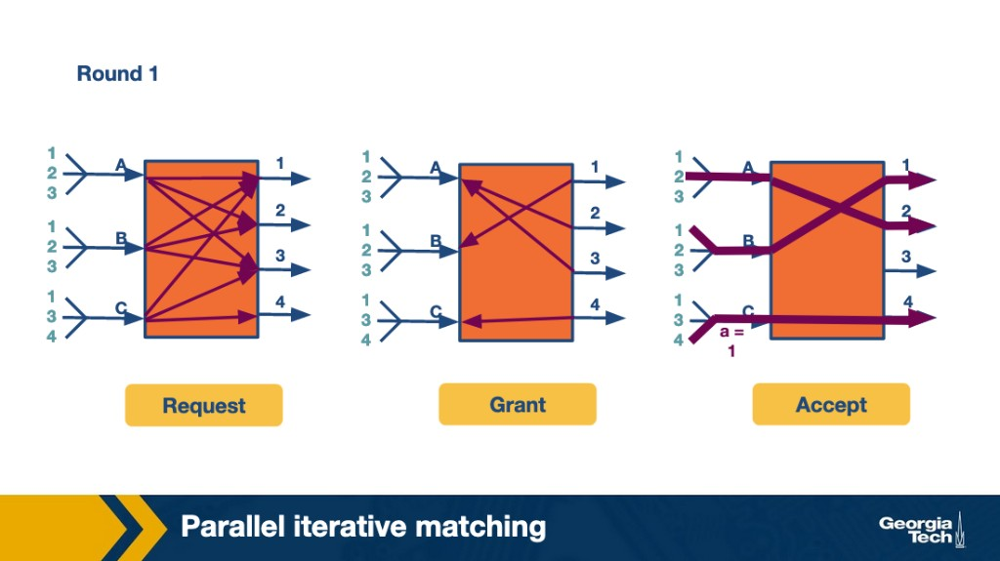

**Round 2:**

- A requests outputs 1, 3. B requests 1, 2, 3. C requests 1, 3.
- Output 1 grants A. Output 2 grants B. Output 3 grants C.
- A→1, B→2, C→3.

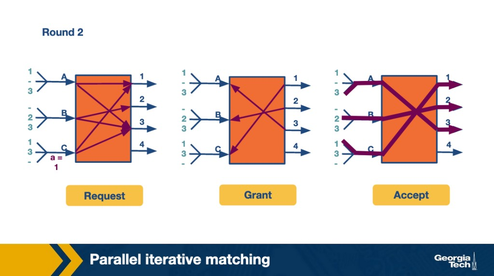

**Round 3:**

- A requests output 1. B requests output 3. C requests output 3.
- Output 1 grants A. Output 3 grants C.
- A→1, C→3. B is not served this round.

All traffic is sent in **four cell times** (the fourth is sparsely used). This is more efficient than take-a-ticket because multiple inputs can transmit simultaneously to different outputs.

!!! info "Reference"
    Varghese, *Network Algorithmics*, Sections 13.6, 13.7

---

## Scheduling Introduction

Busy routers rely on **scheduling** to handle routing updates, management queries, and data packets. Scheduling enables routers to give different services to different types of data packets. These decisions must be made in **real-time** — at link speeds over 40 Gbps, scheduling decisions must be made within the minimum inter-packet times.

### FIFO with Tail Drop

The simplest router scheduling method:

1. Packets enter on input links and are looked up to determine the output link.
2. The switching system places the packet in the corresponding **output port FIFO queue**.
3. If the output buffer is full, incoming packets at the **tail** of the queue are **dropped**.

This yields fast scheduling decisions but can drop important packets indiscriminately.

### Need for Quality of Service (QoS)

More complex scheduling methods (priority, round-robin, etc.) provide **QoS guarantees** on delay and bandwidth. A **flow** is a stream of packets traveling the same route from source to destination, requiring the same service at each router. Flows are identifiable using packet header fields (e.g., all packets with source or destination port 23).

**Reasons to go beyond FIFO with tail drop:**

1. **Router support for congestion** — Internet usage has grown faster than link speeds. While TCP handles congestion end-to-end, router-level support can improve throughput.

2. **Providing QoS guarantees to flows** — During backup periods, bursty flows flood output buffers. FIFO with tail drop blocks other flows, causing important connections to freeze.

3. **Fair sharing among competing flows** — Guarantee bandwidth or bound delay per flow. This is critical for video — without delay bounds, live streaming fails.

Finding time-efficient scheduling algorithms that guarantee bandwidth and delay is essential.

!!! info "Reference"
    Varghese, *Network Algorithmics*, Chapter 14 Intro., Section 14.1

---

## Deficit Round Robin

### Bit-by-Bit Round Robin

Imagine a system where one bit from each active flow is transmitted per round in round-robin fashion. This ensures **fair bandwidth allocation**, but packets cannot be split in practice. Instead, we use an imaginary bit-by-bit system to calculate **packet finishing times** and send whole packets.

Let **R(t)** be the current round number at time t. If the router sends µ bits/second and N flows are active:

$$\frac{dR}{dt} = \frac{\mu}{N}$$

The rate of round-number increase is **inversely proportional** to the number of active flows. Importantly, the number of rounds to transmit a packet does **not** depend on the number of backlogged queues.

For flow α, let packet i of size p(i) bits arrive. The round at which it reaches the head of the queue:

$$S(i) = \max(R(t),\; F(i-1))$$

The round at which it finishes:

$$F(i) = S(i) + p(i)$$

### Packet-Level Fair Queuing

This strategy emulates bit-by-bit fair queueing by sending the packet with the **smallest finishing round number** — the packet that was most starved during the previous scheduling round.

**Example walkthrough:**

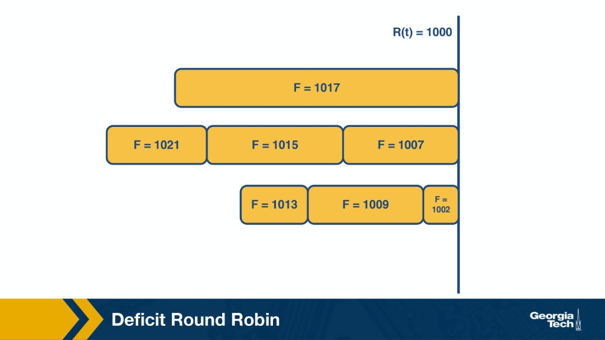

At R(t) = 1000, the head packets have F = 1017, 1007, and 1002. The packet with **F = 1002** (smallest) is transmitted.

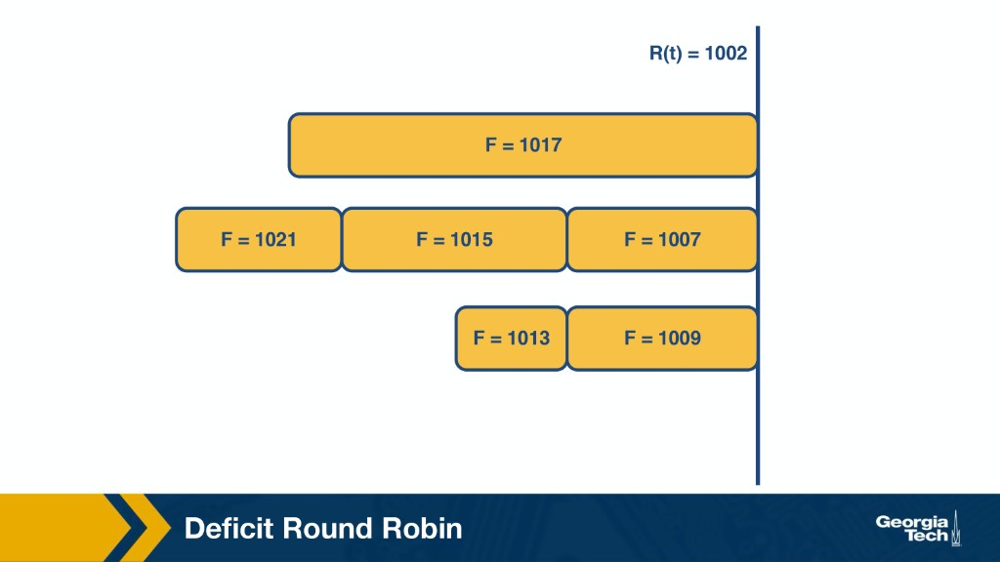

Next, the head packets have F = 1017, 1007, and 1009. The packet with **F = 1007** is transmitted.

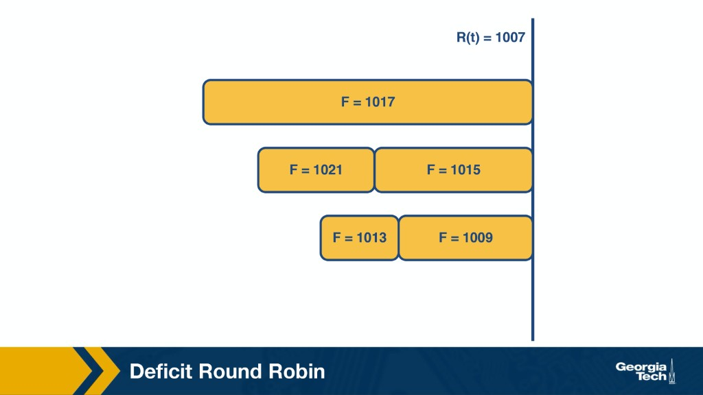

Next, the head packets have F = 1017, 1015, and 1009. The packet with **F = 1009** is transmitted.

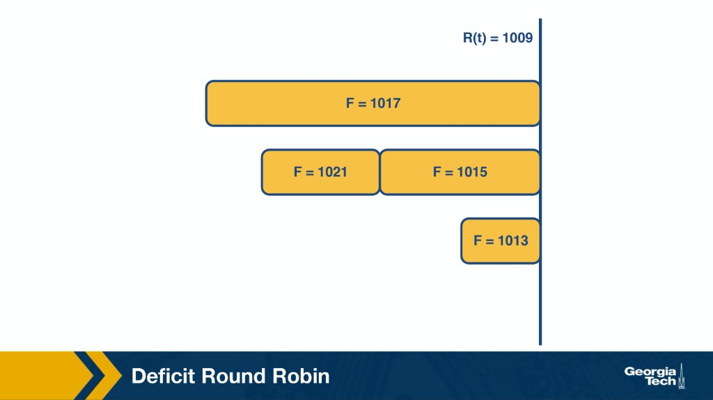

Next, the head packets have F = 1017, 1015, and 1013. The packet with **F = 1013** would be transmitted next.

**Problem:** Requires tracking the finishing time of each queue's head packet and choosing the earliest — a **priority queue** with O(log N) complexity. When a new queue becomes active, all timestamps may need updating (O(N)). Too expensive for gigabit speeds.

### Deficit Round Robin (DRR)

DRR provides bandwidth guarantees with **O(1) constant-time** round-robin. Each flow i has:

- **Quantum $Q_i$** — bandwidth share allocated to the flow.
- **Deficit counter $D_i$** — remaining bandwidth credit (initialized to 0).

**Per turn:** Serve as many packets in flow $i$ with size $\leq Q_i + D_i$. Remaining credit carries over in $D_i$. If all packets are serviced, reset $D_i$ to 0.

**Example:** Four flows (F1–F4) with quantum Q = 500 for all. Initially, all deficit counters are 0 and the round-robin pointer points to F1.

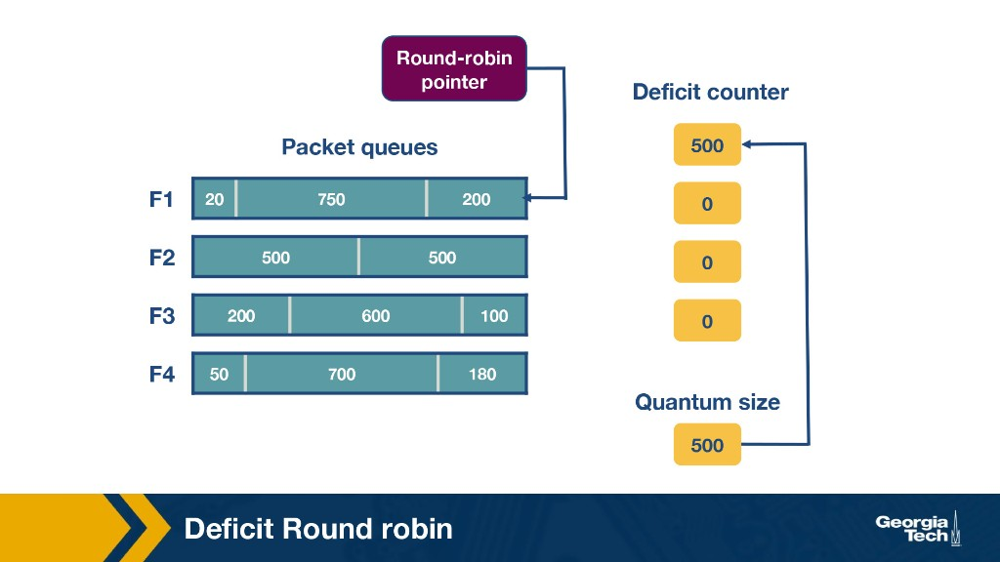

**Iteration 1 (F1's turn):** $Q_1$ is added to $D_1$ → $D_1 = 500$. The head packet (size 200) satisfies $200 \leq 500$, so it is sent. $D_1$ becomes 300. The next packet (size 750) exceeds the remaining deficit, so it waits. The pointer advances to F2.

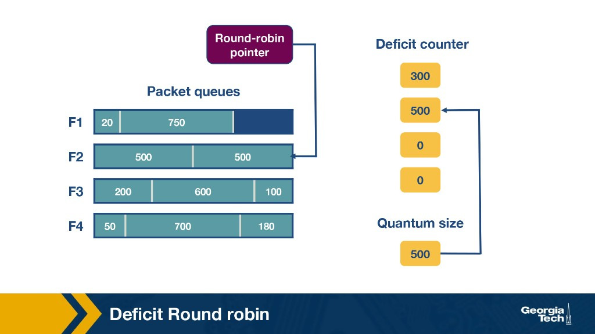

**Iteration 2 (F2's turn):** Q₂ is added to D₂ → D₂ = 500. F2 sends its head packet (size 500). D₂ resets to 0. The process continues for F3 and F4 in subsequent rounds.

| Flow | Packets (size) | After its turn | D after turn |
|------|----------------|----------------|--------------|
| F1 | 200, 750, 200 | Send 200; can't send 750 | D₁ = 300 |
| F2 | 500, 500 | Send 500 | D₂ = 0 |
| F3 | 200, 600, 100 | Send 200 | D₃ = 300 |
| F4 | 50, 700, 180 | Send 50 | D₄ = 450 |

When F1's turn comes again, D₁ + Q₁ = 800 — sufficient to send the 750-byte packet. If the queue empties, D₁ resets to 0 rather than carrying over the leftover credit.

!!! info "Reference"
    Varghese, *Network Algorithmics*, Sections 14.6.2, 14.6.3

---

## Why is packet classification needed?

Simple forwarding uses only the destination IP address (longest prefix match). However, modern routers need to handle packets differently based on **multiple header fields** — source IP, destination IP, source port, destination port, and protocol. This is required for:

- **Firewalls** — Block or allow traffic based on rules.
- **Quality of Service (QoS)** — Prioritize certain traffic classes.
- **Traffic engineering** — Route traffic along specific paths.
- **Network Address Translation (NAT)** — Map internal to external addresses.

Packet classification matches each packet against a **set of rules** defined on multiple fields simultaneously.

---

## What are three established variants of packet classification?

1. **Firewalls** — Match packets against access control lists (ACLs) to permit or deny traffic.
2. **Resource Reservations (QoS)** — Classify packets to assign them to specific service classes with guaranteed bandwidth or priority.
3. **Routing based on Traffic Type** — Different forwarding paths for different types of traffic (e.g., VoIP vs. web browsing).

---

## What are the simple solutions to the packet classification problem?

1. **Linear search** — Check each rule sequentially and track the best-match rule. Reasonable for a few rules, but prohibitive for thousands of rules (e.g., 10,000 rules at 1 memory access each = 1 msec per search).

2. **Caching** — Cache recent classification results. Even with a 90% hit rate, average search time can still be ~0.1 msec (100 nsec cache hit + 1 msec cache miss × 10%). Cache misses still require slow linear searches.

3. **Passing labels** — MPLS and DiffServ classify at the network edge and attach labels/markings. Interior routers forward based on labels without re-classifying. MPLS sets up label-switched paths between sites; DiffServ marks packets at edges for QoS treatment.

---

## How does fast searching using set-pruning tries work?

Set-pruning tries build a **trie on destination prefixes**, then "hang" a **source trie** at each destination trie node. For every destination prefix D, the set of rules is **pruned** to those compatible with D.

**Lookup:**

1. Match the destination IP in the destination trie.
2. Traverse the corresponding source trie for the longest source prefix match.
3. Track the lowest-cost matching rule.

**Challenge:** Source prefixes must include not only rules with destination exactly D, but also rules from **ancestor destination prefixes** that match D (e.g., for D = `00*`, rules with destination `0*` and `*` must also be included in the source trie).

---

## What's the main problem with set pruning tries?

**Memory explosion.** A source prefix can occur in **multiple destination tries** because ancestor destination prefixes must also be included. Rules with wildcard destinations (e.g., R₇ with D = `*`) appear in every source trie. This duplication causes storage to grow far beyond the original rule count.

---

## What is the difference between the pruning approach and the backtracking approach for packet classification with a trie?

**Set-pruning approach:**

- Each destination prefix D points to a source trie containing **all rules compatible with D** (including ancestor rules).
- **Fast lookup** — no backtracking needed.
- **High memory cost** — rules duplicated across many source tries.

**Backtracking approach:**

- Each destination prefix D points to a source trie storing only rules whose destination field is **exactly D**.
- After finding the longest destination match, the algorithm **backtracks** up the destination trie, searching source tries at every ancestor prefix.
- **Lower memory** (each rule stored once) — but **slower lookup** due to backtracking.

---

## What's the benefit of a grid of tries approach?

The **grid of tries** approach uses **precomputed switch pointers** to avoid the wasted time of backtracking:

- When a source trie search fails, a switch pointer jumps directly to the next possible source trie containing a matching rule.
- Avoids backtracking up the destination trie and re-traversing ancestor source tries.
- Still tracks the current best source match, skipping source tries with source fields shorter than the current match.
- **Benefit:** Lower memory than set-pruning (rules stored once) with faster lookup than naive backtracking.

---

## Describe the "Take the Ticket" algorithm

The Take-the-Ticket algorithm schedules access to shared output ports in an N×N crossbar switch:

1. Each output line maintains a **distributed queue** for all input lines wanting to send to it.
2. An input line **requests a ticket** when it wants to send to a specific output.
3. The output line grants tickets in order (T1, T2, T3, …).
4. When its ticket is served, the input connects to the output, the crosspoint turns on, and the packet is sent.

**Example:** If inputs A, B, and C all request output 1, output 1 grants T1→A, T2→B, T3→C. A connects in round 1; B connects in round 2; C waits until round 3. This provides fair, ordered access but causes **head-of-line blocking** for inputs waiting behind the head of their queue.

---

## What is the head-of-line (HOL) problem?

Head-of-line blocking occurs when the **packet at the front of an input queue** is destined for a busy output port, and it **blocks all packets behind it** — even if those subsequent packets are destined for idle output ports.

In the take-a-ticket example, while A sends to output 1 in round 1, inputs B and C's **entire queues** wait — even though B and C may have packets for other idle outputs. The entire queue is blocked by the head.

With FIFO input queuing and uniform random traffic, HOL blocking limits throughput to approximately **58.6%** (2 − √2) of the switch capacity.

---

## How is the head-of-line problem avoided using the knockout scheme?

The knockout scheme sends packets directly to output links without input queueing, using fixed-size **cells** and a fabric running **k times faster** than input links (k < N):

- The same output rarely receives N cells simultaneously; expected contention is k.
- **Concentrators** randomly pick winners when multiple cells contend for the same output.
- Excess cells beyond k are **dropped** ("knocked out").
- For k = 1, N = 2: a single 2-by-2 concentrator. For arbitrary k, N: **k knockout trees** compute the first k winners.

This avoids HOL blocking because packets go directly to outputs. **Drawback:** complex to implement.

---

## How is the head-of-line problem avoided using parallel iterative matching?

**Parallel Iterative Matching (PIM)** uses **Virtual Output Queues (VOQs)** — one queue per output at each input — so the queue progresses even when the head packet is blocked.

Each round has three phases:

1. **Request** — All inputs send requests in parallel to every output they want.
2. **Grant** — Each output that received multiple requests picks one input randomly.
3. **Accept** — Inputs that received multiple grants randomly pick one output.

**Example (Round 1):** A, B, C all request output 1. Output 1 grants B. Output 2 grants A. A also receives grant from 3, randomly chooses 2. Result: A→2, B→1, C→4 — three simultaneous connections. All traffic sent in four cell times, more efficient than take-a-ticket.

---

## Describe FIFO with tail drop

**FIFO with tail drop** is the simplest router scheduling method:

1. Packets are looked up and placed in the corresponding **output port FIFO queue**.
2. Packets depart in arrival order.
3. When the output buffer is full, packets arriving at the **tail** are **dropped**.

Fast scheduling decisions, but can drop important packets indiscriminately and block other flows during congestion (no QoS differentiation).

---

## What are the reasons for making scheduling decisions more complex than FIFO?

1. **Router support for congestion** — Internet usage has outpaced link speeds; router-level congestion handling improves throughput beyond what TCP alone provides.

2. **Providing QoS guarantees to flows** — Bursty flows during backup flood output buffers; FIFO blocks other flows, freezing important connections.

3. **Fair sharing among competing flows** — Guarantee bandwidth or bound delay per flow. Critical for video — without delay bounds, live streaming fails.

---

## Describe Bit-by-bit Round Robin scheduling

Bit-by-bit Round Robin imagines transmitting **one bit from each active flow** per round, ensuring fair bandwidth. Since packets can't be split, we compute **finishing round numbers**:

- Round rate: $dR/dt = \mu / N$ (inversely proportional to active flows).
- Start round for packet i: $S(i) = \max(R(t),\; F(i-1))$
- Finish round: $F(i) = S(i) + p(i)$ where p(i) is packet size in bits.

**Packet-level fair queuing** sends the packet with the smallest F — the most starved packet.

---

## Bit-by-bit Round Robin provides fairness; what's the problem with this method?

**Computational complexity** — must track the finishing time of each queue's head packet and select the earliest, requiring a **priority queue** with O(log N) time per decision. When a new queue becomes active, all timestamps may need updating (O(N)). Too expensive to implement at gigabit speeds (40+ Gbps requires decisions within minimum inter-packet times).

---

## Describe Deficit Round Robin (DRR)

DRR provides bandwidth guarantees with **O(1) constant-time** round-robin:

1. Each flow i has a **quantum Qᵢ** (bandwidth share) and **deficit counter Dᵢ** (initialized to 0).
2. Each turn, serve packets in flow $i$ with size $\leq Q_i + D_i$.
3. Remaining credit carries over in Dᵢ for the next turn.
4. If all packets in the queue are serviced, reset Dᵢ to 0.

**Example (Q = 500 for all flows):** F1 sends packet of 200 (D₁ = 300 remaining); F2 sends 500 (D₂ = 0); F3 sends 100 (D₃ = 400); F4 sends 180 (D₄ = 320). Next turn, F1 has Q + D = 800, enough to send packets of 750 and 350.

**Advantages:** O(1) per packet, long-term fairness with variable packet sizes, simple hardware implementation.

---

## Traffic Scheduling: Token Bucket

There are scenarios where we want to set **bandwidth guarantees** for flows in the same queue without separating them. For example, we may want to limit a specific type of traffic (e.g., news traffic) to no more than X Mbps without putting it into a separate queue.

### Token Bucket Shaping

**Token bucket shaping** limits the burstiness of a flow by:

1. Limiting the **average rate** (e.g., 100 Kbps).
2. Limiting the **maximum burst size** (e.g., the flow can send a burst of 4 KB at a rate of its choice).

Each flow has a bucket that fills with tokens at rate **R** per second, with a maximum of **B** tokens at any time. If the bucket is full, additional tokens are dropped. When a packet arrives, it can pass through if there are enough tokens (equal to the packet size in bits). Otherwise, the packet **waits** until enough tokens accumulate. The max size B limits bursts to B bits.

In practice, this is implemented using a **counter** (can't exceed B, decremented when bits are sent) and a **timer** (increments the counter at rate R).

**Problem:** Token bucket shaping requires **one queue per flow**, because one flow may have a full token bucket while others have empty buckets and must wait.

### Token Bucket Policing

A modified version — **token bucket policing** — maintains a **single queue**. If a packet arrives and there are no tokens in the bucket, the packet is **dropped** instead of waiting.

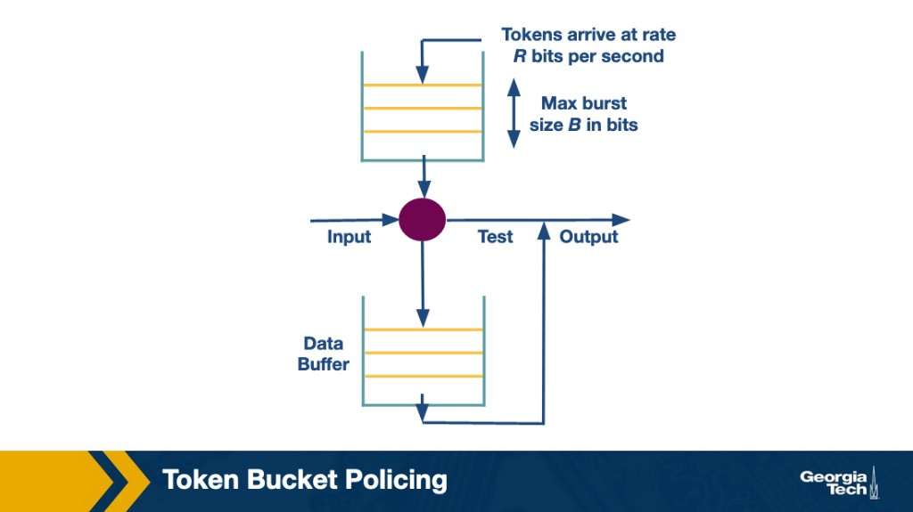

!!! info "Reference"
    Varghese, *Network Algorithmics*, Section 14.3

---

## Traffic Scheduling: Leaky Bucket

Traffic **policing** and **shaping** are mechanisms to limit the output rate of a link. Both identify traffic descriptor violations but respond differently:

- **Policer** — When the traffic rate reaches the maximum configured rate, excess traffic is **dropped** or the packet's marking is changed. The output rate appears as a **saw-toothed wave** (peaks clipped at the threshold).
- **Shaper** — Excess packets are retained in a **queue or buffer** and scheduled for later transmission. Excess traffic is **delayed** instead of dropped, producing a **smooth, constant** output rate.

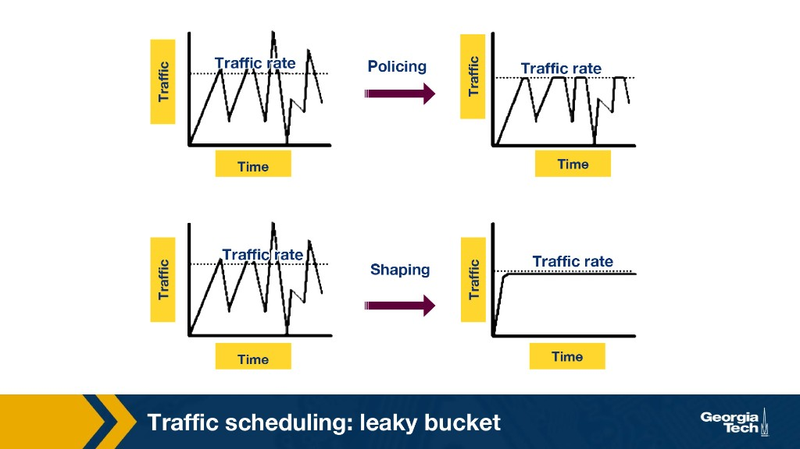{ width="700" }

Traffic shaping and policing can work in tandem.

### The Leaky Bucket Algorithm

The leaky bucket is analogous to water flowing into a leaky bucket, with water leaking at a **constant rate**:

- The bucket (capacity **b**) represents a buffer holding packets; water corresponds to incoming packets.
- The **leak rate r** is the constant rate at which packets are allowed to enter the network, regardless of arrival rate.
- If an arriving packet does not cause overflow, it is **conforming** and added to the bucket. Otherwise, it is **non-conforming** and **discarded**.
- If the bucket is full, the new packet is dropped.
- Irrespective of input rate, the **output rate is constant**, producing uniform packet distribution. Can be implemented as a single-server queue.

{ width="700" }

!!! info "Reference"
    Kurose & Ross, Edition 6, Section 7.5.2

---

## What is token bucket shaping?

Token bucket shaping limits flow burstiness without requiring a separate queue per flow type:

- A bucket per flow fills with tokens at rate **R** bits/second, up to maximum **B** tokens.
- If the bucket is full, additional tokens are dropped.
- A packet passes if enough tokens exist ($\geq$ packet size in bits); otherwise it **waits** until tokens accumulate.
- Burst size is limited to **B** bits.

Implemented via a counter (max B, decremented on send) and a timer (increments at rate R). **Drawback:** requires one queue per flow. **Token bucket policing** (modified version) drops packets when no tokens are available, allowing a single shared queue.

---

## In traffic scheduling, what is the difference between policing and shaping?

Both mechanisms limit output link rate by identifying traffic descriptor violations:

**Policing** — Excess traffic is **dropped** or **marked** when the configured rate is exceeded. Output appears as a saw-toothed wave with peaks clipped at the threshold.

**Shaping** — Excess packets are **buffered** and scheduled for later transmission. Traffic is delayed rather than dropped, producing a smooth, constant output rate.

| Aspect | Shaping | Policing |
|--------|---------|----------|
| **Action on excess** | Buffer/delay | Drop/mark |
| **Buffering** | Required | Not required |
| **Output pattern** | Smooth, constant | Saw-toothed (clipped peaks) |
| **Use case** | Smooth outbound traffic | Enforce SLAs, inbound rate limits |

Policing and shaping can work in tandem.

---

## How is a leaky bucket used for traffic policing and shaping?

The **leaky bucket** algorithm models a bucket of capacity **b** that holds packets, leaking at constant rate **r**:

- **Conforming packets** (don't cause overflow) are added to the bucket.
- **Non-conforming packets** (would overflow) are discarded.
- Output rate is **constant** regardless of input burstiness.

**For policing:** When the bucket is full, arriving packets are dropped. Excess traffic is discarded; output shows saw-toothed clipping at the rate threshold.

**For shaping:** Excess packets are buffered in the bucket and released at the constant leak rate r. Bursts are smoothed into a steady output stream.

**Difference from token bucket:** Leaky bucket enforces a strict constant output rate (no bursting). Token bucket allows controlled bursts up to B while limiting average rate to R.
