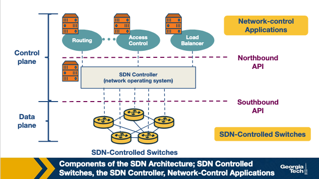

---
tags:
  - lesson-07
  - sdn
  - control-plane
  - openflow
  - plain-language
search:
  boost: 2
---

# Lesson 7: SDN (Part 1) — Plain-Language Guide

This is the easy-to-digest version of [Lesson 7](sdn-1.md). For exam-focused compression, use the **[Quick Study Guide](quick-study-guide.md)** and then the **[Quiz](quiz.md)**.

!!! tip "Exam prep"
    Use this sequence: **[Full guide](sdn-1.md)** → **[Quick Study Guide](quick-study-guide.md)** → **[Quiz](quiz.md)**. Router design context is in [Lesson 6](../lesson-06/router-design-2.md).

---

## Summary

**Software Defined Networking (SDN)** separates a network's **brain** (control plane) from its **muscles** (data plane). A **controller** computes forwarding rules; **switches** execute them at line rate. That makes large networks easier to program, debug, and keep consistent.

---

## The one-sentence version

SDN turns networking from "configure every box separately" into "write software once and push consistent rules to many switches."

---

## Why SDN happened

Networks became unmanageable because:

- **Too many device types** — routers, firewalls, load balancers, NATs, IDSs, each with its own knobs
- **Vendor lock-in** — closed software and different CLIs per vendor (sometimes per product line)

Result: slow innovation, high cost, error-prone management. SDN's fix: **divide and conquer** — split control from forwarding, like modular code.

---

## Control plane vs data plane (plain version)

| Plane | Job | Speed |
|------|-----|-------|
| **Control plane** | **Routing** — compute paths and policies | Slower (seconds) |
| **Data plane** | **Forwarding** — send each packet out the right port | Fast (nanoseconds) |

**Memory trick:** Routing **computes** the map; forwarding **uses** the map.

---

## The 3-phase SDN story

| Phase | Era | Plain idea |
|-------|-----|------------|
| **1. Active networks** | mid-1990s | "Let packets carry programs" — too ambitious, but planted programmability |
| **2. Control/data separation** | ~2001–2007 | Pull routing brain off the router; one controller, many switches |
| **3. OpenFlow + NOS** | ~2007–2010 | Standard API + "network operating system" — actually deployable |

**Active networks** had two flavors: **capsule** (code in packets) vs **programmable router** (code installed out-of-band). They also foreshadowed **NFV** (unified middlebox control).

**Separation phase** pushed **control-plane** programmability (not end users writing Java on routers).

**OpenFlow era:** each switch has a **flow table** — match fields, actions, counters, priority.

---

## Traditional vs SDN (one picture)

**Traditional:** every router runs routing protocols and builds its own table.

**SDN:** a **remote controller** builds tables and **pushes** rules; switches just forward.

The controller can live in a data center — physically separate from switches.

---

## SDN architecture (3 components)

{ width="600" }

| Piece | Role |
|-------|------|
| **Switches** (bottom) | Data plane — forward using flow rules |
| **Controller** (middle) | Network OS — global view, APIs |
| **Apps** (top) | Routing, ACL, load balancing, etc. |

- **Southbound** = controller **down** to devices (OpenFlow)
- **Northbound** = controller **up** to apps (often REST)

---

## Four defining SDN features

1. **Flow-based forwarding** — match on many header fields, not just destination IP
2. **Control/data separation**
3. **Network control functions** — controller + apps share network state
4. **Programmable network** — apps are the policy "brain"

---

## Controller internals (3 layers)

Bottom to top:

1. **Communication (southbound)** — talk to switches, receive events
2. **State management** — topology, hosts, links, flow table copies
3. **App interface (northbound)** — REST APIs for applications

Controllers are often **logically one brain, physically many servers** (OpenDaylight, ONOS) for reliability.

---

## Why separation helps (plain list)

- Update routing software without replacing hardware
- Debug network behavior in one place
- Apply consistent policy across the whole network

**Where it shines:** data centers, richer path control than BGP alone, enterprise DDoS defense, research testbeds.

---

## OpenDaylight (optional lab context)

**OpenDaylight** is a real open-source controller. Its **MD-SAL** layer sits between plugins and apps, with separate **config** vs **operational** datastores. The course lab uses **Mininet** + **Karaf** + **DLUX** at `localhost:8181` — see the [full guide](sdn-1.md) for commands.

---

## High-yield plain-language Q&A

### Why separate control from data?

So control logic can evolve in software while forwarding stays fast in hardware.

### Is SDN always one physical controller?

No — **logically** centralized, often **physically** distributed.

### What changed with OpenFlow?

A **standard** way for controllers to program switch forwarding tables.

### Routing vs forwarding?

Routing = control plane, builds tables. Forwarding = data plane, uses tables per packet.

---

## The whole lesson on one napkin

```
Problem: diverse boxes + vendor lock-in → complex, slow, expensive

Fix: SDN = separate control (brain) from data (muscle)

History: Active nets → plane separation → OpenFlow/NOS

Architecture:
  Apps (routing, ACL, LB)
       ↕ northbound
  Controller (global state)
       ↕ southbound
  Switches (flow tables)

Core features: flow-based rules, decoupling, apps, programmability
```

---

## Where to go next

| You want... | Go here |
|-------------|---------|
| Full explanation | [Lesson 7 full guide](sdn-1.md) |
| Exam cram | [Quick Study Guide](quick-study-guide.md) |
| Practice | [Lesson 7 Quiz](quiz.md) |
| SDN Part 2 (OpenFlow pipeline, ONOS, P4) | [Lesson 8](../lesson-08/sdn-2.md) |
