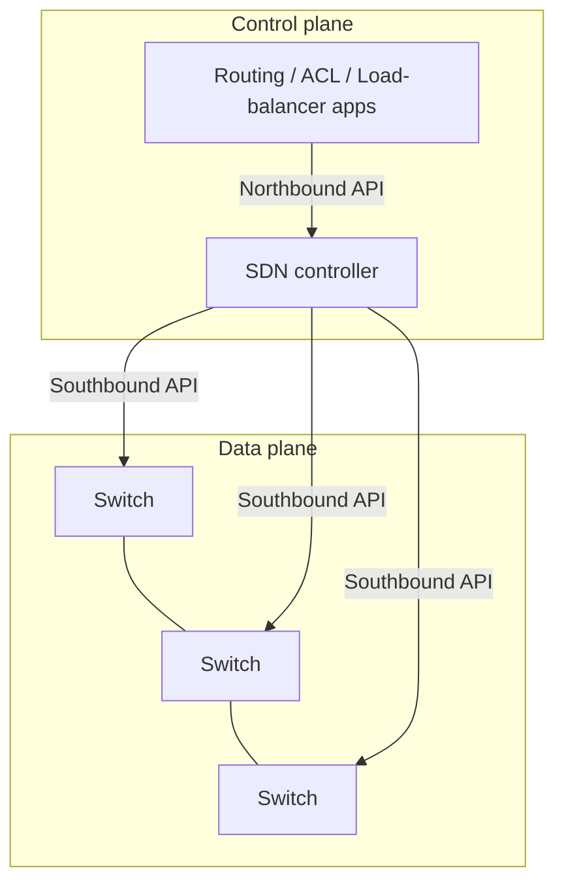
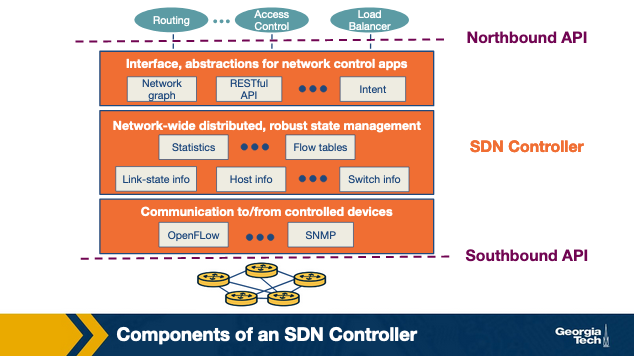
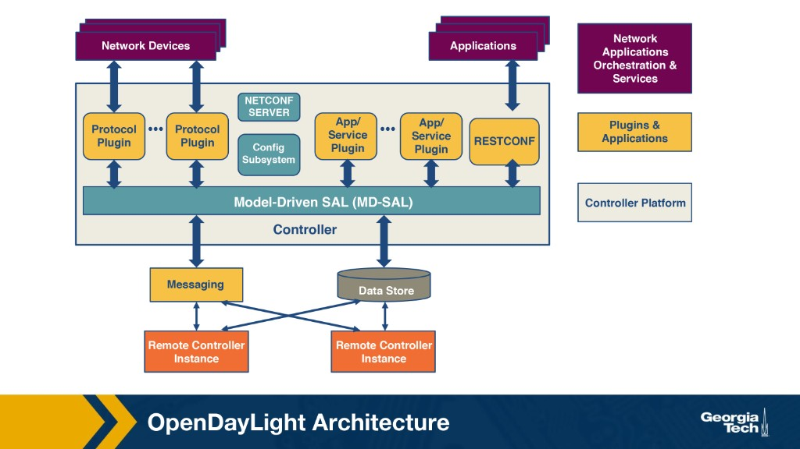
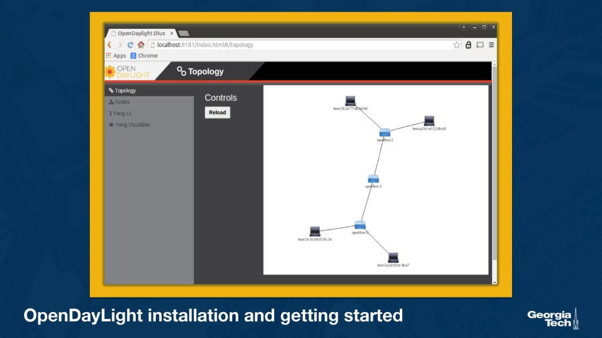

---
tags:
  - lesson-07
  - sdn
  - openflow
  - control-plane
---

# Lesson 7: Software Defined Networking (Part 1)

Why **Software Defined Networking (SDN)** emerged, how control and data planes separated historically, and the three-tier SDN architecture (switches, controller, applications). Part 2 ([Lesson 8](../lesson-08/sdn-2.md)) covers OpenFlow pipelines, ONOS, P4, and SDX.

!!! tip "Exam prep"
    New to the material? Start with the **[Plain-language guide](plain-language.md)**. Condensed review: **[Quick Study Guide](quick-study-guide.md)**. Interactive practice: **[Lesson 7 Quiz](quiz.md)**. Router design context: **[Lesson 5](../lesson-05/router-design-1.md)** / **[Lesson 6](../lesson-06/router-design-2.md)**.

**Course references:** Module 7 pages (What led us to SDN, SDN history, control/data separation, SDN architecture, SDN controller), Kurose & Ross Ch. 4.4 (Generalized Forwarding and SDN), Ch. 5.5 (The SDN Control Plane).

**Important readings:** [The Road to SDN: An Intellectual History of Programmable Networks](https://www.cs.princeton.edu/courses/archive/fall13/cos597E/papers/sdnhistory.pdf), [Software-Defined Networking: A Comprehensive Survey](https://arxiv.org/pdf/1406.0440.pdf), [ONOS: Towards an Open, Distributed SDN OS](https://classpages.cselabs.umn.edu/Fall-2019/csci8211/Papers/SDN%20Controller%20ONOS-hotsdn14.pdf).

**Optional readings:** [SDN Controllers: Benchmarking & Performance Evaluation](https://arxiv.org/pdf/1902.04491.pdf), [SDN Architecture (ONF TR)](https://www.opennetworking.org/wp-content/uploads/2013/02/TR_SDN_ARCH_1.0_06062014.pdf).

---

## What led us to SDN?

**Software Defined Networking (SDN)** arose as networks became harder to **program** and **manage**. Two structural problems dominated:

### Diversity of equipment

Networks mix routers, switches, and **middleboxes** — firewalls, NATs, load balancers, intrusion detection systems (IDSs), and more. Each device type speaks different protocols and exposes different configuration interfaces. Even with a central management console, operators still configure **per-protocol, per-mechanism, per-device** behavior. Network management stays fragmented and complex.

### Proprietary technologies

Routers and switches typically run **closed, vendor-specific** software. Configuration CLIs differ across vendors — and sometimes across product lines from the same vendor. Centralized management across heterogeneous gear is therefore difficult.

These traits made networks **complex**, **slow to innovate**, and **expensive** to operate. SDN's core response is **separation of tasks**: decouple the **control plane** (decision logic) from the **data plane** (forwarding), the same way modular software divides focused functions.

!!! abstract "Takeaway"
    SDN targets operational complexity and closed boxes by **centralizing control logic** and exposing **open, programmable interfaces** to forwarding hardware.

---

## What spurred the development of Software Defined Networking (SDN)?

The Canvas study questions compress the motivation above into exam-ready bullets:

| Pain point | Why it hurt | SDN direction |
|------------|-------------|---------------|
| **Coupled control + forwarding** | Every box runs its own routing logic; no global policy view | Logically centralized controller |
| **Limited programmability** | Operators cannot easily customize or automate behavior | Software apps on a **Network Operating System (NOS)** |
| **Slow innovation** | Vendor lock-in and closed implementations | Open southbound APIs (e.g., **OpenFlow**) |
| **Inconsistent policy** | Per-device configuration → misconfigurations | Network-wide state + coordinated rule installation |
| **Research needs** | Hard to experiment on production hardware | Programmable testbeds without replacing switches |

---

## What are the three phases in the history of SDN?

Based on [The Road to SDN](https://www.cs.princeton.edu/courses/archive/fall13/cos597E/papers/sdnhistory.pdf):

1. **Active networks** (mid-1990s – early 2000s)
2. **Control and data plane separation** (~2001–2007)
3. **OpenFlow API and network operating systems** (~2007–2010)

---

## Summarize each phase in the history of SDN

### Phase 1: Active networks (mid-1990s – early 2000s)

Internet growth drove demand for new services, but **IETF standardization** was slow. **Active networking** proposed a **network API** that exposed node resources and let operators customize behavior for subsets of packets — challenging the "dumb core" design philosophy.

Two programming models:

| Model | Where code lives | Idea |
|-------|------------------|------|
| **Capsule model** | **In-band** in data packets | Packets carry programs executed at routers |
| **Programmable router/switch model** | **Out-of-band** | Operator installs code on nodes |

**Technology push:** cheaper CPUs, portable languages (Java/VMs), rapid compilation, DARPA funding for interoperability.

**Use pull:** provider frustration with slow service deployment; third-party value-add; large-scale experimentation; **unified control over middleboxes** (foreshadowing **NFV**).

**Contributions to later SDN:**

- Programmable network functions to lower innovation barriers (data-plane focus)
- **Network virtualization** and demultiplexing traffic to software by header fields
- Vision of unified middlebox orchestration (not fully realized then)

**Why it faded:** too ambitious (users writing Java on routers), weak short-term use cases, insufficient emphasis on performance and security. Next phases narrowed scope to **control-plane** programmability with clearer deployment paths.

### Phase 2: Control and data plane separation (~2001–2007)

Traffic growth made **reliability, predictability, and traffic engineering** critical. Researchers noticed that **tight integration** of control and forwarding inside each router was the management bottleneck.

**Technology push:**

- High-speed links → forwarding moved into **hardware**, naturally splitting from control software
- ISPs struggled with scale, VPNs, and reliability
- Servers gained enough memory/CPU to hold **entire-ISP routing state** on one machine
- **Open-source routing stacks** lowered the cost of prototype centralized controllers

**Two main innovations:**

1. **Open interface** between control and data planes
2. **Logically centralized control** of the network

Compared to active networks, this phase:

- Targeted **network administrators**, not end-user programmers
- Emphasized **control-plane** programmability
- Pursued **network-wide visibility** instead of per-device knobs

**Use pull:** load-aware path selection; minimizing disruption during planned changes; attack traffic redirection/dropping; customer traffic control; VPN value-added services.

**Concepts carried forward:** logically centralized control via an open data-plane interface; **distributed state management** techniques. Early skepticism (controller failure? loss of common network view?) pushed better fault-tolerance thinking.

Representative projects: **RCP (Routing Control Platform)**, **4D architecture**.

### Phase 3: OpenFlow API and network operating systems (~2007–2010)

**OpenFlow** balanced **research programmability** with **deployability** on existing switch ASICs. Each switch holds a **flow table** of rules: **match pattern**, **actions**, **counters**, **priority**. On arrival, the switch applies the **highest-priority matching rule**.

**Technology push:**

- Chip vendors already exposed limited programmable forwarding
- OpenFlow enabled third-party switches without custom silicon
- Early versions needed only a **firmware upgrade** on supported hardware

**Use pull:** campus and WAN **OpenFlow testbeds**; **data-center** traffic management at scale; industry shift toward hiring **control programmers** instead of proprietary feature boxes.

**Key effects:**

- **Generalized** network devices and functions beyond destination-IP forwarding
- **Network operating system** abstraction above switches
- Mature **distributed state management** for production controllers

OpenFlow details and pipeline semantics continue in **[Lesson 8](../lesson-08/sdn-2.md)**.

---

## What is the function of the control and data planes?

Two essential **network-layer** functions:

| | **Forwarding** | **Routing** |
|---|----------------|-------------|
| **Plane** | **Data plane** | **Control plane** |
| **What** | Per-packet: consult forwarding table → output port (or drop/duplicate) | End-to-end: compute paths across the network |
| **Speed** | Nanoseconds (often hardware) | Seconds (software) |
| **Scope** | Local lookup at each device | Network-wide algorithm / policy |

**Forwarding** reads packet headers and the **forwarding table**. **Routing** runs **routing algorithms** and protocols to **build** that table.

!!! tip "Memory aid"
    **Routing** computes the map; **forwarding** drives using the map. (Same framing as [Lesson 3](../lesson-03/intradomain-routing.md).)

!!! warning "Exam point"
    **Routing** is a **control-plane** function. **Forwarding** is a **data-plane** function. (Course video errata: audio at ~0:55 incorrectly says routing is on the data plane — slides and text are correct.)

---

## What is the relationship between forwarding and routing?

**Routing** **produces** forwarding state (tables, flow rules). **Forwarding** **consumes** that state packet-by-packet.

- **Routing** = global, slower, software-heavy
- **Forwarding** = local, line-rate, often hardware

In traditional routers both live on the same box. In SDN, routing logic moves to a **remote controller** that **distributes** forwarding tables to switches.

---

## What is the difference between a traditional and SDN approach in terms of coupling of control and data plane?

### Traditional approach

Each router **runs routing protocols**, participates in distributed computation, and **locally builds** its forwarding table. Control and data planes are **tightly coupled** inside the device. No single entity holds a complete network view.

{ width="700" }

### SDN approach

A **logically centralized controller** (often physically distributed for fault tolerance) computes forwarding rules and **pushes** them to switches. Switches **only forward** according to installed rules — the network is **software-defined** because control runs as open software, frequently on commodity servers.



---

## Why separate the control from the data plane?

| Reason | Explanation |
|--------|-------------|
| **Independent evolution** | Forwarding ASICs optimize for speed; control software can change without hardware upgrades — and vice versa |
| **Control from high-level software** | Forwarding tables computed by programs → easier debugging, verification, and automation |
| **Centralized network view** | One place to enforce consistent policy (traffic engineering, security, ACLs) |

### Opportunities in practice

| Domain | SDN benefit |
|--------|-------------|
| **Data centers** | Manage thousands of servers/VMs; dynamic paths for migration and load balancing |
| **Routing** | **BGP** path selection is constrained; SDN enables richer multi-criteria path control |
| **Enterprise networks** | Drop **DDoS** traffic at strategic points; unified security policy |
| **Research networks** | Experimental and production traffic coexist (slicing / isolation) |

---

## What are the main components of an SDN network and their responsibilities?

Three layers (infrastructure, control, applications):

{ width="700" }

| Component | Layer | Responsibility |
|-----------|-------|----------------|
| **SDN-controlled network elements** (switches) | Data / infrastructure | Forward traffic using controller-installed **flow rules** |
| **SDN controller** | Control | **Network OS** — global state, southbound/northbound APIs between devices and apps |
| **Network-control applications** | Application | Implement routing, access control, load balancing, monitoring, analytics |

**Northbound API** (dashed line above controller): applications → controller.  
**Southbound API** (dashed line below controller): controller → switches.

Example apps: run **Dijkstra** end-to-end path computation; install ACL drops; rebalance flows.

---

## What are the four defining features of an SDN architecture?

1. **Flow-based forwarding** — Rules match on multiple header fields (transport, network, link layers), not only destination IP. **OpenFlow** historically matched up to **11** header fields.

2. **Separation of data plane and control plane** — Switches execute flow tables; separate servers compute and manage rules.

3. **Network control functions** — The control plane comprises the **controller** plus **network applications**. The controller maintains topology, hosts, links, switch flow tables; apps consume that state to monitor and control the network.

4. **A programmable network** — Applications are the "brain" of control: traffic engineering, security, automation, analytics — written as software atop the controller.

!!! warning "Exam point"
    The fourth feature is **programmability through applications**, not merely "one physical box called a controller."

---

## What are the three layers of SDN controllers?

The controller is **part of the SDN control plane** — the interface between **network elements** and **network-control applications**. Internally it has three layers (bottom to top):

{ width="700" }

### 1. Communication layer (southbound)

Protocol between controller and devices. Switches send **events** (join, heartbeat, link up/down, packet-in) so the controller maintains current state. **OpenFlow** is the canonical example.

### 2. Network-wide state-management layer

Stores **hosts, links, switches**, copies of **flow tables**, statistics, link-state information — everything apps need to configure forwarding.

### 3. Interface to network-control applications (northbound)

Apps **read/write** network state and flow tables; the controller **notifies** apps of device events. Often implemented as **REST** APIs.

| Interface | Direction | Typical protocol/API |
|-----------|-----------|----------------------|
| **Southbound** | Controller → devices | OpenFlow, NETCONF, SNMP, … |
| **Northbound** | Controller → applications | REST, intent APIs, network graph abstractions |

### Distributed controllers

Externally the controller looks like one service; internally it often runs on **multiple servers** for fault tolerance and scale. **OpenDaylight** and **ONOS** synchronize state across instances — covered further in [Lesson 8](../lesson-08/sdn-2.md).

---

## Optional: OpenDaylight architecture overview

**OpenDaylight (ODL)** is an open-source SDN controller platform. Beyond generic three-layer controller design, ODL adds a **Model-Driven Service Abstraction Layer (MD-SAL)** at its core.

{ width="700" }

| Piece | Role |
|-------|------|
| **Southbound plugins** | OpenFlow, NETCONF, NETFLOW, vendor protocols; extensible via plugins |
| **Northbound (RESTCONF)** | Applications query and configure controller state |
| **MD-SAL** | Abstraction layer for services and protocol drivers (Karaf runtime) |
| **Config datastore** | Intended network representation; validates and stages configuration changes |
| **Operational datastore** | **Actual** network state after changes commit to devices |
| **Message bus** | Inter-service notifications inside the controller |
| **Messaging + data store** | Support **remote controller instances** in a cluster |

!!! info "Reference"
    OpenDaylight Application Developer's Tutorial (Canvas optional reading).

---

## Optional: Hands-on OpenDaylight (getting started)

Lab-oriented steps from the course — useful context for the **SDN Firewall** project:

| Step | Command / URL |
|------|---------------|
| Start Karaf | `cd <distribution-folder> && bin/karaf` |
| Install L2 switch feature | `feature:install odl-l2switch-switch-ui` (after `feature:list \| grep l2switch`) |
| Mininet topology | `sudo mn --switch ovs --controller ref --topo tree,depth=2,fanout=8 --test pingall` |
| DLUX UI | `feature:install odl-dlux-all` → `http://localhost:8181/index.html` (admin/admin) |
| RESTCONF config | `http://localhost:8181/restconf/config/*` (CRUD, persistent) |
| RESTCONF operational | `http://localhost:8181/restconf/operational` (GET only — live state) |

{ width="700" }

Example flow install (config datastore):

```
PUT http://localhost:8181/restconf/config/opendaylight/opendaylight-inventory:nodes/node/openflow:1/table/0/flow/1
```

Logs: `<distribution-folder>/data/log/karaf.log` or `log:display` in the Karaf console.

---

## SDN Firewall project (course assignment)

The **SDN Firewall** assignment applies Part 1 concepts: implement an **externally configurable firewall** in **Mininet** using SDN — rules in code describe disallowed traffic by **protocol** and **topology parameters**. It exercises the controller ↔ switch ↔ application loop you study here; OpenFlow rule semantics are detailed in **[Lesson 8](../lesson-08/sdn-2.md)**.

---

## Where this lesson fits

| Prior | This lesson | Next |
|-------|-------------|------|
| [Lesson 5](../lesson-05/router-design-1.md) / [6](../lesson-06/router-design-2.md) — router data/control planes, classification | SDN motivation, history, architecture, controller layers | [Lesson 8](../lesson-08/sdn-2.md) — OpenFlow pipeline, ONOS, P4, SDX |
