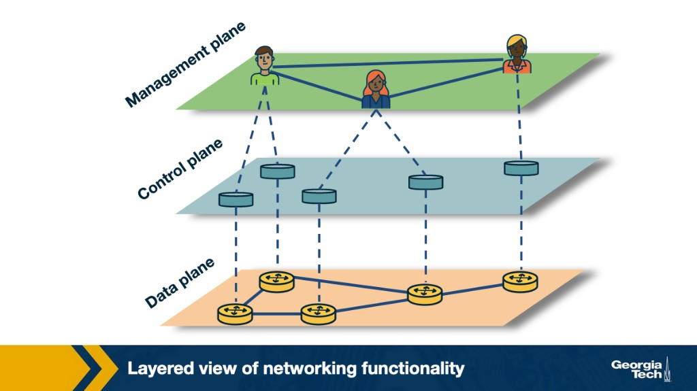
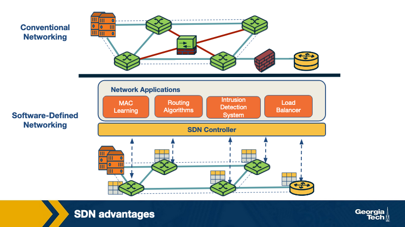
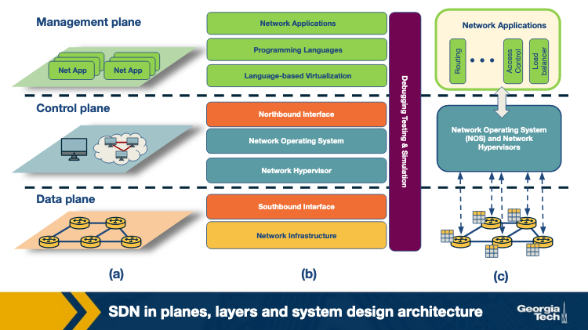
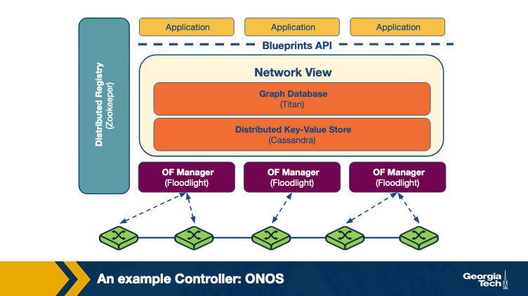
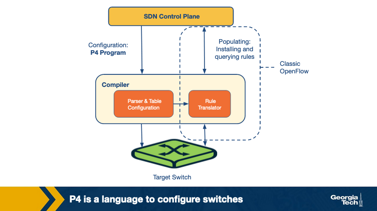
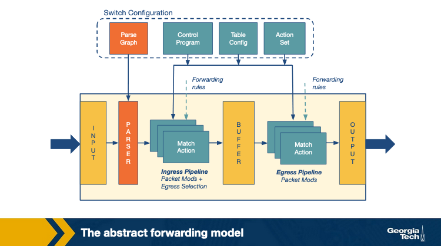
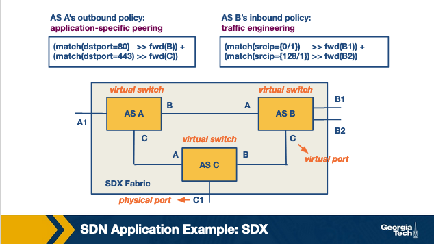

---
tags:
  - lesson-08
  - sdn
  - openflow
  - onos
  - p4
  - sdx
  - plain-language
search:
  boost: 2
---

# Lesson 8: SDN (Part 2) — Plain-Language Guide

This is the simplified version of [Lesson 8](sdn-2.md). For compressed exam prep, use the **[Quick Study Guide](quick-study-guide.md)** and then the **[Quiz](quiz.md)**.

!!! tip "Exam prep"
    Follow this path: **[Full guide](sdn-2.md)** → **[Quick Study Guide](quick-study-guide.md)** → **[Quiz](quiz.md)**. Part 1: [Lesson 7](../lesson-07/sdn-1.md).

---

## Summary

Part 2 is the **systems view** of SDN: how layers stack, how **OpenFlow** pipelines work, why controllers go **distributed**, how **ONOS** stays up when nodes fail, and how **P4** programs the data plane beyond fixed OpenFlow match fields.

---

## The one-sentence version

SDN Part 2 turns "central brain + dumb switches" into a full stack — APIs, controllers, languages, apps — that can scale, survive failures, and reprogram how packets are parsed.

---

## Why SDN (again, in plain terms)

Traditional networks are **hard to change** (policy on every box, ~10-year protocol rollouts) and **tightly coupled** (control + forwarding in one device).

SDN splits the brain out. Production still uses **many controller machines** for speed and reliability.

### Three planes

{ width="550" }

| Plane | Plain job |
|-------|-----------|
| **Management** | Operators set policy (SNMP, consoles) |
| **Control** | Controller + apps decide paths and rules |
| **Data** | Switches forward packets |

Policy flows **down**: management → control → data.

---

## SDN vs conventional (why it's better)

{ width="550" }

Old way: buy a **middlebox** (firewall, LB) and **park it** in the topology.

SDN way: middlebox logic is an **app on the controller** — shared APIs, same network view, can act from anywhere, easier to combine (LB + routing in sequence).

---

## Three ways to view SDN

{ width="550" }

| View | Emphasis |
|------|----------|
| **Planes** | Management / control / data |
| **Layers** | Infrastructure → southbound → NOS → northbound → languages → apps |
| **System design** | Apps talk to NOS; NOS programs switches via southbound |

---

## SDN landscape (8 layers, simplified)

Bottom to top: **switches** → **southbound (OpenFlow)** → **virtualization** → **NOS (ONOS, ODL)** → **northbound APIs** → **languages (Frenetic, Pyretic)** → **apps (routing, security, TE)**.

OpenFlow is the de facto **southbound** standard. **Northbound** still has no single standard.

---

## OpenFlow switch in plain words

Each flow table entry = **match** + **actions** + **counters**.

When a packet arrives: start at Table 0 → match or miss → actions like forward, drop, send to controller, or **GoTo next table**.

**Pipeline trick:** ACL in table 0, routing in table 1, QoS in table 2.

Controller learns from switches via:

- **Events** (link up/down)
- **Statistics** (counters)
- **Packet-in** (unknown flow)

---

## Centralized vs distributed controllers

| | Centralized | Distributed |
|---|-------------|-------------|
| **Good** | Simple | Scales, survives failures |
| **Bad** | Single point of failure | Must sync state across nodes |

Examples: **Beacon** (fast single node), **ONOS** (cluster).

---

## ONOS in plain language

{ width="550" }

**ONOS** = distributed controller built from **Floodlight** ideas.

- **Global network view** — all instances see the same topology (Titan + Cassandra)
- **Apps** use **Blueprints API**
- **OF Managers** push OpenFlow to switches
- Each switch has one **master** ONOS instance; **Zookeeper** tracks mastership
- If a controller dies, switches pick a **new master** from remaining connections

---

## P4 in plain language

{ width="550" }

**OpenFlow** = fixed parser, tables only in series.

**P4** = **programmable parser**, tables in **series or parallel**, works on many device types. Compiler maps one program to different hardware.

Two steps:

- **Configure** — define parser + pipeline (what the switch *can* do)
- **Populate** — add/delete table entries (what policy *applies* now)

{ width="550" }

Packet path: Input → Parser → Ingress match+action → Buffer → Egress match+action → Output.

**TDGs (Table Dependency Graphs):** compiler builds these from your P4 to decide table order; independent tables can run in parallel. Example: L2/L3 switch with routing miss → L2, routing hit → L3, both → access control.

---

## SDN application areas (five buckets)

| Area | One-line idea | Examples |
|------|---------------|----------|
| **Traffic engineering** | Optimize power, load, paths | ElasticTree, Plug-n-Serve |
| **Mobility & wireless** | Programmable WiFi/cellular | OpenRadio, Odin, LVAPs |
| **Measurement** | Stats without melting controller | OpenSketch, PayLess |
| **Security** | DDoS, anomalies, entry policy | OF-RHM, CloudWatcher |
| **Data centers** | Live migration, anomaly detect | LIME, FlowDiff |

---

## SDX (still on the exam)

{ width="550" }

**SDX** = SDN at **Internet exchange points**. BGP tells you what's reachable; SDX lets you steer **how** traffic flows.

**BGP limits SDX fixes:** destination-prefix-only routing; no direct end-to-end path control.

Each AS gets a **virtual switch** to every other participant. Policies written in **Pyretic**:

```python
(match(dstport = 80) >> fwd(B)) + (match(dstport = 443) >> fwd(C))
```

- `>>` = then (sequential)
- `+` = parallel policies; no match → **drop**
- `fwd(B)` = send toward AS B's virtual port

**Wide-area uses:** app-specific peering, inbound TE by source IP/port, anycast load balancing (rewrite dest IP at IXP), middlebox chains.

SDX works **with** BGP, not as a full replacement.

---

## The whole lesson on one napkin

```
3 planes: management → control → data

SDN wins: apps not boxes, global view, flexible placement

Landscape: switches + southbound + NOS + northbound + langs + apps

OpenFlow: flow tables, pipeline, packet-in/events/stats

Controllers: centralized (simple) vs distributed (scale/HA)
ONOS: shared view, Zookeeper mastership, failover

P4: configure parser/pipeline; OpenFlow populates rules
  Parser programmable; tables series OR parallel
  TDG = compiler dependency graph

SDN apps: TE, wireless, monitoring, security, data centers

SDX: virtual switch per AS, Pyretic policies
  BGP limits: dest-prefix only, weak path control
  >> sequential, + parallel, no match = drop
```

---

## Where to go next

| You want... | Go here |
|-------------|---------|
| Full Part 2 details | [Lesson 8 full guide](sdn-2.md) |
| Exam compression | [Quick Study Guide](quick-study-guide.md) |
| Practice | [Lesson 8 Quiz](quiz.md) |
| Part 1 foundations | [Lesson 7](../lesson-07/sdn-1.md) |
| Security | [Lesson 9](../lesson-09/security.md) |
