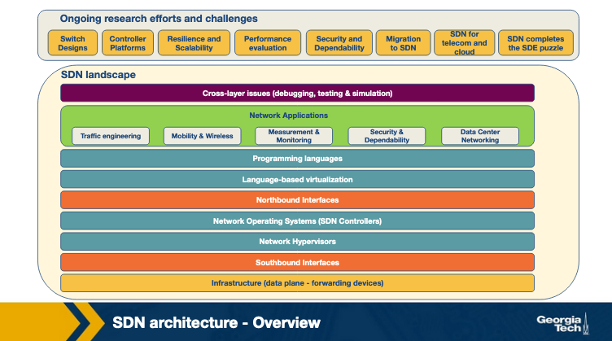
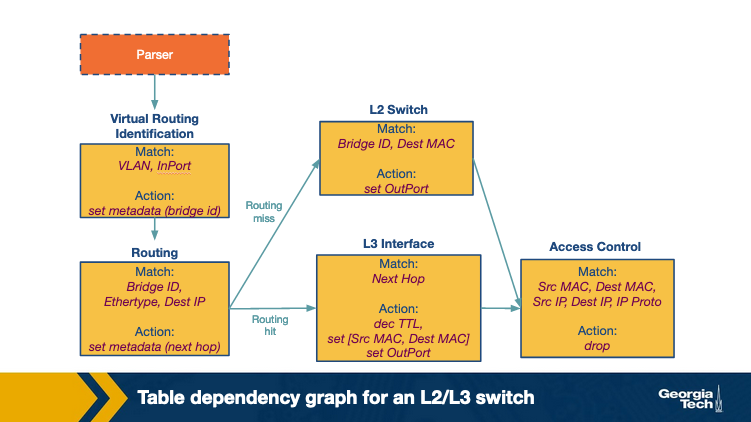

---
tags:
  - lesson-08
  - sdn
  - openflow
  - onos
  - p4
  - sdx
---

# Lesson 8: Software Defined Networking (Part 2)

SDN landscape, OpenFlow infrastructure, southbound APIs, centralized vs distributed controllers, **ONOS**, and **P4** data-plane programmability. Part 1 ([Lesson 7](../lesson-07/sdn-1.md)) covers SDN motivation, history, and three-tier architecture.

!!! tip "Exam prep"
    New to the material? Start with the **[Plain-language guide](plain-language.md)**. Condensed review: **[Quick Study Guide](quick-study-guide.md)**. Interactive practice: **[Lesson 8 Quiz](quiz.md)**.

**Course references:** Module 8 pages (SDN motivation, landscape, infrastructure, southbound, controllers, ONOS, P4 forwarding model, SDN applications, SDX), Kurose & Ross Ch. 4.4, Ch. 5.5.

**Important readings:** [Software-Defined Networking: A Comprehensive Survey](https://arxiv.org/pdf/1406.0440.pdf), [ONOS: Towards an Open, Distributed SDN OS](https://classpages.cselabs.umn.edu/Fall-2019/csci8211/Papers/SDN%20Controller%20ONOS-hotsdn14.pdf), [P4: Programming Protocol-Independent Packet Processors](https://www.cs.princeton.edu/~jrex/papers/P4-ccr14.pdf), [A Software-Defined Internet Exchange](https://dl.acm.org/doi/pdf/10.1145/2740070.2626300).

**Optional readings:** [SDN Controllers: Benchmarking & Performance Evaluation](https://arxiv.org/pdf/1902.04491.pdf), [P4 Language Tutorial](https://github.com/p4lang/tutorials/tree/master/exercises/basic), [An Industrial-Scale SDX (NSDI'16)](https://www.usenix.org/system/files/conference/nsdi16/nsdi16-paper-gupta.pdf).

---

## Revisiting the motivation for SDN

As IP networks scaled globally, two problems intensified:

| Challenge | Traditional impact |
|-----------|-------------------|
| **Growing complexity and dynamics** | Policies require **per-device**, vendor-specific manual configuration — far from automatic response to change |
| **Tightly coupled architecture** | Control and data planes bundled inside each box; protocol updates can take **~10 years** to propagate fleet-wide |

**SDN** separates **control logic** from the **data plane**. Switches **forward**; a **logically centralized controller** (a **Network Operating System**) implements control in software — enabling faster innovation in reconfiguration and policy enforcement.

Production SDNs still need a **physically distributed** control plane for performance, reliability, and scale. The controller programs switches through a **southbound API** (e.g., **OpenFlow**). An OpenFlow switch holds **flow tables**; rules match traffic subsets and **drop, forward, modify**, etc. — letting one device act as firewall, router, load balancer, or traffic shaper.

SDN introduces **separation of concerns** among:

- **Policy definition** (what should happen)
- **Hardware implementation** (how tables are programmed)
- **Traffic forwarding** (execution at line rate)

{ width="700" }

### Three planes of functionality

| Plane | Role | Example |
|-------|------|---------|
| **Management plane** | Monitor and configure control functionality | SNMP-based tools, operator consoles |
| **Control plane** | Determine paths; populate forwarding state via protocols | SDN controller + apps |
| **Data plane** | Forward packets/frames per installed rules | OpenFlow switches |

**Flow:** policy defined in the **management plane** → enforced by the **control plane** → executed by the **data plane**.

---

## SDN advantages over conventional networks

**Conventional networks** tightly couple control and data planes inside each device. Adding features often means **firmware/hardware upgrades** on every box — or deploying specialized **middleboxes** (load balancers, IDSs, firewalls) at fixed topology locations that are hard to move later.

**SDN** decouples control; middlebox functions become **controller applications**.

{ width="700" }

| Advantage | Explanation |
|-----------|-------------|
| **Shared abstractions** | Control platform and network programming languages let multiple services reuse the same APIs |
| **Consistent network information** | All apps share one **global view** → consistent policy; reusable control modules |
| **Locality of functionality** | Middlebox logic need not live at a fixed physical box — apps can act from anywhere |
| **Simpler integration** | Compose services sequentially (e.g., load balancing then routing) in software |

---

## Describe the three perspectives of the SDN landscape

The SDN architecture decomposes into **three perspectives** (columns **a**, **b**, **c** in the course figure):

{ width="700" }

| Perspective | What it shows |
|-------------|---------------|
| **(a) Plane-oriented** | **Management**, **control**, and **data** planes as conceptual layers |
| **(b) Layered architecture** | Functional blocks per plane: apps, languages, northbound/southbound APIs, NOS, hypervisor, infrastructure; plus cross-cutting **debugging, testing & simulation** |
| **(c) System design** | Concrete components: routing/ACL/load-balancer apps → **NOS** → switches with **flow tables**, connected by northbound and southbound interfaces |

---

## The SDN landscape — layer by layer

{ width="700" }

| Layer | Function | Representative technologies |
|-------|----------|----------------------------|
| **1. Infrastructure** | Forwarding elements (routers, switches, appliances) — simple forwarding only | Open vSwitch, SwitchLight, Pica8 |
| **2. Southbound interfaces** | Bridge control ↔ data plane; tightly coupled to forwarding hardware | **OpenFlow**, ForCES, OVSDB, POF, OpFlex |
| **3. Network virtualization** | Arbitrary topologies and addressing beyond box-by-box VLAN/NAT/MPLS config | VxLAN, NVGRE, FlowVisor, FlowN, NVP |
| **4. Network operating systems (NOS)** | Abstractions, services, common APIs for developers | OpenDaylight, ONOS, OpenContrail, Onix, Beacon |
| **5. Northbound interfaces** | App ↔ controller APIs (still **no single standard**) | Floodlight, Trema, NOX, Onix, SFNet APIs |
| **6. Language-based virtualization** | Modularity and multi-view abstraction of physical devices | Pyretic, libNetVirt, AutoSlice, OpenVirteX |
| **7. Network programming languages** | High-level, modular control-plane code | Frenetic, Pyretic, Merlin, Nettle, Procera, FML |
| **8. Network applications** | Control logic → data-plane commands | Hedera, OpenQoS, FlowNAC, FortNOX, routing, security, TE |

**Ongoing research areas:** switch designs, controller platforms, resilience/scalability, performance evaluation, security, SDN migration, telecom/cloud SDN.

---

## Describe the responsibility of each layer in the SDN layer perspective

### Infrastructure layer (data plane)

- Physical or virtual switches/routers performing **simple forwarding**
- No embedded control intelligence — logic lives in the **NOS**
- Built on **open, standard interfaces** (not proprietary per-box CLIs)
- **OpenFlow model:** pipeline of **flow tables**; each entry has **(a) match rule, (b) actions, (c) counters**
- Alternatives: **POF** (Protocol-Oblivious Forwarding), **NDMs** (Negotiable Datapath Models)

### Control layer (NOS + interfaces)

- **Southbound:** install rules, collect events/stats
- **NOS:** global state, abstractions hiding distribution details from app developers
- **Northbound:** expose state and policy hooks to applications

### Application layer

- Implement routing, load balancing, security, QoS, virtualization, mobility, etc.
- Deployable in data centers, IXPs, home networks, enterprise WANs

---

## SDN infrastructure layer — OpenFlow pipeline

When a packet arrives at an OpenFlow device:

1. Lookup starts at the **first table** (Table 0)
2. Ends on a **match** in some table or a **miss** (no rule)
3. Actions execute on match

| Action (examples) | Effect |
|-------------------|--------|
| Forward to outgoing port | Normal forwarding |
| Encapsulate and send to controller | **Packet-in** for unknown flows |
| Drop | Discard |
| Send to **normal** processing pipeline | Legacy L2/L3 behavior |
| Send to **next flow table** | Multi-stage pipeline |

### Describe a pipeline of flow tables in OpenFlow

Multiple tables form a **pipeline**:

1. Packet enters **Table 0**
2. Match against flow entries; execute associated actions
3. **GoTo Table N** sends the packet to another table
4. Actions accumulate in an **action set**
5. When no further GoTo, the action set executes

**Example staging:** Table 0 = ACL check → Table 1 = routing → Table 2 = QoS marking.

!!! tip "Memory aid"
    **Match → (optional GoTo) → accumulate actions → execute.**

---

## What's the main purpose of southbound interfaces?

**Southbound APIs** are the **separating medium** between control and data planes. They:

- Let the controller **install, modify, and delete** flow rules
- Let devices **report events** and **statistics**
- Enable **discovery** and device configuration

Southbound standards are a major barrier to new networking tech — **OpenFlow** succeeded by enabling **vendor-agnostic** switches.

### What are three information sources provided by the OpenFlow protocol?

1. **Event-based messages** — link/port changes, flow expiry, etc., from device to controller
2. **Flow statistics** — per-flow, per-table, per-port counters collected by the controller
3. **Packet messages** — when a device does not know what to do with a **new incoming flow** (packet-in)

These three channels supply **flow-level information** to the NOS.

### Other southbound APIs

| API | Note |
|-----|------|
| **ForCES** | Flexible; control/data separated but **need not** be logically centralized |
| **OVSDB** | Complements OpenFlow on **Open vSwitch** — vSwitch instances, QoS, tunnels, queues |
| **POF, OpFlex, OpenState** | Alternative proposals |

---

## What are the core functions of an SDN controller?

Essential services all controllers should provide:

| Function | Purpose |
|----------|---------|
| **Topology management** | Discover switches, links, hosts |
| **Statistics** | Flow and port counters for TE/monitoring |
| **Notifications** | Handle link failures, packet-ins |
| **Device management** | Configure switch parameters |
| **Shortest-path forwarding** | Path computation on network graph |
| **Security mechanisms** | Isolation; **priority** — high-priority service rules beat low-priority app rules |

---

## What are the differences between centralized and distributed architectures of SDN controllers?

### Centralized controllers

- **Single entity** manages all forwarding devices
- **Single point of failure**; may not scale to many data-plane elements
- Used in some enterprise/data-center deployments
- **Multi-threaded** designs exploit multi-core servers

| Example | Note |
|---------|------|
| **Beacon** | >12M flows/sec on large cloud nodes |
| **Maestro, NOX-MT** | Multi-threaded enterprise class |
| **Trema, Ryu** | Data-center / cloud focused |
| **Rosemary** | Container-based **micro-NOS** for app isolation |

### Distributed controllers

- Scale to small or large networks via **clusters** or **geographically distributed** nodes
- Hybrid: controller **cluster per data center** + WAN-distributed instances
- Properties: **weak consistency semantics**, **fault tolerance**

!!! warning "Exam point"
    **Logically centralized** control ≠ one physical machine. Production systems are **distributed**.

---

## When would a distributed controller be preferred to a centralized controller?

- **Large-scale networks** — event and flow-install rate exceeds one controller
- **High availability** — cannot tolerate control-plane outage
- **Geographic spread** — latency to remote switches
- **Multi-site / multi-data-center** WAN deployments

---

## Describe the purpose of each component of ONOS (Open Networking Operating System)

**ONOS (Open Networking Operating System)** is a **distributed SDN control platform** (prototype built on **Floodlight**). Goals: **global network view**, **scale-out performance**, **fault tolerance**.

{ width="700" }

| Component | Role |
|-----------|------|
| **Network applications** | Consume view; implement forwarding/policy logic |
| **Blueprints API** | Northbound **graph API** for apps to read/write network state |
| **Global network view** | Shared topology + port/link/host state across cluster |
| **Titan** | **Graph database** backing the view |
| **Cassandra** | **Distributed key-value store** for state |
| **OF Managers (Floodlight-based)** | Southbound OpenFlow — program switches from view changes |
| **Zookeeper** | **Distributed registry** — **mastership** between switches and controller instances |

**Data flow:** apps read/write the **view** → **OF Managers** translate to OpenFlow → switches programmed.

Each **ONOS instance** is **master** for a **subset of switches**. Each switch connects to **multiple** instances; exactly one master at a time.

---

## How does ONOS achieve fault tolerance?

1. **Cluster of ONOS instances** share workload via the global view
2. **Master per switch** — only the master propagates state for that switch
3. **Scale-out** — add instances as data plane or control demand grows
4. **Failure handling** — when an instance fails, **re-election** chooses a new master for each affected switch from remaining instances that already connect to that switch
5. **Zookeeper** maintains mastership assignments

At most **one new master** per switch after failover.

---

## Programming the data plane — P4 motivation

**OpenFlow** began with simple match on ~a dozen header fields but grew to **multi-stage tables** and many match fields — hard to specify in one fixed API.

**P4 (Programming Protocol-independent Packet Processors)** is a **high-level language** to **configure** switches, working **with** SDN control protocols. It provides an extensible way to define **parsers**, **match fields**, and **tables** while exposing an open interface to controllers.

{ width="700" }

| Phase | Mechanism | What it does |
|-------|-----------|--------------|
| **Configuration** | **P4 program** (via compiler) | Defines parser + table pipeline structure on target switch |
| **Populating** | **Classic OpenFlow** (or similar) | Controller **installs and queries rules** in fixed-function tables |

!!! abstract "Takeaway"
    **P4 configures how the switch works; OpenFlow (control plane) fills the tables.**

---

## What is P4?

**P4** specifies **how packets are parsed and processed** in the data plane — header formats, match-action tables, and pipeline structure — independent of any single protocol or ASIC.

Unlike fixed OpenFlow match sets, P4 lets operators define new header fields and processing stages.

---

## What are the primary goals of P4?

1. **Reconfigurability** — controller can change parsing and processing behavior
2. **Protocol independence** — controller defines parser + match/action tables; not tied to IP/Ethernet alone
3. **Target independence** — one P4 program compiles to different targets (software switch, FPGA, ASIC) via a **compiler**

---

## What are the two main operations of the P4 forwarding model?

P4 switches use a **programmable parser** and **match+action tables** accessed in **series or parallel** — unlike OpenFlow's **fixed parser** (predetermined header fields) and **serial-only** table pipeline.

P4 generalizes packet processing across routers, load balancers, fixed-function switches, and **NPUs** via a **target-independent** language compiled per device.

| Operation | What it does | Analogy |
|-----------|--------------|---------|
| **Configure** | Program the **parser**; specify header fields per match+action stage and **stage order** | Define the switch's "instruction set" and pipeline layout |
| **Populate** | **Add/delete** entries in configured match+action tables at runtime | Install forwarding/policy rules into pre-defined tables |

!!! abstract "Takeaway"
    **Configuration** determines **how** packets are processed and which protocols are supported. **Population** determines **which policies** apply to specific traffic.

{ width="700" }

### P4 pipeline stages (abstract model)

| Stage | Role |
|-------|------|
| **Input** | Packet arrival |
| **Parser** | Extract headers per **parse graph** configuration |
| **Ingress match+action** | Packet modifications + **egress port selection**; receives **forwarding rules** (populate) |
| **Buffer** | Queuing between ingress and egress |
| **Egress match+action** | Additional packet modifications |
| **Output** | Departure |

**Configure** (dashed control path): parse graph, control program, table config, action set → pipeline structure.  
**Populate**: dynamic **forwarding rules** → table entries.

### P4 vs OpenFlow (data plane)

| Aspect | OpenFlow | P4 |
|--------|----------|-----|
| Parser | Fixed, predetermined fields | **Programmable** |
| Tables | Serial pipeline only | **Series or parallel** stages |
| Device scope | Mainly switches | Routers, LBs, NPUs, ASICs, software targets |
| Control split | Rules via OpenFlow | **Configure** (P4) + **Populate** (OpenFlow or similar) |

---

## Optional: An introduction to the P4 programming language

The abstract forwarding model defines a language for **switch configuration** and **packet processing**. P4 characteristics:

### 1. Legal header types

Declare allowed packet formats so the **parser** knows valid header sequences — e.g., IPv4 format and which headers may follow an IP header.

### 2. Control flow program

Uses declared header types and **actions** to specify header processing — checksums, tunnel header insertion, etc.

### 3. Table Dependency Graphs (TDGs)

**TDGs** capture dependencies between header fields and determine **table execution order**. Tables with **no dependencies** may run **in parallel**. Each node = one match+action table (match + action); edges = control flow between tables.

TDGs are **not written directly** by programmers — the **P4 compiler** translates control-flow programs into TDGs, analyzes dependencies, and maps the graph to a **specific target switch**.

{ width="700" }

**Example L2/L3 TDG flow:**

| Table | Match | Action / branch |
|-------|-------|-----------------|
| **Virtual routing identification** | VLAN, InPort | Set metadata (bridge id) |
| **Routing** | Bridge ID, Ethertype, Dest IP | Set metadata (next hop); **miss** → L2 switch; **hit** → L3 interface |
| **L2 switch** | Bridge ID, Dest MAC | Set OutPort |
| **L3 interface** | Next hop | Dec TTL, set MACs, set OutPort |
| **Access control** | Src/Dest MAC, Src/Dest IP, IP Proto | Drop (both paths converge here) |

---

## SDN applications: overview

Five major application domains from the course survey:

### 1. Traffic engineering

Optimize flows for **power savings**, resource use, and **load balancing** using southbound stats and optimization algorithms.

| Example | Idea |
|---------|------|
| **ElasticTree** | Shut down links/devices when load is low |
| **Plug-n-Serve, Aster\*x** | Wildcard-based rules for scalable load balancing |
| **ALTO VPN** | Dynamic VPN provisioning in cloud infrastructure |

Automate router configuration to reduce **routing table duplication**; large providers use SDN for dynamic WAN optimization.

### 2. Mobility and wireless

SDN simplifies WLAN/cellular control: spectrum management, radio allocation, load balancing.

| Example | Idea |
|---------|------|
| **OpenRadio** | "OpenFlow for wireless" — decouple protocols from hardware |
| **LVAPs (Light Virtual APs)** | One-to-one LVAP↔client mapping |
| **Odin** | LVAP-based mobility — client moves between APs without visible lag |

### 3. Measurement and monitoring

- Extend measurement systems (e.g., **BISmark** on broadband links) with SDN-responsiveness to network changes
- Reduce control-plane load from statistics collection via **sampling/estimation**

| Example | Idea |
|---------|------|
| **OpenSketch** | Flexible southbound API for measurements |
| **OpenSample, PayLess** | Monitoring frameworks |

### 4. Security and dependability

- Enforce policy at **network entry points** or across programmable devices
- **DDoS detection** using timely network-wide information
- Anomaly detection; **OF-RHM** (random IP mutation against attackers); **CloudWatcher** for cloud monitoring
- SDN security itself: **rule prioritization** (high-priority apps override low-priority rules) — still an active research area

### 5. Data center networking

Live migration, troubleshooting, real-time monitoring, **anomaly detection** via application signatures.

| Example | Idea |
|---------|------|
| **LIME** | Live virtual network migration |
| **FlowDiff** | Detect abnormalities during migration |

Dynamic reconfiguration during **live VM/network migration** in cloud environments.

---

## What are the applications of SDN? Provide examples of each application

Exam-ready summary across domains:

| Domain | Examples |
|--------|----------|
| **Traffic engineering** | ElasticTree, Plug-n-Serve, Aster\*x, ALTO VPN, Google B4-style WAN TE |
| **Mobility & wireless** | OpenRadio, Odin, LVAPs |
| **Measurement & monitoring** | OpenSketch, OpenSample, PayLess, BISmark extensions |
| **Security & dependability** | DDoS detection, OF-RHM, CloudWatcher, FlowNAC, FortNOX |
| **Data center networking** | LIME, FlowDiff, Hedera, multi-tenant isolation |
| **IXPs / WAN** | SDX |
| **QoS / virtualization** | OpenQoS, FlowVisor, NVGRE, VxLAN |

---

## Which BGP limitations can be addressed by using SDN?

BGP's two main limitations at IXPs and in the wider Internet:

1. **Routing only on destination IP prefix** — no per-application or per-source/destination custom rules
2. **Little end-to-end path control** — networks only choose among paths advertised by **direct neighbors**; indirect tricks like **AS path prepending** are clumsy

SDN matches on **many header fields** and can **modify, drop, or forward** traffic with fine-grained policies — without replacing BGP for global reachability.

Additional limitations (from [Lesson 4](../lesson-04/interdomain-routing.md)):

3. **Slow convergence** vs controller reaction in seconds  
4. **Complex multi-attribute policy** chains  
5. **No native load-aware traffic engineering**

---

## What's the purpose of SDX?

An **SDX (Software Defined Internet Exchange)** applies SDN at **Internet Exchange Points (IXPs)** — physical sites where networks interconnect and exchange traffic and BGP routes ([Lesson 4](../lesson-04/interdomain-routing.md)).

SDX addresses BGP limitations by enabling:

| SDX application | Capability |
|-----------------|------------|
| **Application-specific peering** | Custom rules for high-bandwidth apps (Netflix, YouTube) |
| **Traffic engineering** | Inbound control by source IP/port |
| **Traffic load balancing** | Rewrite destination IP from any header field |
| **Middlebox redirection** | Steer traffic subsets through firewalls, scrubbers, caches |

**Reading:** [SDX: A Software Defined Internet Exchange](https://dl.acm.org/doi/pdf/10.1145/2740070.2626300). Optional: [Industrial-Scale SDX (NSDI'16)](https://www.usenix.org/system/files/conference/nsdi16/nsdi16-paper-gupta.pdf).

---

## Describe the SDX architecture

### Traditional IXP

- Participant AS **border routers** connect to shared **Layer-2 fabric** (data plane)
- **BGP route server** exchanges routing information (control plane)

### SDX architecture

Each AS has the illusion of its own **virtual SDN switch** connecting its border router to **every other participant**:

{ width="700" }

| Concept | Detail |
|---------|--------|
| **Virtual switch per AS** | AS A sees virtual ports to B and C; writes policies as if alone at the IXP |
| **Inbound vs outbound policy** | **Inbound** = traffic from other participants arriving on your virtual switch; **Outbound** = traffic leaving your port toward others |
| **Policy isolation** | Your policies do not dictate other ASes' forwarding on their virtual switches |
| **SDX compilation** | SDX **combines** all participant policies → **single rule set** on **physical switches** |
| **Policy language** | **Pyretic** — match header fields, express actions |

### Example: application-specific peering (AS A outbound)

HTTP (port 80) → AS B; HTTPS (port 443) → AS C:

```python
(match(dstport = 80) >> fwd(B)) +
(match(dstport = 443) >> fwd(C))
```

| Operator | Meaning |
|----------|---------|
| `match(...)` | Filter packets matching criteria |
| `>>` | Sequential composition — pass matched packets to next function |
| `fwd(X)` | Set next destination to virtual switch/port **X** |
| `+` | **Parallel** policies — apply both; if **neither** matches, **drop** |

**AS B inbound traffic engineering** example:

```python
(match(srcip={0/1}) >> fwd(B1)) +
(match(srcip={128/1}) >> fwd(B2))
```

Splits inbound traffic by source IP prefix to different internal ports (**B1** vs **B2**).

**Virtual vs physical ports:** internal links between virtual switches are **virtual ports**; connections crossing the IXP fabric boundary are **physical ports** (e.g., **C1**).

---

## What are the applications of SDX in the domain of wide-area traffic delivery?

### 1. Application-specific peering

ISPs prefer dedicated ASes for high-volume apps (YouTube, Netflix). Packet classifiers at **edge routers** are heavy; SDX installs **custom flow rules** at the exchange for matching criteria.

### 2. Inbound traffic engineering

Install rules on **source IP and source port** — control how traffic **enters** your network. BGP only routes on **destination**; workarounds (AS path prepending, selective advertisements) pollute global tables or conflict with **local preference** on outbound traffic.

### 3. Wide-area server load balancing

Traditional approach: client DNS → service DNS returns a server IP (caching slows failure response). **SDX approach:** assign one **anycast IP** to the service; **rewrite destination IP** at the IXP to the best backend server based on load — no DNS cache staleness for steering.

### 4. Redirection through middleboxes

Enterprise/ISP middleboxes sit at key junctions; geo-large ISPs **hijack** traffic via iBGP to fixed middlebox sites — extra traffic and inflexible placement. **SDX** identifies desired flows and redirects through a **sequence of middleboxes** at the exchange.

---

## Where this lesson fits

| Prior | This lesson | Next |
|-------|-------------|------|
| [Lesson 7](../lesson-07/sdn-1.md) — SDN history, architecture, controller layers | Landscape, OpenFlow, ONOS, P4, SDX | [Lesson 9](../lesson-09/security.md) — Internet security |
